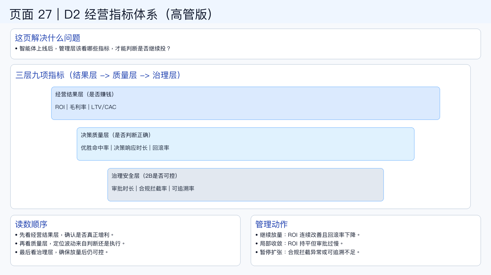

# 页面 27｜D2 经营指标体系（高管版）

## 这页解决什么问题
- `智能体项目上线后，管理层到底该看哪些指标，才能判断“值不值得继续投”？`
- `要避免“只看点击率”或“只看自动化率”的单点误判。`

## 指标体系：三层九项（够用且能管）
1. `经营结果层（看是否赚钱）`
  - ROI（总回报）
  - 毛利率（利润质量）
  - LTV/CAC（长期可持续）
2. `决策质量层（看智能体是否判断正确）`
  - 优胜命中率（建议被验证为有效的比例）
  - 决策响应时长（从识别到动作）
  - 回滚率（错误动作占比）
3. `治理安全层（看2B是否可控）`
  - 审批时长（治理是否拖慢业务）
  - 合规拦截率（风险前置能力）
  - 可追溯率（动作是否可解释、可审计）

## 读数方法（避免误判）
- `先看经营结果层`：结果没改善，其他都只是过程优化。
- `再看决策质量层`：若 ROI 波动大，优先查命中率和回滚率。
- `最后看治理安全层`：确保放量后仍然可控，而不是靠运气。

## 管理动作建议（季度复盘可直接用）
- `继续放量`：ROI 连续改善 + 回滚率下降。
- `局部收敛`：ROI 持平但审批过慢，优先优化分流阈值。
- `暂停扩张`：合规拦截率异常或可追溯率不足。

## 一句话结论
- `指标体系的作用不是“汇报好看”，而是指导“该放量、该收敛、还是该暂停”。`

## 可视化建议（用于制图）
- 上部 `20%`：问题定义
- 中部 `55%`：三层指标金字塔（结果层 / 质量层 / 治理层）
- 下部 `25%`：三种管理动作（放量 / 收敛 / 暂停）

## 页面展示

