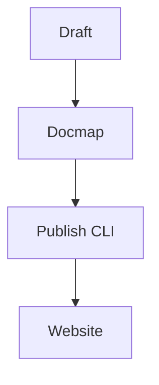

# Positioning & Goals

覆盖插件发布后多仓同步流程。

# Core Capabilities

- 触发纯 Push 分发
- 校验 docmap 对应关系

# Acceptance Criteria

1. docmap 注册齐全
2. 发布脚本输出报告

# Validation Workflow

| Step | Owner | Tool |
| --- | --- | --- |
| Draft | Steward | Markdown |
| Docmap | Steward | YAML |
| Publish | Ops | CLI |

# Related Links

- docs/usecases-seeds/**
- reports/**

# Architecture Diagram

