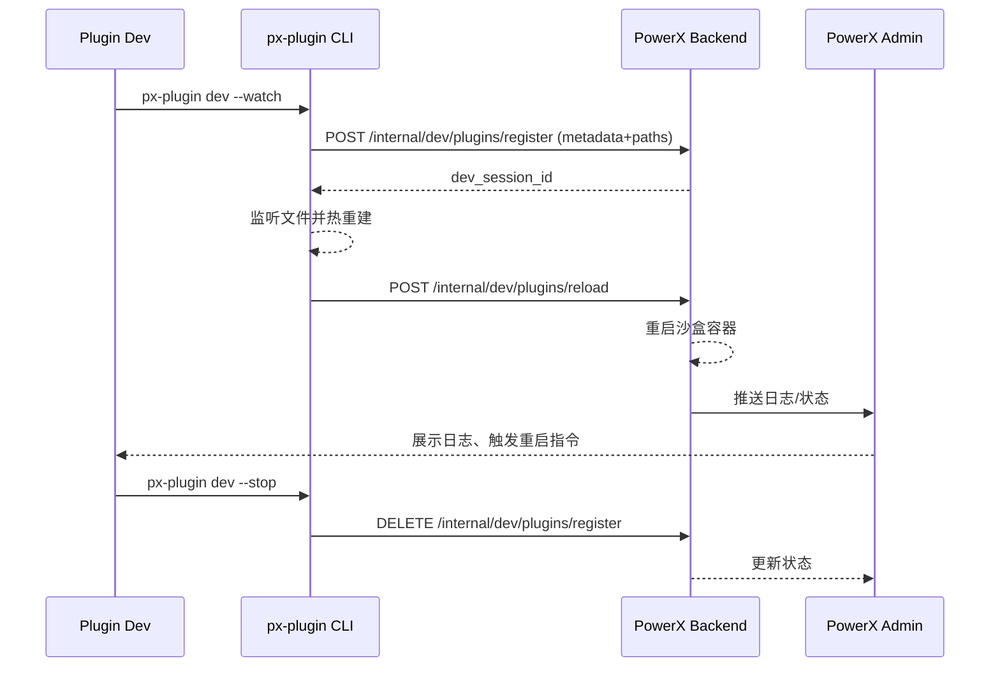

scn_id: SCN-DEV-HOTLOAD-001
title: 插件本地开发热加载与快速验证
status: Draft
version: v0.1.0
owners:

- name: Li Wei
    role: Scenario Steward
    contact: <li.wei@artisancloud.com>
domains: [dev, publish, install]
layers: [proto, service, ui]
repos:
- key: powerx-plugin
    scope: plg
    responsibility: 提供开发模式 build、文件监听与调试工具
- key: powerx-backend
    scope: px
    responsibility: 支持本地热加载目录、沙盒环境和插件重载接口
- key: powerx-admin
    scope: admin
    responsibility: 提供开发环境中的插件管理、日志查看与调试入口
related_usecases:
- doc_id: PLG-DEV-HOTLOAD-001
    layer: proto
    domain: dev
- doc_id: PX-DEV-HOTLOAD-001
    layer: service
    domain: dev
- doc_id: PX-ADMIN-DEV-HOTLOAD-001
    layer: ui
    domain: dev
last_reviewed_at: 2025-01-15

---

# Executive Summary

开发者在迭代插件时需要即时验证功能、调试日志并缩短“编写 → 运行 → 验证”的循环。本场景描述使用 PowerXPlugin 的开发模式生成本地目录、PowerX Backend 热加载接口以及 Admin 调试工具的端到端流程，确保开发体验稳定，同时遵守安全隔离与审计规定。

# Scope & Guardrails

- **In Scope**
  - `px-plugin dev` / `px-plugin build --mode=dev` 生成热加载目录（参考 `docs/standards/powerx-plugin/deploy/local_debug.md`）
  - PowerX Backend 本地沙盒配置、自动重载、隔离容器（`powerx/plugins/sts_flow.md`、`integration/03_registry_router/Runtime_Endpoint_Management.md`）
  - PowerX Admin 开发面板：日志、状态、重启按钮（`powerx-admin/plugins/host_plugin_grpc.md`）
  - 安全与资源限制（`powerx-plugin/integration/03_runtime_and_ops/Runtime_Env_and_Ports.md`）
- **Out of Scope**
  - 线上 Marketplace 发布、审核流程（见 `SCN-PUBLISH-ONLINE-001`）
  - `.pxp` 离线导入（见 `SCN-PUBLISH-OFFLINE-001`）
  - 多租户 SaaS 环境的开发代理（另有 Dev Proxy 文档）
- **Environment & Flags**
  - PowerX 开发环境需开启 `PX_DEV_PLUGIN_HOTLOAD=true`
  - Admin 需启用“开发者模式”，限制仅管理员访问
  - 开发者必须配置允许使用本地 mTLS 凭据（`powerx-plugin/security/integration.md`）

# Participants & Responsibilities

| Scope | Repository | Layer | 责任与交付物 | Owners |
|-------|------------|-------|--------------|--------|
| plg | powerx-plugin | proto | 提供 `px-plugin dev` 支持、生成热加载目录和代理脚本、watcher | Alice (Plugin Lead) |
| px | powerx-backend | service | 暴露 `POST /internal/dev/plugins/reload` 接口，管理沙盒容器、隔离凭据 | Carol (Backend Maintainer) |
| admin | powerx-admin | ui | 提供开发调试界面：列出本地插件、显示日志、支持重启/清理 | Dave (Admin Lead) |

# End-to-End Flow

1. **Stage 1 – 本地开发环境准备**
   - 开发者运行 `px-plugin init` 创建工程，并配置 `dev.config.json`（参考 `developer/backend.md`）。
   - 执行 `px-plugin dev --watch`：CLI 读取 `deploy/local_debug.md` 指南，在 `.powerx/dev/<plugin-id>/` 输出 build 产物，并启动文件监听。
   - CLI 注册 gRPC 代理与 HTTP 端口，根据 `integration/03_runtime_and_ops/Runtime_Env_and_Ports.md` 分配端口。

2. **Stage 2 – PowerX Backend 热加载**
   - CLI 向 PowerX Backend 调用 `POST /internal/dev/plugins/register`，提供插件元数据与本地路径。
   - Backend 将该插件挂载到沙盒容器，建立本地 gRPC 通道，并写入 `dev_sessions` 表（见 `plugins/sts_flow.md`）。
   - 文件发生变化时 CLI 通过 `POST /internal/dev/plugins/reload` 通知 Backend，后者刷新容器、重启 session。

3. **Stage 3 – Admin 开发面板操作**
   - 管理员/开发者访问 Admin 的“开发者插件”面板（`plugins/admin_workflow.md` dev 模式章节），查看已注册的本地插件。

- 面板展示实时日志（接入 `realtime/SSE_WS_Client_Guide.md`）与健康状态。
- 用户可触发“重新加载”“清理缓存”，调用 Backend 对应接口。

4. **Stage 4 – 测试与回滚**
   - 完成调试后，开发者执行 `px-plugin dev --stop`，CLI 调用 `DELETE /internal/dev/plugins/register`.
   - Backend 清除沙盒资源、关闭通道并写入审计日志。
   - Admin 面板同步显示插件已卸载，保留日志供追溯。

# Key Interactions & Contracts

- **CLI 工具链**：`docs/standards/powerx-plugin/deploy/local_debug.md`、`developer/frontend.md`
- **Backend Dev API**：
  - `POST /internal/dev/plugins/register` — 注册本地插件，返回 `dev_session_id`
  - `POST /internal/dev/plugins/reload` — 通知 Backend 重载
  - `DELETE /internal/dev/plugins/register/{plugin_id}` — 停止会话
- **安全措施**：本地凭据与 Token 管理见 `powerx-plugin/security/audit-pipeline.md`、`powerx-admin/security/Secrets_and_Config_Handling.md`
- **实时日志**：Admin 通过 `realtime/SSE_WS_Client_Guide.md` 与 Backend WebSocket 推送通信

# Usecase Links

- `PLG-DEV-HOTLOAD-001` — CLI 热加载与 watcher 策略（proto 层）
- `PX-DEV-HOTLOAD-001` — Backend 沙盒与重载接口（service 层）
- `PX-ADMIN-DEV-HOTLOAD-001` — Admin 开发调试面板（ui 层）

# Acceptance Criteria

1. `px-plugin dev --watch` 在 2 秒内完成热重建，重载后 API 可立即调用。
2. Backend 必须隔离沙盒与生产实例，日志中无敏感数据泄露。
3. Admin 面板提供实时日志、状态与重启操作；所有操作写入审计。
4. 开发会话结束后资源自动释放，无残留容器或端口占用。

# Telemetry & Ops

- **指标**
  - `dev.hotload.reload_time_ms`
  - `dev.hotload.active_sessions`
  - `dev.hotload.reload_failures`（目标 < 1%）
- **告警**
  - 重载失败连续 3 次触发 Slack `#powerx-dev-alerts`
  - 会话闲置超过 60 分钟自动回收并通知开发者
- **观测来源**
  - PowerXPlugin CLI 日志（`developer/backend.md` 指南）
  - Backend Dev Dashboard（新增 `dev_sessions` 面板）
  - Admin Dev 面板的实时诊断（`powerx-admin/realtime/websocket-implementation-guide.md`）

# Open Issues & Follow-ups

| 风险/事项 | 影响范围 | 负责人 | ETA |
|-----------|----------|--------|-----|
| CLI 热加载对大型前端资源构建仍较慢，需要增量编译策略 | PLG | Alice | 2025-02-20 |
| Backend 沙盒缺少资源配额监控，存在滥用风险 | PX | Carol | 2025-02-12 |

# Appendix

- **参考资料**
  - `docs/standards/powerx-plugin/deploy/local_debug.md`
  - `docs/standards/powerx-plugin/developer/backend.md`
  - `docs/standards/powerx-backend/plugins/sts_flow.md`
  - `docs/standards/powerx-admin/plugins/host_plugin_grpc.md`
- **相关 PR**
  - `ArtisanCloud/PowerXPlugin#140` — `px-plugin dev` watcher 优化
  - `ArtisanCloud/PowerX#470` — Dev 插件重载 API
  - `ArtisanCloud/PowerXAdmin#330` — 开发者调试面板
