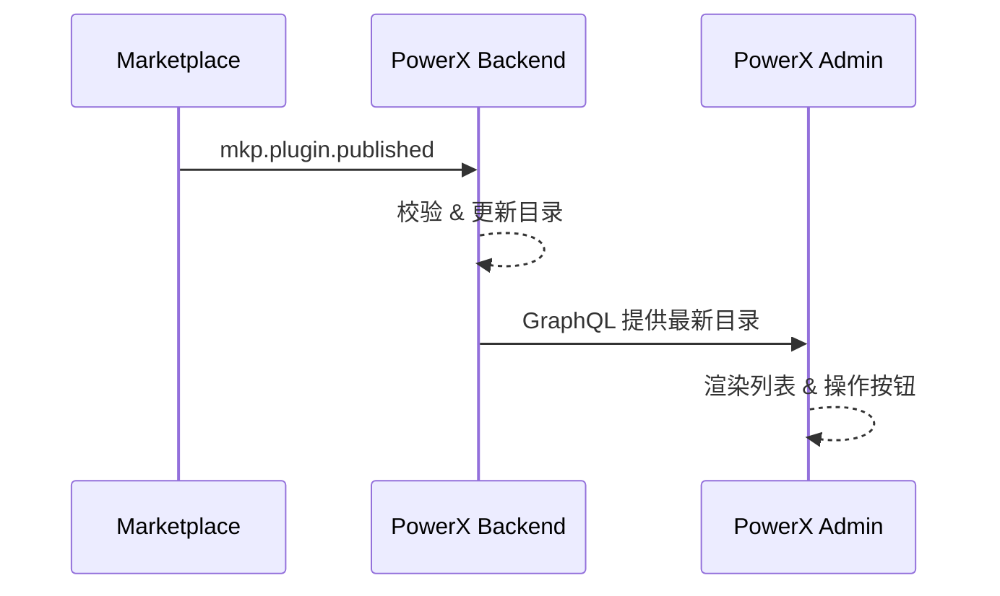

scn_id: SCN-PUBLISH-001
last_reviewed_at: 2024-10-20
title: 插件发布后目录同步
status: Draft
version: v0.1.0
owners:
  - name: Li Wei
    role: Scenario Steward
    contact: li.wei@artisancloud.com
domains: [publish]
layers: [service, ui]
repos:
  - key: powerx-backend
    scope: px
    responsibility: 同步插件目录、刷新缓存
  - key: powerx-admin
    scope: admin
    responsibility: 展示目录并提供安装操作
related_usecases:
  - doc_id: PX-PUBLISH-001
    layer: service
    domain: publish
  - doc_id: PX-ADMIN-PUBLISH-001
    layer: ui
    domain: publish
---

# Executive Summary

PowerX 插件发布后，需要确保后台目录及时同步、Admin 控制台展示正确。这一场景聚焦于监听 Marketplace 发布事件，更新 PowerX 目录数据，并在 Admin 前端提供可安装的视图。

# Scope & Guardrails

- **In Scope**：PowerX Backend 目录同步、缓存刷新；PowerX Admin 插件列表更新、标记安装状态。
- **Out of Scope**：Marketplace 审核流程（见 `SCN-PUBLISH-ONLINE-001`）；离线导入及本地热加载（见其他 SCN）。
- **Environment**：需启用 `PX_MARKETPLACE_SYNC`；Admin 需开启插件市场模块。

# Participants & Responsibilities

| Scope | Repository | Layer | 责任与交付物 | Owners |
|-------|------------|-------|--------------|--------|
| px | powerx-backend | service | 订阅事件、写入目录、刷新缓存 | Carol |
| admin | powerx-admin | ui | 读取目录 GraphQL、渲染 UI、提供安装操作 | Dave |

# End-to-End Flow

1. 接收 Marketplace `mkp.plugin.published` 事件。
2. Backend 校验签名、更新目录表、发起缓存刷新。
3. Admin 调用 GraphQL 获取最新目录，刷新插件列表。
4. 管理员可执行安装或查看插件详情。

# Key Interactions & Contracts

- 事件契约：`mkp.plugin.published`
- Backend API：`GET /internal/plugins/catalog`
- Admin GraphQL：`query listMarketplacePlugins`

# Usecase Links

- `PX-PUBLISH-001` — Backend 目录同步（service）
- `PX-ADMIN-PUBLISH-001` — Admin 列表展示（ui）

# Acceptance Criteria

1. 事件触发后 5 分钟内 Admin 列表刷新。
2. 缓存刷新失败时提供重试与告警。
3. 子用例文档完成并在 docmap 中配置。

# Telemetry & Ops

- 指标：`catalog.sync.latency`, `admin.plugins.refresh.success_rate`
- 告警：同步失败、目录为空时发出告警。

# Open Issues & Follow-ups

| 风险/事项 | 负责人 | ETA |
|-----------|--------|-----|
| 目录缓存缺少局部刷新策略 | Carol | 2025-01-15 |

# Appendix

- `docs/standards/powerx/plugins/admin_workflow.md`
- `docs/standards/powerx-marketplace/发布和下载插件流程.md`
