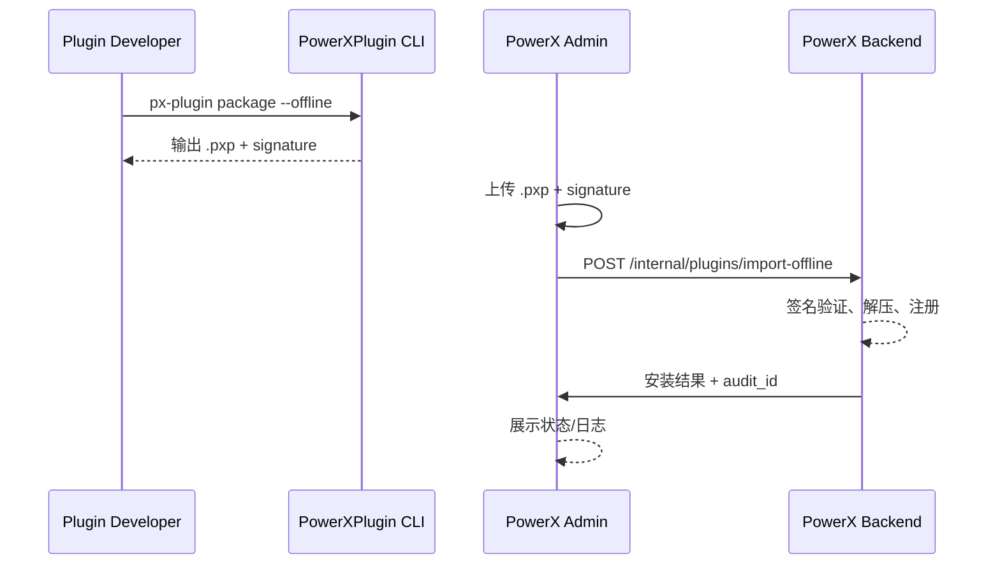

scn_id: SCN-PUBLISH-OFFLINE-001
title: 插件离线包生成与 PowerX 手工导入
status: Draft
version: v0.1.0
owners:

- name: Li Wei
    role: Scenario Steward
    contact: <li.wei@artisancloud.com>
domains: [publish, install, offline]
layers: [proto, service, ui]
repos:
- key: powerx-plugin
    scope: plg
    responsibility: 生成 `.pxp` 离线包、附带签名与依赖清单
- key: powerx-backend
    scope: px
    responsibility: 校验离线包、导入插件、执行业务回调
- key: powerx-admin
    scope: admin
    responsibility: 提供手工导入向导、展示结果与日志
related_usecases:
- doc_id: PLG-PUBLISH-OFFLINE-001
    layer: proto
    domain: publish
- doc_id: PX-INSTALL-OFFLINE-001
    layer: service
    domain: install
- doc_id: PX-ADMIN-INSTALL-OFFLINE-001
    layer: ui
    domain: install
last_reviewed_at: 2025-01-15

---

# Executive Summary

离线路径允许内部或私有生态伙伴在无 Marketplace 接入的环境下，把插件作为 `.pxp` 包体导入 PowerX。该场景针对隔离环境、客户自建部署或需要提前验证的情形，重点保障包体安全、签名校验以及安装后的治理与观测。

# Scope & Guardrails

- **In Scope**
  - `px-plugin package --offline` 生成符合 `release_package.md` 的离线包
  - PowerX Backend 手工导入接口、签名校验（`plugins/sts.md`）
  - PowerX Admin 手工上传向导、离线安装流程（`powerx-admin/plugins/admin_workflow.md`）
  - 审计与 License 校验（`powerx/plugins/admin_workflow.md`）
- **Out of Scope**
  - Marketplace 审核、上架、事件同步（覆盖于 `SCN-PUBLISH-ONLINE-001`）
  - 本地开发热加载（覆盖于 `SCN-DEV-HOTLOAD-001`）
  - 自动化升级、灰度策略（另有专属场景）
- **Environment & Flags**
  - PowerX Backend 需启用 `PX_OFFLINE_IMPORT` Feature Flag
  - 管理后台需配置允许上传 `.pxp`，且接入对象存储或本地磁盘
  - 离线包必须由受信 CA 签名并包含 `manifest.signature` 元数据

# Participants & Responsibilities

| Scope | Repository | Layer | 责任与交付物 | Owners |
|-------|------------|-------|--------------|--------|
| plg | powerx-plugin | proto | 使用 `release_package.md` 指南生成离线包，附带签名、哈希、依赖声明 | Alice (Plugin Lead) |
| px | powerx-backend | service | 校验包体、解压、注册插件、刷新缓存，同时返回安装结果与审计 ID | Carol (Backend Maintainer) |
| admin | powerx-admin | ui | 提供手工导入向导、调用后台导入 API，并展示安装日志、失败原因 | Dave (Admin Lead) |

# End-to-End Flow

1. **Stage 1 – 离线包生成**
   - 开发者执行 `px-plugin package --offline`，CLI 根据 `deploy/release_package.md` 打包代码、资源、manifest。
   - CLI 读取 `contract/plugin_yaml_spec.md` 校验字段，生成 `manifest.json` 与 `sha256` 校验文件。
   - 最终输出 `.pxp`、`manifest.signature`、`integrity.txt` 等文件，存入安全文件仓。

2. **Stage 2 – 管理员上传**
   - 管理员在 PowerX Admin “离线导入”入口上传 `.pxp` 与签名文件，遵守 `admin_plugins_user_guide.md` 步骤。
   - Admin 校验文件大小、格式，调用 `POST /internal/plugins/import-offline` 接口。
   - 上传成功后进入“待校验”状态，等待 Backend 处理。

3. **Stage 3 – Backend 校验与导入**
   - Backend 接收文件后，根据 `plugins/sts.md` 执行签名验证，检查 `rbac_manifest` 与 `Capability` 声明。
   - 若验证通过，解压到隔离目录，执行注册流程：写入目录表、构建安装任务、刷新缓存。
   - 处理过程中将审计记录写入 `admin_workflow` 定义的日志表，并返回结果给 Admin。

4. **Stage 4 – 安装完成与回滚选项**
   - Admin 获取安装结果，展示成功/失败状态及日志下载入口。
   - 若失败，管理员可选择删除上传记录或重新导入；成功时可跳转插件配置页。
   - Backend 记录 License 激活（若 manifest 含 License 信息），并发送通知邮件。

# Key Interactions & Contracts

- **离线打包规范**：`docs/standards/powerx-plugin/deploy/release_package.md`、`contract/plugin_yaml_spec.md`
- **导入 API**：`POST /internal/plugins/import-offline`（请求体包括 `bundle`, `signature`, `verify_only`），返回 `install_job_id`, `audit_id`
- **安全策略**：`powerx-plugin/security/audit-logs.md`、`powerx-admin/security/Secrets_and_Config_Handling.md`
- **审计要求**：`powerx/plugins/admin_workflow.md` 描述的 `PX_PLUGIN_IMPORT` 事件与存档策略

# Usecase Links

- `PLG-PUBLISH-OFFLINE-001` — 离线打包与签名流程（proto 层）
- `PX-INSTALL-OFFLINE-001` — Backend 校验与导入执行（service 层）
- `PX-ADMIN-INSTALL-OFFLINE-001` — Admin 手工导入 UX 与日志展示（ui 层）

# Acceptance Criteria

1. `.pxp` 导入后 3 分钟内完成注册并在插件列表显示。
2. 未通过签名或 manifest 校验的离线包应被拒绝，并给出明确错误（含审计 ID）。
3. 审计记录与统计数据完整：`PX_OFFLINE_IMPORT` 事件在 workflow metrics 中可见。
4. 安装成功率 ≥ 98%；失败需在 30 分钟内完成重试或回滚。

# Telemetry & Ops

- **指标**
  - `offline.import.duration`、`offline.import.success_rate`
  - `offline.import.signature_failures`（需低于 1%）
- **告警**
  - 连续 3 次导入失败触发 SRE 柱状告警
  - 无法写入审计日志时触发紧急通知
- **观测来源**
  - Backend Prometheus 面板（`integration-dashboard.json` 中的 `offline_import` 区段）
  - Admin Sentry 追踪（`Sentry_Logging_and_Traces.md`）

# Open Issues & Follow-ups

| 风险/事项 | 影响范围 | 负责人 | ETA |
|-----------|----------|--------|-----|
| 离线包缺少 License 校验脚本，需要补充自动测试 | PX | Carol | 2025-02-05 |
| Admin 上传过程中缺少进度条，影响大文件体验 | Admin | Dave | 2025-01-30 |

# Appendix

- **参考资料**
  - `docs/standards/powerx-plugin/deploy/release_package.md`
  - `docs/standards/powerx-backend/plugins/admin_workflow.md`
  - `docs/standards/powerx-admin/plugins/admin_workflow.md`
  - `docs/standards/powerx-marketplace/pxp插件压缩包.md`（提供压缩结构参考）
- **相关 PR 示例**
  - `ArtisanCloud/PowerXPlugin#130` — CLI 离线打包命令增强
  - `ArtisanCloud/PowerX#460` — Offline Import API 实现
  - `ArtisanCloud/PowerXAdmin#320` — 离线导入向导 UI
