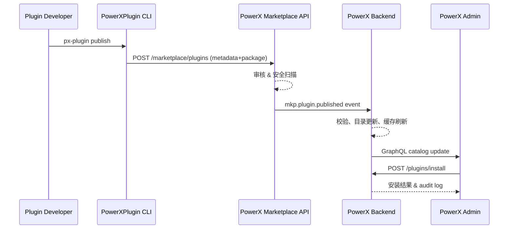

scn_id: SCN-PUBLISH-ONLINE-001
title: 插件标准发布与 Marketplace 上架（全链路）
status: Draft
version: v0.1.0
owners:

- name: Li Wei
    role: Scenario Steward
    contact: <li.wei@artisancloud.com>
domains: [publish, marketplace, install]
layers: [proto, api, service, ui]
repos:
- key: powerx-plugin
    scope: plg
    responsibility: 构建、签名与发布插件包
- key: powerx-marketplace
    scope: mkp
    responsibility: 审核上架、目录管理、交付指令
- key: powerx-backend
    scope: px
    responsibility: 监听上架事件、同步目录并分发安装包
- key: powerx-admin
    scope: admin
    responsibility: 展示上架插件、提供安装与管理入口
related_usecases:
- doc_id: PLG-PUBLISH-ONLINE-001
    layer: proto
    domain: publish
- doc_id: MKP-PUBLISH-ONLINE-001
    layer: api
    domain: marketplace
- doc_id: PX-PUBLISH-ONLINE-001
    layer: service
    domain: catalog
- doc_id: PX-ADMIN-PUBLISH-ONLINE-001
    layer: ui
    domain: marketplace
last_reviewed_at: 2025-01-15

---

# Executive Summary

标准发布链路覆盖插件开发完成后，从 PowerXPlugin CLI 签名发布、PowerXMarketplace 审核与上架、到 PowerX 后端同步安装目录，并在 PowerX Admin 控制台提供安装入口的端到端体验。该场景确保合作伙伴通过线上流程即可快速把插件交付给客户，同时满足安全审核、合规与可观测性要求。

# Scope & Guardrails

- **In Scope**
  - PowerXPlugin CLI `px-plugin publish` 流程（参考 `docs/standards/powerx-plugin/integration/01_plugin_lifecycle/Versioning_and_Publishing.md`）
  - Marketplace 上架审核、签名校验、目录同步（`docs/standards/powerx-marketplace/发布和下载插件流程.md`）
  - PowerX Backend 安装目录刷新、缓存失效、License 验证
  - PowerX Admin 插件市场页面展示、安装、卸载与审计入口（`docs/standards/powerx-admin/plugins/admin_workflow.md`）
- **Out of Scope**
  - 离线导入 `.pxp` 的流程（见 `SCN-PUBLISH-OFFLINE-001`）
  - 开发者本地热加载调试（见 `SCN-DEV-HOTLOAD-001`）
  - 付费结算、License 扩展策略（另有 Finance 场景覆盖）
- **Environment & Flags**
  - `PX_MARKETPLACE_SYNC` Feature Flag 必须开启
  - Marketplace 需要配置生产签名证书 (`docs/standards/powerx-plugin/contract/ctx_signing.md`)
  - PowerX Admin 需启用 `marketplace.enabled=true` 配置

# Participants & Responsibilities

| Scope | Repository | Layer | 责任与交付物 | Owners |
|-------|------------|-------|--------------|--------|
| plg | powerx-plugin | proto | 产出符合 `plugin.yaml` 规范的插件包；执行 `px-plugin publish` 并上传到 Marketplace | Alice (Plugin Lead) |
| mkp | powerx-marketplace | api | 审核提交、运行安全扫描、发布 `mkp.plugin.published` 事件并存档审核记录 | Bob (Marketplace Steward) |
| px | powerx-backend | service | 监听 Marketplace 事件，提取 manifest、写入目录、刷新缓存，并记录审计日志 | Carol (Backend Maintainer) |
| admin | powerx-admin | ui | 从 GraphQL 目录读取最新插件，展示详情、触发安装流程，输出运维审计日志 | Dave (Admin Lead) |

> 责任与 Owners 需与 `related_usecases` 中的子用例对齐，确保各仓撰写对应的深度文档。

# End-to-End Flow

1. **Stage 1 – Publish Trigger（PowerXPlugin）**
   - 开发者运行 `px-plugin package` 生成 `.pxp`，并根据 `docs/standards/powerx-plugin/lifecycle/package.md` 提交构建日志。
   - 执行 `px-plugin publish --channel=stable`，CLI 会加载 `plugin.yaml`、`rbac_manifest.yaml`，并调用 Marketplace 提交 API。
   - CLI 上传包体、签名元数据（`ctx_signing`），写入发布审计日志。

2. **Stage 2 – Marketplace 审核与上架**
   - Marketplace 接收发布请求，使用 `vendor/02_plugin_development/Testing_and_Sandbox.md` 定义的安全扫描策略检查包。
   - 审核通过后，生成插件清单记录，触发 `mkp.plugin.published` 事件，包括版本号、依赖、License 配置（参考 `vendor/03_listing_and_lifecycle/Submission_and_Review.md`）。
   - Marketplace 更新目录与搜索索引，同时在 `host/api.md` 所述的 API 中暴露该插件。

3. **Stage 3 – PowerX Backend 同步**
   - PowerX Backend 通过 `EventBus_and_Message_Fabric.md` 定义的 Gateway 订阅 `mkp.plugin.published`。
   - 服务侧校验签名、提取 manifest，写入插件目录表，发出缓存刷新（参考 `plugins/sts_flow.md`）。
   - 自动生成安装任务与 License 验证钩子，记录审计 (`plugins/admin_workflow.md`)。

4. **Stage 4 – PowerX Admin 展示与安装**
   - Admin 前端在 `Registry_Console` 功能中显示新插件，调用 `plugins/admin_workflow.md` 定义的流程触发安装。
   - 管理员点击安装 → Admin 调用 PowerX Backend API (`Integration_API_and_Admin_Interface.md`) 安装插件 → 展示状态与日志。
   - 完成后，Admin 在 UI 中标记“已安装”，并提供配置入口。

# Key Interactions & Contracts

- **Publishing API**：`POST /marketplace/plugins`（Body 见 `powerx-marketplace/plugin-development-release.md`），需携带签名头和 manifest。
- **Event Contract**：`mkp.plugin.published` 事件负载含 `plugin_id`, `version`, `channel`, `bundle_url`, `signature`; Schema 参考 `powerx-marketplace/telemetry/lifecycle-metrics.md`。
- **Sync API**：PowerX Backend `POST /internal/plugins/install`（`Integration_API_and_Admin_Interface.md` 定义）。
- **GraphQL Catalog**：Admin 端通过 `plugins/admin_workflow.md` 中的 `listMarketplacePlugins` 查询。
- **Observability**：指标 `marketplace.publish.duration`, `powerx.catalog.sync.latency`, `admin.install.success_rate`，配置见 `powerx-plugin/observability/integration-checklist.md` 与 `powerx-marketplace/telemetry/lifecycle-metrics.md`。

# Usecase Links

- `PLG-PUBLISH-ONLINE-001` — PowerXPlugin CLI 发布流程与审计（proto 层，自有仓：`docs/use_cases/proto/publish/PLG-PUBLISH-ONLINE-001.md`）
- `MKP-PUBLISH-ONLINE-001` — Marketplace 审核与上架（api 层）
- `PX-PUBLISH-ONLINE-001` — PowerX 后端目录同步与缓存刷新（service 层）
- `PX-ADMIN-PUBLISH-ONLINE-001` — Admin 市场页面展示与安装（ui 层）

> 子用例模板需在 `docs/usecases-seeds/<scope>/<layer>/<domain>/` 下创建，路径与上述 ID 保持一致。

# Acceptance Criteria

1. 插件发布后 5 分钟内可在 Admin 市场列表中搜索到，目录信息与 Marketplace 一致。
2. 所有 API 与事件调用成功记录在审计日志中，无未处理的告警。
3. 四个仓库的子用例文档完成并经评审；`publish:usecases --dry-run` 正常生成分发包。
4. 发布链路在 `scripts/qa/workflow-metrics.mjs` 中记录的 `publish_online.success_rate` ≥ 99%。

# Telemetry & Ops

- **指标**
  - `marketplace.publish.duration`（从提交到上架）90% < 10 分钟
  - `powerx.catalog.sync.latency`（事件到目录可用）90% < 2 分钟
  - `admin.install.time_to_ready`（安装到可用）90% < 5 分钟
- **告警**
  - Marketplace 审核失败率 > 5% 时触发 PagerDuty
  - PowerX Backend 同步失败或缓存刷新异常触发 Slack `#powerx-alerts`
- **观测来源**
  - `docs/standards/powerx-plugin/observability/integration-dashboard.json`
  - Marketplace `telemetry/lifecycle-metrics.md` 定义的 Looker 仪表板
  - Admin `Sentry_Logging_and_Traces.md` 提供的监控

# Open Issues & Follow-ups

| 风险/事项 | 影响范围 | 负责人 | ETA |
|-----------|----------|--------|-----|
| Marketplace 事件在高峰期存在延迟，需要升级队列容量 | MKP, PX | Bob | 2025-02-15 |
| Admin 安装过程缺少重试按钮，需补 UI 提示 | Admin | Dave | 2025-02-10 |

# Appendix

- **关键规范参考**
  - `docs/standards/powerx-plugin/integration/01_plugin_lifecycle/README.md`
  - `docs/standards/powerx-marketplace/发布和下载插件流程.md`
  - `docs/standards/powerx-backend/plugins/admin_workflow.md`
  - `docs/standards/powerx-admin/plugins/admin_plugins_user_guide.md`
- **相关 PR**
  - `ArtisanCloud/PowerXPlugin#128` — 发布 CLI 支持渠道参数
  - `ArtisanCloud/PowerXMarketplace#96` — `mkp.plugin.published` schema v3
  - `ArtisanCloud/PowerX#452` — 安装目录缓存刷新重构
  - `ArtisanCloud/PowerXAdmin#311` — 市场安装向导 UX 改版
