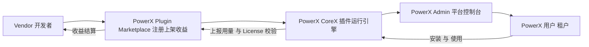
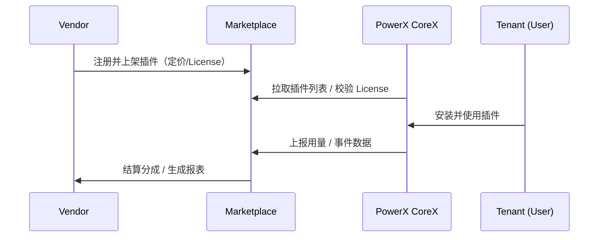

# 🧩 PowerX Plugin Marketplace — Vendor Overview

> 本文档面向 **插件开发者（Vendor）**，介绍 PowerX 插件生态的整体结构、角色关系与运行机制。  
> 目标：帮助你理解如何注册、开发、上架并盈利你的插件。

---

## 🎯 1. PowerX 插件生态总览

PowerX 生态由三大部分组成：

| 模块 | 职责 | 主要用户 |
|------|------|-----------|
| **PowerX Plugin Marketplace** | 插件市场：Vendor 注册、上架、结算、分成 | 插件开发者（Vendor） |
| **PowerX CoreX（内核）** | 平台运行引擎：负责插件运行、租户隔离、安全校验 | PowerX 平台 |
| **PowerX Admin（控制台）** | 平台运营界面：管理插件安装、启停、License 校验 | 平台运营人员 |

> Marketplace 是 **供给端**，  
> CoreX 是 **运行端**，  
> Admin 是 **运营端**。

---

## 🧭 2. 生态关系图

### 🔁 简要说明

1. **Vendor** 在 Marketplace 注册、完成 KYC 审核；
2. 开发并上传插件（含 `plugin.yaml`、manifest、后端与前端）；
3. 插件通过审核后上架；
4. **PowerX 平台** 定期从 Marketplace 拉取插件清单；
5. 用户在 PowerX Admin 中选择并安装插件；
6. CoreX 执行插件，校验 license 与 vendor 状态；
7. 用量事件与计费回传 Marketplace；
8. Marketplace 按周期向 Vendor 分成结算。

---

## 🧠 3. 关键角色与职责

| 角色               | 职责说明                               | 所属系统                 |
| ---------------- | ---------------------------------- | -------------------- |
| **Vendor**       | 插件的创建者与所有者；维护代码、版本与支持              | Marketplace          |
| **Plugin**       | Vendor 发布的独立功能模块；遵循 plugin.yaml 规范 | Marketplace & PowerX |
| **License**      | 插件的授权凭证，用于控制使用范围与到期时间              | Marketplace          |
| **Tenant（租户）**   | 在 PowerX 平台内安装并使用插件的企业 / 用户        | PowerX CoreX         |
| **PowerX Admin** | 平台运营人员管理插件、租户、授权、日志的控制台            | PowerX Admin         |

---

## 🏗️ 4. 数据与职责边界

| 维度               | Marketplace              | PowerX CoreX                     | PowerX Admin    |
| ---------------- | ------------------------ | -------------------------------- | --------------- |
| **Vendor 注册与审核** | ✅ 保存 Vendor 资料、资质、状态     | ❌                                | ✅ 可查看 Vendor 信息 |
| **插件上架与版本管理**    | ✅ Plugin、Version、Pricing | ✅ Plugin Registry（仅引用 vendor_id） | ✅ 显示插件元信息       |
| **License 与计费**  | ✅ 授权与结算                  | ✅ 校验 License 状态                  | ✅ 查看授权与使用情况     |
| **安全与隔离**        | ✅ 审核安全策略                 | ✅ 执行安全隔离 / RBAC                  | ✅ 展示与配置安全策略     |
| **事件与用量上报**      | ✅ 聚合与结算                  | ✅ 上报与追踪                          | ✅ 查看审计日志        |

> ⚙️ PowerX CoreX 内不会保存 Vendor 资料，
> 仅保存 `vendor_id` 作为插件来源标识。

---

## 🔐 5. 信任与安全模型

| 层级                   | 信任机制                            | 说明              |
| -------------------- | ------------------------------- | --------------- |
| Vendor → Marketplace | 账号与签名认证（KYC + Token）            | 发布与更新插件必须经过身份验证 |
| Marketplace → PowerX | Server-to-Server 授权（mTLS + JWT） | 保证插件信息同步的安全     |
| PowerX → Marketplace | License 校验 + 用量上报               | 确保合法使用与正确计费     |
| PowerX Admin         | OIDC + RBAC 权限控制                | 细粒度控制操作与审计      |

---

## 💰 6. 收益闭环

> PowerX 生态的核心目标是：
> **让开发者（Vendor）能安全、可控、可盈利地扩展 PowerX 平台。**

---

## 🧩 7. 文档导航

| 模块          | 路径                               | 内容摘要                         |
| ----------- | -------------------------------- | ---------------------------- |
| 注册与入驻       | `../01_onboarding/`              | Vendor 注册、审核、资料管理            |
| 插件开发        | `../02_plugin_development/`      | 插件结构、YAML、API 接口规范           |
| 上架与版本       | `../03_listing_and_lifecycle/`   | 审核、发布、版本控制                   |
| 授权与定价       | `../04_license_and_pricing/`     | License 与付费模型                |
| 收益结算        | `../05_finance_and_settlement/`  | 收益分成、对账、税务                   |
| 与 PowerX 集成 | `../06_integration_with_powerx/` | Manifest、License 校验、Usage 上报 |
| 支持与政策       | `../07_support_and_policies/`    | 停权、申诉、客服支持                   |
| 附录          | `../99_appendix/`                | 术语、接口索引、变更日志                 |

---

## 🧾 8. 下一步阅读建议

* 👉 [注册与入驻流程](../01_onboarding/Registration_and_KYC.md)
* 👉 [插件结构与开发规范](../02_plugin_development/Plugin_Structure_and_YAML.md)
* 👉 [PowerX Manifest 对接规范](../06_integration_with_powerx/PowerX_Plugin_Manifest.md)

---

## 🧱 附录：核心设计原则

1. **分层解耦（Decoupling）**

   * Vendor ↔ Marketplace ↔ PowerX 明确职责边界
   * CoreX 不保存 Vendor 实体，仅保存 vendor_id

2. **安全可审计（Auditable Security）**

   * 所有操作均留痕，支持追踪来源与调用路径

3. **可扩展（Extensible）**

   * 新增插件类别无需修改 CoreX 内核，只需更新 manifest 与 capability schema

4. **收益可衡量（Monetizable）**

   * 每个插件可单独计费、追踪使用量并结算收益

---

> 📘 **总结一句话：**
> PowerX Plugin Marketplace 是整个生态的“开发者入口与商业中枢”。
> 你作为 Vendor，只需专注开发好插件，
> 其余（授权、分发、结算、安全）都由 PowerX 平台自动完成。

