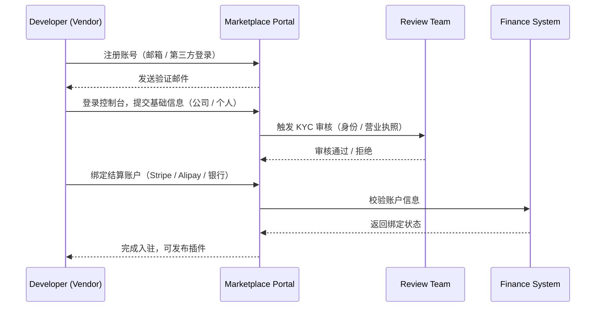

# 🪪 Vendor Registration & KYC 入驻流程

> 本文档介绍 **PowerX Plugin Marketplace** 的开发者（Vendor）如何注册、验证身份、创建开发者资料并完成入驻。  
> 所有希望在 Marketplace 上架插件的个人或企业均需完成以下流程。

---

## 🎯 1. 流程总览

PowerX Marketplace 的入驻流程共分为五个阶段：



---

## 🧾 2. 账户类型

| 类型                             | 适用场景      | 所需资料            | 备注      |
| ------------------------------ | --------- | --------------- | ------- |
| **个人开发者（Individual）**          | 个人或自由职业者  | 身份证 / 护照 / 银行账户 | 收入按个人结算 |
| **企业开发者（Organization）**        | 公司或团队     | 营业执照、法人信息、公司账户  | 需提供发票信息 |
| **代理商（Agency / Vendor Group）** | 为多个团队托管插件 | 企业资质 + 代理合同     | 可统一结算分账 |

> ⚠️ 企业账户在 Marketplace 侧将获得独立的 `vendor_id` 与 “开发者控制台（Vendor Portal）”。

---

## 🔑 3. 注册流程详解

### 3.1 创建账户

1. 打开 [Marketplace Developer Portal](https://marketplace.powerx.dev)
2. 点击「注册 / Sign up」
3. 支持以下注册方式：

   * 邮箱 + 密码（推荐）
   * GitHub / Google 登录（OAuth）
4. 邮件验证成功后可登录控制台。

---

### 3.2 填写基本信息

登录后填写基础信息：

| 字段        | 示例                                                   | 说明         |
| --------- | ---------------------------------------------------- | ---------- |
| 开发者名称     | ArtisanCloud Studio                                  | 展示在插件页的品牌名 |
| 联系邮箱      | [dev@artisancloud.com](mailto:dev@artisancloud.com)  | 接收审核、结算、通知 |
| 官网        | [https://artisancloud.com](https://artisancloud.com) | 可选         |
| 头像 / Logo | PNG/JPG                                              | 推荐 256×256 |
| 简介        | “专注 AI 应用开发的团队”                                      | 对外展示简介     |

---

### 3.3 实名认证（KYC）

KYC（Know Your Customer）是必须步骤，确保 Marketplace 的合法与合规。

| 项目   | 内容           | 说明            |
| ---- | ------------ | ------------- |
| 身份验证 | 上传身份证或护照     | OCR 自动识别 + 人审 |
| 企业验证 | 上传营业执照、公司注册号 | 必须与结算账户法人匹配   |
| 联系方式 | 手机号验证        | 短信验证码         |
| 风控检测 | 黑名单 / 重复检测   | 系统自动完成        |

> 审核时间一般为 1–3 个工作日。
> 若资料不全，可在控制台查看「待补充项」。

---

### 3.4 绑定结算账户

通过 KYC 后，进入「财务设置 / Finance」页面，选择收款方式：

| 渠道          | 支持地区   | 结算周期 | 说明              |
| ----------- | ------ | ---- | --------------- |
| **Stripe**  | 全球（推荐） | 每月   | 自动入账，支持美元、欧元等   |
| **支付宝企业账户** | 中国大陆   | 每月   | 需绑定企业支付宝        |
| **银行转账**    | 全球     | 每季度  | 手动打款（需提供 SWIFT） |

> 绑定后会生成一个唯一的 `payout_id`，用于后续分账。

---

### 3.5 审核与激活

| 状态               | 含义   | 操作                |
| ---------------- | ---- | ----------------- |
| `pending_review` | 审核中  | 等待 Marketplace 审核 |
| `rejected`       | 驳回   | 按提示补充资料后可重提       |
| `active`         | 激活完成 | 可创建并提交插件          |
| `suspended`      | 暂停   | 风控或违规导致冻结         |

---

## 🧱 4. 开发者控制台结构

注册完成后，你将获得专属 **Vendor 控制台**：

```markdown
Vendor Portal
├── Dashboard                  # 概览：收益、插件状态、通知
├── Plugins
│   ├── My Plugins              # 已上架插件列表
│   ├── New Plugin              # 新建 / 提交插件
│   └── Versions                # 版本与更新记录
├── Finance
│   ├── Payouts                 # 收益明细与结算记录
│   ├── Tax Info                # 税务资料管理
│   └── Invoices                # 发票与账单下载
├── Account
│   ├── Profile                 # 基本信息
│   ├── Security                # 密码、2FA、API Token
│   └── Compliance              # KYC、协议、政策

```

---

## 🧩 5. 审核通过后下一步

完成入驻后，建议阅读：

* 👉 [插件结构与 YAML 规范](../02_plugin_development/Plugin_Structure_and_YAML.md)
* 👉 [插件上架与审核流程](../03_listing_and_lifecycle/Submission_and_Review.md)
* 👉 [收益分成与结算规则](../05_finance_and_settlement/Revenue_Share_and_Payouts.md)

---

## 🛡️ 6. 合规与政策提醒

| 事项   | 要求                                 |
| ---- | ---------------------------------- |
| 法律合规 | 插件内容需符合各地法规（含隐私、数据保护、版权）           |
| 禁止内容 | 禁止恶意代码、色情、政治、仇恨或侵权内容               |
| 安全责任 | Vendor 对其插件行为负责，必须遵循 PowerX 安全审计机制 |
| 审核权  | PowerX Marketplace 保留上架与下架的最终审核权   |
| 税务申报 | Vendor 自行负责本地税务申报与发票               |

---

## 🧾 附录：状态码定义

| 状态码                | 含义     | 适用阶段  |
| ------------------ | ------ | ----- |
| `KYC_PENDING`      | 等待身份验证 | 注册阶段  |
| `KYC_REVIEWING`    | 审核中    | 审核阶段  |
| `KYC_APPROVED`     | 已通过    | 入驻完成  |
| `VENDOR_ACTIVE`    | 正常可用   | 可上架插件 |
| `VENDOR_SUSPENDED` | 暂停使用   | 风控锁定  |

---

> ✅ 完成以上步骤后，你的 Vendor 账户即处于 **Active 状态**，
> 可创建插件、提交审核并开始商业化。
