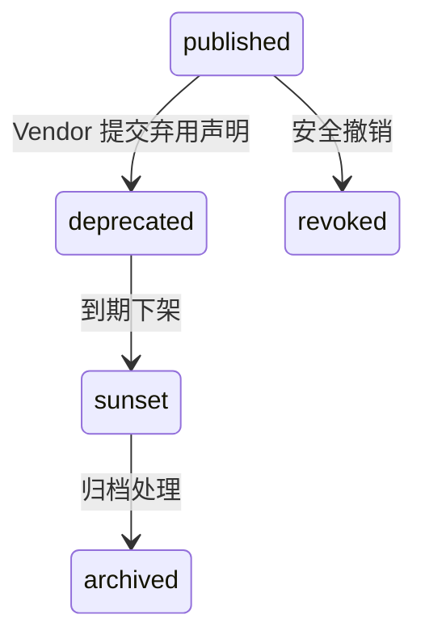

# 🌅 Deprecation & Sunset 插件弃用与下架策略

> 本文档定义 **PowerX Plugin Marketplace** 中插件的弃用（Deprecation）与下架（Sunset）管理规范。  
> 目标是确保插件生命周期闭环：**透明通知、平滑迁移、兼容性保障、合规存档**。

---

## 🧱 1. 定义区别

| 概念 | 英文状态 | 说明 | 是否仍可运行 |
|------|-----------|------|---------------|
| **Deprecated（弃用）** | `deprecated` | 插件仍可运行，但即将被替换或停止维护 | ✅ |
| **Sunset（下架）** | `sunset` | 插件正式停止分发与支持 | ⚠️ 仅保留历史版本 |
| **Revoked（撤销）** | `revoked` | 因安全或违规被强制吊销 | ❌ 不可运行 |
| **Replaced（替代）** | - | 新版本或新插件替代旧版本 | ✅（通过 redirect 安装） |

---

## 🧭 2. 生命周期阶段扩展

```

draft → pending_validation → pending_review
→ approved → published → deprecated → sunset → archived

````

| 阶段 | 描述 | 触发方 |
|------|------|---------|
| **deprecated** | Vendor 标记为弃用，提示用户迁移 | Vendor |
| **sunset** | 插件正式下架 | Vendor / Marketplace |
| **archived** | 插件完全归档，仅存历史记录 | 系统自动 |
| **revoked** | 因安全问题强制停用 | 安全团队 |

---

## 🧩 3. 弃用（Deprecation）策略

### 3.1 触发条件

- 发布了新主版本（Major Release）
- 替代插件已上线（`replaced_by`）
- Vendor 终止维护或迁移产品线
- 合规原因（例如隐私策略变更）

### 3.2 插件声明方式

在 `plugin.yaml` 中标记弃用状态：

```yaml
version: 2.0.0
deprecated: true
replaced_by: com.vendor.data_forge_plus
deprecation_notice: >
  本版本将在 2026-03-01 后不再维护，请升级到 Data Forge Plus。
````

### 3.3 前端展示

Marketplace 在插件详情页显示：

> ⚠️ 此插件已弃用，将在 2026-03-01 停止维护。
> 推荐升级至 [Data Forge Plus](https://marketplace.powerx.dev/plugins/com.vendor.data_forge_plus)。

### 3.4 通知机制

| 渠道                 | 内容              | 说明      |
| ------------------ | --------------- | ------- |
| **Marketplace 公告** | 弃用日期 + 替代推荐     | 全局可见    |
| **邮件通知**           | 发送给已安装租户管理员     | 仅针对安装用户 |
| **CoreX 告警日志**     | 插件加载时提示 warning | 本地日志记录  |

---

## ⚙️ 4. 下架（Sunset）策略

### 4.1 触发条件

- 弃用后超过维护期（通常为 90 天）
- 合规/法律风险要求立即下线
- Vendor 主动终止分发
- 安全团队要求下架

### 4.2 流程

| 阶段         | 动作                 | 执行方    |
| ---------- | ------------------ | ------ |
| ① 提交下架申请   | Vendor 在 Portal 发起 | Vendor |
| ② 审核确认     | Marketplace 合规团队复核 | 审核员    |
| ③ 通知租户     | 邮件+事件通告            | 系统自动   |
| ④ CoreX 同步 | 从安装清单中移除           | 系统自动   |
| ⑤ 存档归档     | 插件迁入 `archived` 状态 | 系统     |

### 4.3 状态变化



---

## 🧠 5. 替代与迁移机制

插件可以声明替代者（`replaced_by`）：

```yaml
replaced_by: com.vendor.data_forge_plus
migration_guide: ./docs/Migration_Guide.md
```

当用户打开旧插件页面时，系统将提示：

> “Data Forge 已升级至 Data Forge Plus，是否迁移？”

点击迁移后自动执行：

1. 卸载旧插件；
2. 安装新插件；
3. 迁移配置与数据（若 `migration_guide` 提供脚本）；
4. 保留旧版本快照以便回滚。

---

## 📦 6. 存档与追溯（Archiving）

当插件进入 `archived` 状态：

- 保留以下数据：

  - plugin.yaml
  - manifest.json
  - 版本签名文件
  - 审核记录
  - 安全扫描报告
- 删除：

  - 二进制包
  - 前端构建产物
  - 运行时镜像
- 存档文件仅限管理员访问，保留期 2 年。

---

## 🧰 7. 下架与弃用通知模版

### 邮件模板

```
主题：【PowerX Marketplace】插件弃用通知

尊敬的用户，

您正在使用的插件「Data Forge」（com.vendor.data_forge）即将弃用，
并将在 2026-03-01 停止维护。

建议您尽快升级至「Data Forge Plus」以获得持续支持与安全更新。

查看迁移指南：
https://marketplace.powerx.dev/docs/migration/com.vendor.data_forge_plus

PowerX Marketplace 团队
```

### CoreX 告警日志示例

```
[WARN] [plugin_loader] Plugin com.vendor.data_forge 已标记为 deprecated。
建议升级至 com.vendor.data_forge_plus。
```

---

## ⚖️ 8. 合规与记录保留

| 项目              | 保留周期 | 说明       |
| --------------- | ---- | -------- |
| 插件 manifest 与签名 | 2 年  | 用于审计     |
| 审核与日志记录         | 2 年  | 满足法规合规要求 |
| Vendor 撤销记录     | 3 年  | 用于责任追踪   |
| 用户使用记录          | 1 年  | 仅保留匿名统计  |

---

## 🧾 9. Deprecated 插件的运行策略

| 状态           | CoreX 行为            | Marketplace 行为   |
| ------------ | ------------------- | ---------------- |
| `deprecated` | 加载时输出 warning，不阻止运行 | 插件详情页标记          |
| `sunset`     | 禁止新安装，但保留旧实例        | Marketplace 不再展示 |
| `revoked`    | 立即卸载并删除缓存           | 插件被完全屏蔽          |
| `archived`   | 仅保留历史记录             | 后台存档，不可访问        |

---

## 🧠 10. 推荐的弃用计划模板

在插件仓库根目录下提供：

```
docs/
└── DEPRECATION_PLAN.md
```

内容示例：

```markdown
# Data Forge 插件弃用计划

## 时间线
- 2026-01-15：发布 Data Forge Plus
- 2026-02-01：标记 Data Forge 为 deprecated
- 2026-03-01：正式 sunset

## 用户迁移说明
1. 进入 PowerX Admin → 插件管理 → 迁移向导；
2. 点击 “迁移至 Data Forge Plus”；
3. 系统自动转移配置与历史报表。

## 联系方式
support@vendor.dev
```

---

## 🪶 11. 最佳实践

| 场景           | 建议                                 |
| ------------ | ---------------------------------- |
| **准备弃用插件**   | 至少提前 60 天公告                        |
| **替代版本**     | 保持接口兼容，方便迁移                        |
| **数据迁移**     | 提供 Migration Guide 或脚本             |
| **API 标记**   | 旧接口可用，但添加 `/deprecated` 前缀或 Header |
| **CoreX 集成** | 使用 Manifest Hook 在加载时提示升级          |
| **市场展示**     | 使用淡化样式与警告标签                        |
| **文档同步**     | 更新 README 与 plugin.yaml            |

---

## 📘 12. 关联文档

- 👉 [Submission & Review 插件上架与审核流程](./Submission_and_Review.md)
- 👉 [Security & Validation 插件安全与完整性校验](../02_plugin_development/Security_and_Validation.md)
- 👉 [Vendor Profile & Portal 开发者控制台](../01_onboarding/Vendor_Profile_and_Portal.md)
- 👉 [PowerX Plugin Manifest 对接规范](../06_integration_with_powerx/PowerX_Plugin_Manifest.md)

---

> ✅ **总结一句话：**
> Deprecation & Sunset 是 PowerX 插件生态的「优雅退出机制」。
> 它保证插件生命周期 **可控、可追溯、可迁移、可合规**，让生态保持健康与稳定。
