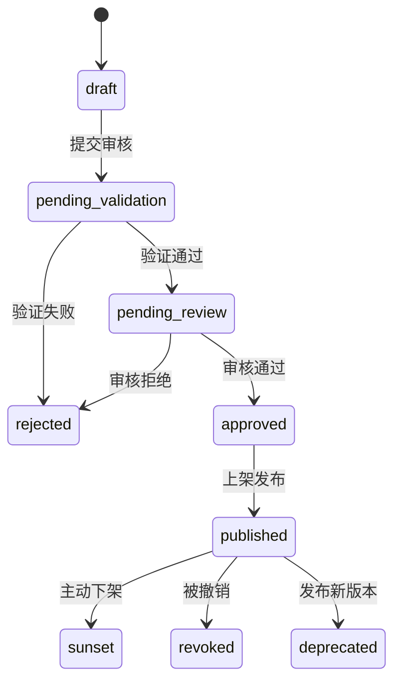

# 🚀 Submission & Review 插件上架与审核流程

> 本文档描述 **PowerX Plugin Marketplace** 的插件提交流程、审核机制、状态机与发布策略。  
> 所有插件在正式上架前必须经过「自动验证 + 人工审核 + 安全扫描」三重流程。

---

## 🧱 1. 插件生命周期总览

插件从开发完成到用户可安装的全过程可分为以下阶段：

```

开发（Development）
↓
提交审核（Submission）
↓
自动验证（Validation）
↓
人工审核（Manual Review）
↓
批准发布（Approved → Published）
↓
用户可安装（Installable）
↓
更新 / 撤销 / 下架（Update / Revoke / Sunset）

```

> PowerX Marketplace 会为每个阶段分配明确状态（`status`），  
> 并在 Vendor Portal / Admin Console 同步显示。

---

## 🧭 2. 状态机定义（State Machine）

| 状态 | 英文枚举 | 说明 | 可操作方 |
|------|-----------|------|-----------|
| **草稿** | `draft` | 初次创建，未提交审核 | Vendor |
| **待验证** | `pending_validation` | 提交后自动检测中 | 系统自动 |
| **待审核** | `pending_review` | 自动验证通过，等待人工审核 | 审核员 |
| **已拒绝** | `rejected` | 审核未通过 | 系统+审核员 |
| **已批准** | `approved` | 审核通过，等待上架 | 系统 |
| **已发布** | `published` | 插件上架，用户可见 | 系统 |
| **已撤销** | `revoked` | 被安全团队吊销 | 系统 |
| **已下架** | `sunset` | 主动下架或替换版本 | Vendor/系统 |
| **已弃用** | `deprecated` | 旧版本仍可运行但不再推荐 | 系统 |

> 状态流转受控于审核策略与安全策略。  
> CoreX 在加载插件时只会识别 `published` 状态的版本。

---

## 🧩 3. 提交流程（Submission Flow）

### 步骤一：构建与打包

Vendor 使用 Makefile 进行本地构建与签名：

```bash
make secure-pack VERSION=1.0.0
```

输出：

```
dist/com.vendor.plugin-1.0.0.tar.gz
dist/com.vendor.plugin-1.0.0.sig
```

### 步骤二：上传包文件

通过 Vendor Portal 或 Marketplace API 上传：

```
POST /api/v1/vendors/{vendor_id}/plugins
Content-Type: multipart/form-data
```

Body：

* `plugin_file`: tar.gz 包
* `signature`: `.sig` 文件
* `meta`: （可选）版本说明 / 更新日志

### 步骤三：自动验证（Validation）

Marketplace 自动执行以下任务：

| 验证类型   | 工具                                | 说明                       |
| ------ | --------------------------------- | ------------------------ |
| 结构校验   | 内置 Schema Validator               | 检查 `plugin.yaml` 字段完整性   |
| 签名验证   | `openssl`                         | 验证 Vendor 公钥签名           |
| 依赖检查   | Trivy / govulncheck / cargo audit | 检查依赖漏洞                   |
| 权限对比   | Manifest Checker                  | 校验最小权限原则                 |
| API 探针 | Mock Runner                       | 验证 `/api/v1/health` 是否正常 |
| 安全扫描   | ClamAV                            | 检测恶意脚本或隐性外链              |

> 若任一验证失败，状态自动变为 `rejected`，并生成详细报告。

### 步骤四：人工审核（Manual Review）

审核团队执行人工检查：

| 项目            | 说明                      |
| ------------- | ----------------------- |
| 插件功能描述是否清晰    | 对照 Marketplace 分类规范     |
| Logo / 图标是否合规 | 不得含品牌侵权元素               |
| 隐私声明是否符合规范    | 明确说明数据使用范围              |
| 权限请求是否合理      | 不得过度访问 tenant 数据        |
| 文档完整性         | 必须包含 README、版本日志、API 文档 |
| UI 体验         | 前端界面运行正常，无异常跳转          |

> 审核结果将在 3 个工作日内反馈。

---

## ⚙️ 4. 审核结果状态流转



---

## 🧠 5. 审核拒绝常见原因

| 原因分类     | 示例                              | 解决方案     |
| -------- | ------------------------------- | -------- |
| **结构错误** | 缺少 `plugin.yaml` 字段 / YAML 语法错误 | 修正并重新打包  |
| **签名无效** | 签名文件与包不匹配                       | 重新执行签名命令 |
| **权限过宽** | 申请 `system.admin` 权限            | 仅保留必要权限  |
| **前端违规** | 内嵌外部跟踪脚本                        | 删除并重新构建  |
| **安全风险** | 依赖含 CVE 高危漏洞                    | 升级依赖后重试  |
| **文档缺失** | 无 README 或说明文件                  | 补充文档重新提交 |

---

## 💬 6. 审核沟通机制

### 通知渠道

* Portal 通知中心（系统消息）
* 邮件（Vendor 注册邮箱）
* Webhook（可选）

### 审核反馈格式

```json
{
  "plugin_id": "com.vendor.data_forge",
  "version": "1.0.0",
  "status": "rejected",
  "issues": [
    { "field": "permissions", "message": "权限过宽，建议仅保留 data_visualization" },
    { "field": "frontend", "message": "检测到跨域请求" }
  ],
  "reviewer": "auditor_12",
  "reviewed_at": "2025-10-13T14:12:00Z"
}
```

> Vendor 可在 Portal 的「审核记录」中查看每条历史反馈。

---

## 🧾 7. 发布与版本管理

### 发布条件

* 审核状态为 `approved`
* 签名验证通过
* 未存在相同版本号
* 无安全风险警告

### 发布行为

系统将：

1. 标记状态为 `published`
2. 生成对应版本的 `manifest.json`
3. 更新插件市场展示页（价格、截图、描述）
4. 通知订阅用户更新可用

---

## 🧰 8. 版本更新与复审机制

| 类型                 | 触发条件         | 审核策略           |
| ------------------ | ------------ | -------------- |
| **Minor 更新**       | bug 修复 / 小优化 | 自动复核 + 快速发布    |
| **Major 更新**       | 接口变更 / 权限调整  | 完整重新审核         |
| **安全补丁**           | 修复安全漏洞       | 优先通道审查，24h 内处理 |
| **价格或 License 更新** | 修改定价策略       | 财务与合规复核        |

> 版本更新必须提升语义化版本号（`1.0.0 → 1.1.0`），
> 否则上传将被拒绝。

---

## 🛑 9. 下架与撤销（Sunset & Revoke）

| 操作       | 说明            | 可发起方             |
| -------- | ------------- | ---------------- |
| **主动下架** | 插件不再维护或需要暂时下线 | Vendor           |
| **安全撤销** | 插件存在高危漏洞或恶意行为 | Marketplace 安全团队 |
| **自动弃用** | 新版本替换旧版本      | 系统自动             |

下架流程：

1. Vendor 发起下架请求；
2. 审核团队确认影响范围；
3. CoreX 通知所有租户插件已下线；
4. 状态更新为 `sunset`。

撤销流程：

1. 安全事件触发；
2. Marketplace 更新状态为 `revoked`；
3. CoreX 停止运行插件；
4. 通知 Vendor 修复与重审。

---

## 🧩 10. 上架质量等级（Quality Tier）

Marketplace 按稳定性与合规性为插件分级：

| 等级                  | 说明                 | 特权          |
| ------------------- | ------------------ | ----------- |
| **Verified**        | 审核通过，签名有效          | 正常展示        |
| **Certified**       | 通过官方扩展测试（≥90% 覆盖率） | 认证徽章        |
| **Trusted Partner** | 签约合作 Vendor        | 优先展示 / 首页推荐 |

---

## 🧠 11. 审核 SLA 与沟通

| 阶段      | 目标响应时间   | 说明     |
| ------- | -------- | ------ |
| 自动验证    | ≤ 5 分钟   | 实时执行   |
| 人工审核    | ≤ 3 个工作日 | 邮件通知   |
| 安全复审    | ≤ 48 小时  | 优先通道   |
| 下架/撤销通报 | ≤ 24 小时  | 高优先级响应 |

---

## 🧰 12. 审核前 Checklist

| 检查项                     | 是否完成 |
| ----------------------- | ---- |
| ✅ `plugin.yaml` 结构正确    | ☐    |
| ✅ 签名与包文件匹配              | ☐    |
| ✅ 权限声明最小化               | ☐    |
| ✅ Sandbox 运行正常          | ☐    |
| ✅ README / CHANGELOG 完整 | ☐    |
| ✅ API / UI 可用           | ☐    |
| ✅ 无外部违规依赖               | ☐    |
| ✅ 通过 `make audit` 检查    | ☐    |
| ✅ 上传签名文件 `.sig`         | ☐    |

---

## 🪶 13. 最佳实践

| 场景         | 建议                                      |
| ---------- | --------------------------------------- |
| **频繁更新插件** | 保持版本号语义化一致（避免覆盖）                        |
| **安全扫描失败** | 本地运行 `make audit` 与 `make secure-check` |
| **审核沟通**   | 提交详细更新日志与截图                             |
| **文档维护**   | README 与 API 文档必须同步更新                   |
| **前端校验**   | 不使用外部脚本或 iframe 注入                      |
| **快速通道**   | 通过 Verified Vendor 认证可加速审核流程            |

---

## 📘 14. 关联文档

* 👉 [Testing & Sandbox 测试与沙盒环境指南](../02_plugin_development/Testing_and_Sandbox.md)
* 👉 [Security & Validation 插件安全与完整性校验](../02_plugin_development/Security_and_Validation.md)
* 👉 [Deprecation & Sunset 生命周期终止策略](./Deprecation_and_Sunset.md)
* 👉 [Marketplace Vendor Onboarding 指南](../01_onboarding/Vendor_Profile_and_Portal.md)

---

> ✅ **总结一句话：**
> 插件的上架流程是一个「自动验证 + 人工复核 + 安全合规 + 持续监控」的闭环。
> 只有通过全链条校验与签名验证的插件，才能进入 PowerX Marketplace 的正式生态。
