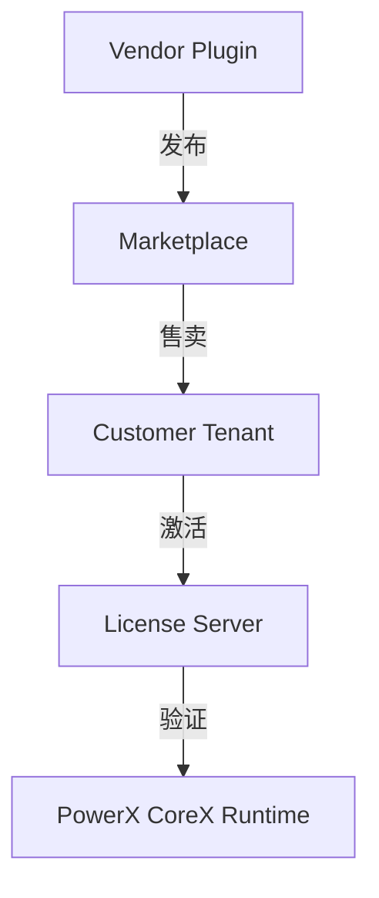

# 🧾 License Types 插件授权类型规范

> 本文档定义 **PowerX Plugin Marketplace** 中插件的授权类型（License Types）与相关约束。  
> 目标是让开发者（Vendor）在 Marketplace 内采用统一的授权模型，实现**灵活变现、透明结算、可续期可追踪**。

---

## 🧱 1. 设计目标

| 目标 | 说明 |
|------|------|
| **标准化授权模型** | 所有插件销售与分发基于统一 License 系统 |
| **灵活性** | 支持免费、订阅、一次性购买、增值模块 |
| **可验证** | PowerX CoreX 会校验 License Token 有效性 |
| **可续期** | 支持自动续费与手动续期 |
| **可扩展** | 支持 Vendor 自定义授权规则（API hook） |

---

## 🧩 2. 授权体系结构概览



**角色说明：**

* **Vendor**：插件开发者，定义授权类型与价格。
* **Marketplace**：负责销售与分发 License。
* **Tenant（客户）**：购买并激活插件。
* **License Server**：PowerX License 验证中心。
* **CoreX Runtime**：在运行时校验并缓存 License Token。

---

## 🧠 3. License 类型总览

| 类型     | 英文名            | 收费方式       | 典型场景       |
| ------ | -------------- | ---------- | ---------- |
| 免费授权   | `free`         | 免费         | 开源插件、示例插件  |
| 订阅授权   | `subscription` | 按月/年       | SaaS 型增值服务 |
| 一次性购买  | `perpetual`    | 单次付款终身使用   | 独立功能插件     |
| 增值模块   | `addon`        | 依附主插件授权    | 可选扩展功能     |
| 企业定制授权 | `enterprise`   | 商议定价       | 高级/白标客户    |
| 按调用计费  | `usage_based`  | 基于 API 调用量 | AI / 算力类插件 |

---

## 💰 4. 免费授权（Free License）

```yaml
license:
  type: free
  validity: unlimited
  verification: none
```

**特点：**

* 用户可直接安装；
* 无需激活或验证；
* 可选择在安装时收集基础统计信息（安装量、租户数）；
* 推荐用于开源或 Demo 插件。

**示例：**

> ✅ `Hello PowerX Plugin`
> 免费授权，无需登录即可安装体验。

---

## 🧩 5. 订阅授权（Subscription License）

```yaml
license:
  type: subscription
  plan: monthly
  price: 29.99
  renewal: auto
  validity_days: 30
```

**特点：**

* 用户通过 Marketplace 支付订阅；
* License 按月或按年自动续费；
* Marketplace 自动生成发票与分成；
* CoreX 每次插件启动时校验有效期。

| 字段              | 示例                   | 说明     |
| --------------- | -------------------- | ------ |
| `plan`          | `monthly` / `yearly` | 计费周期   |
| `renewal`       | `auto` / `manual`    | 是否自动续费 |
| `validity_days` | `30`                 | 授权周期   |
| `trial_days`    | `7`                  | 可选试用期  |

**续费机制：**

* Marketplace 每日任务检测 License 到期；
* 自动扣款或邮件提醒续期；
* 续期成功 → License token 刷新。

---

## 🧾 6. 一次性购买（Perpetual License）

```yaml
license:
  type: perpetual
  price: 199.00
  updates_included: 365
```

**特点：**

* 用户一次付费，永久拥有授权；
* 可设置「含更新期限」；
* 到期后仍可使用旧版本，但无法获取更新；
* 适用于单功能型插件（如 PDF 转换、报表导出）。

---

## 🧩 7. 增值模块（Add-on License）

```yaml
license:
  type: addon
  depends_on: com.vendor.analytics
  price: 9.99
```

**特点：**

* 依附于主插件（必须先安装主插件）；
* 由主插件统一 License 校验；
* 可通过 `License API` 检查是否启用：

  ```json
  {
    "plugin_id": "com.vendor.analytics",
    "addons": ["charts", "insights"]
  }
  ```

* 常用于：模块化功能、主题包、附加算力等。

---

## 🏢 8. 企业定制（Enterprise License）

```yaml
license:
  type: enterprise
  contract_id: ENT-2025-0001
  pricing: custom
  seats: 500
```

**特点：**

* 面向大型客户（白标/OEM）；
* 价格与条款单独协商；
* 支持 Seat / Tenant / SLA 维度；
* 可绑定企业邮箱域（`@company.com`）。

> 企业授权通常通过 API 接口签发，不在 Marketplace 公共目录展示。

---

## ⚙️ 9. 按调用计费（Usage-Based License）

```yaml
license:
  type: usage_based
  metric: "api_calls"
  unit_price: 0.005
  quota: 10000
  auto_throttle: true
```

**特点：**

* 按调用量计费；
* CoreX 每次请求上报使用事件；
* 超出配额后自动限流或暂停。

**计费字段：**

| 字段              | 说明                   |
| --------------- | -------------------- |
| `metric`        | 计量维度（如调用次数、token 数量） |
| `unit_price`    | 单位价格                 |
| `quota`         | 月度配额                 |
| `auto_throttle` | 自动限速开关               |

---

## 🔐 10. 授权验证机制

PowerX CoreX 在插件启动时执行以下流程：

```
1️⃣ 获取 License Token（JWT）
2️⃣ 调用 License API 校验签名与有效期
3️⃣ 检查租户、插件、版本、Scope
4️⃣ 缓存验证结果 24 小时
```

License Token 示例：

```json
{
  "plugin_id": "com.vendor.analytics",
  "tenant_id": "t-9a21",
  "license_type": "subscription",
  "valid_until": "2025-11-13T00:00:00Z",
  "signature": "base64-rsa-signature"
}
```

---

## 💬 11. 授权与定价的关系

| 授权类型 | 定价模型  | 续期  | 收入分成      | 示例         |
| ---- | ----- | --- | --------- | ---------- |
| 免费   | 无     | 否   | 0%        | Demo / 工具类 |
| 订阅   | 月/年   | 自动  | 10% / 90% | SaaS 类插件   |
| 一次性  | 单次付款  | 否   | 15% / 85% | 工具型插件      |
| 增值模块 | 依附主插件 | 可选  | 10% / 90% | 附加功能包      |
| 企业定制 | 合同价   | 自定义 | 按协议       | 白标/OEM     |
| 按调用  | 动态计费  | 自动  | 20% / 80% | AI/算力型插件   |

---

## 📦 12. License 状态与生命周期

| 状态        | 说明   | 触发条件     |
| --------- | ---- | -------- |
| `active`  | 授权有效 | 正常运行     |
| `expired` | 授权过期 | 到期未续费    |
| `revoked` | 被撤销  | 违规/退款    |
| `pending` | 待验证  | 新安装等待激活  |
| `trial`   | 试用中  | 未付费但有效期内 |

CoreX 会根据状态自动调整行为：

* `active` → 正常运行；
* `expired` → 提示续费；
* `revoked` → 停止加载；
* `trial` → 限制部分功能。

---

## 🧠 13. License 定义在 plugin.yaml

示例：

```yaml
license:
  type: subscription
  price: 49.00
  plan: yearly
  renewal: auto
  trial_days: 14
  validation_endpoint: https://license.powerx.dev/api/v1/verify
```

> 运行期由 CoreX License Manager 调用该接口完成验证。

---

## 🧰 14. Makefile 示例：License 检查命令

```makefile
license-check:
 @echo "🔍 Checking license validation endpoint..."
 curl -s https://license.powerx.dev/api/v1/verify \
   -H "Authorization: Bearer $$LICENSE_TOKEN" \
   | jq '.status'
```

---

## 🪶 15. 最佳实践

| 场景            | 建议                      |
| ------------- | ----------------------- |
| **免费插件**      | 可通过 Analytics 收集匿名使用数据  |
| **订阅插件**      | 保证 License 校验稳定（支持重试）   |
| **企业客户**      | 使用独立 License API 域名     |
| **Add-on 模块** | 与主插件共用 License 校验逻辑     |
| **按调用计费**     | 明确定义 metric 与配额上限       |
| **试用机制**      | 试用期 ≤ 14 天，确保体验无风险      |
| **安全建议**      | License Token 不落盘、仅内存缓存 |

---

## 📘 16. 关联文档

* 👉 [Pricing & Plan 定价模型与订阅策略](./Pricing_and_Plan.md)
* 👉 [License Validation & Refresh 授权验证与续期机制](./License_Validation_and_Refresh.md)
* 👉 [Revenue Share & Payouts 分成与结算规则](../05_finance_and_settlement/Revenue_Share_and_Payouts.md)
* 👉 [PowerX Plugin Manifest 对接规范](../06_integration_with_powerx/PowerX_Plugin_Manifest.md)

---

> ✅ **总结一句话：**
> PowerX 的 License 体系以 **统一 Token、灵活类型、自动验证、透明结算** 为核心，
> 让每个插件都能安全变现、灵活分发、合规追踪。
