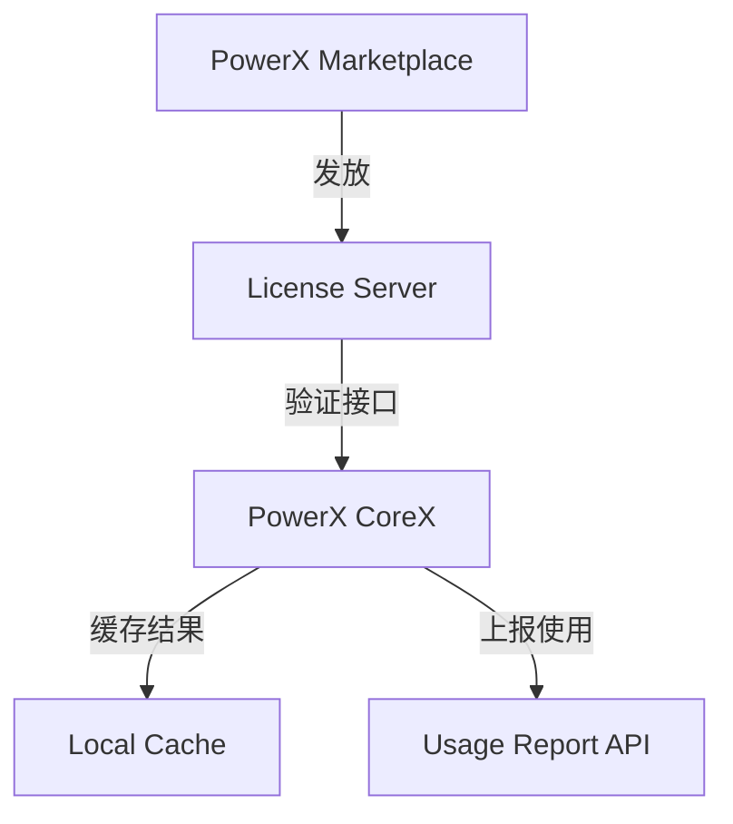
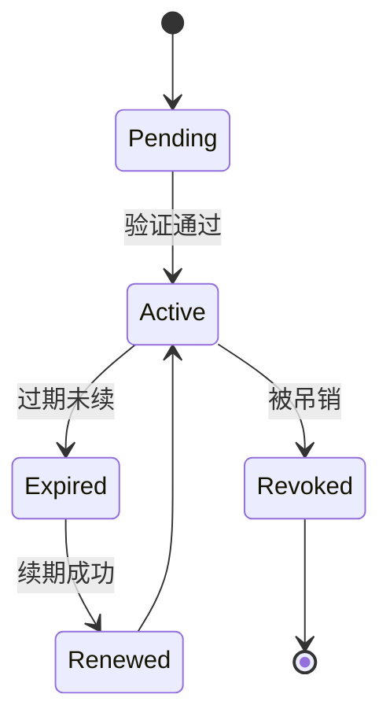

# 🔐 License Validation & Refresh 授权验证与续期机制

> 本文档定义 **PowerX Plugin Marketplace** 授权系统的验证、续期与吊销逻辑。  
> 目标：确保每个插件在运行时都能安全、可靠地验证授权合法性，  
> 并支持自动续期、离线缓存与违规吊销。

---

## 🧱 1. 系统组成结构



| 组件                 | 职责                         |
| ------------------ | -------------------------- |
| **Marketplace**    | 生成与管理 License 记录           |
| **License Server** | 提供授权验证、刷新与吊销接口             |
| **CoreX**          | 在插件启动时校验 License           |
| **Plugin**         | 持有 License Token 并在运行时上报事件 |

---

## 🧩 2. License Token 结构

License 是一个 JWT（JSON Web Token），
由 Marketplace 签发，Vendor 的私钥或系统密钥签名。

```json
{
  "iss": "powerx.marketplace",
  "plugin_id": "com.vendor.analytics",
  "tenant_id": "t-9a21",
  "license_id": "lic-74b2d",
  "type": "subscription",
  "plan": "growth",
  "valid_until": "2025-11-13T00:00:00Z",
  "scope": ["read", "write"],
  "meta": {"users": 5},
  "signature": "base64-rsa-signature"
}
```

### 验证要点

| 字段            | 校验项                       |
| ------------- | ------------------------- |
| `iss`         | 必须等于 `powerx.marketplace` |
| `plugin_id`   | 必须匹配当前插件                  |
| `tenant_id`   | 必须匹配当前租户                  |
| `valid_until` | 不得过期                      |
| `signature`   | 必须通过公钥验证                  |

---

## ⚙️ 3. 验证流程（CoreX Runtime）

```
plugin start → CoreX LicenseManager → License API → Cache → OK
```

### 流程步骤

1️⃣ 插件启动时读取 License Token（来自 Marketplace 激活或租户导入）；
2️⃣ 调用 License Server 验证接口；
3️⃣ 验证签名、有效期与租户绑定；
4️⃣ 校验通过 → 缓存结果 24 小时；
5️⃣ 校验失败 → 禁止启动插件。

---

## 🔍 4. 验证接口定义（License API）

**Endpoint:**

```
POST https://license.powerx.dev/api/v1/verify
```

**Request:**

```json
{
  "plugin_id": "com.vendor.analytics",
  "tenant_id": "t-9a21",
  "license_token": "eyJhbGciOiJIUzI1..."
}
```

**Response:**

```json
{
  "valid": true,
  "expires_at": "2025-11-13T00:00:00Z",
  "plan": "growth",
  "license_type": "subscription",
  "next_renewal": "2025-10-13T00:00:00Z",
  "features": ["analytics", "dashboard"],
  "remaining_quota": 9421
}
```

---

## 🔁 5. 自动续期（License Refresh）

### 5.1 定时续期机制

* CoreX 每 24 小时刷新一次 License；
* 使用 `license.refresh` 事件触发后台任务；
* 若 Marketplace 返回新 Token → 自动覆盖；
* 若刷新失败 → 保留旧 Token 并记录警告日志。

```bash
corex license refresh --plugin com.vendor.analytics
```

### 5.2 Refresh API

```
POST https://license.powerx.dev/api/v1/refresh
```

**Request:**

```json
{
  "license_id": "lic-74b2d",
  "tenant_id": "t-9a21"
}
```

**Response:**

```json
{
  "new_token": "eyJhbGciOiJIUzI1...",
  "valid_until": "2026-01-01T00:00:00Z"
}
```

---

## 🔒 6. 吊销与失效（Revocation）

License 可由 Marketplace 主动吊销：

* 退款；
* 安全违规；
* 订阅逾期；
* 合同终止。

### Revocation API

```
POST https://license.powerx.dev/api/v1/revoke
```

**CoreX 行为：**

* 检测到吊销 → 插件立即停止运行；
* 写入事件：`plugin.license.revoked`;
* 记录至审计日志 `/var/log/powerx/audit.log`。

---

## 📦 7. 离线缓存与容错策略

| 场景                  | 行为                    |
| ------------------- | --------------------- |
| License Server 可访问  | 实时验证                  |
| License Server 不可访问 | 使用缓存 Token（有效期 ≤ 72h） |
| 缓存 Token 过期         | 插件进入 “冻结模式”           |
| 网络恢复后               | 自动重试验证                |

> 离线验证确保企业私有部署场景下依然可运行。

---

## 🧰 8. 插件端验证逻辑（SDK 示例）

```go
func (m *LicenseManager) Validate(ctx context.Context, token string) error {
    if m.Cache.IsValid(token) {
        return nil
    }
    resp, err := http.Post(m.Endpoint+"/verify", "application/json", bytes.NewBuffer([]byte(token)))
    if err != nil {
        return fmt.Errorf("License verification failed: %w", err)
    }
    if !resp.Valid {
        return errors.New("Invalid or expired license")
    }
    m.Cache.Store(token, resp.ExpiresAt)
    return nil
}
```

---

## 🧾 9. 核心状态机（License Lifecycle）



---

## ⚙️ 10. CoreX 本地缓存结构

缓存文件路径：

```
/var/lib/powerx/licenses/{plugin_id}.json
```

示例：

```json
{
  "plugin_id": "com.vendor.analytics",
  "license_id": "lic-74b2d",
  "valid_until": "2025-11-13T00:00:00Z",
  "cached_at": "2025-10-13T00:00:00Z"
}
```

> CoreX 会在每次启动时验证缓存文件有效性。

---

## 🧩 11. 事件上报与审计

| 事件                         | 描述   |
| -------------------------- | ---- |
| `plugin.license.verified`  | 验证成功 |
| `plugin.license.expired`   | 授权过期 |
| `plugin.license.revoked`   | 被吊销  |
| `plugin.license.refreshed` | 续期成功 |
| `plugin.license.error`     | 验证失败 |

> 所有事件通过 EventBus 上报至 Marketplace，用于计费与监控。

---

## 💡 12. 多租户隔离与验证策略

| 场景     | 验证策略                   |
| ------ | ---------------------- |
| 单租户插件  | License 绑定唯一租户         |
| 多租户插件  | 每个租户独立 License Token   |
| 企业授权插件 | 绑定企业域名（`@company.com`） |
| 内置插件   | 由 CoreX 内部签发内网 License |

---

## 🧠 13. License 续期逻辑（时间线）

| 阶段      | 操作                   | 结果                   |
| ------- | -------------------- | -------------------- |
| 到期前 7 天 | 发送续期提醒邮件             | 用户可主动续费              |
| 到期日     | 自动尝试续期               | 若失败 → 状态改为 `expired` |
| 到期后 3 天 | 再次尝试续期               | 若仍失败 → 插件冻结          |
| 成功续期    | 状态改为 `active`，续期日期更新 |                      |

---

## 🧰 14. Makefile 示例（验证与续期）

```makefile
license-verify:
 @echo "🔍 Verifying plugin license..."
 curl -s -X POST https://license.powerx.dev/api/v1/verify \
  -d '{"plugin_id":"$(PLUGIN_ID)","tenant_id":"$(TENANT_ID)","license_token":"$(LICENSE_TOKEN)"}' \
  | jq '.valid'

license-refresh:
 @echo "♻️ Refreshing license..."
 curl -s -X POST https://license.powerx.dev/api/v1/refresh \
  -d '{"license_id":"$(LICENSE_ID)","tenant_id":"$(TENANT_ID)"}' \
  | jq '.new_token'
```

---

## 🧾 15. 安全性与合规要求

| 项目           | 要求               |
| ------------ | ---------------- |
| **加密算法**     | RSA-2048 / ES256 |
| **签名方式**     | Base64 + 公钥验证    |
| **通信协议**     | HTTPS 必选         |
| **Token 存储** | 不落盘（仅缓存摘要）       |
| **敏感信息脱敏**   | CoreX 仅存储签名摘要    |
| **日志要求**     | 不记录完整 Token 内容   |

---

## 🪶 16. 最佳实践

| 场景               | 建议                     |
| ---------------- | ---------------------- |
| **企业客户离线部署**     | 启用离线缓存 + 手动验证模式        |
| **高频插件（AI/算力类）** | 增加验证间隔（缓存 12h）         |
| **开发测试环境**       | 使用 `mock-license=true` |
| **多租户插件**        | 独立 License per Tenant  |
| **安全插件**         | 使用 RSA256 签名验证         |
| **续期失败场景**       | 提前触发提醒机制               |

---

## 📘 17. 关联文档

* 👉 [License Types 授权类型定义](./License_Types.md)
* 👉 [Pricing & Plan 定价与套餐设计](./Pricing_and_Plan.md)
* 👉 [Usage Report & Event API 使用事件上报接口](../06_integration_with_powerx/Usage_Report_and_Event_API.md)
* 👉 [Security & Validation 插件安全与签名机制](../02_plugin_development/Security_and_Validation.md)
* 👉 [Revenue Share & Payouts 分成与结算流程](../05_finance_and_settlement/Revenue_Share_and_Payouts.md)

---

> ✅ **总结一句话：**
> PowerX 的 License 验证体系以 **「可验证、可续期、可吊销、可离线」** 为核心，
> 通过安全签名与缓存机制，保证每个插件的授权链条可控、可信、可审计。
