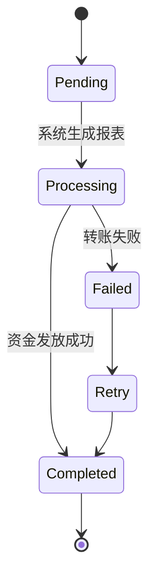

# 💵 Revenue Share & Payouts 分成与结算机制

> 本文档定义 **PowerX Plugin Marketplace** 的收益分成、结算周期、分润比例、提现方式与税务合规机制。  
> 目标是：确保所有 Vendor 的收益**透明、可追踪、可结算、可审计**，并支持多货币与多支付渠道。

---

## 🧱 1. 系统设计目标

| 目标 | 说明 |
|------|------|
| **透明分成** | 收入分配公式统一、可视化 |
| **自动结算** | 定期触发分润任务、自动对账 |
| **多币种支持** | USD / CNY / JPY / EUR |
| **税务合规** | 自动计算平台服务费与预扣税 |
| **跨境支付** | 支持 Stripe / Payoneer / Alipay / 银行转账 |
| **可追踪** | 所有交易生成唯一 Trace ID、可审计回溯 |

---

## 🧩 2. 收益闭环概览


**主要角色：**

* **Tenant**：客户租户，发起购买或续费；
* **Marketplace**：负责支付与账务处理；
* **Revenue Pool**：待结算资金池；
* **Vendor Portal**：展示收益与发票；
* **Payout Gateway**：第三方支付通道（Stripe/Payoneer等）。

---

## 💰 3. 收益分成模型（Revenue Split Model）

| 模型    | Vendor 收益 | 平台分成 | 说明             |
| ----- | --------- | ---- | -------------- |
| 免费插件  | 0%        | 0%   | 无交易            |
| 订阅制   | 90%       | 10%  | 平台抽成 10%       |
| 一次性购买 | 85%       | 15%  | 平台抽成 15%       |
| 按调用计费 | 80%       | 20%  | 平台抽成 20%，含监控成本 |
| 企业合同  | 自定义       | 自定义  | 按合同约定          |
| 增值模块  | 90%       | 10%  | 跟随主插件分成        |

> ✅ 平台分成比例可通过运营活动或认证等级（Verified Vendor）获得优惠。

---

## ⚙️ 4. 收入计算公式

> 每个订单交易会生成一条收益明细（Revenue Record）。

公式：

```
vendor_revenue = gross_amount × (1 - platform_fee%) - tax_withholding
```

| 参数                | 说明           |
| ----------------- | ------------ |
| `gross_amount`    | 订单总额（含税）     |
| `platform_fee%`   | 平台抽成比例       |
| `tax_withholding` | 扣缴税额（按国家/地区） |
| `vendor_revenue`  | 实际入账金额       |

---

## 📅 5. 结算周期（Settlement Cycle）

| 类型       | 周期             | 描述                 |
| -------- | -------------- | ------------------ |
| **月度结算** | 每月 1 日触发上月结算任务 | 默认方式               |
| **快速结算** | 每周自动结算         | 需开通 Stripe Express |
| **企业合约** | 按合同            | 定制周期（季度/半年）        |

> 结算日会自动生成结算报表（Settlement Report）并发送至 Vendor 邮箱。

---

## 📊 6. 收益记录结构（Revenue Record Schema）

```json
{
  "revenue_id": "rev_20251013_00092",
  "vendor_id": "vnd_0021",
  "plugin_id": "com.vendor.analytics",
  "order_id": "ord_9f3a2b",
  "currency": "USD",
  "gross_amount": 49.99,
  "platform_fee": 4.99,
  "tax_withheld": 1.00,
  "net_revenue": 44.00,
  "status": "pending_payout",
  "created_at": "2025-10-13T00:00:00Z"
}
```

---

## 💳 7. 提现与支付通道（Payout Channels）

| 通道                | 说明            | 周期    | 手续费   |
| ----------------- | ------------- | ----- | ----- |
| **Stripe**        | 默认通道（全球支持）    | 1–3 天 | 1.5%  |
| **Payoneer**      | 跨境账户常用        | 3–5 天 | 2%    |
| **Alipay**        | 中国区 Vendor 支持 | 1–2 天 | 0.8%  |
| **Bank Transfer** | 企业账户转账        | 3–7 天 | 视银行而定 |

Vendor 可在 Portal 配置提现账户：

```yaml
payout_account:
  provider: stripe
  account_id: acct_29x8dd91
  currency: USD
```

---

## 🧾 8. 结算状态流转（Settlement Status）



| 状态           | 说明   |
| ------------ | ---- |
| `pending`    | 待结算  |
| `processing` | 结算中  |
| `completed`  | 已发放  |
| `failed`     | 转账失败 |
| `retry`      | 重试中  |

---

## 💼 9. Vendor 等级与分成比例

| 等级                     | 条件                    | 平台抽成 | 优惠说明     |
| ---------------------- | --------------------- | ---- | -------- |
| **Standard**           | 默认入驻                  | 15%  | 基础分成     |
| **Verified Vendor**    | 完成认证（KYC + 稳定运营 3 个月） | 10%  | 优惠 5%    |
| **Top Vendor**         | 年销售额 > 10 万美元         | 8%   | 享受推广流量扶持 |
| **Enterprise Partner** | 合作协议签署                | 自定义  | 按合同执行    |

---

## ⚙️ 10. 报表与对账（Invoicing & Reports）

每月自动生成三类报表：

| 报表类型     | 文件名示例                      | 说明        |
| -------- | -------------------------- | --------- |
| **结算报表** | `settlement_2025-09.csv`   | 收入、税额、手续费 |
| **交易明细** | `transactions_2025-09.csv` | 每笔订单流水    |
| **发票列表** | `invoice_2025-09.pdf`      | 税务凭证或电子发票 |

> 报表存储于 Vendor Portal 的「财务中心」，支持导出 CSV / PDF。

---

## 🧮 11. 汇率与多币种结算规则

| 原始货币      | 目标结算币种     | 汇率来源              | 更新时间         |
| --------- | ---------- | ----------------- | ------------ |
| USD → CNY | 中国区 Vendor | OpenExchangeRates | 每日 00:00 UTC |
| EUR → USD | 默认         | ECB 外汇参考价         | 每日更新         |
| JPY → USD | 日本区 Vendor | OANDA             | 每日更新         |

结算时汇率固定为**订单支付日汇率**，非实时浮动。

---

## 🧾 12. 税务与合规（Tax Compliance）

### 12.1 自动预扣税（Withholding Tax）

* 根据 Vendor 所属国家自动计算；
* 平台代扣后向 Vendor 提供税务证明；
* 可在 Portal 下载年度汇总报表。

### 12.2 发票与申报

* 平台统一生成电子发票；
* Vendor 端可上传纳税人识别号；
* 企业客户支持 VAT/GST 号绑定。

---

## 🔐 13. 安全与审计控制

| 项目        | 控制策略                    |
| --------- | ----------------------- |
| **资金流追踪** | 每笔收益都有唯一 Trace ID       |
| **日志审计**  | 所有转账操作写入审计日志            |
| **账户安全**  | 双重验证（2FA）提现确认           |
| **加密传输**  | TLS1.3 + HMAC-SHA256 签名 |
| **防欺诈检测** | 对异常提现行为进行风控标记           |

---

## 🧰 14. Makefile 辅助命令（Vendor 本地测试）

```makefile
revenue-report:
 @echo "📈 Fetching monthly revenue report..."
 curl -s "https://marketplace.powerx.dev/api/v1/vendor/revenue?month=$(MONTH)" \
  -H "Authorization: Bearer $(API_TOKEN)" | jq .

payout-trigger:
 @echo "💵 Requesting payout..."
 curl -s -X POST "https://marketplace.powerx.dev/api/v1/vendor/payout" \
  -H "Authorization: Bearer $(API_TOKEN)" \
  -d '{"currency":"USD","provider":"stripe"}' | jq .
```

---

## 🪶 15. 最佳实践

| 场景            | 建议                      |
| ------------- | ----------------------- |
| **初创 Vendor** | 使用 Stripe Express 自动结算  |
| **跨境收款**      | 建议 Payoneer 或银行账户（USD）  |
| **企业客户多币种销售** | 开启自动汇率换算                |
| **年销售额增长后**   | 申请 Verified Vendor 降低抽成 |
| **税务申报**      | 每季度下载报表归档               |
| **财务团队接入**    | 使用 API 获取自动化结算数据        |

---

## 📘 16. 关联文档

* 👉 [Invoicing & Reports 发票与报表](./Invoicing_and_Reports.md)
* 👉 [Tax & Compliance 税务与合规指南](./Tax_and_Compliance.md)
* 👉 [License Types 授权类型](../04_license_and_pricing/License_Types.md)
* 👉 [Pricing & Plan 定价模型](../04_license_and_pricing/Pricing_and_Plan.md)
* 👉 [Vendor Portal Profile 资料管理](../01_onboarding/Vendor_Profile_and_Portal.md)

---

> ✅ **总结一句话：**
> PowerX 的收益结算体系以 **透明分成 + 自动结算 + 多通道提现 + 全球合规** 为核心，
> 让每个 Vendor 的努力都能快速、安全、可持续地变现。
