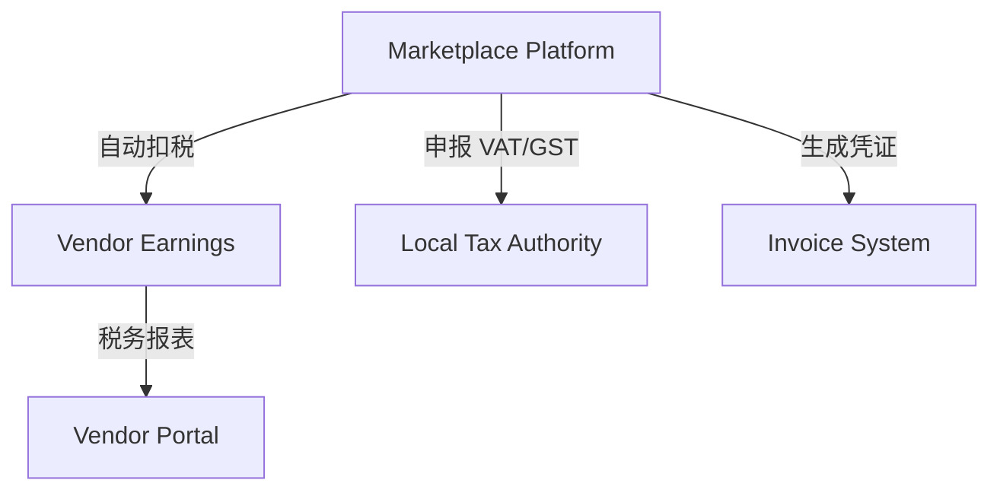

# 🧾 Tax & Compliance 税务与合规政策

> 本文档定义 **PowerX Plugin Marketplace** 在全球范围内的税务、合规、发票与反洗钱（KYC/AML）政策。  
> 目标：确保 Marketplace 在多国经营、跨境支付与 Vendor 收益结算时的合法、透明、可审计。

---

## 🧱 1. 设计原则

| 原则 | 说明 |
|------|------|
| **合规优先** | 所有支付、结算均遵守所在国家/地区税务法规 |
| **透明报税** | 平台统一申报平台服务费与 Vendor 预扣税 |
| **数据留痕** | 每笔收益均生成可审计凭证与 Trace ID |
| **区域自治** | 各区域税务与发票规则独立配置 |
| **安全防控** | 所有 Vendor 与客户必须完成 KYC/AML 审核 |

---

## 🧩 2. 全球税务合规结构



| 角色                | 说明                       |
| ----------------- | ------------------------ |
| **Marketplace**   | 代扣代缴、发票开具主体              |
| **Vendor**        | 收款方、需提供税务身份信息            |
| **Tax Authority** | 不同国家/地区税务机关（VAT/GST/IRS） |
| **Vendor Portal** | 提供税务申报与历史记录              |

---

## 💰 3. 税务类型分类

| 税种                           | 适用地区        | 说明              |
| ---------------------------- | ----------- | --------------- |
| **VAT（Value-Added Tax）**     | 欧盟、英国、新加坡   | 增值税，按销售额征收      |
| **GST（Goods & Service Tax）** | 加拿大、澳大利亚、印度 | 类似 VAT          |
| **Sales Tax**                | 美国          | 按州征收，不同州税率不同    |
| **Withholding Tax（预扣税）**     | 全球范围        | 平台代扣 Vendor 所得税 |
| **Corporate Income Tax**     | Vendor 自申报  | 厂商所在地缴纳企业所得税    |

---

## ⚙️ 4. 平台代扣与 Vendor 税务身份

### 4.1 Vendor 税务信息（Tax Profile）

Vendor 注册时需填写以下字段：

| 字段                      | 示例                           | 说明        |
| ----------------------- | ---------------------------- | --------- |
| `tax_residency_country` | `CN`                         | 税务居民国     |
| `tax_id_number`         | `91440300MA5Fxxxxxx`         | 企业税号/VAT号 |
| `legal_name`            | `Shenzhen AI Cloud Ltd.`     | 法人名称      |
| `address`               | `China, Guangdong, Shenzhen` | 税务注册地址    |
| `contact_email`         | `finance@vendor.dev`         | 财务联系人     |

系统验证规则：

* 必须通过 KYC；
* 税号匹配国家规则；
* 不支持匿名或代收账户。

### 4.2 代扣逻辑

| 区域         | 扣税方         | 扣税比例                | 备注       |
| ---------- | ----------- | ------------------- | -------- |
| 欧盟区 Vendor | Marketplace | 19–23% VAT          | 依据收款国    |
| 中国区 Vendor | Marketplace | 6%                  | 技术服务出口政策 |
| 美国区 Vendor | Marketplace | 10% Withholding Tax | 依州不同     |
| 其他         | Marketplace | 0–15%               | 按地区条约    |

---

## 🧾 5. 电子发票与凭证（Invoice Policy）

### 5.1 发票类型

| 类型              | 说明                      |
| --------------- | ----------------------- |
| **平台服务费发票**     | Marketplace 向 Vendor 开具 |
| **客户购买发票**      | Marketplace 向 Tenant 开具 |
| **Vendor 收益报表** | Vendor 收入凭证（非发票）        |

### 5.2 发票字段示例

```json
{
  "invoice_id": "inv_20251013_0021",
  "issued_by": "PowerX Marketplace Ltd.",
  "issued_to": "Shenzhen AI Cloud Ltd.",
  "amount": 49.99,
  "currency": "USD",
  "tax_rate": 0.1,
  "tax_amount": 4.99,
  "issue_date": "2025-10-13",
  "invoice_type": "platform_fee"
}
```

### 5.3 存储与下载

* 发票存储于 Vendor Portal；
* 可导出 PDF、CSV；
* 保留期限：**7 年**（符合欧盟 GDPR 与财务留存要求）。

---

## 🧮 6. 税率与结算规则

| 区域   | 税种        | 平台服务费税率 | 备注      |
| ---- | --------- | ------- | ------- |
| 中国大陆 | VAT       | 6%      | 服务出口可免征 |
| 香港   | 无         | 0%      | 离岸服务免税  |
| 欧盟   | VAT       | 19–23%  | 按国家自动匹配 |
| 美国   | Sales Tax | 6–10%   | 州级自动适配  |
| 日本   | 消费税       | 10%     | 含在售价中   |
| 新加坡  | GST       | 8%      | 税额单独列出  |

> 平台每日自动从 OpenTaxRate API 拉取各地区税率更新。

---

## 🧠 7. 反洗钱与合规（KYC / AML）

### 7.1 KYC 验证流程

1️⃣ 提交公司注册文件（营业执照、税号、法人身份证明）；
2️⃣ 完成邮箱与银行账户验证；
3️⃣ 系统审核通过后生成 Vendor ID；
4️⃣ 方可进行提现与分润。

### 7.2 AML 防洗钱策略

| 项目           | 策略                      |
| ------------ | ----------------------- |
| **资金来源监测**   | 检查异常高频或小额分账             |
| **国家/地区黑名单** | 禁止在受制裁国家注册 Vendor       |
| **支付通道风险评分** | 集成 Stripe Radar 风控      |
| **提现限额**     | 单笔上限 10,000 USD，超额需人工审核 |

---

## ⚖️ 8. 数据合规与隐私（GDPR & CCPA）

| 区域   | 合规框架             | 要求              |
| ---- | ---------------- | --------------- |
| 欧盟   | GDPR             | Vendor 数据可导出与删除 |
| 美国加州 | CCPA             | 用户可请求停止数据共享     |
| 中国   | CSL / DSL / PIPL | 数据跨境需备案与加密传输    |
| 日本   | APPI             | 银行信息加密存储        |

Marketplace 在所有区域均采用以下措施：

* 数据传输：TLS 1.3；
* 存储加密：AES-256；
* 日志脱敏：仅记录哈希；
* 访问控制：RBAC + 审计日志。

---

## 💼 9. 年度申报与审计报告

| 报表类型                                | 周期     | 文件格式  | 提供方         |
| ----------------------------------- | ------ | ----- | ----------- |
| **年度收益汇总表**                         | 每年 1 月 | CSV   | Marketplace |
| **税务预扣证明（Withholding Certificate）** | 每季度    | PDF   | Marketplace |
| **KYC 状态报告**                        | 实时     | JSON  | Vendor API  |
| **审计日志（Audit Trail）**               | 按需导出   | JSONL | 系统生成        |

> Vendor 可通过 API 或 Portal 下载用于会计审计。

---

## 🔐 10. 国际双边税收协定支持（DTA）

PowerX Marketplace 根据各国税务双边协定，自动识别是否可减免预扣税。

| 国家       | 协定伙伴 | 优惠税率     | 备注      |
| -------- | ---- | -------- | ------- |
| 中国 ↔ 美国  | ✅    | 10% → 5% | 技术服务出口  |
| 中国 ↔ 新加坡 | ✅    | 10% → 8% | 跨境 SaaS |
| 美国 ↔ 日本  | ✅    | 10% → 0% | 软件使用权   |
| 欧盟内部     | ✅    | 无预扣      | 欧盟内统一申报 |

---

## 🧾 11. 审计与合规检查（Audit & Enforcement）

| 事件         | 审计频率 | 检查项       |
| ---------- | ---- | --------- |
| Vendor 认证  | 每年   | 税号与公司状态   |
| License 销售 | 每季度  | 销售额与预扣税匹配 |
| 结算提现       | 每月   | 银行账户合规性   |
| 异常收入       | 实时   | 防洗钱与风险标记  |

Marketplace 会自动触发合规警报（Compliance Alert）并暂停可疑账户提现。

---

## 🧰 12. Makefile 与 API 示例（Vendor 自测）

```makefile
tax-report:
 @echo "📊 Fetching tax report..."
 curl -s "https://marketplace.powerx.dev/api/v1/vendor/tax?year=$(YEAR)" \
  -H "Authorization: Bearer $(API_TOKEN)" | jq .

kyc-status:
 @echo "🧩 Checking KYC status..."
 curl -s "https://marketplace.powerx.dev/api/v1/vendor/kyc/status" \
  -H "Authorization: Bearer $(API_TOKEN)" | jq .
```

---

## 🪶 13. 最佳实践

| 场景              | 建议                     |
| --------------- | ---------------------- |
| **中国区 Vendor**  | 提供 VAT 专票信息，享受出口退税政策   |
| **欧盟区 Vendor**  | 提交有效 VAT 号，自动抵扣税额      |
| **美国区 Vendor**  | 启用 W-9 / W-8BEN 表格     |
| **跨境结算**        | 使用 USD 作为基础币种，减少汇兑差额   |
| **高交易量 Vendor** | 启用季度税务报告 API 自动同步      |
| **团队协作**        | 为财务与法务角色分配独立 Portal 权限 |

---

## 📘 14. 关联文档

* 👉 [Revenue Share & Payouts 分成与结算机制](./Revenue_Share_and_Payouts.md)
* 👉 [Invoicing & Reports 发票与报表接口](./Invoicing_and_Reports.md)
* 👉 [Vendor Profile & Portal 入驻与认证](../01_onboarding/Vendor_Profile_and_Portal.md)
* 👉 [License Validation & Refresh 授权验证与续期](../04_license_and_pricing/License_Validation_and_Refresh.md)

---

> ✅ **总结一句话：**
> PowerX Marketplace 的税务与合规体系以 **「自动代扣、分区合规、隐私保护、审计可追踪」** 为核心，
> 确保每笔交易都能合法、安全、合规地跨境结算。
