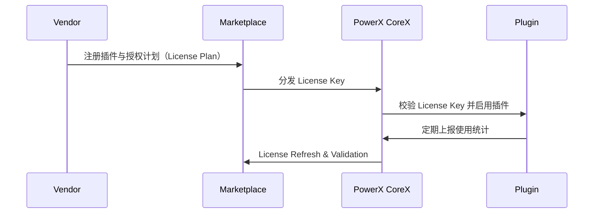
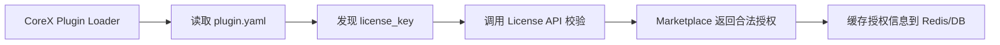
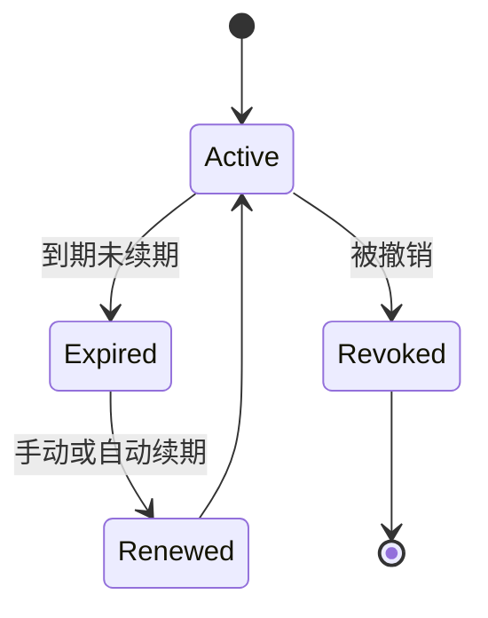

# 🔐 License API & Verification 授权验证与续期机制

> 本文档定义 **PowerX Plugin Marketplace** 与 **PowerX CoreX** 之间的授权验证、续期与配额控制 API 协议。  
> 它确保每个插件的使用都基于合法授权，支持离线缓存、限额管控、自动续期与审计追踪。

---

## 🧱 1. License 生命周期总览



授权在三个阶段生效：

| 阶段               | 行为                     | 参与方                  |
| ---------------- | ---------------------- | -------------------- |
| **签发（Issue）**    | Marketplace 签发 License | Vendor & Marketplace |
| **验证（Validate）** | CoreX 校验合法性            | CoreX & Marketplace  |
| **续期（Refresh）**  | CoreX 定期续期 License     | CoreX & Marketplace  |

---

## 🧩 2. License 数据结构

### JSON Schema

```json
{
  "license_id": "lic_20251013_002",
  "plugin_id": "com.vendor.analytics",
  "vendor_id": "vnd_0021",
  "tenant_id": "tenant_881f",
  "plan_id": "plan_pro_001",
  "issued_at": "2025-10-13T00:00:00Z",
  "expires_at": "2026-10-13T00:00:00Z",
  "status": "active",
  "quota": {
    "calls_per_month": 10000,
    "storage_mb": 2048
  },
  "signature": "base64-encoded-signature"
}
```

### 字段说明

| 字段           | 说明                         |
| ------------ | -------------------------- |
| `license_id` | 授权唯一标识                     |
| `plugin_id`  | 对应插件 ID                    |
| `vendor_id`  | 开发者 ID                     |
| `tenant_id`  | 租户 ID（购买方）                 |
| `plan_id`    | 对应定价方案                     |
| `issued_at`  | 签发时间                       |
| `expires_at` | 到期时间                       |
| `status`     | active / expired / revoked |
| `quota`      | 使用配额（按调用、存储、租户等）           |
| `signature`  | RSA 签名校验字段                 |

---

## ⚙️ 3. License 校验流程

### 3.1 CoreX 启动时校验



### 3.2 调用示例

```
POST /api/v1/license/verify
```

**Request**

```json
{
  "plugin_id": "com.vendor.analytics",
  "tenant_id": "tenant_881f",
  "license_key": "LIC-ABCD-1234-XYZ",
  "corex_version": "1.5.2",
  "host_id": "corex-cn1"
}
```

**Response**

```json
{
  "valid": true,
  "plan_id": "plan_pro_001",
  "quota": {
    "calls_per_month": 10000,
    "storage_mb": 2048
  },
  "expires_at": "2026-10-13T00:00:00Z",
  "signature_valid": true
}
```

---

## 🔁 4. License 续期（Refresh API）

CoreX 会在 License 到期前 **7 天自动续期**：

```
POST /api/v1/license/refresh
```

**Request**

```json
{
  "license_id": "lic_20251013_002",
  "tenant_id": "tenant_881f"
}
```

**Response**

```json
{
  "license_id": "lic_20251013_002",
  "new_expiration": "2026-10-13T00:00:00Z",
  "status": "renewed"
}
```

若 License 不合法或过期，则返回：

```json
{
  "valid": false,
  "reason": "license_expired"
}
```

---

## 🔐 5. 签名验证机制（Signature Verification）

### 5.1 Marketplace 签发

每个 License 均由 Marketplace 使用 RSA 私钥签名：

```bash
openssl dgst -sha256 -sign private.pem -out license.sig license.json
```

### 5.2 CoreX 验证

CoreX 启动时下载 Marketplace 公钥：

```
GET https://marketplace.powerx.dev/certs/public.pem
```

并验证签名：

```go
VerifySignature(licenseJSON, signature, publicKey)
```

验证失败 → 插件不加载。

---

## 🧮 6. 离线缓存机制（Offline Validation）

CoreX 允许 License 在离线场景下继续使用：

| 项目       | 策略                                |
| -------- | --------------------------------- |
| **缓存介质** | Redis 或本地文件（`license.cache.json`） |
| **有效期**  | 最多 14 天离线可用                       |
| **校验字段** | 签名、到期时间、租户 ID、一致性哈希               |
| **失效逻辑** | 超期后必须重新连接 Marketplace 验证          |

> 离线缓存仅适用于 SaaS 企业客户，不适用于免费插件。

---

## ⚙️ 7. 配额与限额控制（Quota Enforcement）

License 可附带配额字段，用于自动限流与告警：

| 配额项               | 类型  | 说明       |
| ----------------- | --- | -------- |
| `calls_per_month` | int | 每月可调用次数  |
| `storage_mb`      | int | 存储配额（MB） |
| `users`           | int | 可用用户数    |
| `agents`          | int | 可启用智能体数量 |

CoreX 运行时会：
1️⃣ 在 Redis 中记录调用次数；
2️⃣ 达限后触发事件 `license.quota.exceeded`；
3️⃣ 暂停插件请求，提示“授权额度已用尽”。

---

## 🧾 8. License 状态流转



| 状态        | 说明          |
| --------- | ----------- |
| `active`  | 授权有效        |
| `expired` | 已过期，插件应禁用功能 |
| `revoked` | 被平台撤销       |
| `renewed` | 续期成功        |

---

## 🧰 9. Makefile 本地测试命令

```makefile
license-verify:
 curl -s -X POST "https://marketplace.powerx.dev/api/v1/license/verify" \
  -H "Authorization: Bearer $(API_TOKEN)" \
  -d '{"plugin_id":"$(PLUGIN_ID)","tenant_id":"$(TENANT_ID)","license_key":"$(LICENSE_KEY)"}' | jq .

license-refresh:
 curl -s -X POST "https://marketplace.powerx.dev/api/v1/license/refresh" \
  -H "Authorization: Bearer $(API_TOKEN)" \
  -d '{"license_id":"$(LICENSE_ID)"}' | jq .
```

---

## 🧠 10. CoreX 插件加载集成示意

```go
// Step 1: 读取插件 Manifest
manifest := LoadManifest("plugin.yaml")

// Step 2: 获取 License Key
licenseKey := GetLicenseKey(manifest.ID)

// Step 3: 验证 License
if !VerifyLicense(licenseKey) {
    panic("❌ Plugin license invalid or expired")
}

// Step 4: 注册能力
RegisterCapabilities(manifest.Capabilities)
```

---

## 🔒 11. 安全与合规策略

| 项目        | 控制措施                            |
| --------- | ------------------------------- |
| **签名防伪**  | 所有 License 由 Marketplace RSA 签名 |
| **到期控制**  | CoreX 定时校验，过期即停                 |
| **反篡改检测** | 校验字段哈希一致性                       |
| **黑名单机制** | 撤销 License 即时生效                 |
| **审计日志**  | 所有 License 事件记录在 CoreX 审计总线中    |

---

## 🧩 12. License API 总览表

| 接口                        | 方法   | 说明              |
| ------------------------- | ---- | --------------- |
| `/api/v1/license/verify`  | POST | 校验 License Key  |
| `/api/v1/license/refresh` | POST | 续期授权            |
| `/api/v1/license/revoke`  | POST | 撤销授权            |
| `/api/v1/license/status`  | GET  | 查询授权状态          |
| `/api/v1/license/usage`   | GET  | 获取配额使用统计        |
| `/api/v1/license/audit`   | GET  | 下载 License 审计日志 |

---

## 🪶 13. 最佳实践

| 场景         | 建议                             |
| ---------- | ------------------------------ |
| **商业插件**   | 必须启用 License 校验与签名验证           |
| **订阅型插件**  | 设置自动续期周期为 7 天                  |
| **试用插件**   | 使用短期 License（7~14 天）并绑定 Tenant |
| **高安全场景**  | 开启强制联网验证模式                     |
| **离线部署企业** | 启用本地 License Server 代理模式       |
| **多租户插件**  | 每个租户单独 License 以防跨租户共享         |

---

## 📘 14. 关联文档

* 👉 [PowerX Plugin Manifest](./PowerX_Plugin_Manifest.md)
* 👉 [License Validation & Refresh 授权机制说明](../04_license_and_pricing/License_Validation_and_Refresh.md)
* 👉 [Revenue Share & Payouts 分润与结算机制](../05_finance_and_settlement/Revenue_Share_and_Payouts.md)
* 👉 [Security & Validation 安全签名机制](../02_plugin_development/Security_and_Validation.md)

---

> ✅ **总结一句话：**
> PowerX 的 License 系统以 **签名认证 + 配额控制 + 自动续期 + 离线容忍** 为核心，
> 实现了插件商业化的安全闭环，让每个插件都能「合法运行、可追踪、可续期」。
