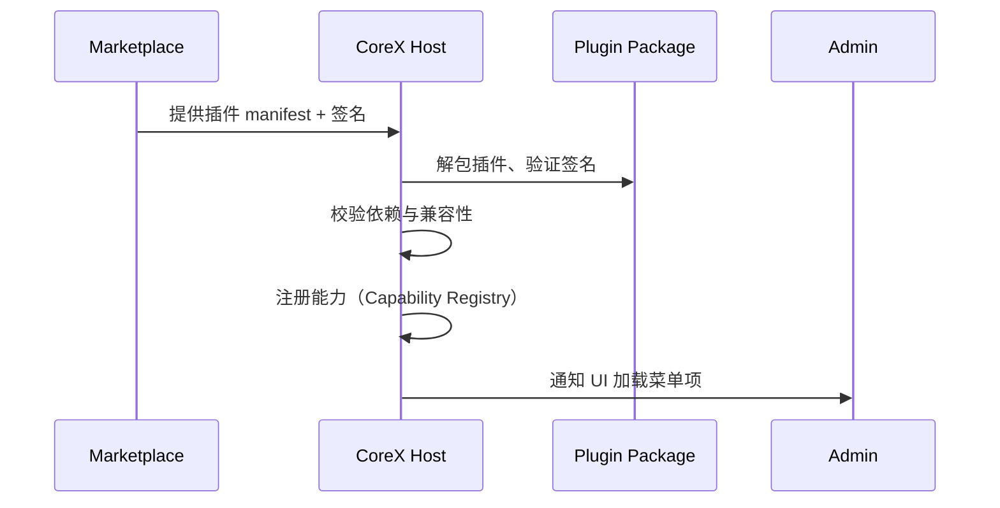

# 🧩 PowerX Plugin Manifest 规范

> 本文档定义 PowerX 插件的核心描述文件 —— `plugin.yaml`（或 `manifest.json`）。  
> 该文件用于 **Marketplace 发布、CoreX 加载、Admin 显示** 三个阶段的统一识别。  
> 它是 PowerX 插件的「身份证」。

---

## 🧱 1. Manifest 的作用

| 场景 | 使用方 | 说明 |
|------|---------|------|
| **Marketplace 上架** | Marketplace | 解析基础信息、版本、依赖、License、Vendor |
| **CoreX 加载运行** | PowerX CoreX | 校验签名、挂载路由、注册服务 |
| **Admin 管理显示** | PowerX Admin | 显示图标、描述、配置入口、版本信息 |

Manifest 是插件的核心契约文件，**必须与 Marketplace 注册信息保持一致**。

---

## 📁 2. 文件位置与格式

插件包结构示例：

```

/my-plugin/
├── plugin.yaml
├── backend/
│   ├── main.go
│   └── manifest.json
├── frontend/
│   └── dist/
│       ├── index.html
│       └── assets/
└── README.md

````

Manifest 可为 YAML 或 JSON 格式，推荐使用 `plugin.yaml`。

---

## 🧩 3. 核心字段定义

### YAML 示例

```yaml
id: com.vendor.analytics
name: PowerX Analytics
version: 1.2.0
vendor_id: vnd_0021
license: commercial
category: analytics
description: >
  提供租户级别的用户行为分析与报表功能，支持多维度聚合、筛选与导出。

homepage: https://vendor.dev/analytics
repository: https://github.com/vendor/powerx-analytics
icon: https://cdn.vendor.dev/icons/analytics.png

entry:
  backend: ./backend/main
  frontend: ./frontend/dist
  config_schema: ./config/schema.json

capabilities:
  - name: analytics.report
    type: service
    api: grpc
    endpoint: /_p/com.vendor.analytics/grpc
  - name: analytics.dashboard
    type: ui
    route: /analytics

dependencies:
  - id: com.powerx.storage
    version: ">=1.0.0"
  - id: com.powerx.iam
    version: ">=1.5.0"

permissions:
  - resource: tenant.data
    actions: [read]
  - resource: analytics.dataset
    actions: [create, read, export]

runtime:
  lang: go
  version: "1.22"
  ports:
    http: 8081
    grpc: 9090
  env:
    POWERX_ENV: production
    LOG_LEVEL: info

signing:
  signature: "base64-encoded-signature"
  cert_url: "https://marketplace.powerx.dev/certs/public.pem"

compatibility:
  corex_min: "1.4.0"
  admin_min: "1.3.0"

support:
  email: support@vendor.dev
  issues: https://vendor.dev/support
````

---

## 🧮 4. 字段说明表

| 字段              | 类型     | 说明                                       |
| --------------- | ------ | ---------------------------------------- |
| `id`            | string | 插件唯一标识（反向域名规范）                           |
| `name`          | string | 插件名称                                     |
| `version`       | string | 语义化版本号（SemVer）                           |
| `vendor_id`     | string | 插件所属 Vendor                              |
| `license`       | string | 授权类型（free, subscription, commercial）     |
| `category`      | string | 插件分类（crm, analytics, ecommerce, ai, ...） |
| `description`   | string | 简要描述（支持多行）                               |
| `homepage`      | string | 插件主页                                     |
| `repository`    | string | 源码地址（可选）                                 |
| `icon`          | string | 图标 URL（推荐 128×128 PNG）                   |
| `entry`         | object | 插件入口配置（前后端路径与 Schema）                    |
| `capabilities`  | array  | 插件提供的能力（Service / UI / Event / Tool）     |
| `dependencies`  | array  | 依赖的插件及版本约束                               |
| `permissions`   | array  | 插件在 CoreX 中的访问资源与动作声明                    |
| `runtime`       | object | 运行时信息（语言、端口、环境变量）                        |
| `signing`       | object | 签名信息（安全验证用）                              |
| `compatibility` | object | 兼容性要求（CoreX/Admin 最低版本）                  |
| `support`       | object | 支持与反馈渠道                                  |

---

## 🧠 5. 能力声明（Capabilities）

每个插件需声明自身可供 CoreX/Agent 调用的「能力」：

| 字段         | 说明                          |
| ---------- | --------------------------- |
| `name`     | 能力标识（`analytics.report`）    |
| `type`     | 能力类型（service/ui/event/tool） |
| `api`      | 调用协议（http/grpc/mcp/agent）   |
| `endpoint` | 服务入口或前端路由                   |
| `desc`     | 简要描述（可选）                    |

> PowerX 核心会在启动时读取所有插件的 `capabilities` 并注册到内部路由表中。

---

## 🔐 6. 安全签名机制（Signing）

Marketplace 上架时，系统会自动对插件清单签名：

```bash
openssl dgst -sha256 -sign private.pem -out manifest.sig plugin.yaml
```

并生成：

```yaml
signing:
  signature: "base64-encoded-signature"
  cert_url: "https://marketplace.powerx.dev/certs/public.pem"
```

CoreX 在加载插件时，会验证签名：

```go
VerifySignature(plugin.yaml, cert_url)
```

验证失败 → 拒绝启动。

---

## 🧩 7. 依赖与兼容性（Dependencies & Compatibility）

| 场景             | 策略                                  |
| -------------- | ----------------------------------- |
| 依赖插件未安装        | 延迟启动并告警                             |
| 版本不兼容          | 阻止安装                                |
| CoreX 版本过低     | 拒绝加载                                |
| Manifest 缺字段   | 拒绝注册                                |
| Schema 变更（破坏性） | 要求声明 `compatibility.breaking: true` |

---

## ⚙️ 8. CoreX 注册流程



核心步骤：

1️⃣ 拉取插件元信息（包含 vendor_id, manifest_url）
2️⃣ 下载压缩包（`.pxp`）并验证签名
3️⃣ 解包后读取 `plugin.yaml`
4️⃣ 挂载后端服务与前端页面
5️⃣ 生成 RBAC 权限节点与事件订阅表

---

## 💼 9. PowerX Admin 显示信息规范

Admin 端读取 Manifest 中以下字段用于展示：

| 字段              | 用途      |
| --------------- | ------- |
| `name`          | 插件卡片标题  |
| `icon`          | 图标显示    |
| `version`       | 当前版本    |
| `vendor_id`     | 展示开发者信息 |
| `category`      | 分组与筛选   |
| `description`   | 摘要信息    |
| `homepage`      | 跳转链接    |
| `support.email` | 联系开发者   |

---

## 📦 10. 插件打包与发布命令（Makefile 示例）

```makefile
build:
 @echo "📦 Building plugin..."
 tar czf powerx-analytics-$(VERSION).pxp plugin.yaml backend/ frontend/

sign:
 @echo "🔐 Signing manifest..."
 openssl dgst -sha256 -sign private.pem -out manifest.sig plugin.yaml
 base64 manifest.sig > signature.txt

publish:
 @echo "🚀 Publishing to Marketplace..."
 curl -X POST https://marketplace.powerx.dev/api/v1/plugins \
  -H "Authorization: Bearer $(API_TOKEN)" \
  -F "file=@powerx-analytics-$(VERSION).pxp"
```

---

## 🧰 11. 插件 Schema 校验命令

```bash
powerx-cli validate plugin.yaml
```

校验内容包括：

* YAML 格式与字段完整性；
* Vendor ID 是否有效；
* License 类型与 Marketplace 一致；
* 签名可验证；
* CoreX/Admin 版本兼容性。

---

## 🧩 12. 最佳实践

| 场景              | 建议                                       |
| --------------- | ---------------------------------------- |
| **开源插件**        | 使用 MIT/Apache License 并公开 repository     |
| **商业插件**        | 使用 `license: commercial` 并启用签名           |
| **多语言支持**       | 在 `manifest` 中声明多语言描述块                   |
| **AI/Agent 插件** | 增加 `capabilities[].api = agent` 与上下文输入结构 |
| **安全要求高**       | 启用 `signing.cert_url` 并强制 TLS 加载         |
| **大规模依赖**       | 用 `dependencies` 明确版本区间（>= x.y.z）        |
| **测试阶段**        | 标记 `version: 1.0.0-beta` 并加上 sandbox 属性  |

---

## 📘 13. 关联文档

* 👉 [Capability & API Design 能力与接口规范](../02_plugin_development/Capability_and_API_Design.md)
* 👉 [Security & Validation 安全与签名机制](../02_plugin_development/Security_and_Validation.md)
* 👉 [License Validation 授权校验与续期](../04_license_and_pricing/License_Validation_and_Refresh.md)
* 👉 [Submission & Review 插件提交流程](../03_listing_and_lifecycle/Submission_and_Review.md)
* 👉 [Marketplace Vendor Overview](../00_overview/README.md)

---

> ✅ **总结一句话：**
> `plugin.yaml` 是 PowerX 插件的统一契约，
> 它让 Marketplace、CoreX、Admin 在「发现 → 安装 → 运行 → 管理」的全流程中保持一致性与安全性。
