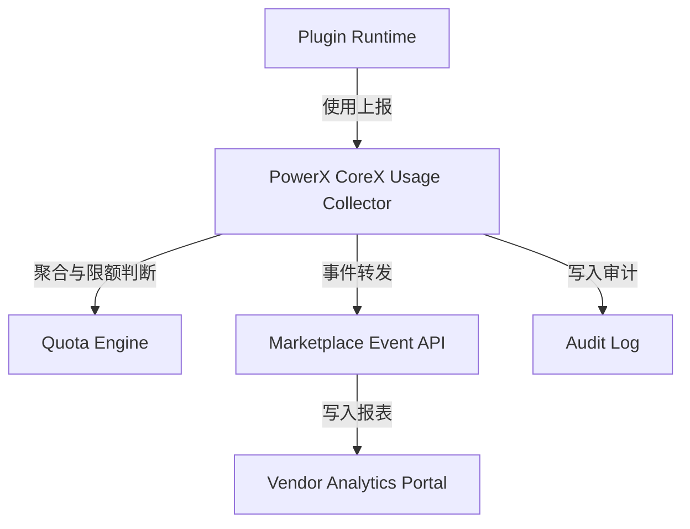

# 📡 Usage Report & Event API 插件使用与事件上报接口

> 本文档定义 **PowerX Plugin Marketplace** 与 **PowerX CoreX** 之间的使用报告（Usage Report）与事件上报（Event Log）API 协议。  
> 它支持插件在运行期上报调用次数、配额消耗、运行异常、安全事件与性能指标，  
> 并与 License 验证机制协同，完成完整的商业化与安全监控闭环。

---

## 🧱 1. 设计目标

| 目标 | 说明 |
|------|------|
| **可追踪** | 每次插件调用、执行、报错都可追踪至 Tenant 与 License |
| **可计费** | 使用量可与 License 绑定，用于计费和限额 |
| **可审计** | 异常与安全事件自动进入 CoreX 审计系统 |
| **低延迟** | 上报 API 采用异步队列（Kafka / Redis Stream） |
| **容错性强** | 离线缓存、批量重试机制确保可靠上报 |

---

## 🧩 2. 事件流概览



* **Plugin Runtime**：插件自身上报调用、异常、性能指标
* **CoreX Usage Collector**：统一收集与校验授权
* **Marketplace Event API**：同步 Vendor Portal 与结算系统
* **Audit Log**：记录合规与异常事件

---

## ⚙️ 3. 核心数据结构

### 3.1 Usage Report（使用报告）

```json
{
  "plugin_id": "com.vendor.analytics",
  "tenant_id": "tenant_92ac",
  "license_id": "lic_20251013_002",
  "timestamp": "2025-10-13T08:00:00Z",
  "usage": {
    "calls": 120,
    "tokens": 80000,
    "storage_mb": 34.2,
    "users_active": 5
  },
  "runtime": {
    "corex_version": "1.5.2",
    "plugin_version": "1.2.0",
    "latency_ms": 95,
    "error_rate": 0.02
  },
  "signature": "base64-encoded-signature"
}
```

### 3.2 Event Log（事件日志）

```json
{
  "plugin_id": "com.vendor.analytics",
  "tenant_id": "tenant_92ac",
  "license_id": "lic_20251013_002",
  "event_type": "error",
  "event_name": "QuotaLimitExceeded",
  "severity": "warning",
  "message": "Tenant quota limit reached for analytics.report API",
  "timestamp": "2025-10-13T08:45:30Z",
  "trace_id": "evt_230da9",
  "metadata": {
    "endpoint": "/_p/com.vendor.analytics/report",
    "method": "POST"
  }
}
```

---

## 🔌 4. API 端点定义

### 4.1 使用报告上报

```
POST /api/v1/usage/report
```

**Request**

```json
{
  "plugin_id": "com.vendor.analytics",
  "tenant_id": "tenant_92ac",
  "license_id": "lic_20251013_002",
  "usage": { "calls": 12, "tokens": 1024 },
  "runtime": { "latency_ms": 91, "error_rate": 0.01 }
}
```

**Response**

```json
{
  "status": "accepted",
  "trace_id": "evt_230da9"
}
```

---

### 4.2 事件日志上报

```
POST /api/v1/usage/event
```

**Request**

```json
{
  "plugin_id": "com.vendor.analytics",
  "tenant_id": "tenant_92ac",
  "event_type": "error",
  "event_name": "RequestTimeout",
  "message": "API latency exceeded 5s",
  "severity": "critical"
}
```

**Response**

```json
{
  "status": "recorded",
  "trace_id": "evt_5fca02"
}
```

---

### 4.3 批量上报（推荐方式）

```
POST /api/v1/usage/batch
```

**Request**

```json
{
  "batch": [
    { "type": "usage", "plugin_id": "com.vendor.analytics", "usage": {"calls": 3} },
    { "type": "event", "plugin_id": "com.vendor.analytics", "event_name": "SlowQuery" }
  ]
}
```

---

## 🧮 5. 核心处理逻辑

1️⃣ **CoreX 收集器验证 License 有效性**
2️⃣ **按 Tenant+Plugin 聚合调用量**（实时限额计算）
3️⃣ **写入 Redis Stream（异步上报）**
4️⃣ **Marketplace 异步接收并生成 Usage Report**
5️⃣ **Vendor Portal 展示调用与账单统计**

---

## 📊 6. 配额统计与限流机制

| 项目                   | 来源                | 触发策略        |
| -------------------- | ----------------- | ----------- |
| 调用次数 (`calls`)       | HTTP/gRPC 中间件     | 超过配额 → 停止请求 |
| Token 消耗 (`tokens`)  | LLM / Agent 插件    | 80% 用量时预警   |
| 存储用量 (`storage_mb`)  | CoreX Storage API | 超限锁定写操作     |
| 用户数 (`users_active`) | IAM 统计            | 超限禁止新用户激活   |

**事件触发：**

```yaml
- event: quota.warning
  condition: usage > 0.8 * quota
- event: quota.limit_exceeded
  condition: usage >= quota
```

---

## 🧰 7. 插件端集成示例（Go SDK）

```go
usage := UsageReport{
    PluginID:  "com.vendor.analytics",
    TenantID:  "tenant_92ac",
    LicenseID: "lic_20251013_002",
    Usage:     map[string]interface{}{"calls": 1, "tokens": 512},
}
err := powerx.ReportUsage(usage)
if err != nil {
    log.Printf("Usage report failed: %v", err)
}
```

> PowerX SDK 会自动签名、批量缓存、定时上报，开发者无需手动处理失败重试。

---

## 🧮 8. 安全与签名机制

每个上报请求均由 CoreX 使用 Marketplace 公钥验证：

* 所有请求附带签名字段 `X-PowerX-Signature`；
* 数据计算方式：

  ```
  signature = HMAC-SHA256(payload, LICENSE_SECRET)
  ```

* 若签名无效或 License 过期 → 拒绝接收上报。

---

## ⚙️ 9. 事件类型标准化表

| 类型         | 示例事件名                | 严重性      | 说明           |
| ---------- | -------------------- | -------- | ------------ |
| `usage`    | `QuotaLimitExceeded` | warning  | 超出配额         |
| `system`   | `PluginCrashed`      | critical | 插件进程崩溃       |
| `security` | `UnauthorizedAccess` | high     | 非法访问数据资源     |
| `billing`  | `PaymentFailed`      | medium   | 支付失败导致授权暂停   |
| `audit`    | `LicenseExpired`     | low      | 到期未续期        |
| `custom`   | `VendorDefined`      | variable | Vendor 自定义事件 |

---

## 🧾 10. 报表与可视化

**Marketplace 将每日聚合生成以下报表：**

| 报表类型             | 文件名示例                     | 内容               |
| ---------------- | ------------------------- | ---------------- |
| Usage Summary    | `usage_2025-10-13.csv`    | 调用、配额、租户、License |
| Event Logs       | `events_2025-10-13.jsonl` | 所有异常与安全事件        |
| Billing Snapshot | `billing_2025-10-13.csv`  | 用量→计费对应关系        |

---

## 🧮 11. 异步上报与容错机制

| 场景         | 策略                        |
| ---------- | ------------------------- |
| 网络异常       | 本地缓存至 `usage_buffer.json` |
| 服务器 5xx    | 重试 3 次后退避上传               |
| License 失效 | 暂停上报并记录事件                 |
| Plugin 停机  | 重启时批量补上未发送数据              |

---

## 🧰 12. Makefile 调试命令

```makefile
usage-report:
 curl -s -X POST "https://marketplace.powerx.dev/api/v1/usage/report" \
  -H "Authorization: Bearer $(API_TOKEN)" \
  -d '{"plugin_id":"$(PLUGIN_ID)","tenant_id":"$(TENANT_ID)","usage":{"calls":5}}' | jq .

event-log:
 curl -s -X POST "https://marketplace.powerx.dev/api/v1/usage/event" \
  -H "Authorization: Bearer $(API_TOKEN)" \
  -d '{"plugin_id":"$(PLUGIN_ID)","tenant_id":"$(TENANT_ID)","event_type":"system","event_name":"PluginRestarted"}' | jq .
```

---

## 🧠 13. PowerX Audit 集成（合规追踪）

所有事件会同步到 **CoreX Audit Log** 模块：

| 字段            | 示例                            | 说明      |
| ------------- | ----------------------------- | ------- |
| `trace_id`    | `evt_230da9`                  | 全局事件 ID |
| `actor`       | `plugin:com.vendor.analytics` | 事件来源    |
| `tenant_id`   | `tenant_92ac`                 | 受影响租户   |
| `severity`    | `critical`                    | 严重性等级   |
| `category`    | `usage/event/security`        | 分类      |
| `recorded_at` | `2025-10-13T09:00:00Z`        | 时间戳     |

这些日志支持导出 JSONL 或接入 ELK/Datadog。

---

## 🪶 14. 最佳实践

| 场景              | 建议                              |
| --------------- | ------------------------------- |
| **高调用频率插件**     | 启用批量上报（batch 模式）                |
| **AI/Agent 插件** | 每次推理调用记录 Token 消耗               |
| **SaaS Vendor** | 使用 `/usage/report` 结合计费计划       |
| **企业版部署**       | 使用异步 MQ 通道汇聚上报                  |
| **异常监控**        | 将 Event 流对接到 Slack / Webhook 告警 |
| **安全合规**        | 每月导出 Event JSONL 进行审计归档         |

---

## 📘 15. 关联文档

* 👉 [License API & Verification 授权验证机制](./License_API_and_Verification.md)
* 👉 [Revenue Share & Payouts 分成与结算机制](../05_finance_and_settlement/Revenue_Share_and_Payouts.md)
* 👉 [Security & Validation 安全签名机制](../02_plugin_development/Security_and_Validation.md)
* 👉 [PowerX Plugin Manifest 结构说明](./PowerX_Plugin_Manifest.md)

---

> ✅ **总结一句话：**
> PowerX 的使用与事件上报体系通过 **实时监控 + 异步回传 + 授权绑定 + 审计记录**，
> 实现了插件运行期的**透明计费、安全追踪与稳定监控闭环**。

```

---

✅ 至此，`docs/vendor/06_integration_with_powerx/` 模块的三篇核心文档已完整闭环：
```

06_integration_with_powerx/
├── PowerX_Plugin_Manifest.md
├── License_API_and_Verification.md
└── Usage_Report_and_Event_API.md
