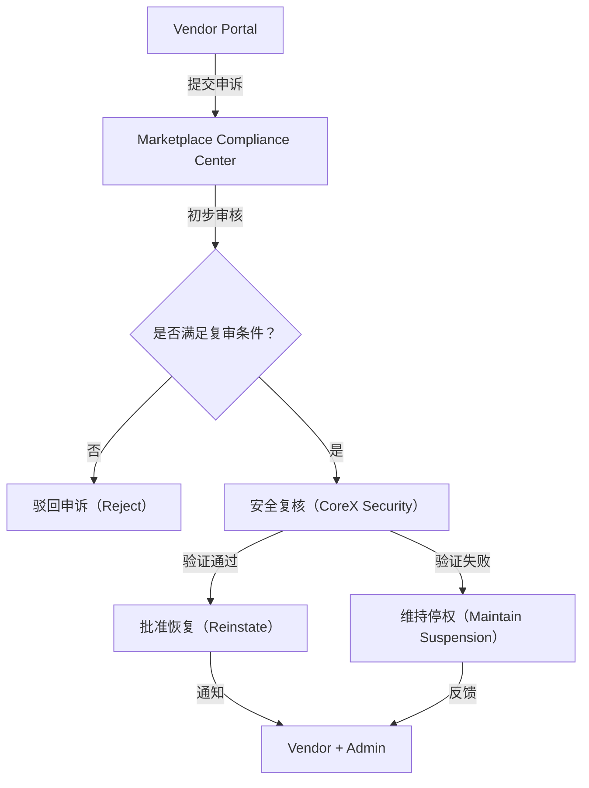
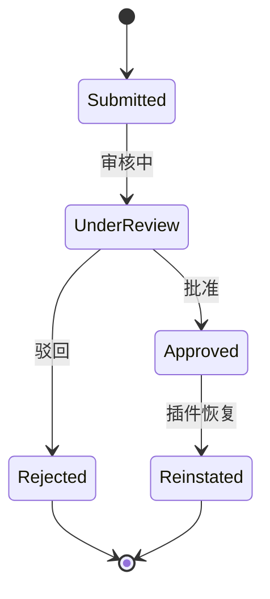

# 🕊 Appeals & Recovery 申诉与恢复流程

> 本文档定义 **PowerX Plugin Marketplace** 的违规申诉、复审与恢复（Reinstatement）流程。  
> 它确保每个被停权或封禁的 Vendor 都有公平、透明的救济通道，  
> 并通过复审机制保证生态的健康与信任。

---

## 🧱 1. 设计目标

| 目标 | 说明 |
|------|------|
| **公平透明** | 所有被处罚的 Vendor 均可提交申诉 |
| **结构化评估** | 明确的申诉状态、证据与结果 |
| **自动化流程** | Portal + API + 审核工作流一体化 |
| **安全前置** | 必须在修复验证通过后方可恢复 |
| **公开记录** | 所有申诉事件进入合规日志（Compliance Log） |

---

## 🧩 2. 申诉流程概览



---

## ⚖️ 3. 可申诉事件类型

| 事件类型           | 示例            | 是否可申诉          |
| -------------- | ------------- | -------------- |
| **插件停权**       | 暂停运行 30 天     | ✅ 是            |
| **插件封禁**       | 永久下架          | ✅ 是（一次性）       |
| **Vendor 封禁**  | 开发者账号被封       | ✅ 是（需重新资质审核）   |
| **License 冻结** | License 被暂停使用 | ✅ 是            |
| **安全违规**       | 代码漏洞 / 后门     | ✅ 是（修复后）       |
| **隐私违规**       | 数据收集争议        | ✅ 是（经外部审计报告证明） |

---

## 🧾 4. 申诉请求结构（Appeal Payload）

```json
{
  "appeal_id": "APL-20251013-00042",
  "event_id": "SUS-20251013-00022",
  "vendor_id": "vnd_0021",
  "plugin_id": "com.vendor.analytics",
  "reason": "漏洞已修复并通过第三方审计报告验证。",
  "evidence": [
    "https://vendor.dev/reports/security_fix_20251013.pdf",
    "https://vendor.dev/screenshots/proof_1.png"
  ],
  "submitted_at": "2025-10-13T09:00:00Z"
}
```

---

## 🧩 5. 申诉状态机（Appeal Lifecycle）



| 状态             | 说明                   |
| -------------- | -------------------- |
| `submitted`    | 已提交申诉等待审核            |
| `under_review` | Marketplace 合规中心正在评估 |
| `rejected`     | 驳回（理由不充分或风险未解决）      |
| `approved`     | 审核通过，等待恢复操作          |
| `reinstated`   | 插件或 Vendor 已恢复上线     |

---

## 🧮 6. 申诉 API

| 接口                              | 方法     | 说明              |
| ------------------------------- | ------ | --------------- |
| `/api/v1/appeals`               | `POST` | 提交申诉            |
| `/api/v1/appeals/{id}`          | `GET`  | 查询申诉状态          |
| `/api/v1/appeals/{id}/decision` | `POST` | 审核人员提交决议        |
| `/api/v1/appeals/list`          | `GET`  | Vendor 查看历史申诉记录 |

**示例：提交申诉**

```bash
curl -X POST https://marketplace.powerx.dev/api/v1/appeals \
  -H "Authorization: Bearer $API_TOKEN" \
  -d '{
        "event_id": "SUS-20251013-00022",
        "reason": "漏洞已修复并重新通过自动审查。",
        "evidence": ["https://vendor.dev/reports/security_fix.pdf"]
      }'
```

---

## ⚙️ 7. 审核与验证机制

| 步骤       | 责任方               | 内容           |
| -------- | ----------------- | ------------ |
| **初步审核** | Marketplace 审核员   | 检查申诉材料完整性    |
| **安全验证** | PowerX CoreX 安全团队 | 自动化安全扫描与修复验证 |
| **合规复核** | Marketplace 合规部门  | 审核证据与第三方报告   |
| **最终决议** | Marketplace 审批委员会 | 统一裁决并记录结果    |

---

## 🧩 8. 恢复策略（Reinstatement Policy）

| 维度             | 恢复条件          | 附加要求         |
| -------------- | ------------- | ------------ |
| **插件停权**       | 修复问题、重新提交     | 需再次通过安全扫描    |
| **插件封禁**       | 提交重大修订版本      | 重新上架并重新审核    |
| **License 冻结** | 核实付款或账单纠正     | 重新激活 License |
| **Vendor 封禁**  | 完成重新资质认证（KYC） | 通过二次人工审核     |
| **安全违规**       | 提供外部安全报告      | CoreX 二次验证   |
| **隐私违规**       | 修订隐私政策        | 提供合规法律文件     |

---

## 🧠 9. 安全复核（CoreX Validation）

PowerX CoreX 的复核逻辑包括：

* 自动执行插件静态分析（Static Scan）
* 动态运行时沙盒检测（Sandbox Replay）
* 调用日志溯源（Trace Log Review）
* License 再校验
* 数据泄露检测（Data Leak Detection）

通过后生成：

```json
{
  "validation_id": "VAL-20251013-004",
  "plugin_id": "com.vendor.analytics",
  "result": "passed",
  "scanned_at": "2025-10-13T10:30:00Z"
}
```

---

## 🧾 10. 审核决议结构（Decision Payload）

```json
{
  "decision_id": "DEC-20251013-0009",
  "appeal_id": "APL-20251013-00042",
  "status": "approved",
  "reviewer": "compliance_admin",
  "notes": "已验证修复并通过安全扫描。",
  "reinstated_at": "2025-10-13T11:00:00Z"
}
```

---

## 🧮 11. 恢复后操作

| 动作           | 系统模块                          | 自动触发 |
| ------------ | ----------------------------- | ---- |
| 插件重新启用       | PowerX CoreX Runtime          | ✅    |
| License 恢复激活 | Marketplace License Server    | ✅    |
| Vendor 状态更新  | Vendor Portal                 | ✅    |
| 审计记录生成       | Compliance Log                | ✅    |
| 通知事件推送       | Event Bus `plugin.reinstated` | ✅    |

---

## 📢 12. 通知与沟通机制

* **通知方式：**

  * 邮件：`support@powerx.dev`
  * Portal 消息中心
  * Webhook：`appeal.status.changed`
* **状态更新：**

  * 每次状态变更（submitted → under_review → approved/rejected）
  * 自动同步至 Vendor 控制台

Webhook 示例：

```json
{
  "event": "appeal.status.changed",
  "appeal_id": "APL-20251013-00042",
  "status": "approved",
  "timestamp": "2025-10-13T11:00:00Z"
}
```

---

## 🧰 13. Makefile 调试命令

```makefile
appeal-new:
 curl -s -X POST "https://marketplace.powerx.dev/api/v1/appeals" \
  -H "Authorization: Bearer $(API_TOKEN)" \
  -d '{"event_id":"$(EVENT_ID)","reason":"$(MSG)"}' | jq .

appeal-status:
 curl -s "https://marketplace.powerx.dev/api/v1/appeals/$(APPEAL_ID)" \
  -H "Authorization: Bearer $(API_TOKEN)" | jq .
```

---

## 📊 14. 报告与透明度

Marketplace 定期公开匿名化统计：

| 指标      | 含义              | 更新频率 |
| ------- | --------------- | ---- |
| 总申诉数    | 所有 Vendor 的申诉总量 | 每月   |
| 成功恢复率   | 通过申诉恢复的比例       | 每季度  |
| 平均处理时间  | 从申诉到决议的时长       | 每月   |
| 驳回原因分布  | 被拒原因统计          | 每季度  |
| 审核一致性指数 | 审核标准稳定性指标       | 每季度  |

---

## 🧩 15. 最佳实践与建议

| 场景             | 建议                       |
| -------------- | ------------------------ |
| **安全漏洞类申诉**    | 提交第三方安全审计报告（如 OWASP 验证）  |
| **内容/隐私违规**    | 附上修订后的政策与用户通知记录          |
| **支付类冻结**      | 附银行对账单与补充证明              |
| **团队型 Vendor** | 指派一位正式合规代表提交申诉           |
| **AI/LLM 插件**  | 附安全内容过滤说明书               |
| **多插件企业**      | 使用 API 批量同步申诉状态          |
| **快速恢复策略**     | 在修复完成前先创建内部 Sandbox 测试报告 |

---

## 📘 16. 关联文档

* 👉 [Policy Suspension & Ban 停权与违规处理机制](./Policy_Suspension_and_Ban.md)
* 👉 [Support & Ticketing 技术支持与客服通道](./Support_and_Ticketing.md)
* 👉 [Security & Validation 安全签名机制](../02_plugin_development/Security_and_Validation.md)
* 👉 [Vendor Profile & Portal 资料与控制台](../01_onboarding/Vendor_Profile_and_Portal.md)

---

> ✅ **总结一句话：**
> PowerX 的申诉与恢复机制以 **结构化复审 + 安全复核 + 透明追踪** 为基础，
> 让每个 Vendor 都有机会「修复错误、重建信任、重新出发」。

```

---

至此，`docs/vendor/07_support_and_policies/` 模块三篇完整闭环：
```

07_support_and_policies/
├── Support_and_Ticketing.md
├── Policy_Suspension_and_Ban.md
└── Appeals_and_Recovery.md
