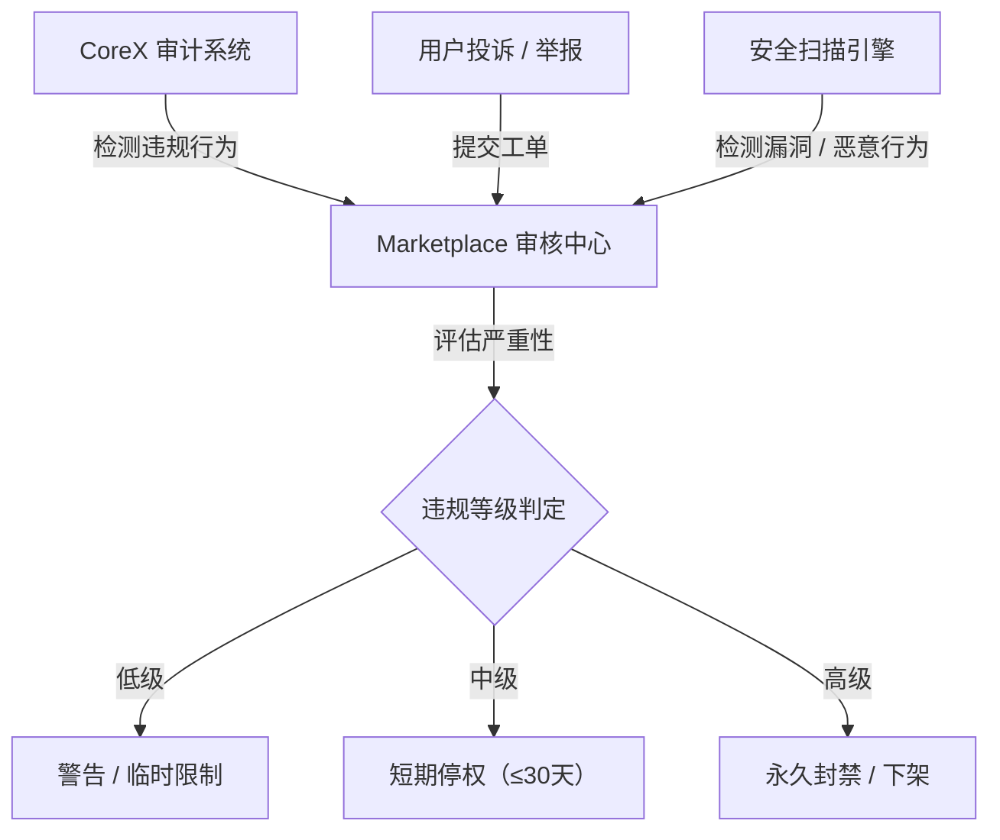
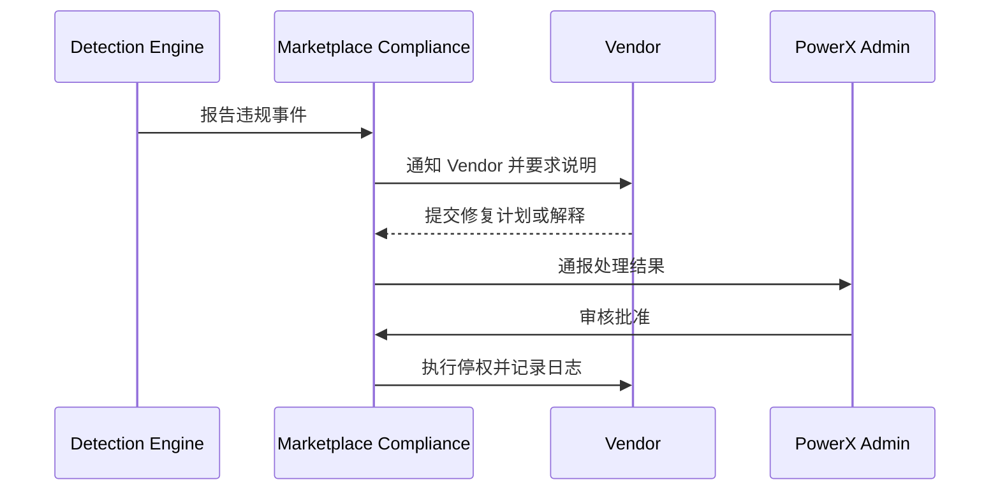

# 🚫 Policy Suspension & Ban 停权与违规处理机制

> 本文档定义 **PowerX Plugin Marketplace** 的插件合规管理、违规检测、停权与封禁流程。  
> 目标：确保 Marketplace 的安全、透明与信任，防止恶意插件、数据滥用或安全漏洞危害平台与用户。

---

## 🧱 1. 设计原则

| 原则 | 说明 |
|------|------|
| **合规优先** | 所有插件必须遵守 PowerX 开发与分发政策 |
| **透明处理** | 违规结果可追踪、可申诉 |
| **渐进处罚** | 按严重程度分级处理：警告 → 限制 → 停权 → 永封 |
| **即时响应** | 安全与隐私违规立即生效 |
| **跨层通报** | 核心事件同步到 PowerX Admin 与 Vendor Portal |

---

## 🧩 2. 停权触发路径



> 所有停权事件都将记录入合规日志（Compliance Log）并生成唯一事件 ID。

---

## ⚖️ 3. 违规类型分类

| 类型          | 示例行为                | 严重程度 |
| ----------- | ------------------- | ---- |
| **安全违规**    | 未授权访问租户数据、代码注入、后门   | 🚨 高 |
| **隐私违规**    | 未经同意收集用户信息          | 🚨 高 |
| **滥用资源**    | 超额调用 API、频繁任务占用 CPU | ⚠️ 中 |
| **内容违规**    | 发布虚假描述、误导性广告        | ⚠️ 中 |
| **支付违规**    | 欺诈交易、退款滥用           | ⚠️ 中 |
| **审查违规**    | 逃避 Marketplace 审核机制 | ⚠️ 中 |
| **版权违规**    | 侵权代码或素材             | ⚠️ 中 |
| **开发规范违规**  | 不符合 SDK/Manifest 规范 | 🟡 低 |
| **服务质量不达标** | SLA 长期未达标、频繁崩溃      | 🟡 低 |

---

## 🧾 4. 违规等级与对应措施

| 等级         | 状态        | 措施              | 时效      |
| ---------- | --------- | --------------- | ------- |
| **L1（警告）** | 警告信       | 要求修复并重新提交       | 7 天     |
| **L2（限制）** | 暂停更新 / 限流 | 暂时限制调用或上架       | 7–30 天  |
| **L3（停权）** | 禁止运行      | 插件在所有租户中禁用      | 30–90 天 |
| **L4（封禁）** | 永久下架      | 删除插件、撤销 License | 永久      |

---

## 🧩 5. 停权执行流程



---

## 🧮 6. 停权通知结构

```json
{
  "event_id": "SUS-20251013-00022",
  "plugin_id": "com.vendor.analytics",
  "vendor_id": "vnd_0021",
  "type": "security",
  "severity": "high",
  "action": "suspend",
  "effective_at": "2025-10-13T09:00:00Z",
  "duration_days": 30,
  "reason": "Detected unauthorized access to tenant data",
  "appeal_deadline": "2025-10-20T09:00:00Z"
}
```

---

## 🧰 7. 停权执行策略

| 项目        | 执行逻辑                            |
| --------- | ------------------------------- |
| 插件加载      | CoreX 拒绝加载被停权插件                 |
| License   | Marketplace 自动冻结所有相关 License    |
| 支付        | 停止 License 续费与结算                |
| 数据访问      | 即时阻断插件数据库与 API 调用               |
| 事件通知      | 推送事件 `plugin.suspended` 到 Admin |
| Portal 显示 | Vendor Portal 显示停权原因与申诉入口       |

---

## 🔐 8. 黑名单与安全隔离

| 项目                 | 策略                        |
| ------------------ | ------------------------- |
| **黑名单数据库**         | 所有被封禁的插件与 Vendor ID 进入黑名单 |
| **CoreX 启动时校验**    | 若在黑名单内 → 跳过加载             |
| **Marketplace 公告** | 高危插件会被公开警告                |
| **多租户隔离**          | 停权插件仅影响对应租户，不影响其他插件运行     |

---

## 📊 9. 审计与报告机制

| 报表类型       | 说明          | 周期  |
| ---------- | ----------- | --- |
| **违规事件列表** | 包含全部违规记录与状态 | 实时  |
| **停权执行报告** | 列出所有停权插件    | 每周  |
| **封禁公告**   | 公开严重违规信息    | 每月  |
| **安全趋势分析** | 安全事件趋势图表    | 每季度 |

Marketplace 管理后台支持按 Vendor / 插件 / 时间筛选违规记录。

---

## ⚙️ 10. 事件总线通知（Event Bus）

| 事件名                     | 说明     |
| ----------------------- | ------ |
| `plugin.suspended`      | 插件被停权  |
| `plugin.reinstated`     | 插件恢复   |
| `vendor.banned`         | 开发者封禁  |
| `vendor.warning`        | 警告事件   |
| `plugin.audit.required` | 触发安全复审 |

> 所有事件都会同步到 PowerX Admin 审计中心。

---

## 🧠 11. 与 Vendor Portal 集成

Portal 将在插件管理页中显示以下字段：

| 字段                   | 说明                |
| -------------------- | ----------------- |
| `compliance_status`  | 正常 / 警告 / 停权 / 封禁 |
| `reason`             | 停权原因摘要            |
| `effective_date`     | 生效时间              |
| `appeal_link`        | 点击进入申诉页面          |
| `reinstatement_date` | 恢复日期（若适用）         |

---

## 📜 12. Vendor 行为守则摘要

| 分类       | 必须遵守的原则          |
| -------- | ---------------- |
| **数据合规** | 不得收集或传输敏感数据（PII） |
| **代码安全** | 不得嵌入恶意代码或远程执行脚本  |
| **授权透明** | 不得绕过 License 校验  |
| **公平竞争** | 不得刷评分或伪造下载量      |
| **隐私保护** | 不得追踪终端用户未经授权的行为  |
| **市场诚信** | 不得发布误导性广告或虚假功能   |

---

## 🧾 13. 违规处理记录表（Compliance Record Schema）

```json
{
  "record_id": "CMP-20251013-0023",
  "vendor_id": "vnd_0021",
  "plugin_id": "com.vendor.analytics",
  "severity": "high",
  "action": "ban",
  "timestamp": "2025-10-13T10:00:00Z",
  "reason": "Data exfiltration detected",
  "resolved": false
}
```

---

## 🧮 14. Makefile 辅助命令（Vendor 自检与上报）

```makefile
compliance-check:
 @echo "🔍 Checking plugin compliance..."
 curl -s -X GET "https://marketplace.powerx.dev/api/v1/plugins/$(PLUGIN_ID)/compliance" \
  -H "Authorization: Bearer $(API_TOKEN)" | jq .

appeal-submit:
 @echo "📨 Submitting appeal..."
 curl -s -X POST "https://marketplace.powerx.dev/api/v1/plugins/$(PLUGIN_ID)/appeal" \
  -H "Authorization: Bearer $(API_TOKEN)" \
  -d '{"reason":"已修复数据访问漏洞"}' | jq .
```

---

## 🪶 15. 最佳实践

| 场景              | 建议                        |
| --------------- | ------------------------- |
| **安全漏洞修复后**     | 立即通过 Portal 提交修复报告与重新审核申请 |
| **高频 API 调用插件** | 启用限流机制防止误触“资源滥用”          |
| **第三方依赖插件**     | 审核所有依赖包安全性                |
| **AI/LLM 插件**   | 遵守内容安全与隐私政策               |
| **企业插件**        | 提供安全评估报告（SOC2/ISO27001）   |
| **团队协作**        | 明确安全负责人并保持 24h 联系渠道可用     |

---

## 📘 16. 关联文档

* 👉 [Appeals & Recovery 申诉与恢复流程](./Appeals_and_Recovery.md)
* 👉 [Support & Ticketing 技术支持与客服通道](./Support_and_Ticketing.md)
* 👉 [Security & Validation 安全签名机制](../02_plugin_development/Security_and_Validation.md)
* 👉 [Vendor Profile & Portal 开发者控制台](../01_onboarding/Vendor_Profile_and_Portal.md)

---

> ✅ **总结一句话：**
> PowerX Marketplace 的停权与封禁机制以 **自动检测 + 渐进惩戒 + 审计追踪 + 申诉恢复** 为核心，
> 让整个插件生态在安全与信任的边界中健康运转。
