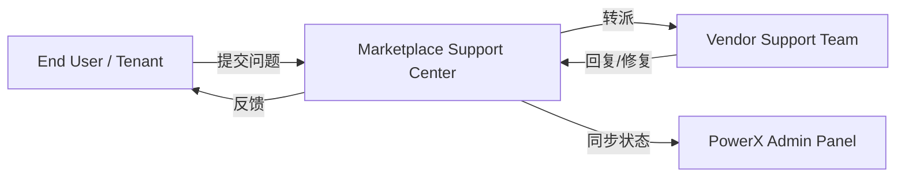
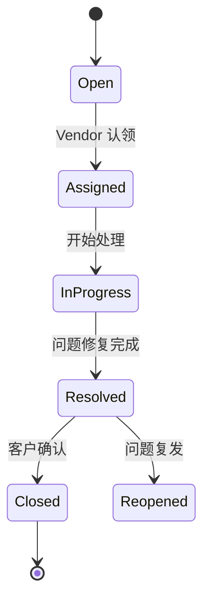

# 🆘 Support & Ticketing 技术支持与客服通道规范

> 本文档定义 **PowerX Plugin Marketplace** 的客户支持（Customer Support）与工单（Ticketing）机制。  
> 目标：建立一个统一、可追踪、分级响应的支持体系，覆盖「租户 ↔ Vendor ↔ Marketplace」三方。

---

## 🧱 1. 设计目标

| 目标 | 说明 |
|------|------|
| **多级支持体系** | 按严重程度与插件来源分级响应 |
| **统一入口** | 所有支持请求通过 Vendor Portal / Admin 统一提交 |
| **可追踪性** | 每个问题生成 Ticket ID，可全程追踪 |
| **服务等级协议（SLA）** | 明确响应与解决时限 |
| **多渠道集成** | 支持 Email、Web、API、Webhook |
| **透明协作** | Marketplace 可查看 Vendor 处理状态 |

---

## 🧩 2. 支持体系结构



| 层级           | 责任方             | 说明                  |
| ------------ | --------------- | ------------------- |
| **L1（基础支持）** | Marketplace     | 登录、支付、授权、账单问题       |
| **L2（插件支持）** | Vendor          | 插件功能、性能、兼容性         |
| **L3（平台支持）** | PowerX CoreX 团队 | 平台 API、SDK、事件总线相关问题 |

---

## 💬 3. 支持渠道（Channels）

| 渠道                      | 说明                   | 响应时间  |
| ----------------------- | -------------------- | ----- |
| **Vendor Portal**       | 官方支持中心，统一提交与查看工单     | 实时    |
| **Email**               | 自动转为 Ticket 记录       | ≤ 24h |
| **API**                 | 自动化支持对接（SaaS Vendor） | 实时    |
| **Webhook**             | 支持事件通知，如状态更新         | 实时    |
| **PowerX Admin 内嵌支持模块** | 管理员可直接反馈问题           | 实时同步  |

---

## 🧮 4. 工单数据结构（Ticket Schema）

```json
{
  "ticket_id": "TCK-20251013-00123",
  "tenant_id": "tenant_998a",
  "plugin_id": "com.vendor.analytics",
  "vendor_id": "vnd_0021",
  "category": "bug",
  "priority": "high",
  "status": "open",
  "subject": "报表导出功能出错",
  "description": "导出 CSV 时出现 500 错误。",
  "created_at": "2025-10-13T08:00:00Z",
  "updated_at": "2025-10-13T08:30:00Z",
  "assignee": "support@vendor.dev",
  "logs_url": "https://portal.powerx.dev/tickets/TCK-20251013-00123"
}
```

### 字段说明

| 字段          | 说明                                        |
| ----------- | ----------------------------------------- |
| `ticket_id` | 工单唯一 ID                                   |
| `tenant_id` | 问题来源租户                                    |
| `plugin_id` | 关联插件                                      |
| `vendor_id` | 所属开发者                                     |
| `category`  | 问题类型（bug, billing, usage, feature, other） |
| `priority`  | 优先级（low, normal, high, urgent）            |
| `status`    | 状态（open, assigned, resolved, closed）      |
| `assignee`  | 当前负责人                                     |
| `logs_url`  | 关联日志或复现信息                                 |

---

## ⚙️ 5. 工单生命周期（Ticket Lifecycle）



| 状态            | 说明              |
| ------------- | --------------- |
| `open`        | 工单新建，等待认领       |
| `assigned`    | 已分配 Vendor 支持人员 |
| `in_progress` | 正在处理            |
| `resolved`    | 已修复或提供解决方案      |
| `closed`      | 用户确认关闭          |
| `reopened`    | 复发或处理不完整        |

---

## 🧰 6. API 端点（Ticket API）

| 接口                            | 方法      | 说明       |
| ----------------------------- | ------- | -------- |
| `/api/v1/tickets`             | `POST`  | 创建工单     |
| `/api/v1/tickets/{id}`        | `GET`   | 查询工单详情   |
| `/api/v1/tickets/{id}/reply`  | `POST`  | 回复工单     |
| `/api/v1/tickets/{id}/status` | `PATCH` | 更新状态     |
| `/api/v1/tickets/list`        | `GET`   | 分页获取工单列表 |

**创建示例**

```bash
curl -X POST https://marketplace.powerx.dev/api/v1/tickets \
  -H "Authorization: Bearer $API_TOKEN" \
  -d '{
        "tenant_id": "tenant_998a",
        "plugin_id": "com.vendor.analytics",
        "category": "bug",
        "subject": "导出 CSV 时出现 500 错误"
      }'
```

---

## 🧮 7. 服务等级协议（SLA）

| 优先级        | 响应时间    | 解决时限    | 升级通道             |
| ---------- | ------- | ------- | ---------------- |
| **Urgent** | ≤ 2 小时  | ≤ 24 小时 | 自动通知 Marketplace |
| **High**   | ≤ 6 小时  | ≤ 48 小时 | 可升级              |
| **Normal** | ≤ 12 小时 | ≤ 72 小时 | 常规流程             |
| **Low**    | ≤ 24 小时 | ≤ 7 天   | 无需升级             |

> SLA 由 Vendor 定义并在 Marketplace 审核后生效。

---

## 🧩 8. Vendor 支持团队规范

| 要求         | 内容                                    |
| ---------- | ------------------------------------- |
| **支持邮箱**   | 必须在 Manifest 中声明 `support.email`      |
| **服务时间**   | 建议提供工作日 9:00–18:00 支持（本地时区）           |
| **语言支持**   | 至少支持英文；鼓励多语言客服                        |
| **日志收集机制** | 插件应支持自动上传错误日志至安全端点                    |
| **自助帮助中心** | 可选：Vendor 可在 Portal 添加知识库文章（FAQ、文档链接） |

---

## 🧩 9. 工单通知机制（Notifications & Webhook）

### 事件类型

| 事件                | 说明          |
| ----------------- | ----------- |
| `ticket.created`  | 新工单创建       |
| `ticket.assigned` | 工单分配 Vendor |
| `ticket.replied`  | 新回复         |
| `ticket.resolved` | 已解决         |
| `ticket.closed`   | 已关闭         |
| `ticket.reopened` | 重新打开        |

### Webhook 示例

```json
{
  "event": "ticket.replied",
  "ticket_id": "TCK-20251013-00123",
  "status": "in_progress",
  "updated_at": "2025-10-13T10:00:00Z"
}
```

---

## 🧮 10. Marketplace 支持监督与评分

Marketplace 定期对 Vendor 的支持表现打分：

| 指标     | 权重  | 来源             |
| ------ | --- | -------------- |
| 平均响应时间 | 30% | 工单系统           |
| 平均解决时间 | 30% | 工单系统           |
| 用户满意度  | 30% | 用户反馈           |
| 升级率    | 10% | Marketplace 审核 |

评分将影响 Vendor 的「认证等级」与推荐排序。

---

## 🧰 11. Makefile 辅助命令（调试与上报）

```makefile
ticket-new:
 curl -s -X POST "https://marketplace.powerx.dev/api/v1/tickets" \
  -H "Authorization: Bearer $(API_TOKEN)" \
  -d '{"plugin_id":"$(PLUGIN_ID)","tenant_id":"$(TENANT_ID)","category":"bug","subject":"$(MSG)"}' | jq .

ticket-list:
 curl -s "https://marketplace.powerx.dev/api/v1/tickets/list?vendor_id=$(VENDOR_ID)" \
  -H "Authorization: Bearer $(API_TOKEN)" | jq .
```

---

## 🧠 12. 与 Vendor Portal 集成

Vendor Portal 的「支持中心」页面包含以下功能：

| 模块    | 功能         | 接口                           |
| ----- | ---------- | ---------------------------- |
| 工单列表  | 展示全部工单     | `/api/v1/tickets/list`       |
| 工单详情  | 查看历史沟通记录   | `/api/v1/tickets/{id}`       |
| 回复表单  | 提交回复与附件    | `/api/v1/tickets/{id}/reply` |
| 统计仪表盘 | 展示 SLA 达标率 | `/api/v1/tickets/metrics`    |

---

## 🧩 13. 与 PowerX Admin 的协作机制

PowerX Admin 管理员可：

* 查看插件相关工单；
* 标记 Marketplace 协助处理；
* 触发「紧急升级」通道；
* 查看 SLA 报告与支持评分；
* 将安全类事件转交 CoreX 审计团队。

---

## 🪶 14. 最佳实践

| 场景             | 建议                      |
| -------------- | ----------------------- |
| **多插件 Vendor** | 统一支持邮箱与知识库              |
| **企业客户多租户**    | 启用 API 自动同步工单状态         |
| **高流量插件**      | 使用 Webhook + Slack 通知机制 |
| **海外市场**       | 提供多语言支持（EN/ZH/JP）       |
| **安全问题**       | 使用分类 `security` 并标记高优先级 |
| **AI 类插件**     | 自动收集上下文日志以便诊断           |
| **VIP 租户支持**   | 可在 Portal 创建专属「优先通道」群组  |

---

## 📘 15. 关联文档

* 👉 [Policy Suspension & Ban 停权与违规处理机制](./Policy_Suspension_and_Ban.md)
* 👉 [Appeals & Recovery 申诉与恢复流程](./Appeals_and_Recovery.md)
* 👉 [Vendor Profile & Portal 资料与控制台](../01_onboarding/Vendor_Profile_and_Portal.md)
* 👉 [Security & Validation 安全与签名机制](../02_plugin_development/Security_and_Validation.md)

---

> ✅ **总结一句话：**
> PowerX Marketplace 的支持体系以 **多级支持 + 工单追踪 + SLA + 审计透明** 为核心，
> 让每个插件从问题出现到解决的全过程都有「记录、责任与信任」。
