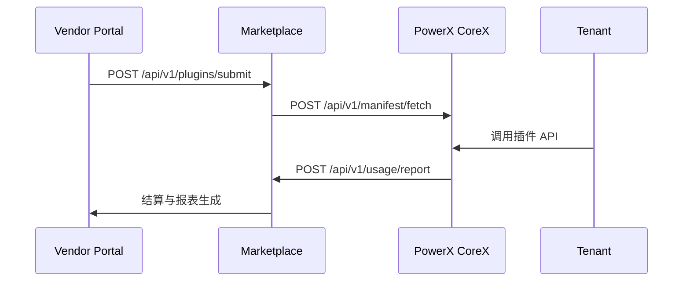

# 🔗 API Index 公共接口索引

> 本文档列出 PowerX Marketplace、CoreX Runtime、License Server 以及 Vendor Portal 之间的核心 API 接口。  
> 所有接口均遵循 RESTful + JSON 规范，部分高性能场景可通过 gRPC / Event Bus 异步调用。  
> 本索引文件为 **开发者参考总览表**，详细字段请参阅对应模块文档。

---

## 🧱 1. 目录结构概览

| 模块 | 文件位置 | 描述 |
|------|-----------|------|
| 🧩 **Vendor 入驻与资料** | `01_onboarding/` | Vendor 注册、KYC、资料管理 |
| ⚙️ **插件开发与验证** | `02_plugin_development/` | 插件结构、测试、安全审查 |
| 🚀 **上架与生命周期** | `03_listing_and_lifecycle/` | 提交流程、审核、版本控制 |
| 💳 **授权与定价** | `04_license_and_pricing/` | License、Pricing、校验机制 |
| 💰 **财务与结算** | `05_finance_and_settlement/` | 分成、发票、税务接口 |
| 🔗 **PowerX 集成** | `06_integration_with_powerx/` | Manifest、License API、Usage API |
| 🧭 **支持与政策** | `07_support_and_policies/` | 工单、停权、申诉 |
| 📚 **附录** | `99_appendix/` | 术语、接口索引、更新日志 |

---

## 🧩 2. Vendor Onboarding APIs（入驻与注册）

| 接口 | 方法 | 说明 |
|------|------|------|
| `/api/v1/vendors` | `POST` | 提交 Vendor 注册与 KYC 资料 |
| `/api/v1/vendors/{id}` | `GET` | 获取 Vendor 详情 |
| `/api/v1/vendors/{id}/approve` | `POST` | 管理员审批 Vendor |
| `/api/v1/vendors/{id}/update` | `PATCH` | 更新 Vendor 信息 |
| `/api/v1/vendors/list` | `GET` | 分页列出所有 Vendor |
| `/api/v1/vendors/{id}/kyc/status` | `GET` | 查询实名认证状态 |

---

## ⚙️ 3. Plugin Development APIs（插件开发与测试）

| 接口 | 方法 | 说明 |
|------|------|------|
| `/api/v1/plugins/validate` | `POST` | 校验 plugin.yaml 的结构与签名 |
| `/api/v1/plugins/sandbox/start` | `POST` | 启动本地测试 Sandbox |
| `/api/v1/plugins/sandbox/stop` | `POST` | 停止测试 Sandbox |
| `/api/v1/plugins/security/scan` | `POST` | 提交安全扫描任务 |
| `/api/v1/plugins/security/report/{id}` | `GET` | 获取安全扫描报告 |

---

## 🚀 4. Listing & Lifecycle APIs（上架与审核）

| 接口 | 方法 | 说明 |
|------|------|------|
| `/api/v1/plugins/submit` | `POST` | 提交插件上架申请 |
| `/api/v1/plugins/review/{id}` | `POST` | 审核通过 / 拒绝 |
| `/api/v1/plugins/{id}/status` | `PATCH` | 更新插件状态（draft/published/hidden） |
| `/api/v1/plugins/{id}/versions` | `GET` | 查看插件版本历史 |
| `/api/v1/plugins/version/diff` | `POST` | 版本对比与兼容性检查 |
| `/api/v1/plugins/deprecate/{id}` | `POST` | 下架 / 废弃插件 |

---

## 💳 5. License & Pricing APIs（授权与计费）

| 接口 | 方法 | 说明 |
|------|------|------|
| `/api/v1/license/issue` | `POST` | 颁发新 License |
| `/api/v1/license/verify` | `POST` | 校验 License 有效性 |
| `/api/v1/license/refresh` | `POST` | License 续期与刷新 |
| `/api/v1/license/{id}` | `GET` | 查询 License 状态 |
| `/api/v1/pricing/plans` | `GET` | 列出插件定价计划 |
| `/api/v1/pricing/plan/{id}` | `GET` | 查看定价详情 |
| `/api/v1/license/usage` | `POST` | 汇报 License 使用量（由 CoreX 调用） |

---

## 💰 6. Finance & Settlement APIs（财务与结算）

| 接口 | 方法 | 说明 |
|------|------|------|
| `/api/v1/finance/payouts` | `GET` | Vendor 收益结算列表 |
| `/api/v1/finance/payouts/request` | `POST` | 提现申请 |
| `/api/v1/finance/payouts/report` | `GET` | 收益明细报表 |
| `/api/v1/finance/invoices` | `GET` | 查询发票记录 |
| `/api/v1/finance/invoices/issue` | `POST` | 申请开票 |
| `/api/v1/finance/tax/info` | `GET` | 查询税务登记与状态 |

---

## 🔗 7. PowerX Integration APIs（PowerX 与 Marketplace 对接）

| 接口 | 方法 | 调用方向 | 说明 |
|------|------|----------|------|
| `/api/v1/manifest/register` | `POST` | Plugin → CoreX | 注册插件 Manifest |
| `/api/v1/manifest/fetch` | `GET` | CoreX → Marketplace | 拉取插件列表与版本 |
| `/api/v1/license/verify` | `POST` | CoreX → Marketplace | 校验租户 License |
| `/api/v1/usage/report` | `POST` | CoreX → Marketplace | 上报使用量 |
| `/api/v1/usage/event` | `POST` | CoreX → Marketplace | 上报运行事件 |
| `/api/v1/usage/batch` | `POST` | CoreX → Marketplace | 批量上报使用与事件数据 |

---

## 🧭 8. Support & Compliance APIs（支持与合规）

| 接口 | 方法 | 说明 |
|------|------|------|
| `/api/v1/tickets` | `POST` | 创建支持工单 |
| `/api/v1/tickets/{id}` | `GET` | 查看工单详情 |
| `/api/v1/tickets/{id}/reply` | `POST` | 回复工单 |
| `/api/v1/tickets/list` | `GET` | 查询工单列表 |
| `/api/v1/appeals` | `POST` | 提交违规申诉 |
| `/api/v1/appeals/{id}` | `GET` | 查询申诉状态 |
| `/api/v1/compliance/violations` | `GET` | 查询违规事件 |
| `/api/v1/compliance/reports` | `GET` | 合规报告与统计 |

---

## 🧩 9. Event Hooks（事件通知与 Webhook）

| 事件名 | 触发时机 | 数据载荷 |
|--------|-----------|----------|
| `plugin.published` | 插件上架成功 | 插件 ID、版本号、时间戳 |
| `plugin.updated` | 插件更新 | 新旧版本号、Diff |
| `plugin.suspended` | 插件停权 | 原因、时限 |
| `plugin.reinstated` | 插件恢复 | 审核决议 |
| `license.issued` | 新 License 颁发 | License ID、租户信息 |
| `license.revoked` | License 撤销 | 原因 |
| `usage.reported` | 调用上报 | 租户、用量、trace_id |
| `event.error` | 插件异常 | 事件类型、错误堆栈 |
| `ticket.created` | 新支持工单 | Ticket ID、插件 ID |
| `appeal.approved` | 申诉成功 | 插件 ID、恢复日期 |

---

## ⚙️ 10. Authentication & Headers（认证与安全）

| Header | 说明 |
|---------|------|
| `Authorization: Bearer <token>` | Vendor 或 CoreX 授权令牌 |
| `X-PowerX-Signature` | HMAC-SHA256 签名，用于请求验证 |
| `X-PowerX-Tenant` | 当前请求租户 ID |
| `X-PowerX-Plugin` | 当前插件标识 |
| `X-Trace-Id` | 全局调用链追踪 ID |
| `Content-Type: application/json` | 默认请求类型 |

---

## 🔐 11. 安全与审计接口（仅内部）

| 接口 | 方法 | 权限 | 说明 |
|------|------|------|------|
| `/internal/audit/events` | `GET` | Admin | 查询系统审计事件 |
| `/internal/audit/plugin/{id}` | `GET` | Admin | 查看插件操作日志 |
| `/internal/security/scan` | `POST` | CoreX | 触发安全扫描任务 |
| `/internal/security/reports` | `GET` | Admin | 查看安全扫描结果 |
| `/internal/compliance/sync` | `POST` | Marketplace → CoreX | 同步合规状态 |

---

## 🧮 12. 示例：多层调用链



---

## 🧰 13. Makefile 快速测试命令

```makefile
plugin-validate:
 curl -s -X POST "$(MARKETPLACE_URL)/api/v1/plugins/validate" \
  -H "Authorization: Bearer $(API_TOKEN)" \
  -F "file=@plugin.yaml" | jq .

license-verify:
 curl -s -X POST "$(MARKETPLACE_URL)/api/v1/license/verify" \
  -H "Authorization: Bearer $(API_TOKEN)" \
  -d '{"license_id":"$(LICENSE_ID)"}' | jq .

usage-report:
 curl -s -X POST "$(MARKETPLACE_URL)/api/v1/usage/report" \
  -H "Authorization: Bearer $(API_TOKEN)" \
  -d '{"plugin_id":"$(PLUGIN_ID)","usage":{"calls":10}}' | jq .
```

---

## 📘 14. 关联文档

* 👉 [License API & Verification](../06_integration_with_powerx/License_API_and_Verification.md)
* 👉 [Usage Report & Event API](../06_integration_with_powerx/Usage_Report_and_Event_API.md)
* 👉 [Support & Ticketing](../07_support_and_policies/Support_and_Ticketing.md)
* 👉 [Vendor Profile & Portal](../01_onboarding/Vendor_Profile_and_Portal.md)
* 👉 [Security & Validation](../02_plugin_development/Security_and_Validation.md)

---

> ✅ **总结一句话：**
> PowerX Marketplace 的 API 体系遵循「**三层架构，双向验证，全链路可追踪**」原则，
> 让 Plugin、Vendor、CoreX、Marketplace 之间的数据与调用流既安全又高效。
