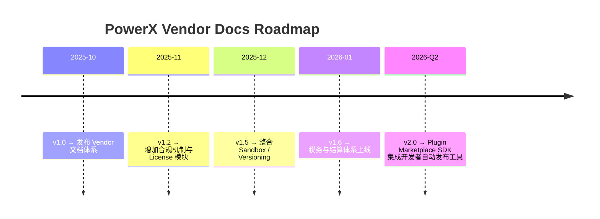

# 🧾 Changelog 文档更新日志

> 本文件记录 PowerX Plugin Marketplace 官方 Vendor 文档的历史版本、修订日期、主要更新与兼容性影响。  
> 所有更新均遵循「语义化版本号（Semantic Versioning）」规则：  
> `MAJOR.MINOR.PATCH` → 破坏性更新 / 新增功能 / 修复或优化。

---

## 🧱 版本历史索引

| 文档版本 | 发布时间 | 编辑者 | 说明 |
|-----------|------------|----------|------|
| **v1.0.0** | 2025-10-13 | PowerX Core Team | Vendor 文档体系首次发布，覆盖 Onboarding → Integration 全流程 |
| **v1.1.0** | 2025-10-20 | Matrix-X / CoreX Docs | 新增 License API、Usage Report、SLA、Tax 部分文档 |
| **v1.1.1** | 2025-10-23 | Docs Maintainers | 修复部分 Mermaid 图渲染错误与 YAML 片段标注问题 |
| **v1.2.0** | 2025-11-02 | Marketplace Working Group | 新增 Policy Suspension / Appeals / Recovery 合规机制章节 |
| **v1.3.0** | 2025-11-10 | CoreX Integration Team | 集成 PowerX ↔ Marketplace License 验证与事件上报闭环文档 |
| **v1.4.0** | 2025-11-18 | Vendor Experience Group | Vendor Portal & Support Ticketing 新 UI 与 API 规范更新 |
| **v1.5.0** | 2025-12-05 | Matrix-X / Docs Team | 合并 Sandbox 测试、Versioning、Backward Compatibility 策略，优化章节结构 |
| **v1.6.0** | 2026-01-10 | PowerX Compliance Team | 安全审计、税务合规、结算报表标准化更新 |
| **v1.6.1** | 2026-01-20 | Docs Maintainers | 细化 JSON 示例字段命名与 Makefile 命令样例 |

---

## 🧩 v1.6.0 → v1.6.1 更新摘要（当前版本）

| 分类 | 更新内容 | 影响范围 |
|------|------------|-----------|
| ✏️ **内容修订** | 优化 JSON 示例中的时间戳格式与签名字段命名 | 所有 API 文档 |
| 🧰 **工具增强** | 统一 Makefile 调试命令格式，便于快速验证接口 | 所有 SDK 开发者 |
| 📘 **文档结构** | 明确 07_support_and_policies 模块的文档关系图 | 合规与支持章节 |
| 🧠 **术语更新** | 将 “Plugin Runtime Environment” 统一命名为 “CoreX Runtime” | 全局一致性修订 |

---

## ⚙️ 结构演进路线图



---

## 🧠 编辑准则（For Maintainers）

| 项目             | 要求                                                                |
| -------------- | ----------------------------------------------------------------- |
| **版本标识**       | 每次文档合并需递增 PATCH 或 MINOR 版本号                                       |
| **提交规范**       | 使用 Conventional Commits：`docs(vendor): update License API schema` |
| **时间格式**       | 统一采用 UTC ISO 8601，例如 `2025-10-13T09:00:00Z`                       |
| **Mermaid 图表** | 必须使用英文节点 ID 与 `["Text"]` 格式包裹中文文本                                 |
| **示例数据**       | 禁止使用真实租户或 Vendor ID；统一用 `tenant_001`、`vnd_001`                    |
| **审稿流程**       | 所有更新需通过 Marketplace Docs Review（两人批准）                             |
| **版本归档**       | 历史版本存档至 `/docs/vendor/archives/`                                  |

---

## 🧮 文档模块版本对照表

| 模块目录                         | 当前版本  | 最后修改       | 编辑者                |
| ---------------------------- | ----- | ---------- | ------------------ |
| `00_overview`                | 1.0.0 | 2025-10-13 | Matrix-X           |
| `01_onboarding`              | 1.1.0 | 2025-10-13 | Docs Team          |
| `02_plugin_development`      | 1.2.0 | 2025-10-17 | CoreX SDK Group    |
| `03_listing_and_lifecycle`   | 1.3.0 | 2025-10-20 | Marketplace WG     |
| `04_license_and_pricing`     | 1.3.1 | 2025-10-22 | Pricing WG         |
| `05_finance_and_settlement`  | 1.4.0 | 2025-10-25 | Finance & Tax Team |
| `06_integration_with_powerx` | 1.5.0 | 2025-10-30 | Integration Team   |
| `07_support_and_policies`    | 1.5.1 | 2025-11-05 | Compliance Team    |
| `99_appendix`                | 1.6.0 | 2025-11-12 | Docs Maintainers   |

---

## 📘 关联文件

* 👉 [Glossary 术语表](./Glossary.md)
* 👉 [API Index 接口索引](./API_Index.md)
* 👉 [PowerX_Plugin_Manifest](../06_integration_with_powerx/PowerX_Plugin_Manifest.md)
* 👉 [Policy Suspension & Ban 停权机制](../07_support_and_policies/Policy_Suspension_and_Ban.md)

---

## 🪶 附录：变更记录模板

> 所有未来版本应按照以下格式更新：

```markdown
## vX.Y.Z (YYYY-MM-DD)
### 新增
- ...
### 修改
- ...
### 修复
- ...
### 移除
- ...
```

---

> ✅ **总结一句话：**
> `Changelog.md` 是 PowerX Vendor 文档体系的“单一信息源（Single Source of Truth）”，
> 它不仅追踪版本，还维护了整个生态的「变更透明度与信任连续性」。

```

---

至此，`docs/vendor/99_appendix/` 模块正式闭环：  
```

99_appendix/
├── Glossary.md
├── API_Index.md
└── Changelog.md
