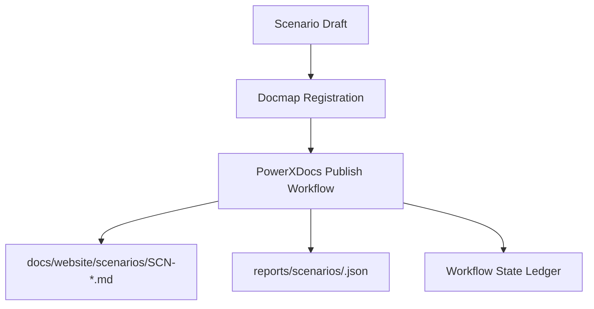

# Positioning & Goals

Describe the narrative focus, target roles, and overarching goals.

# Core Capabilities

- Capability one (why it matters)
- Capability two (cross-repo alignment point)

# Acceptance Criteria

1. Requirement or system behavior
2. Validation rule or governance check

# Validation Workflow

| Step | Owner | Tooling |
|------|-------|---------|
| Draft authored | Documentation Steward | docs/standards/scenarios/_template.md |
| Docmap entry registered | Documentation Steward | docs/_data/docmap.yaml |
| Publication run | Operations Engineer | `npm run publish:scenarios` |

# Related Links

- Link to usecase seeds (`docs/usecases-seeds/<scope>/<layer>/<domain>/`)
- Link to downstream repo PR demonstrating adoption
- Link to leadership summary card in docs/website/library/

# Architecture Diagram

