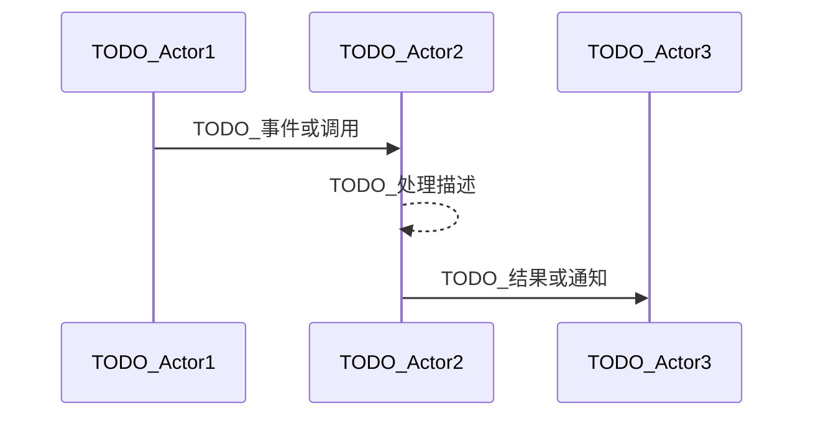

scn_id: SCN_ID_PLACEHOLDER         # 与 docmap.yaml 对齐的唯一场景 ID（例如 SCN-PUBLISH-ONLINE-001）
title: TODO_UPDATE_TITLE           # 面向读者的标题
status: Draft                      # Draft | In Review | Approved | Deprecated
version: v0.1.0                    # 场景文档版本号
owners:
  - name: TODO_OWNER_NAME
    role: Scenario Steward
    contact: <owner@example.com>
domains: [TODO_DOMAIN_LIST]        # 适用领域标签（可多选）
layers: [TODO_LAYER_LIST]          # 涉及的体系层
repos:
  - key: TODO_REPO_KEY
    scope: TODO_SCOPE
    responsibility: TODO_RESPONSIBILITY
related_usecases:
  - doc_id: TODO_DOC_ID
    layer: TODO_LAYER
    domain: TODO_DOMAIN
last_reviewed_at: YYYY-MM-DD

---

# Executive Summary

> 使用说明：请将所有 `TODO_*` 或占位段落替换为实际内容。保留该说明以提醒作者填写完整。

简述业务价值、关联角色（开发者/审核/运营等）以及成功判定标准。

# Scope & Guardrails

- **In Scope**：TODO_列出纳入的仓库、模块、版本假设。
- **Out of Scope**：TODO_不覆盖的流程、仓库或边界。
- **Environment & Flags**：TODO_前置条件、所需 Feature Flag、外部依赖。

# Participants & Responsibilities

| Scope | Repository | Layer | 责任与交付物 | Owners |
|-------|------------|-------|--------------|--------|
| TODO_SCOPE | TODO_REPO | TODO_LAYER | TODO_责任与交付物 | TODO_Owner |

> 提示：根据实际情况增删行；Owners 应与 Frontmatter 中 `owners`/`repos` 元数据相呼应。

# End-to-End Flow

1. **Stage 1 – TODO_STAGE_NAME**：描述触发者、输入、关键事件。
2. **Stage 2 – TODO_STAGE_NAME**：列出关键交互、状态流转、跨仓通知。
3. **Stage 3 – TODO_STAGE_NAME**：说明需要的系统动作与验证。
4. **Stage 4 – TODO_STAGE_NAME**：描述完成条件、用户反馈或后续步骤。

如需补充时序/流程图可参考（请替换参与者和事件）：

# Key Interactions & Contracts

- **APIs / Events**：TODO_列出跨仓契约（方法、路径、payload 示例）。
- **Configs / Schemas**：TODO_链接到 `docs/standards/**` 或下游仓库文件。
- **Security / Compliance**：TODO_权限、审计、数据合规要点。

# Usecase Links

- `TODO_DOC_ID` — TODO_说明（TODO_LAYER 层，自有仓路径）

> 提示：应与 Frontmatter 的 `related_usecases` 保持一致，便于脚本校验。

# Acceptance Criteria

1. TODO_核心业务结果（可量化）。
2. TODO_数据/治理约束（例如审计、签名校验）。
3. TODO_多仓协作检查（例如脚本执行、PR 合入）。

# Telemetry & Ops

- 指标：TODO_指标名称（如 `xxx.duration`）。
- 告警阈值：TODO_触发条件与通知渠道。
- 观测来源：TODO_仪表板或脚本。

# Open Issues & Follow-ups

| 风险/事项 | 影响范围 | 负责人 | ETA |
|-----------|----------|--------|-----|
| TODO_风险或跟进项 | TODO_影响范围 | TODO_负责人 | YYYY-MM-DD |

# Appendix

- TODO_相关 PR：跨仓 PR 列表。
- TODO_设计稿 / 白板：外部文档或截图链接。
- TODO_历史版本：记录重要版本与变更说明。
