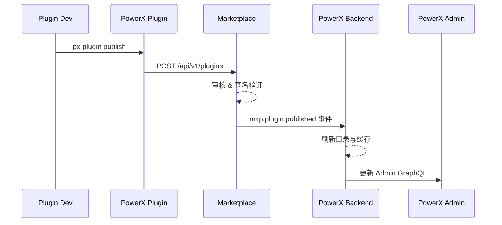

scn_id: SCN-EXAMPLE-001            # 与 docmap.yaml 对齐的唯一场景 ID
title: Example Scenario Title      # 面向读者的标题
status: Draft                      # Draft | In Review | Approved | Deprecated
version: v0.1.0                    # 场景文档版本号
owners:
  - name: Steward Name
    role: Scenario Steward
    contact: steward@example.com
domains: [publish, marketplace]    # 适用领域标签（可多选）
layers: [proto, api, service, ui]  # 涉及的体系层
repos:
  - key: powerx-plugin
    scope: plg
    responsibility: 构建与签名流程
  - key: powerx-marketplace
    scope: mkp
    responsibility: 审核与上架
  - key: powerx-backend
    scope: px
    responsibility: 目录同步与缓存
  - key: powerx-admin
    scope: admin
    responsibility: 上架管理界面
related_usecases:
  - doc_id: PLG-PUBLISH-002
    layer: proto
    domain: publish
  - doc_id: MKP-PUBLISH-002
    layer: api
    domain: publish
  - doc_id: PX-PUBLISH-002
    layer: service
    domain: publish
  - doc_id: PX-ADMIN-PUBLISH-002
    layer: ui
    domain: publish
last_reviewed_at: 2025-01-01
---

# Executive Summary

简述业务价值、关联角色（开发者/审核/运营等）以及成功判定标准。

# Scope & Guardrails

- **In Scope**：纳入的仓库、模块、版本假设。
- **Out of Scope**：不覆盖的流程、仓库或边界。
- **Environment & Flags**：前置条件、所需 Feature Flag、外部依赖。

# Participants & Responsibilities

| Scope | Repository | Layer | 责任与交付物 | Owners |
|-------|------------|-------|--------------|--------|
| plg   | powerx-plugin        | proto   | 构建、签名、提交插件包 | Alice (Lead) |
| mkp   | powerx-marketplace   | api     | 审核、上架、事件触发   | Bob (Reviewer) |
| px    | powerx-backend       | service | 目录同步、缓存刷新     | Carol (Maintainer) |
| admin | powerx-admin         | ui      | 上架展示、运维界面     | Dave (Ops) |

> 可根据实际情况增删行；Owners 应与 Frontmatter 中 `owners`/`repos` 元数据相呼应。

# End-to-End Flow

1. **Stage 1 – Trigger**：描述触发者、输入、关键事件。
2. **Stage 2 – Marketplace 审核**：列出 API 调用、状态流转、跨仓通知。
3. **Stage 3 – Backend 同步**：说明监听事件、处理逻辑、缓存/数据库更新。
4. **Stage 4 – Admin 展示**：描述前端刷新、权限校验、运维反馈。

如需补充时序/流程图可参考：

# Key Interactions & Contracts

- **APIs / Events**：列出跨仓契约（方法、路径、payload 示意）。
- **Configs / Schemas**：链接到 `docs/standards/**` 或下游仓库文件。
- **Security / Compliance**：权限、审计、数据合规要点。

# Usecase Links

- `PLG-PUBLISH-002` — 插件构建与签名（proto 层，自有仓：`docs/use_cases/proto/publish/PLG-PUBLISH-002.md`）
- `MKP-PUBLISH-002` — 审核与上架流程（api 层）
- `PX-PUBLISH-002` — 目录同步与缓存刷新（service 层）
- `PX-ADMIN-PUBLISH-002` — 管理后台展示（ui 层，可选）

> 应与 Frontmatter 的 `related_usecases` 保持一致，便于脚本校验。

# Acceptance Criteria

1. 核心业务结果（如：发布后 5 分钟内可在目录搜索）。
2. 数据/治理约束（如：审核日志完备、事件去重）。
3. 多仓协作检查（如：分发脚本成功、PR 全部合并）。

# Telemetry & Ops

- 指标：`publish.duration`、`catalog.refresh.latency` 等。
- 告警阈值：触发条件与通知渠道。
- 观测来源：内部仪表板、`scripts/qa/workflow-metrics.mjs` 等。

# Open Issues & Follow-ups

| 风险/事项 | 影响范围 | 负责人 | ETA |
|-----------|----------|--------|-----|
| 缺少 marketplace 回滚脚本 | MKP | Bob | 2025-02-01 |

# Appendix

- 相关 PR：跨仓 PR 列表。
- 设计稿 / 白板：外部文档或截图链接。
- 历史版本：记录重要版本与变更说明。
