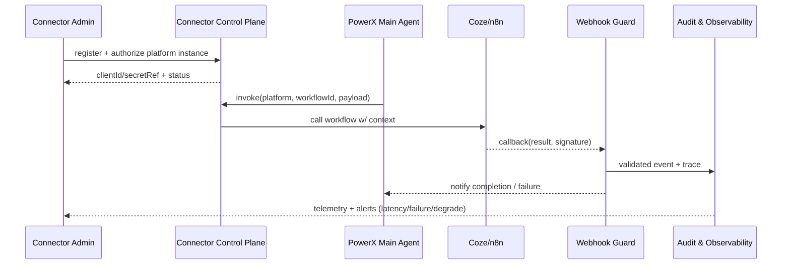

doc_id: UC-AGENT-PLATFORM-COZE-001
scn_id: SCN-AGENT-MODEL-HUB-001
title: PowerX Plugin (integration) - 外部智能体平台接入（Coze / n8n）
status: Draft
version: v0.2.0
repo_key: powerx-plugin
scope: powerx-plugin
layer: integration
domain: agent-orchestration
scenario_title: "智能体模型与平台接入"
owners:
  - name: Plugin Guild
    role: Platform Connector Lead
    contact: plugin-guild@artisan-cloud.com
contributors:
  - name: Ops Reliability Center
    role: Automation Co-owner
    contact: ops-center@artisan-cloud.com
  - name: Agent Platform Guild
    role: Identity & Security Partner
    contact: agent-platform@artisan-cloud.com
linked_requirements:
  - id: SCN-AGENT-PLATFORM-COZE-001
    description: 外部智能体平台接入（Coze / n8n） Stage
code_refs:
  - repo: powerx-plugin
    path: connectors/coze/
    description: Coze 连接器、上下文映射、回调处理
  - repo: powerx-plugin
    path: connectors/n8n/
    description: n8n Webhook、工作流调用、重试策略
  - repo: powerx
    path: services/security/webhook_guard.ts
    description: Webhook 签名校验、速率限制、重放防护
  - repo: powerx
    path: services/audit/platform_trace.go
    description: 平台调用审计、Trace 追踪
  - repo: powerx
    path: config/platform/connectors/
    description: 连接器实例、租户映射、Feature Flag 配置
feature_flags:
  - agent-platform-connectors
  - platform-webhook-guard
optional: false
last_reviewed_at: 2025-02-18

---

# Usecase Overview

- **业务目标**：让 PowerX 主 Agent 能在统一身份、安全与审计框架下调用 Coze、n8n 等外部智能体/工作流平台，扩展自动化能力且可控可回滚。
- **成功度量**：平台调用成功率 ≥98%；回调延迟 <3 秒；签名失败率 <0.1%；降级切换 ≤5 分钟；多租户凭证同步成功率 100%。
- **场景关联**：承接 `SCN-AGENT-PLATFORM-COZE-001` Stage（外部平台接入），为任务执行场景提供“高级 provider”，并依赖 Provider/路由子用例的健康与策略输出。

> 摘要：通过连接器 SDK + Webhook Guard + 租户映射，形成“注册/授权 → 调用 → 回调 → 降级”的闭环，确保外部平台的可观测、可审计与安全。

# Context & Assumptions

- **前置条件**
  - 外部平台提供 OAuth/Token 或 API Key，Webhook 支持签名验证。
  - `agent-platform-connectors` 与 `platform-webhook-guard` Feature Flags 已在配置中心注册，可按租户灰度。
  - Vault/Secret Manager 已支持平台凭证的租户级加密存储。
  - `docs/_data/docmap.yaml` 中 `SCN-AGENT-MODEL-HUB-001 -> UC-AGENT-PLATFORM-COZE-001` 的 scope/layer/domain 与本 Seed 保持一致。
- **输入**
  - 平台 OAuth/Token、App ID、Webhook Secret。
  - 租户/用户映射、上下文模板、工作流 ID、运行参数。
  - 降级策略（转人工、本地降级流程、重试阈值）。
- **输出**
  - Connector 实例配置（`config/platform/connectors/*.yaml`）与密钥引用。
  - `POST /platform/connectors/{platform}/invoke` 的 Trace、调用结果、错误码。
  - `EVENT platform.connector.callback` 与审计记录、告警信号。
- **边界**
  - 不负责外部平台内部 Workflow/Node 的设计与运维。
  - 不覆盖第三方依赖的资质审批（由平台管理员执行）。
  - 不直接修改 PowerX 下游插件或任务执行逻辑，只提供调用与结果同步。

# Solution Blueprint

## 体系分解

| 层 | 主要组件/模块 | 责任 | 代码入口 |
|----|---------------|------|---------|
| integration | Connector SDK (Coze/n8n) | 实现 OAuth/Token 管理、上下文映射、调用/回调封装 | `connectors/coze/`, `connectors/n8n/` |
| integration | Webhook Guard & Gateway | 验证签名、限流、幂等与重放防护 | `services/security/webhook_guard.ts` |
| integration | Connector Control Plane | Connector 实例管理、租户映射、Feature Flag | `config/platform/connectors/` + Control APIs |
| ops | Audit & Degrade Pipeline | Trace、审计、降级开关、告警处理 | `services/audit/platform_trace.go`, `scripts/ops/platform-degrade.mjs` |

## 流程与时序

1. **Step 1 – Platform Onboarding**：创建 Connector 实例、完成 OAuth/Token 或 API Key 交换，密钥写入 Vault。
2. **Step 2 – Context Mapping**：在配置中心定义租户/用户映射及输入输出模板，开启必要 Feature Flag。
3. **Step 3 – Invocation**：主 Agent 通过 `POST /platform/connectors/{platform}/invoke` 触发工作流，附带 Trace、幂等键、租户标签。
4. **Step 4 – Callback & Persistence**：Webhook Gateway 校验签名，将结果写入任务看板、审计与事件流，失败时重试或标记降级。
5. **Step 5 – Monitoring & Degrade**：Telemetry 监控成功率/延迟，必要时 `POST /platform/connectors/{platform}/degrade` 切换到本地流程或人工处理，并发出告警。

# Contracts & Interfaces

- **Inbound APIs / Events**
  - `POST /platform/connectors/{platform}/instances` — 创建/更新实例，返回 secret 引用与租户范围，需 `agent.connector.manage` 权限。
  - `POST /platform/connectors/{platform}/invoke` — 主 Agent 触发外部工作流，请求体包含 `tenant`, `workflowId`, `context`, `traceId`, `idempotencyKey`。
  - `POST /platform/connectors/{platform}/degrade` — 设置降级模式（本地流程 / 人工），支持 `--timeout`, `--reason`。
  - `EVENT platform.connector.callback` — Webhook 成功回传，payload 包含签名、结果、错误码、traceId。
- **Outbound 调用**
  - External Platform OAuth/API (`https://api.coze.com/...`, `https://api.n8n.cloud/...`) — 需处理速率限制与重试。
  - Secret Manager (`/v1/platform-secrets`) — 存储/轮换平台密钥。
  - Audit & Telemetry (`agent.platform.*`) — 写入指标、告警事件与审计记录。
- **配置与脚本**
  - `config/platform/connectors/*.yaml` — Connector 实例、租户映射、回调端点。
  - `scripts/ops/platform-degrade.mjs` — 快速降级/恢复脚本。
  - `config/feature_flags/platform_connectors.yaml` — 灰度、租户白名单、速率限制。

# Implementation Checklist

| 项目 | 描述 | 完成状态 | 负责人 |
|------|------|----------|--------|
| OAuth / Token 管理 | 多平台凭证、租户隔离、自动轮换 | [ ] | Plugin Guild |
| 上下文模板与验证 | 输入/输出映射、参数校验、敏感数据脱敏 | [ ] | Agent Platform Guild |
| Webhook Guard | 签名算法、幂等表、限流、重放检测 | [ ] | Ops Reliability Center |
| 调用 & 降级 API | Invoke/Degrade 接口、Feature Flag 控制 | [ ] | Agent Platform Guild |
| 审计 & Telemetry | Trace、`agent.platform.*` 指标、告警路由 | [ ] | Ops Reliability Center |

# Testing Strategy

- **单元测试**：Connector SDK 参数校验、签名验证、回调解析、幂等键生成。
- **集成测试**：沙箱调用 Coze/n8n、Webhook 回调签名、Secret Manager 替换、租户映射覆盖。
- **端到端**：从注册 → 调用 → 回调 → 审计 → 降级的全链路脚本（`npm run test:workflows -- --suite=platform-connectors` 或 `routing-simulator` 组合）。
- **Chaos / Failover**：模拟平台 5xx、网络超时、签名篡改、凭证过期、Webhook 延迟，验证降级路径和告警。

# Observability & Ops

- **指标**：`agent.platform.latency_p95`, `agent.platform.success_rate`, `agent.platform.callback_failure_total`, `agent.platform.degrade_total`, `agent.platform.signature_failure_total`.
- **日志**: Connector 调用日志（包含 `traceId`, `tenant`, `workflowId`）、Webhook 验证日志、降级操作记录。
- **告警**：回调失败率 >5%、签名失败 >0.1%、降级持续 >30 分钟、调用延迟 >3s、凭证接近失效。
- **Dashboards**：Grafana「Platform Connectors」、Datadog `agent.platform.*`、Ops 中台降级面板。

# Rollback & Failure Handling

- `POST /platform/connectors/{platform}/degrade --mode local --tenant <id>` 可在平台不可用时切换到本地流程，结束后手动或自动恢复。
- 当 OAuth/Token 失效时触发轮换流程并阻断调用，必要时回滚到上一版本凭证引用。
- Webhook 失败自动重试（指数退避），超过阈值后告警并记录审计。
- 平台契约变更时，通过配置版本化回滚 `config/platform/connectors/*.yaml` 并重新发布。

# Follow-ups & Risks

| 风险/事项 | 影响 | 缓解方案 | 负责人 | ETA |
|-----------|------|----------|--------|-----|
| 平台协议/Schema 变更缺乏预警 | 导致调用/回调失败 | 与平台订阅变更 Webhook，拉取 SDK 版本并加入兼容层 | Plugin Guild | 2025-03-08 |
| 租户映射手动维护易出错 | 可能越权或请求失败 | 建立自动同步脚本 + 审批流，定期审计映射 | Agent Platform Guild | 2025-03-01 |
| 签名算法泄露或被滥用 | 安全风险 | 定期轮换签名密钥、强制 mTLS、启用 Webhook Guard 阈值 | Ops Reliability Center | 2025-03-05 |

# References & Links

- 场景：`docs/scenarios/agent-orchestration/SCN-AGENT-PLATFORM-COZE-001.md`
- Docmap：`docs/_data/docmap.yaml` (`SCN-AGENT-MODEL-HUB-001 -> UC-AGENT-PLATFORM-COZE-001`)
- Repo 元数据：`docs/_data/repos.yaml` (`key: powerx`, `key: powerx-plugin`)
- 配置模板：`config/platform/connectors/*.yaml`
- 审计与安全：`services/security/webhook_guard.ts`, `services/audit/platform_trace.go`, `scripts/ops/platform-degrade.mjs`
