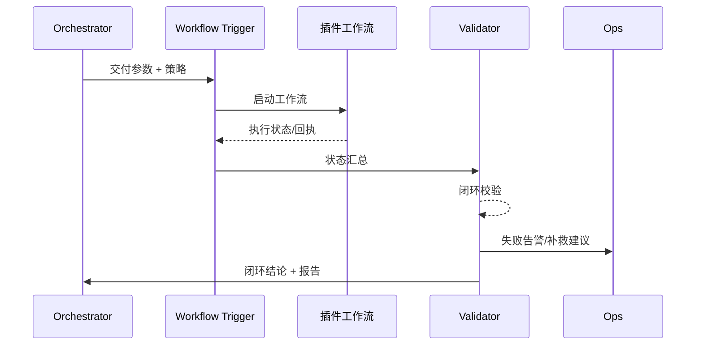

doc_id: UC-AGENT-EXEC-CLOSURE-001
scn_id: SCN-AGENT-TASK-EXEC-001
title: 插件工作流闭环验证
status: Draft
version: v0.1.0
repo_key: powerx
scope: powerx
layer: ops
domain: agent-orchestration
scenario_title: "智能体任务执行"
owners:
  - name: Agent Platform Guild
    role: Scenario Steward
    contact: agent-platform@artisan-cloud.com
  - name: Ops Reliability Center
    role: Automation Co-owner
    contact: ops-center@artisan-cloud.com
contributors: []
linked_requirements:
  - SCN-AGENT-TASK-EXEC-001-D
code_refs:
  - repo: powerx
    path: services/agent/workflow_trigger.ts
    description: 触发插件工作流、传递上下文与回调地址
  - repo: powerx
    path: services/agent/workflow_validator.ts
    description: 闭环校验、对账、通知回执处理
  - repo: powerx
    path: services/monitoring/agent_closure_metrics.ts
    description: 闭环指标采集与告警
  - repo: powerx
    path: services/audit/closure_report_builder.ts
    description: 生成任务交付报告与审计记录
feature_flags:
  - workflow-trigger-kit
  - closure-verification
  - telemetry-unified-sink
optional: false
last_reviewed_at: 2025-02-15

---

# Usecase Overview

- **业务目标**：在任务执行完毕后，通过插件工作流触发复杂业务动作，完成通知、对账、审批等闭环，并生成可追溯的交付报告。
- **成功度量**：闭环通过率 ≥98%；通知/对账失败可在 2 分钟内触发补救；监控与审计记录覆盖率 100%。
- **场景关联**：对应 Stage 4「Workflow Closure & Reporting」，是任务交付价值与合规可追溯的关键。

> 通过闭环校验与补救策略，确保每个任务都能给出明确的成果和审计痕迹，避免“执行完成但业务未感知”。

# Context & Assumptions

- **前置条件**
  - 插件工作流支持可追踪的节点状态、回执与补救接口。
  - `workflow-trigger-kit` 与 `closure-verification` Feature Flag 已开启。
  - 监控面板和审计仓库具备写入权限。
  - 通知渠道（邮件/IM/Webhook）已配置。
- **输入/输出**
  - 输入：任务执行结果、工作流触发参数、对账/通知策略、租户与用户上下文。
  - 输出：插件工作流执行状态、闭环校验结果、补救任务、用户/运营侧通知、审计报告。
- **边界**
  - 不涵盖插件内部每个工作流节点的实现细节。
  - 不负责跨系统资金结算，只提供对账校验接口。

# Solution Blueprint

## 体系分解

| 模块 | 责任 | 说明 |
|------|------|------|
| Workflow Trigger | 调用插件或外部工作流 | 支持同步/异步触发、参数映射、幂等键。
| Closure Validator | 校验回执、对账、通知结果 | 校验必达节点并判定成功/失败等级。
| Remediation Orchestrator | 触发补救流程或人工审批 | 补发通知、重建任务、升级人工。
| Reporting Builder | 汇总执行、闭环、补救日志并生成报告 | 输出给用户、Ops 和审计系统。
| Metrics & Alerting | 采集闭环指标、设置阈值 | 触发 Grafana/Slack 告警。

## 流程与时序

1. **Step 1 – 工作流触发**：主 Agent 调用 Workflow Trigger，将执行结果转为插件工作流输入，带上对账/通知策略。
2. **Step 2 – 状态回传**：插件节点执行审批、写库、通知等操作，并回传 `workflow.callback` 事件或轮询接口。
3. **Step 3 – 闭环校验**：Closure Validator 检查所有必达节点是否成功，包含通知回执、数据对账、余额一致性等。
4. **Step 4 – 补救或结案**：若校验失败，Remediation Orchestrator 触发补救；成功则生成交付报告并通知用户。
5. **Step 5 – 指标与审计**：Metrics 模块写入闭环指标，Audit 构建报告并归档。

# Contracts & Interfaces

- **Inbound**：`POST /internal/agent/workflow/trigger`；`EVENT agent.task.completed`（携带任务输出）。
- **Outbound**：`POST /plugins/{pluginId}/workflow`；`EVENT plugin.workflow.completed`；`POST /notifications/agent-delivery`；`EVENT agent.workflow.closure.failed`；`POST /audit/agent-closure-report`。
- **配置/脚本**：`config/agent/workflow_templates/*.yaml`、`config/agent/closure_rules.yaml`、`scripts/ops/closure-validation.mjs`。

# Implementation Checklist

| 项目 | 描述 | 状态 | Owner |
|------|------|------|-------|
| 工作流模板 | 常见任务（报表、通知、审批）的模板库 | [ ] | Plugin Guild |
| 闭环规则 | 必达节点、对账逻辑、通知矩阵配置 | [ ] | Agent Platform Guild |
| 补救策略 | 补发、人工确认、升级告警流程脚本 | [ ] | Ops Reliability Center |
| 报告生成 | 交付报告、审计附件、用户通知 | [ ] | Agent Platform Guild |
| 指标+告警 | `plugin.workflow.closure_rate`、补救次数 | [ ] | Ops Reliability Center |

# Testing Strategy

- **单元**：工作流触发参数映射、闭环规则引擎、补救策略选择。
- **集成**：与报表/通知插件联调，验证同步与异步回执路径；模拟对账失败触发补救。
- **端到端**：执行完整任务（报表+通知），检查闭环事件、用户通知、审计报告。
- **容灾**：模拟插件回调延迟、通知失败、对账差异，确认补救与告警生效。

# Observability & Ops

- **指标**：`plugin.workflow.closure_rate`, `agent.workflow.remediation_total`, `agent.workflow.callback_latency`, `agent.workflow.audit_delay`。
- **日志**：记录 `workflow_id`, `required_nodes`, `closure_status`, `remediation_action`, `user_notified`。
- **告警**：闭环失败连续 3 次、补救耗时 >5 分钟、审计报告写入失败；推送到 Ops 值班与业务负责人。
- **Dashboard**：Grafana「Agent Closure」、Ops 闭环看板、Audit 报告仓库。

# Rollback & Failure Handling

- 工作流触发器部署支持蓝绿；若新版本失败可回滚并暂停新模板。
- 回调超时可切换为轮询或直接触发补救。
- 报告生成失败时保留原始数据并标记任务为「等待补充」。

# Follow-ups & Risks

| 风险 | 影响 | 缓解 | ETA |
|------|------|------|-----|
| 插件回调协议不统一 | 闭环校验困难 | 制定标准回调 schema 并提供适配器 | 2025-03-12 |
| 对账逻辑与财务系统未对齐 | 误报/漏报 | 与财务接口定义对账字段并灰度验证 | 2025-03-20 |

# References & Links

- 场景文档：`docs/scenarios/agent-orchestration/SCN-AGENT-TASK-EXEC-001.md`
- 插件契约：`docs/standards/powerx-plugin/contract/agent_contract.md`
- 流程指南：`docs/website/zh/scenarios/meta/powerx/agent-and-automation/agent-orchestration/agent-task-execution/primary.md`
