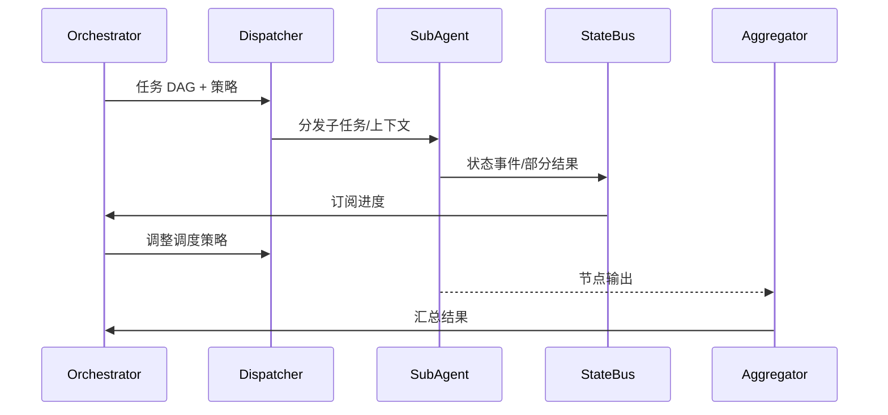

doc_id: UC-AGENT-EXEC-COORD-001
scn_id: SCN-AGENT-TASK-EXEC-001
title: 多 Agent 并行执行与状态协调
status: Draft
version: v0.1.0
repo_key: powerx
scope: powerx
layer: integration
domain: agent-orchestration
scenario_title: "智能体任务执行"
owners:
  - name: Agent Platform Guild
    role: Scenario Steward
    contact: agent-platform@artisan-cloud.com
  - name: Ops Reliability Center
    role: Automation Co-owner
    contact: ops-center@artisan-cloud.com
contributors: []
linked_requirements:
  - SCN-AGENT-TASK-EXEC-001-B
code_refs:
  - repo: powerx
    path: services/agent/orchestrator/dag_runtime.ts
    description: 任务 DAG 运行器、依赖与优先级执行
  - repo: powerx
    path: services/agent/subagents/dispatcher.ts
    description: 子 Agent 任务领取、上下文装载
  - repo: powerx
    path: services/statebus/event_streamer.ts
    description: 状态总线上报与订阅
  - repo: powerx
    path: services/agent/controller/rebalance_manager.ts
    description: 调度策略调整、重排与副本扩缩
feature_flags:
  - agent-orchestrator-v2
  - statebus-stream
  - scheduler-autoscale
optional: false
last_reviewed_at: 2025-02-15

---

# Usecase Overview

- **业务目标**：让主 Agent 将任务 DAG 拆分给多个子 Agent 并行执行，实时汇报状态与部分结果，确保高吞吐、低延迟并支持动态调度。
- **成功度量**：并行子任务成功率 ≥95%；状态同步延迟 <1 秒；阻塞任务可在 SLA 内被检测并处理；结果汇总可追踪。
- **场景关联**：承接 Stage 2「Parallel Execution & State Coordination」，为后续失败恢复、闭环校验提供实时状态与上下文。

> 关键在于 DAG 与状态总线的联动，确保调度器能依据实时信号进行重排、扩缩和限流。

# Context & Assumptions

- **前置条件**
  - 状态总线（Kafka/SQS 或等价实现）可用，且已启用 `statebus-stream` Flag。
  - 子 Agent 注册表含有租户、权限、工具清单与限流策略。
  - 插件调用配额、凭证和追踪 ID 已注入。
- **输入/输出**
  - 输入：Planner 产出的任务 DAG、租户上下文、子 Agent 池、执行策略（优先级、并行度、限流、幂等键）。
  - 输出：状态事件流、阶段结果、上下文快照、阻塞告警、最终合并的任务交付物。
- **边界**
  - 不负责失败后的重试策略（由恢复用例处理）。
  - 不直接处理人工协同。
  - 不覆盖插件内部执行逻辑。

# Solution Blueprint

## 体系分解

| 组件 | 责任 | 说明 |
|------|------|------|
| DAG Runtime | 解析 DAG、管理依赖与优先级 | 支持并行、串行、互斥节点及最大并发数。
| Sub-Agent Dispatcher | 子 Agent 任务分发、上下文注入 | 确保租户隔离、工具可用性校验、幂等任务领取。
| State Bus Streamer | 状态事件写入/订阅 | 发布 `agent.task.status.updated`，供调度与监控消费。
| Rebalance Manager | 动态调度、扩缩、副本协调 | 依据延迟、阻塞和失败率调整任务分配。
| Result Aggregator | 汇总部分结果、上下文与最终交付物 | 输出给主 Agent 及后续闭环用例。

## 流程与时序

1. **Step 1 – DAG 装载**：Orchestrator 读取任务 DAG，计算初始拓扑顺序与资源需求。
2. **Step 2 – 分发子任务**：Dispatcher 根据租户上下文与子 Agent 能力发放工作，注入 Trace/幂等键。
3. **Step 3 – 状态上报**：子 Agent 在关键节点将进度、耗时与部分结果写入状态总线。
4. **Step 4 – 调度调优**：Rebalance Manager 消费状态事件，检测阻塞/超时并执行重排或扩容。
5. **Step 5 – 结果汇总**：所有子任务完成后，由 Result Aggregator 合并数据并输出。

# Contracts & Interfaces

- **Inbound**：
  - `POST /internal/agent/dag/{dag_id}/execute` — Planner 调用，传入 DAG、策略、上下文。
  - `EVENT agent.plan.created` — 触发自动装载。
- **Outbound**：
  - `EVENT agent.task.status.updated` — 状态事件，包含 `task_id`, `node_id`, `status`, `progress`, `latency`。
  - `POST /internal/plugins/{pluginId}/invoke` — 子 Agent 调用插件，附带租户与 Trace。
  - `EVENT agent.task.blocked` — 通知 Ops/调度层处理阻塞。
- **配置/脚本**：
  - `config/agent/subagents.yaml` — 子 Agent 能力注册表。
  - `config/agent/scheduler_policies.yaml` — 并行度、限流、超时策略。
  - `scripts/qa/dag-simulator.mjs` — DAG 执行模拟器。

# Implementation Checklist

| 项目 | 描述 | 状态 | Owner |
|------|------|------|-------|
| DAG 拓扑校验 | 构建循环检测、资源推导 | [ ] | Agent Platform Guild |
| 子 Agent 认证 | 保障任务领取强制租户校验 | [ ] | Ops Reliability Center |
| 状态总线 Schema | 统一 `agent.task.status.updated` payload | [ ] | Agent Platform Guild |
| 调度策略 | 根据延迟/失败率动态调优 | [ ] | Agent Platform Guild |
| 汇总日志 | 结果聚合与上下文快照入审计 | [ ] | Ops Reliability Center |

# Testing Strategy

- **单元**：DAG 拓扑排序、优先级决策、状态机转换、幂等领取。
- **集成**：Dispatcher + 真实子 Agent + 状态总线，验证并行执行、阻塞检测、重排逻辑。
- **端到端**：沙箱任务触发多插件并行，观察 Grafana 状态曲线与结果汇总。
- **压力/Chaos**：注入部分子 Agent 宕机、状态事件延迟 >3s，检查调度降级与限流策略。

# Observability & Ops

- **指标**：`agent.statebus.lag_ms`, `agent.task.parallelism`, `agent.task.blocked_total`, `agent.task.repeat_total`, `agent.result.generation_latency`。
- **日志**：分发决策、重排动作、子 Agent 分配历史、阻塞原因。
- **告警**：状态延迟 >1s、阻塞任务 >20、重复执行率 >0.5%；通知 Ops 值班。
- **Dashboard**：Grafana「Agent Execution」、Ops 控制台任务看板、Datadog `agent.statebus.*`。

# Rollback & Failure Handling

- DAG Runtime 升级可通过蓝绿切换，异常时退回旧版本并暂停新任务。
- 状态总线不可用时降级为数据库轮询并限制最大并发。
- 子 Agent 批量失败时触发 `agent-exec-pause` Flag，阻止新任务进入。

# Follow-ups & Risks

| 风险 | 影响 | 缓解 | ETA |
|------|------|------|-----|
| 子 Agent 注册表未与插件发布联动 | 任务领取失败 | 接入插件健康信号与版本事件 | 2025-03-08 |
| 状态事件 schema 变更未通知下游 | 指标面板受影响 | 发布 schema 版本与兼容层 | 2025-03-01 |

# References & Links

- 场景文档：`docs/scenarios/agent-orchestration/SCN-AGENT-TASK-EXEC-001.md`
- 插件健康度标准：`docs/standards/powerx/backend/integration/09_agent/Agent_Metrics_and_Observability.md`
- 调度 Runbook：`scripts/qa/workflow-metrics.mjs`
