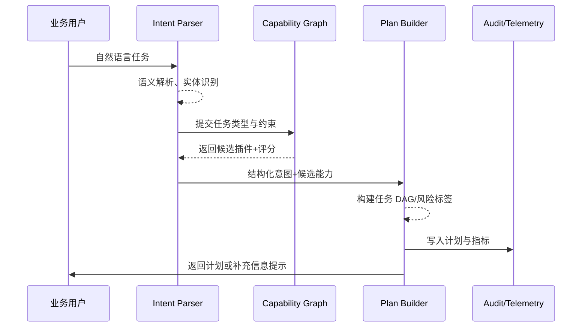

doc_id: UC-AGENT-EXEC-PLAN-001
scn_id: SCN-AGENT-TASK-EXEC-001
title: 自然语言任务解析与插件匹配
status: Draft
version: v0.1.0
repo_key: powerx
scope: powerx
layer: service
domain: agent-orchestration
scenario_title: "智能体任务执行"
owners:
  - name: Agent Platform Guild
    role: Scenario Steward
    contact: agent-platform@artisan-cloud.com
  - name: Ops Reliability Center
    role: Automation Co-owner
    contact: ops-center@artisan-cloud.com
contributors: []
linked_requirements:
  - SCN-AGENT-TASK-EXEC-001-A
code_refs:
  - repo: powerx
    path: services/agent/planner/intent_parser.ts
    description: 自然语言意图解析、实体抽取与置信度计算
  - repo: powerx
    path: services/agent/planner/capability_graph.ts
    description: 插件能力图谱检索、评分与过滤
  - repo: powerx
    path: services/agent/planner/plan_builder.ts
    description: 任务 DAG 构建、约束注入与风险标注
  - repo: powerx
    path: services/audit/agent_plan_logger.ts
    description: 计划、插件与风险上下文写入审计
feature_flags:
  - agent-orchestrator-v2
  - capability-graph-service
  - telemetry-unified-sink
optional: false
last_reviewed_at: 2025-02-15

---

# Usecase Overview

- **业务目标**：将业务用户的自然语言指令快速转化为结构化任务计划，自动匹配合适的插件/工具组合，并为后续并行执行与风控提供可追踪的上下文。
- **成功度量**：平均 2 秒内返回可执行计划；插件匹配准确率 ≥ 90%；低置信度提示准确引导补充信息；所有计划均写入审计。
- **场景关联**：对应主场景 Stage 1「Intent Parsing & Capability Planning」，是任务链路的入口，直接决定后续执行效率与安全边界。

> Planner 需要兼顾 NLU 准确率与能力覆盖率，在保持体验秒级响应的同时输出可审计、可控的任务 DAG。

# Context & Assumptions

- **前置条件**
  - `agent-orchestrator-v2` 与 `capability-graph-service` Feature Flag 已启用。
  - 能力图谱中已录入插件元数据（版本、输入输出、租户可用性、敏感等级）。
  - 对话/指令中心能够提供租户、用户、语言等上下文字段。
  - 审计与指标管道可用，以便记录 Planner 输出与风险提示。
- **输入/输出**
  - 输入：自然语言指令、上下文实体（客户、账期、渠道）、历史对话片段、租户策略、Feature Flag。
  - 输出：任务 DAG（节点、依赖、参数映射）、候选插件列表、插件评分/置信度、风险与审批建议、审计记录 ID。
- **边界**
  - 不负责插件自身的能力实现或测试。
  - 不覆盖 ReAct Prompt 设计（由 ReAct 场景负责）。
  - 不在此用例中处理执行重试或人工协同。

# Solution Blueprint

## 体系分解

| 组件 | 责任 | 说明 |
|------|------|------|
| Intent Parser | NLU、实体抽取、置信度评估 | 基于多语言模型 + 规则，对输入语句进行结构化处理。
| Constraint Extractor | 约束识别、上下文合并 | 提取 SLA、预算、敏感级别等限制，并与租户策略融合。
| Capability Graph Service | 插件能力检索与打分 | 依据任务类型、数据需求、插件健康度进行多维评分。
| Plan Builder | 构建任务 DAG 与步骤描述 | 输出节点依赖、输入输出映射、风险标注、审批策略。
| Audit & Telemetry Writer | 记录计划与风险指标 | 写入 `agent_plan` 表、发布 `agent.plan.created` 事件。

## 流程与时序

1. **Step 1 – 输入解析**：Intent Parser 对自然语言进行语义分析、实体抽取、置信度计算。
2. **Step 2 – 约束合并**：Constraint Extractor 将输入约束与租户策略合并，补充缺失字段。
3. **Step 3 – 能力检索**：Capability Graph 根据任务类型和上下文加载插件候选，结合健康信号和历史成功率打分。
4. **Step 4 – 计划生成**：Plan Builder 生成任务 DAG，确定节点顺序、调用参数、回调、审批策略与风险标签。
5. **Step 5 – 输出与审计**：Planner 返回计划给 Orchestrator，并写入审计、指标与风险提示，若置信度低则请求用户补充信息。

# Contracts & Interfaces

- **Inbound**：
  - `POST /internal/agent/intents:parse` — 对话/命令中心调用，包含 `tenant`, `user`, `utterance`, `context`。
  - `EVENT agent.intent.created` — 提示异步 Planner 处理，适用于批量请求。
- **Outbound**：
  - `POST /internal/capabilities/search` — 根据任务标签、数据域、租户可用性检索插件能力。
  - `POST /audit/agent-plan` — 写入计划、风险、插件列表。
  - `POST /notifications/agent/need-context` — 当置信度过低时请求补充信息。
- **配置/脚本**：
  - `config/agent/intent_rules.yaml` — 意图模板与后备规则。
  - `config/agent/capability_weights.yaml` — 插件评分因子。
  - `scripts/qa/intent-regression.mjs` — Parser 回归测试脚本。

# Implementation Checklist

| 项目 | 描述 | 状态 | Owner |
|------|------|------|-------|
| Parser 多语言支持 | 引入多语言模型与降级规则 | [ ] | Agent Platform Guild |
| 能力图谱评分 | 接入健康信号、租户白名单 | [ ] | Plugin Guild |
| 风险标注 | 支持敏感任务审批提示 | [ ] | Ops Reliability Center |
| 审计输出 | 计划、插件、约束写入统一审计通道 | [ ] | Agent Platform Guild |
| 低置信度补充 | 自动构造澄清问题并通知用户 | [ ] | Agent Platform Guild |

# Testing Strategy

- **单元**：意图解析、实体抽取、评分函数、DAG 依赖拓扑校验。
- **集成**：Parser + Capability Graph + Plan Builder 端到端，分别验证常规任务、敏感任务、无可用插件三类路径。
- **端到端**：在沙箱对话入口发起真实任务，检查 Planner 输出、审计日志、告警提示。
- **非功能**：并发 200 QPS 压测；注入 Graph 慢查询验证超时保护；Chaos 模拟部分插件健康信号缺失。

# Observability & Ops

- **指标**：`agent.plan.latency_p95`、`agent.plan.success_rate`、`agent.plan.low_confidence_total`、`agent.plan.audit_write_total`。
- **日志**：记录 `plan_id`, `intent`, `confidence`, `selected_plugins`, `risk_flags`; 对 PII 做脱敏。
- **告警**：计划耗时 >5s（5 分钟窗口）、匹配失败率 >5%、审计写入失败 >1%；通过 Grafana + PagerDuty 推送。
- **Dashboard**：Grafana「Agent Planner」、Datadog Trace「planner.*」、内部审计回放面板。

# Rollback & Failure Handling

- Planner 升级失败时，可回滚至上一个容器镜像并恢复旧版权重配置。
- 若能力图谱不可用，降级为规则表匹配或提示人工流程。
- 发生大面积低置信度告警时，启用 `planner-safe-mode` 仅允许白名单任务通过。

# Follow-ups & Risks

| 风险 | 影响 | 缓解 | ETA |
|------|------|------|-----|
| 插件健康信号尚未完全接入，影响评分稳定性 | 计划选择错误 | 与 Plugin Guild 对齐指标字段，发布健康信号 SDK | 2025-03-10 |
| 多语言支持覆盖不足 | 某些租户解析失败 | 扩充示例语料，按地区灰度上线 | 2025-03-05 |

# References & Links

- 场景文档：`docs/scenarios/agent-orchestration/SCN-AGENT-TASK-EXEC-001.md`
- 设计稿：`docs/meta/scenarios/powerx/agent-and-automation/agent-orchestration/agent-task-execution/primary.md`
- 相关标准：`docs/standards/powerx/backend/integration/09_agent/Agent_Adaptor_and_Transport_Spec.md`
