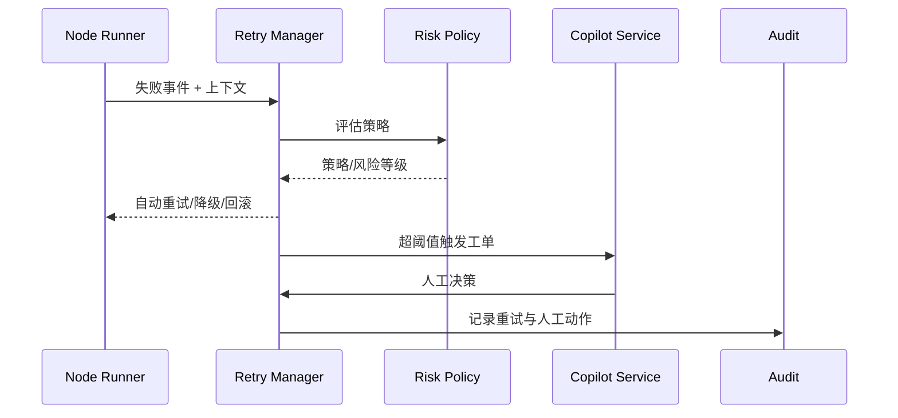

doc_id: UC-AGENT-EXEC-RECOVERY-001
scn_id: SCN-AGENT-TASK-EXEC-001
title: 失败恢复与 Copilot 协同
status: Draft
version: v0.1.0
repo_key: powerx
scope: powerx
layer: ops
domain: agent-orchestration
scenario_title: "智能体任务执行"
owners:
  - name: Agent Platform Guild
    role: Scenario Steward
    contact: agent-platform@artisan-cloud.com
  - name: Ops Reliability Center
    role: Automation Co-owner
    contact: ops-center@artisan-cloud.com
contributors: []
linked_requirements:
  - SCN-AGENT-TASK-EXEC-001-C
code_refs:
  - repo: powerx
    path: services/agent/runtime/retry_manager.ts
    description: 自动重试、退避与熔断策略
  - repo: powerx
    path: services/agent/runtime/rollback_coordinator.ts
    description: 回滚、补偿操作 orchestration
  - repo: powerx
    path: services/copilot/handoff_api.ts
    description: 工单创建、上下文打包与权限校验
  - repo: powerx
    path: services/audit/agent_failure_logger.ts
    description: 失败上下文与人工处理记录
feature_flags:
  - retry-manager-v2
  - copilot-handoff
  - audit-streaming
optional: false
last_reviewed_at: 2025-02-15

---

# Usecase Overview

- **业务目标**：当子任务失败或命中风险策略时，提供可治理的自动重试、回滚、降级与人工协同流程，缩短恢复时间并保留全链审计。
- **成功度量**：自动重试成功率 ≥80%；人工接管响应 <5 分钟；无限重试保护生效；所有动作在审计中可追踪。
- **场景关联**：支撑 Stage 3「Failure Recovery & Human Handoff」，保障任务执行的鲁棒性与客户体验。

> 通过标准化 Retry/Degrade 策略与 Copilot 流程，把复杂恢复操作沉淀为可配置、可审计的自动化链路。

# Context & Assumptions

- **前置条件**
  - `retry-manager-v2` 与 `copilot-handoff` Feature Flag 已开启。
  - 下游插件提供幂等接口与可调用的补偿操作。
  - Ops/Copilot 平台可接收自动创建的工单。
  - 审计流 `agent.failure.*` 已接入。
- **输入/输出**
  - 输入：失败的任务上下文（task_id, node_id, payload, error_code, retries）、风险等级、策略配置。
  - 输出：自动重试任务、降级/回滚动作、Copilot 工单、人工决定与审计记录。
- **边界**
  - 不涵盖人工工单处理流程细节。
  - 不负责跨租户的数据修复（由数据团队处理）。

# Solution Blueprint

## 体系分解

| 模块 | 责任 | 说明 |
|------|------|------|
| Retry Manager | 自动重试、退避、阈值管理 | 支持指数退避、优先级调度、最大次数限制。
| Degrade & Rollback Coordinator | 调用补偿脚本、切换备用流程 | 可执行兜底插件、回滚数据库、发起人工确认。
| Risk Policy Engine | 评估失败风险等级 | 根据错误码、插件敏感度、租户 SLA 输出处理策略。
| Copilot Handoff Service | 工单创建与协作 | 打包上下文、建议操作、权限校验与通知。
| Audit & Telemetry | 记录失败事件、重试、人工动作 | 写入 `agent.failure.log` 与指标。

## 流程与时序

1. **Step 1 – 失败捕获**：子 Agent 报告失败，Orchestrator 将上下文推送给 Retry Manager。
2. **Step 2 – 策略评估**：Risk Policy Engine 判断是否可自动重试或需直接人工介入。
3. **Step 3 – 自动动作**：Retry Manager 依策略执行重试/降级/回滚，并记录结果。
4. **Step 4 – Copilot 接管**：超过阈值或高风险时，Handoff Service 创建工单并通知负责角色。
5. **Step 5 – 审批与收敛**：人工选择继续执行、跳过或终止，结果写回 Orchestrator 并更新审计。

# Contracts & Interfaces

- **Inbound**：`EVENT agent.task.failed`；`POST /internal/agent/tasks/{task_id}/recover`（人工触发恢复）。
- **Outbound**：`POST /internal/plugins/{pluginId}/rollback`；`POST /ops/copilot/handoffs`；`EVENT agent.retry.executed`；`EVENT agent.task.degraded`。
- **配置/脚本**：`config/agent/retry_policies.yaml`、`config/agent/degrade_routes.yaml`、`scripts/runbooks/agent-retry-drills.mjs`。

# Implementation Checklist

| 项目 | 描述 | 状态 | Owner |
|------|------|------|-------|
| 策略矩阵 | 区分可重试/需人工/直接终止的错误码 | [ ] | Agent Platform Guild |
| 退避算法 | 实现指数退避 + 抖动 + 最大窗口 | [ ] | Agent Platform Guild |
| 回滚脚本库 | 关键插件补偿脚本入库 | [ ] | Plugin Guild |
| Copilot 模板 | 工单模板 + 脱敏字段清单 | [ ] | Ops Reliability Center |
| 审计事件 | `agent.retry.*`、`agent.degrade.*` 指标入仓 | [ ] | Ops Reliability Center |

# Testing Strategy

- **单元**：策略矩阵解析、退避计算、阈值计数。
- **集成**：模拟插件失败，验证重试/回滚/降级的调用链；模拟 Copilot 批准不同操作。
- **演练**：季度执行恢复演练脚本 `agent-retry-drills.mjs`，覆盖关键报表任务与通知任务。
- **Chaos**：强制触发连续失败，确认不会无限重试并能自动创建工单。

# Observability & Ops

- **指标**：`agent.retry.total`, `agent.retry.success_rate`, `agent.copilot.handoff_total`, `agent.failure.mtt_recovery`, `agent.degrade.trigger_total`。
- **日志**：记录 `failure_id`, `task_id`, `retry_count`, `action`, `copilot_decision`，敏感 payload 脱敏。
- **告警**：自动重试成功率 <80%、Copilot 工单积压 >10、回滚脚本失败 >1；通过 Ops 值班群通知。
- **Dashboard**：Grafana「Agent Recovery」、Ops 工单面板、Audit 回放工具。

# Rollback & Failure Handling

- Retry 服务异常时，可退回旧镜像或切换为保守策略（仅记录失败，不自动动作）。
- Copilot 服务不可用时，发出高优先级告警并自动降级为短信/邮件通知。
- 待处理工单过多时自动启用限流，暂停新任务进入恢复流程。

# Follow-ups & Risks

| 风险 | 影响 | 缓解 | ETA |
|------|------|------|-----|
| Copilot 模板未脱敏 | 数据泄露风险 | 在模板层引入字段白名单与审计 | 2025-02-28 |
| 补偿脚本分布在各团队 | 回滚不一致 | 建立统一回滚脚本仓库并自动化测试 | 2025-03-15 |

# References & Links

- 场景文档：`docs/scenarios/agent-orchestration/SCN-AGENT-TASK-EXEC-001.md`
- Runbook：`scripts/qa/workflow-metrics.mjs`, `scripts/runbooks/agent-retry-drills.mjs`
- 安全标准：`docs/standards/powerx/backend/integration/09_agent/Agent_Metrics_and_Observability.md`
