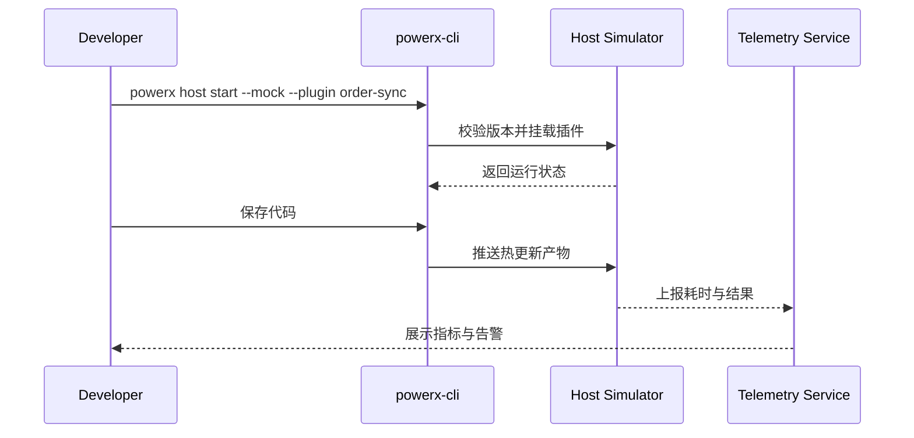

doc_id: UC-DEV-PLUGIN-HOT-RELOAD-001
scn_id: SCN-DEV-PLUGIN-DEBUG-001
title: 本地宿主模拟热更新调试
status: Draft
version: v0.1.0
repo_key: powerx-plugin
scope: powerx-plugin
layer: proto
domain: dev
scenario_title: "插件开发与调试主场景"
owners:
  - name: Michael Hu
    role: Plugin Tech Lead
    contact: tech@artisan-cloud.com
contributors: []
linked_requirements:
  - SCN-DEV-PLUGIN-HOT-RELOAD-001
code_refs:
  - repo: powerx-plugin
    path: packages/cli/src/commands/plugin/debug.ts
    description: `powerx host start --mock`、调试会话及热更新入口
  - repo: powerx-plugin
    path: packages/cli/src/executors/hotReload.ts
    description: 监听文件变更、增量编译与传输
  - repo: powerx
    path: internal/debug/host/simulator_controller.go
    description: 宿主模拟器编排、版本校验、权限隔离
  - repo: powerx
    path: internal/debug/telemetry/hot_reload_metrics.go
    description: 热更新指标采集、失败分类与告警
feature_flags:
  - PX_PLUGIN_HOST_SIMULATOR
  - debug-observability-v2
optional: false
last_reviewed_at: 2025-11-20

---

# Usecase Overview

- **业务目标**：让插件开发者在本地宿主模拟环境中实现秒级热更新、断点调试与日志收集，快速验证功能并定位异常。
- **成功度量**：热更新耗时 ≤ 2 秒、成功率 ≥ 98%；断点同步覆盖主语言；版本不匹配阻断率 100%。
- **场景关联**：支撑主场景 Stage 1 “本地模拟与热更新”，保障开发迭代效率与安全控制。

> 本用例为开发者提供稳定一致的本地调试体验，使变更可快速验证并进入后续沙箱或 CI 流程。

# Context & Assumptions

- **前置条件**
  - 启用 `PX_PLUGIN_HOST_SIMULATOR` 与 `debug-observability-v2` Feature Flag。
  - 开发者完成 CLI 登录并具备 `plugin:debug` 权限。
  - 宿主模拟器镜像与插件 manifest 声明版本兼容。
  - 本地已安装所需运行时（Node 18、Python 3.11 等）。
- **输入/输出**
  - 输入：插件源代码、调试配置、宿主模拟器版本。
  - 输出：热更新结果、调试日志、遥测指标、版本校验报告。
- **边界**
  - 不覆盖沙箱部署、数据集加载与工单闭环。
  - 不负责生产环境压测与运行监控。

# Solution Blueprint

## 体系分解

| 层 | 主要组件/模块 | 责任 | 代码入口 |
|----|---------------|------|---------|
| CLI 命令层 | `packages/cli/src/commands/plugin/debug.ts` | 启动模拟器、连接调试服务、暴露命令 | `packages/cli` |
| 热更新执行层 | `packages/cli/src/executors/hotReload.ts` | 监听源码、增量编译、推送产物 | `packages/cli` |
| 模拟器控制层 | `internal/debug/host/simulator_controller.go` | 校验版本、挂载插件、隔离权限 | `services/debug/host` |
| 遥测与日志层 | `internal/debug/telemetry/hot_reload_metrics.go` | 采集耗时、失败原因、告警推送 | `services/debug/telemetry` |

## 流程与时序

1. **Step 1 – 启动模拟器**：CLI 校验宿主版本、权限与插件 manifest，拉起模拟器并挂载插件。
2. **Step 2 – 热更新循环**：监听源码变更、执行增量编译，推送产物至模拟器并返回耗时。
3. **Step 3 – 调试交互**：调试器同步断点、变量快照与实时日志，开发者在浏览器/CLI 验证功能。
4. **Step 4 – 审计与回滚**：记录调试事件与遥测，若版本不匹配或访问生产 API 直接阻断并提示修复。

# Contracts & Interfaces

- **Inbound APIs / Events**
  - CLI 命令：`powerx host start --mock`、`powerx debug attach`.
  - `POST /internal/debug/hot-reload` — 接收编译产物、校验版本。
- **Outbound 调用**
  - `POST /internal/debug/telemetry` — 上报耗时、失败类型、断点同步情况。
  - `EVENT plugin.debug.hot_reload` — 通知监控系统热更新状态。
- **配置与脚本**
  - `config/plugins/debug/host_simulator.yaml` — 宿主镜像、端口、权限策略。
  - `scripts/workflows/hot-reload-smoke.mjs` — 自动化演练与回归脚本。

# Implementation Checklist

| 项目 | 描述 | 完成状态 | 负责人 |
|------|------|----------|--------|
| 模拟器版本管理 | 对齐宿主 API 版本、提供升级提示 | [ ] | Michael Hu |
| 热更新执行链 | 实现增量编译、缓存、失败回滚 | [ ] | Michael Hu |
| 遥测指标 | 收集耗时、失败、阻断原因并上报 | [ ] | Michael Hu |
| 审计与安全 | 禁止访问生产资源、记录调试动作 | [ ] | Grace Lin |
| 文档指引 | 更新开发者指南与 CLI 帮助文档 | [ ] | Michael Hu |

# Testing Strategy

- **单元**：热更新执行器、版本校验、错误处理、权限阻断。
- **集成**：执行 `scripts/workflows/hot-reload-smoke.mjs` 覆盖正向与版本不匹配场景。
- **端到端**：复现 meta 文档用例 A-1/A-2，验证浏览器交互与审计日志。
- **非功能**：并发多仓热更新、跨平台文件系统、网络波动重试。

# Observability & Ops

- **指标**：`debug.hot_reload.duration_ms`、`debug.hot_reload.failure_total`、`debug.host.version_mismatch_total`。
- **日志**：记录插件、租户、版本、耗时、失败原因，脱敏敏感字段。
- **告警**：热更新失败率 >5% 或版本不匹配连续发生触发告警。
- **Dashboards**：Hot Reload Dashboard、调试遥测面板、`workflow-metrics.mjs`。

# Rollback & Failure Handling

- **回滚步骤**：关闭 `PX_PLUGIN_HOST_SIMULATOR` Flag 或回退至上一稳定镜像；清理热更新缓存。
- **补救措施**：提供 `powerx host rollback` 恢复上个成功产物；输出手动升级指南。
- **数据修复**：运行 `scripts/workflows/hot-reload-reconcile.mjs` 对齐遥测与审计记录。

# Follow-ups & Risks

| 风险/事项 | 影响 | 缓解方案 | 负责人 | ETA |
|-----------|------|----------|--------|-----|
| Windows 文件监控不稳定 | 热更新成功率下降 | 引入轮询兜底与文档指引 | Michael Hu | 2025-12-06 |
| 多语言断点同步覆盖不足 | 调试效率 | 扩展调试适配器与样例工程 | Michael Hu | 2025-12-15 |

# References & Links

- 场景文档：`docs/scenarios/plugin-lifecycle/SCN-DEV-PLUGIN-HOT-RELOAD-001.md`
- 主场景：`docs/scenarios/plugin-lifecycle/SCN-DEV-PLUGIN-DEBUG-001.md`
- 背景材料：`docs/meta/scenarios/powerx/plugin-ecosystem/plugin-lifecycle/plugin-dev-and-debug/primary.md`
- 标准文档：`docs/standards/powerx-plugin/integration/08_dev_console_and_ui/Common_Tasks_and_Troubleshooting.md`
