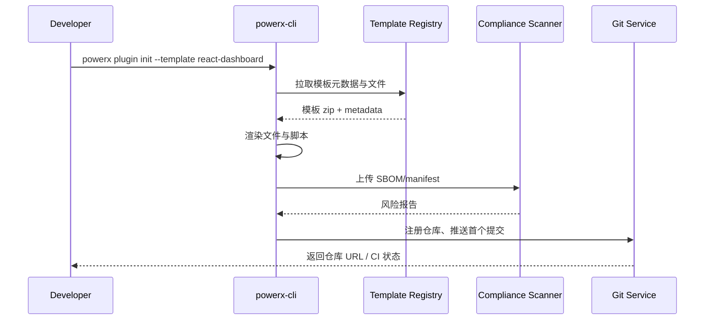

doc_id: UC-DEV-PLUGIN-CLI-INIT-001
scn_id: SCN-DEV-PLUGIN-INIT-001
title: CLI 初始化标准插件工程
status: Draft
version: v0.1.0
repo_key: powerx-plugin
scope: powerx-plugin
layer: proto
domain: dev
scenario_title: "插件创建与工程初始化主场景"
owners:
  - name: Michael Hu
    role: Plugin Tech Lead
    contact: tech@artisan-cloud.com
  - name: Grace Lin
    role: Security & Compliance Lead
    contact: compliance@artisan-cloud.com
contributors: []
linked_requirements:
  - SCN-DEV-PLUGIN-CLI-INIT-001
code_refs:
  - repo: powerx-plugin
    path: packages/cli/src/commands/plugin/init.ts
    description: `powerx plugin init` 入口、参数解析、模板拉取与文件生成
  - repo: powerx-plugin
    path: packages/template-registry/index.yaml
    description: 模板元数据、版本治理、依赖锁定策略
  - repo: powerx
    path: internal/plugins/bootstrap/service/bootstrap_handler.go
    description: 初始化校验、仓库注册、审计落库
  - repo: powerx
    path: internal/compliance/scanner/license_scanner.go
    description: 许可证/漏洞扫描、风险报告生成
feature_flags:
  - PX_PLUGIN_SCAFFOLD_V2
  - plugin-import-audit
  - gitops-bootstrap
optional: false
last_reviewed_at: 2025-11-20

---

# Usecase Overview

- **业务目标**：为插件开发者提供统一的 CLI 初始化体验，自动生成标准化工程骨架、安装核心依赖、对接合规扫描并完成 Git 注册，让新项目 1 分钟内进入可开发状态。
- **成功度量**：初始化耗时 ≤ 60 秒；依赖安装成功率 ≥ 98%；扫描阻断率 < 2%；首个提交自动推送成功率 ≥ 95%。
- **场景关联**：覆盖主场景 `SCN-DEV-PLUGIN-INIT-001` Stage 1-3，支撑 CLI 初始化路径并为团队协作与第三方导入提供基础模版与安全防线。

> 通过将模板、扫描与仓库注册串联成自动化流程，显著缩短插件立项周期并降低合规风险。

# Context & Assumptions

- **前置条件**
  - 已安装 `powerx-cli` ≥ v3.2，启用 `PX_PLUGIN_SCAFFOLD_V2` 与 `plugin-import-audit` Feature Flag。
  - 模板仓 `packages/template-registry` 可访问，并同步最新模板/依赖清单。
  - 合规扫描服务、Git 注册 API 可用，开发者拥有 `plugin: "bootstrap` 权限。"
  - Node 18、Python 3.11 等基础运行时已按模板要求预装。
- **输入/输出**
  - 输入：模板 ID、插件名称、目标路径、租户/组织、语言与能力选项、可选第三方依赖白名单。
  - 输出：标准化目录结构、manifest/权限声明、依赖安装结果、扫描报告、初始 Git 仓库与分支。
- **边界**
  - 不处理后续功能开发、测试与部署；不负责第三方源码导入（另见 `UC-DEV-PLUGIN-THIRD-PARTY-IMPORT-001`）。
  - 不覆盖团队成员环境检查（由 `UC-DEV-PLUGIN-TEAM-CLONE-001` 负责）。
  - 若用户拒绝 Git 注册，仅提供本地初始化但不保证协作基线。

# Solution Blueprint

## 体系分解

| 层 | 主要组件/模块 | 责任 | 代码入口 |
|----|---------------|------|---------|
| CLI 命令层 | `packages/cli/src/commands/plugin/init.ts` | 解析参数、校验 CLI 版本、串联执行器与报告渲染 | `packages/cli` |
| 模板管理层 | `packages/template-registry/index.yaml` | 模板元数据、依赖锁定、post-hook 定义 | `packages/template-registry` |
| 执行器层 | `packages/cli/src/executors/scaffold.ts` | 下载/渲染模板、写入配置、hook 执行 | `packages/cli` |
| 合规扫描层 | `internal/compliance/scanner/license_scanner.go` | 生成 SBOM、执行许可证/漏洞扫描、产出报告 | `services/compliance` |
| 仓库注册层 | `internal/plugins/bootstrap/service/bootstrap_handler.go` | 创建远程仓、推送首个提交、生成 CI 配置 | `services/bootstrap` |

## 流程与时序

1. **Step 1 – CLI 预检**：校验 CLI 版本、模板可用性、目标目录是否为空，若检查失败输出修复建议。
2. **Step 2 – 模板渲染**：拉取模板、渲染变量、生成 manifest/权限声明、脚本与示例代码。
3. **Step 3 – 依赖安装与扫描**：执行 `npm install`/`pip install` 等命令，生成 SBOM 并提交合规扫描，返回风险报告。
4. **Step 4 – Git 注册**：初始化 Git、创建初始提交，调用 `bootstrap_handler` 注册远程仓与 CI，返回仓库信息与后续指引。

# Contracts & Interfaces

- **Inbound APIs / Events**
  - CLI 命令：`powerx plugin init [template] [name] --lang <lang> --features ...`
  - `POST /internal/plugins/bootstrap/validate` — 校验模板与租户配额、名称冲突、目录访问。
- **Outbound 调用**
  - `POST /internal/compliance/licensescan` — 提交 SBOM，字段含 `artifact_url`, `template_id`, `language`.
  - `POST /internal/git/register` — 创建远程仓与初始分支，返回 `repo_url`, `access_token`, `ci_config`.
  - `POST /internal/plugins/bootstrap/telemetry` — 写入初始化遥测与审计。
- **配置与脚本**
  - `config/plugins/templates/index.yaml` — 模板映射、依赖、语言要求。
  - `scripts/workflows/scaffold-smoke.mjs` — 自动验证初始化流程与依赖安装。

# Implementation Checklist

| 项目 | 描述 | 完成状态 | 负责人 |
|------|------|----------|--------|
| 模板索引治理 | 建立模板版本与依赖锁定策略，支持回滚与灰度发布 | [ ] | Michael Hu |
| CLI 执行链重构 | 将初始化执行器模块化，支持失败回滚与幂等重试 | [ ] | Michael Hu |
| 合规扫描集成 | 完成 SBOM 生成、扫描 API 集成与错误兜底 | [ ] | Grace Lin |
| Git 注册插件化 | 支持多 Git 平台、PAT 轮换与权限最小化 | [ ] | Grace Lin |
| 遥测与审计 | 统一记录初始化耗时、模板 ID、失败分类 | [ ] | Michael Hu |

# Testing Strategy

- **单元测试**：模板变量渲染、参数校验、错误提示；扫描 API 调用的错误处理。
- **集成测试**：沙箱环境执行 `scripts/workflows/scaffold-smoke.mjs`，验证模板下载、依赖安装、Git 注册与扫描流程。
- **端到端验证**：照 meta 文档用例 A-1/A-2 操作，确认离线模板与版本过旧的兜底路径。
- **非功能测试**：压力测试 20 并发初始化，确保 CLI 内部缓存/锁无死锁；模拟网络波动验证重试。

# Observability & Ops

- **指标**：`cli.init.duration_ms`, `cli.init.failure_total`, `cli.init.template_usage{template}`, `cli.init.scan_blocked_total`.
- **日志**：记录 CLI 执行阶段、耗时、使用模板、失败堆栈、扫描结果摘要；敏感字段脱敏。
- **告警**：初始化失败率 >5% 时发送至 `plugin-dev-oncall`；扫描阻断连续三次触发合规值班通知。
- **Dashboards**：`reports/_state/workflow_metrics.json`、CLI Telemetry Dashboard、合规扫描面板。

# Rollback & Failure Handling

- **回滚步骤**：关闭 `PX_PLUGIN_SCAFFOLD_V2`，回退至上一稳定模板索引；撤销 Git 注册变更并清理审计。
- **补救措施**：提供 `powerx plugin init --resume` 命令从失败阶段继续；提供离线模板包下载链接。
- **数据修复**：运行 `scripts/workflows/scaffold-reconcile.mjs` 对比失败记录与 Git 注册状态，补齐缺失仓库或清理脏目录。

# Follow-ups & Risks

| 风险/事项 | 影响 | 缓解方案 | 负责人 | ETA |
|-----------|------|----------|--------|-----|
| 模板依赖对国内镜像不友好导致安装失败 | 初始化成功率下降 | 建立镜像代理、增加离线缓存策略 | Michael Hu | 2025-12-05 |
| 扫描阻断豁免流程未自动回写 CLI | 开发者需要手动重试 | 将审批结果通过 Webhook 回写 CLI 重试队列 | Grace Lin | 2025-12-15 |

# References & Links

- 场景文档：`docs/scenarios/plugin-lifecycle/SCN-DEV-PLUGIN-CLI-INIT-001.md`
- 主场景：`docs/scenarios/plugin-lifecycle/SCN-DEV-PLUGIN-INIT-001.md`
- 背景材料：`docs/meta/scenarios/powerx/plugin-ecosystem/plugin-lifecycle/plugin-create-and-init/primary.md`
- 标准文档：`docs/standards/powerx-plugin/lifecycle/manifest-mapping.md`
