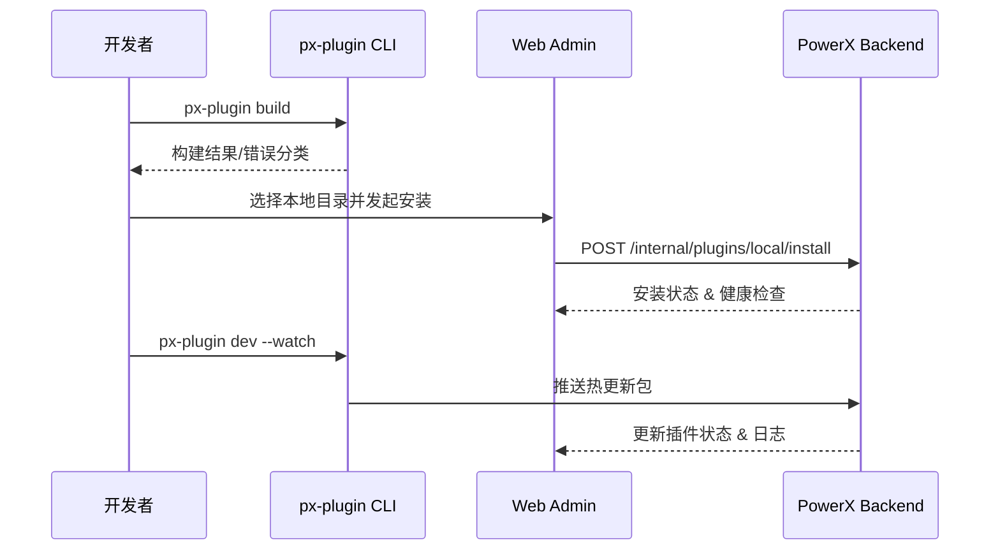

doc_id: UC-DEV-PLUGIN-LOCAL-DEBUG-001
scn_id: SCN-DEV-PLUGIN-PUBLISH-001
title: 本地调试与快速迭代保障
status: Draft
version: v0.1.0
repo_key: powerx-plugin
scope: powerx-plugin
layer: dev
domain: dev
scenario_title: "插件发布与上架主场景"
owners:
  - name: Michael Hu
    role: Plugin Tech Lead
    contact: tech@artisan-cloud.com
  - name: Lily Zhang
    role: Developer Experience Engineer
    contact: devexp@artisan-cloud.com
contributors: []
linked_requirements:
  - SCN-DEV-PLUGIN-LOCAL-DEBUG-001
code_refs:
  - repo: powerx-plugin
    path: packages/cli/src/commands/plugin/build.ts
    description: `px-plugin build` 构建命令、产物管理、错误分类
  - repo: powerx-plugin
    path: packages/cli/src/commands/plugin/dev.ts
    description: 本地调试/热更新命令、watcher 与日志输出
  - repo: powerx
    path: internal/plugin/local/install_handler.go
    description: 本地目录安装接口、签名与权限校验
  - repo: powerx-admin
    path: apps/admin/src/modules/plugin/local-install.tsx
    description: Web Admin 调试面板、健康检查、权限提示
feature_flags:
  - px-plugin-local-dev
  - plugin-local-install
optional: false
last_reviewed_at: 2025-11-20

---

# Usecase Overview

- **业务目标**：让插件开发者在提交发布请求前，以分钟级迭代完成本地构建、安装、调试与热更新，及时发现权限、依赖与接口问题。
- **成功度量**：单轮构建+安装+验证 ≤ 15 分钟；本地安装成功率 ≥ 97%；调试日志保留率 100% 并可按插件/版本过滤。
- **场景关联**：补充主场景前置环节，确保进入测试租户验证前的版本稳定可信。

> 本用例通过 CLI 与 Web Admin 协同，提供本地闭环调试体验，降低后续流程的返工与审批阻断。

# Context & Assumptions

- **前置条件**
  - 开发者具备有效的 PowerX CLI 凭证并配置本地 PowerX 环境或内网代理。
  - Feature Flag `px-plugin-local-dev`、`plugin-local-install` 已开启。
  - 插件项目遵循 PowerXPlugin 目录结构并配置最小权限模板。
  - 调试日志服务可用，具备日志脱敏与检索能力。
- **输入/输出**
  - 输入：插件源码、构建配置、调试环境配置、权限清单。
  - 输出：构建产物（`dist/`）、安装状态、调试日志、健康检查结果、权限建议。
- **边界**
  - 不负责远程测试租户部署与审批；不覆盖插件业务测试脚本；不处理商业定价信息。

# Solution Blueprint

## 体系分解

| 层 | 主要组件/模块 | 责任 | 代码入口 |
|----|---------------|------|---------|
| CLI 构建层 | `packages/cli/src/commands/plugin/build.ts` | 构建产物、依赖校验、错误分类、缓存清理 | `packages/cli` |
| CLI 调试层 | `packages/cli/src/commands/plugin/dev.ts` | 热更新、日志流、自动重启、迭代统计 | `packages/cli` |
| 后端安装层 | `internal/plugin/local/install_handler.go` | 签名校验、权限模板比对、安装/激活、审计 | `internal/plugin/local` |
| 管理界面 | `apps/admin/src/modules/plugin/local-install.tsx` | 本地安装向导、健康检查、调试面板 | `apps/admin` |
| 日志/遥测层 | `internal/plugin/telemetry/local_dev.go` | 调试日志聚合、指标上报、失败告警 | `services/plugin/telemetry` |

## 流程与时序

1. **Step 1 – 构建准备**：CLI 校验依赖与环境变量，执行 `px-plugin build` 生成产物并输出摘要。
2. **Step 2 – 本地安装**：Web Admin 调用后台 `POST /internal/plugins/local/install`，后端校验签名、权限并激活插件。
3. **Step 3 – 调试与热更新**：`px-plugin dev --watch` 监听源码变化，自动推送热更新并刷新调试面板。
4. **Step 4 – 归档与同步**：导出调试日志，记录版本标签与权限差异，准备提交测试租户。

# Contracts & Interfaces

- **Inbound APIs / Events**
  - `px-plugin build`、`px-plugin dev --watch`。
  - `POST /internal/plugins/local/install`、`POST /internal/plugins/local/reload`。
- **Outbound 调用**
  - `POST /internal/audit/log` — 写入调试安装审计。
  - `POST /internal/telemetry/local-dev` — 上报迭代指标。
- **配置与脚本**
  - `config/plugin/local_dev.yaml` — 构建参数、热更新开关。
  - `config/plugin/permissions_minimal.json` — 最小权限模板。
  - `scripts/workflows/plugin-local-dev-smoke.mjs` — 本地调试冒烟脚本。

# Implementation Checklist

| 项目 | 描述 | 完成状态 | 负责人 |
|------|------|----------|--------|
| 构建缓存优化 | 减少重复构建时间，支持增量编译 | [ ] | Michael Hu |
| 热更新稳定性 | watch 机制与错误回退、日志提炼 | [ ] | Lily Zhang |
| 权限模板提示 | 自动提示缺失权限并生成脚手架 | [ ] | Grace Lin |
| 调试日志脱敏 | 对敏感字段脱敏并落盘追踪 | [ ] | Matrix Ops |
| 指标上报 | 上报迭代时间、失败次数、热更新成功率 | [ ] | Lily Zhang |

# Testing Strategy

- **单元**：构建命令参数解析、错误分类、热更新队列、权限模板对比。
- **集成**：运行 `scripts/workflows/plugin-local-dev-smoke.mjs` 验证构建/安装/热更新链路；模拟依赖缺失、权限不足、签名失败。
- **端到端**：复现 meta 用例 E（正向/逆向），确保日志、审计、权限提示正常。
- **非功能**：并行调试多个插件、长时间 watch 稳定性、跨平台（macOS/Linux/Windows）兼容性。

# Observability & Ops

- **指标**：`plugin.local.iteration_cycle_time`、`plugin.local.install_success_rate`、`plugin.local.hot_reload_success_rate`。
- **日志**：构建输出、安装结果、权限建议、热更新推送；脱敏后存入 `plugin_local_debug` index。
- **告警**：连续三次安装失败触发 P1；热更新失败率 >5% 触发 PagerDuty；日志写入失败 10 分钟内告警。
- **Dashboards**：Local Dev Loop Dashboard、CLI Telemetry、`workflow-metrics.mjs` 报表。

# Rollback & Failure Handling

- **回滚策略**：自动保留上一版本产物；安装失败时恢复旧版本并提示回退脚本。
- **补救措施**：提供 `px-plugin dev --reset` 清理缓存；支持一键导出日志和权限建议供研发审查。
- **数据修复**：`scripts/workflows/plugin-local-dev-reconcile.mjs` 对齐调试历史与审计记录。

# Follow-ups & Risks

| 风险/事项 | 影响 | 缓解方案 | 负责人 | ETA |
|-----------|------|----------|--------|-----|
| CLI 缺乏离线依赖镜像策略 | 无网环境调试失败 | 提供离线依赖缓存与镜像脚本 | Michael Hu | 2025-12-26 |
| 调试日志体量大影响磁盘 | 本地资源占用高 | 引入压缩与自动清理策略 | Matrix Ops | 2026-01-02 |
| 权限提示与真实生产策略存在差异 | 上线后仍可能缺权限 | 统一权限模板生成逻辑，与审批子场景共享 | Grace Lin | 2025-12-21 |

# References & Links

- 场景文档：`docs/scenarios/plugin-lifecycle/SCN-DEV-PLUGIN-LOCAL-DEBUG-001.md`
- 主场景：`docs/scenarios/plugin-lifecycle/SCN-DEV-PLUGIN-PUBLISH-001.md`
- Meta 设计：`docs/meta/scenarios/powerx/plugin-ecosystem/plugin-lifecycle/plugin-publish-and-release/primary.md`
- 检查脚本：`scripts/workflows/plugin-local-dev-smoke.mjs`
