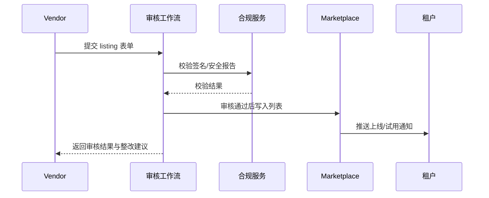

doc_id: UC-DEV-PLUGIN-MARKETPLACE-LISTING-001
scn_id: SCN-DEV-PLUGIN-PUBLISH-001
title: Marketplace 审核与上架
status: Draft
version: v0.1.0
repo_key: powerx-marketplace
scope: powerx-marketplace
layer: marketplace
domain: dev
scenario_title: "插件发布与上架主场景"
owners:
  - name: Ivy Chen
    role: Marketplace Operations Lead
    contact: marketplace@artisan-cloud.com
  - name: Grace Lin
    role: Security & Compliance Lead
    contact: compliance@artisan-cloud.com
contributors: []
linked_requirements:
  - SCN-DEV-PLUGIN-MARKETPLACE-LISTING-001
code_refs:
  - repo: powerx-marketplace
    path: internal/listing/workflow/review_flow.go
    description: 上架审核工作流、SLA 计时、状态流转
  - repo: powerx-marketplace
    path: internal/listing/metadata/syncer.go
    description: 元数据同步、版本对齐、可见范围配置
  - repo: powerx-marketplace
    path: internal/listing/notification/broadcast.go
    description: 审核结果通知、订阅租户推送、试用引导
  - repo: powerx
    path: internal/publish/compliance/report_verifier.go
    description: 签名与安全报告校验、合规审计记录
feature_flags:
  - marketplace-review-v2
  - marketplace-metadata-sync
  - plugin-marketplace-telemetry
optional: false
last_reviewed_at: 2025-11-20

---

# Usecase Overview

- **业务目标**：确保插件在 Marketplace 的审核、上架与通知流程可追踪、可量化，3 个工作日内完成审核并同步至 Marketplace 列表。
- **成功度量**：审核 SLA ≤ 72 小时；资料缺失反馈 ≤ 24 小时；签名/安全报告校验成功率 ≥ 99%；订阅通知送达率 ≥ 98%。
- **场景关联**：支撑主场景 Stage 4，与发布记录联动，实现上线后触达租户与持续运营。

> 通过结构化的审核与元数据同步机制，保证 Marketplace 展示信息与发布版本一致，兼顾合规与运营效率。

# Context & Assumptions

- **前置条件**
  - `marketplace-review-v2`、`marketplace-metadata-sync` Feature Flag 已启用。
  - 发布流程已生成版本信息、签名指纹与安全报告链接。
  - Marketplace 审核员、Vendor Success 团队在系统中登记，具备审批权限。
  - 通知服务与运营报表平台可用。
- **输入/输出**
  - 输入：上架申请表单、签名证书、合规/安全报告、定价与试用策略。
  - 输出：审核结果、Marketplace 列表数据、订阅通知、初始运营报表、审计记录。
- **边界**
  - 不覆盖 Marketplace 计费结算、合同签署或外部推广。
  - 不负责插件运行期配置或升级策略。

# Solution Blueprint

## 体系分解

| 层 | 主要组件/模块 | 责任 | 代码入口 |
|----|---------------|------|---------|
| 审核工作流层 | `internal/listing/workflow/review_flow.go` | 受理申请、检查资料、推进审核、记录 SLA | `services/listing/workflow` |
| 合规校验层 | `internal/publish/compliance/report_verifier.go` | 校验签名、验证安全报告、同步审计 | `services/publish/compliance` |
| 元数据同步层 | `internal/listing/metadata/syncer.go` | 写入 Marketplace 列表、配置可见范围、绑定版本 | `services/listing/metadata` |
| 通知与运营层 | `internal/listing/notification/broadcast.go` | 通知 Vendor/租户、生成初始报表、跟踪转化 | `services/listing/notification` |
| Vendor 支持层 | `internal/listing/support/templates.go` | 维护模板、提示资料缺口、收集补充材料 | `services/listing/support` |

## 流程与时序

1. **Step 1 – 受理申请**：Vendor 提交资料与签名，系统创建审核任务并启动 SLA 计时。
2. **Step 2 – 校验与补充**：自动校验签名、合规报告；缺失项生成待补清单并通知 Vendor。
3. **Step 3 – 审批与上架**：审核员完成检查后批准/驳回；通过时写入 Marketplace 列表并配置可见性。
4. **Step 4 – 通知与运营**：推送上线通知、开启试用引导、输出初始运营报表并归档审计。

# Contracts & Interfaces

- **Inbound APIs / Events**
  - `POST /marketplace/listing/apply` — Vendor 提交上架申请。
  - `POST /marketplace/listing/review` — 审核员审批或驳回。
- **Outbound 调用**
  - `POST /marketplace/listing/publish` — 同步列表与可见范围。
  - `POST /internal/publish/compliance/verify` — 校验签名与安全报告。
  - `POST /internal/notify/publish` — 租户与 Vendor 通知。
- **配置与脚本**
  - `config/marketplace/listing_form.yaml` — 资料字段定义与校验规则。
  - `config/marketplace/review_checklist.yaml` — 审核检查项、合规标准。
  - `scripts/workflows/marketplace-review-smoke.mjs` — 审核流程冒烟脚本。

# Implementation Checklist

| 项目 | 描述 | 完成状态 | 负责人 |
|------|------|----------|--------|
| 审核工作流 | 多阶段状态机、SLA 计时、驳回原因模板 | [ ] | Ivy Chen |
| 合规校验 | 签名/安全报告自动验证、审计留痕 | [ ] | Grace Lin |
| 元数据同步 | 列表字段映射、版本关联、可见范围控制 | [ ] | Ivy Chen |
| 通知与报表 | 推送上线通知、生成初始下载/订阅报表 | [ ] | Leo Wang |
| Vendor 支持 | 资料模板、本地化支持、缺口提示系统 | [ ] | Leo Wang |

# Testing Strategy

- **单元**：审核状态机、SLA 计时器、资料校验、通知模板渲染。
- **集成**：执行 `scripts/workflows/marketplace-review-smoke.mjs` 验证通过与驳回路径。
- **端到端**：复现 meta 文档用例 D-1/D-2，检查审核 SLA、驳回记录与资料补齐流程。
- **非功能**：高并发审核、资料附件大文件处理、跨语言模板渲染。

# Observability & Ops

- **指标**：`marketplace.listing.sla_hours`、`marketplace.listing.approval_rate`、`marketplace.listing.rejection_total`、`marketplace.listing.notification_success_rate`。
- **日志**：记录申请 ID、审核员、结论、签名指纹、通知渠道；敏感数据脱敏存储。
- **告警**：审核 SLA >72 小时、签名校验失败率 >1%、驳回率异常飙升、通知失败率 >5%。
- **Dashboards**：Marketplace Review Dashboard、Vendor Response Tracker、`workflow-metrics.mjs`。

# Rollback & Failure Handling

- **回滚步骤**：驳回时恢复旧版本展示、撤销上线通知、同步审计；必要时下架新版本。
- **补救措施**：发送整改清单、启用人工审核加速通道、安排合规复核。
- **数据修复**：运行 `scripts/workflows/marketplace-review-reconcile.mjs` 对齐审核记录与 Marketplace 列表。

# Follow-ups & Risks

| 风险/事项 | 影响 | 缓解方案 | 负责人 | ETA |
|-----------|------|----------|--------|-----|
| 多语言资料模板缺失导致国际 Vendor 提交流程阻塞 | 审核效率 | 提供英文/日文模板与指导 | Leo Wang | 2025-12-06 |
| 安全报告格式不统一影响自动校验 | 合规准确性 | 定义标准格式并在提交端提示 | Grace Lin | 2025-12-15 |
| 审核决策数据未与发布记录对齐 | 追溯性 | 建立版本关联校验并定期对账 | Ivy Chen | 2025-12-20 |

# References & Links

- 场景文档：`docs/scenarios/plugin-lifecycle/SCN-DEV-PLUGIN-MARKETPLACE-LISTING-001.md`
- 主场景：`docs/scenarios/plugin-lifecycle/SCN-DEV-PLUGIN-PUBLISH-001.md`
- Meta 设计：`docs/meta/scenarios/powerx/plugin-ecosystem/plugin-lifecycle/plugin-publish-and-release/primary.md`
- 配置文件：`config/marketplace/listing_form.yaml`、`config/marketplace/review_checklist.yaml`
