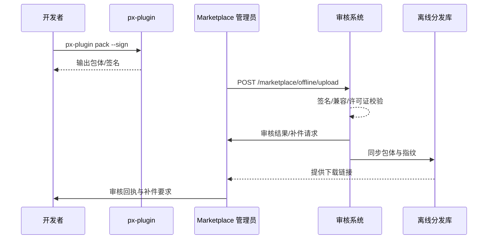

doc_id: UC-DEV-PLUGIN-OFFLINE-MARKETPLACE-001
scn_id: SCN-DEV-PLUGIN-PUBLISH-001
title: 离线包送审与 Marketplace 入库
status: Draft
version: v0.1.0
repo_key: powerx-marketplace
scope: powerx-marketplace
layer: marketplace
domain: dev
scenario_title: "插件发布与上架主场景"
owners:
  - name: Ivy Chen
    role: Marketplace Operations Lead
    contact: marketplace@artisan-cloud.com
  - name: Grace Lin
    role: Security & Compliance Lead
    contact: compliance@artisan-cloud.com
contributors: []
linked_requirements:
  - SCN-DEV-PLUGIN-OFFLINE-MARKETPLACE-001
code_refs:
  - repo: powerx-plugin
    path: packages/cli/src/commands/plugin/pack.ts
    description: `px-plugin pack` 命令、签名与依赖打包
  - repo: powerx-marketplace
    path: apps/market/src/modules/offline-upload/index.tsx
    description: 离线上传界面、元数据校验、补件入口
  - repo: powerx-marketplace
    path: internal/review/offline_pipeline.go
    description: 离线审核流程、签名校验、补件任务
  - repo: powerx
    path: internal/security/signature/validator.go
    description: 签名、许可证解析与告警
feature_flags:
  - marketplace-offline-upload
  - plugin-offline-package
optional: false
last_reviewed_at: 2025-11-20

---

# Usecase Overview

- **业务目标**：支持无公网或弱网环境下的供应商通过离线包提交 Marketplace 审核，保证包体合规、签名有效并在 2 个工作日内入库。
- **成功度量**：签名校验通过率 ≥ 99%；审核 SLA ≤ 48 小时；补件率 < 5%；离线分发库同步延迟 < 30 分钟。
- **场景关联**：补充主场景 Stage 2/4，在离线链路实现 Marketplace 触达与版本入库。

> 通过标准化离线上传、审核与入库流程，确保隔离环境的插件版本能与线上生态保持一致的安全与合规基线。

# Context & Assumptions

- **前置条件**
  - Feature Flag `plugin-offline-package`、`marketplace-offline-upload` 已开启。
  - 签名服务与许可证服务可供审查系统访问；离线分发库配置完成。
  - 开发者提供最新版本说明、依赖清单、合规文档。
  - 审核团队具备离线审核权限与补件沟通渠道。
- **输入/输出**
  - 输入：`.pxp` 离线包、签名文件、依赖/兼容清单、许可证声明、版本元数据。
  - 输出：审核结果、补件通知、入库记录、离线分发库下载链接与指纹。
- **边界**
  - 不处理在线发布；不覆盖租户导入流程；不处理商业定价策略。

# Solution Blueprint

## 体系分解

| 层 | 主要组件/模块 | 责任 | 代码入口 |
|----|---------------|------|---------|
| 打包层 | `packages/cli/src/commands/plugin/pack.ts` | 生成 `.pxp` 包、签名、依赖清单、校验文件 | `packages/cli` |
| 上传层 | `apps/market/src/modules/offline-upload/index.tsx` | 上传包体、元数据校验、补件指引 | `apps/market` |
| 审核层 | `internal/review/offline_pipeline.go` | 签名验证、兼容矩阵、许可证校验、工单分配 | `services/review` |
| 安全层 | `internal/security/signature/validator.go` | 签名解析、证书轮换、异常告警 | `services/security` |
| 分发层 | `internal/marketplace/repo/offline_sync.go` | 入库离线分发库、生成指纹与下载链接 | `services/marketplace/repo` |

## 流程与时序

1. **Step 1 – 离线打包**：开发者运行 `px-plugin pack`，生成 `.pxp` 包、签名和依赖清单。
2. **Step 2 – 离线上传**：Marketplace 管理员上传包体、填写元数据、绑定版本信息。
3. **Step 3 – 审核校验**：审核系统验证签名、兼容矩阵、许可证状态，如有缺口触发补件。
4. **Step 4 – 入库同步**：审核通过后写入 Marketplace 版本库并同步离线分发库，返回下载指纹。

# Contracts & Interfaces

- **Inbound APIs / Events**
  - `px-plugin pack`、`POST /marketplace/offline/upload`。
  - `POST /marketplace/review/offline/decision`。
- **Outbound 调用**
  - `POST /internal/security/signature/verify` — 签名与证书验证。
  - `POST /internal/license/validate` — 许可证解析。
  - `POST /internal/marketplace/repo/sync` — 入库离线分发库。
- **配置与脚本**
  - `config/publish/offline_package.json` — 文件结构、校验规则。
  - `config/marketplace/offline_upload.yaml` — 元数据字段与补件策略。
  - `scripts/workflows/marketplace-offline-review.mjs` — 审核冒烟脚本。

# Implementation Checklist

| 项目 | 描述 | 完成状态 | 负责人 |
|------|------|----------|--------|
| 包体结构标准化 | 统一 `.pxp` 目录结构、校验文件 | [ ] | Michael Hu |
| 审核流水线 | 并行校验、补件工单、SLA 打点 | [ ] | Ivy Chen |
| 许可证校验 | 集成多区域许可证策略、合规映射 | [ ] | Grace Lin |
| 分发库同步 | 增量同步、指纹记录、下载监控 | [ ] | Matrix Ops |
| 通知模板 | 多语言补件与通过模板、Webhook 通知 | [ ] | Ivy Chen |

# Testing Strategy

- **单元**：打包命令参数解析、签名验证、许可证解析、元数据校验。
- **集成**：运行 `scripts/workflows/marketplace-offline-review.mjs`，覆盖正向流程与补件场景。
- **端到端**：演练 meta 用例 F（正向/逆向），确保补件流程、入库记录、指标采集正确。
- **非功能**：大包体 (>500MB) 上传、断点续传、不同证书组合、并发审核。

# Observability & Ops

- **指标**：`marketplace.offline.upload_success_rate`、`marketplace.offline.review_sla_hours`、`marketplace.offline.rework_rate`。
- **日志**：审核详情、补件原因、签名/许可证校验日志；统一落在 `marketplace_offline_review` index。
- **告警**：签名失败率 >1%、审核超 SLA、补件率 >5%、分发库同步失败。
- **Dashboards**：Offline Review Dashboard、License Validation Monitor、`workflow-metrics.mjs` 离线通道报表。

# Rollback & Failure Handling

- **回滚策略**：审核失败保留旧版本可见；分发库同步失败自动重试并回滚至旧指纹。
- **补救措施**：自动生成补件任务、发送邮件/Webhook；提供 CLI 命令 `px-plugin pack --fix` 帮助重打包。
- **数据修复**：使用 `scripts/workflows/marketplace-offline-reconcile.mjs` 对账入库记录与离线指纹。

# Follow-ups & Risks

| 风险/事项 | 影响 | 缓解方案 | 负责人 | ETA |
|-----------|------|----------|--------|-----|
| 部分证书即将过期导致大面积校验失败 | 审核阻断 | 建立证书轮换提醒与自动续期脚本 | Grace Lin | 2025-12-23 |
| 离线分发库磁盘容量紧张 | 下载服务稳定性 | 引入生命周期管理与分层存储 | Matrix Ops | 2026-01-08 |
| 补件沟通缺乏标准渠道 | 工作量增加 | 整合到运营工作流与模板化回复 | Ivy Chen | 2025-12-20 |

# References & Links

- 场景文档：`docs/scenarios/plugin-lifecycle/SCN-DEV-PLUGIN-OFFLINE-MARKETPLACE-001.md`
- 主场景：`docs/scenarios/plugin-lifecycle/SCN-DEV-PLUGIN-PUBLISH-001.md`
- Meta 设计：`docs/meta/scenarios/powerx/plugin-ecosystem/plugin-lifecycle/plugin-publish-and-release/primary.md`
- 脚本：`scripts/workflows/marketplace-offline-review.mjs`
