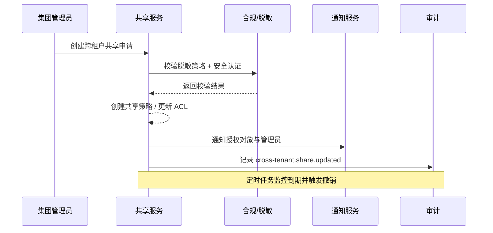

doc_id: UC-IAM-MULTI-TENANT-CROSS-SHARE-001
scn_id: SCN-IAM-MULTI-TENANT-001
title: 跨租户数据共享与合规校验
status: Draft
version: v0.1.0
repo_key: powerx
scope: powerx
layer: service
domain: iam
scenario_title: "PowerX 多租户与组织管理"
owners:
  - name: Michael Hu
    role: Product Manager
    contact: matrix-x@artisan-cloud.com
  - name: Matrix Ops
    role: Platform Ops Lead
    contact: ops@artisan-cloud.com
contributors: []
linked_requirements:
  - SCN-IAM-MULTI-TENANT-CROSS-SHARE-001
code_refs:
  - repo: powerx
    path: services/cross-tenant-sharing/
feature_flags:
  - cross-tenant-sharing
  - iam-compliance-check
last_reviewed_at: 2025-10-29

---

# Usecase Overview

- **业务目标**：为集团管理员提供安全可审计的跨租户数据共享机制，允许临时或长期授予访问权限，同时兼顾合规策略和脱敏要求。
- **触发角色**：集团管理员（发起共享）、合规服务（规则校验）、通知服务（告知授权对象）。
- **成功度量**：共享请求成功率 ≥ 95%，合规阻断通知延时 < 1 分钟，撤销生效时间 ≤ 5 分钟，审计覆盖率 100%。
- **场景关联**：支撑主场景 Stage 3，与租户组织数据（ORG-MODELING）和生命周期治理（RENEWAL-FREEZE）共享租户状态信息。

> 摘要：实现跨租户资源共享策略的申请、审批、校验、通知与撤销闭环，确保共享操作全链路可追溯。

# Context & Assumptions

- **前置条件**：
  - Feature Flags：`cross-tenant-sharing`, `iam-compliance-check`, `audit-streaming`。
  - 源租户与目标租户均处于 Active 状态；共享资源需在资源目录注册（可包含脱敏配置）。
  - 授权对象需通过安全认证（MFA + 隐私培训确认）。
- **输入数据**：源/目标租户 ID、资源集合、授权用户/用户组、权限级别（只读/可编辑）、期限、审批流程标识。
- **输出数据**：共享策略记录、访问控制条目、通知消息、`cross-tenant.share.updated` 事件、审计日志。
- **边界**：
  - 不包含持续的数据同步任务（需由数据中台处理）。
  - 无法跨组织同步用户账号，需依赖目录服务已存在用户。
  - 数据脱敏规则由合规服务维护，本用例只消费校验结果。

# Solution Blueprint

## 体系分解

| 层 | 主要组件/模块 | 责任 | 代码入口 |
|----|---------------|------|---------|
| 接入层 | `apps/group-admin/pages/cross-share.tsx` | 共享策略创建 UI、审批进度展示 | `apps/group-admin/` |
| 服务层 | `services/cross-tenant-sharing/handler.go` | 策略持久化、审批流触发、ACL 写入 | `services/cross-tenant-sharing/` |
| 合规层 | `services/compliance/client.go` | 脱敏策略校验、安全认证校验 | `services/compliance/` |
| 任务层 | `services/cross-tenant-sharing/jobs/revoke.go` | 定时撤销策略、发送到期提醒 | `services/cross-tenant-sharing/jobs/` |

## 流程与时序

1. **Step 1 – 授权申请**：集团管理员提交共享请求，指定租户、资源、用户、期限。
2. **Step 2 – 合规校验**：服务调用合规/脱敏检查、安全认证接口，若失败则返回错误并记录违规。
3. **Step 3 – 策略落地**：创建共享策略、更新访问控制列表、写入审计日志；通知目标用户。
4. **Step 4 – 生命周期管理**：定时任务监控期限，到期自动撤销并告知相关人员。

# Contracts & Interfaces

- **Inbound API**：
  - `POST /internal/cross-tenant/sharing` — 需要 `group-admin` 权限；body 包括 `source_tenant`, `target_tenant`, `resource_ids[]`, `principal_ids[]`, `permission`, `expires_at`。
  - `POST /internal/cross-tenant/sharing/{id}/revoke` — 手动撤销接口。
- **Outbound 调用**：
  - `Compliance.CheckSharingPolicy`（gRPC，超时 2s，失败即拒绝并附带 `policy_violation`）。
  - `AuthZ.ApplySharePolicy`（REST，写入访问控制 `share_policy` 表）。
  - `Notify.SendTransactional`（共享成功/拒绝/即将到期通知）。
  - `Audit.LogEvent`（共享成功、拒绝、撤销事件）。
- **配置与脚本**：
  - `config/cross-share.yaml` — 资源白名单、默认期限、审批流程映射。
  - `scripts/jobs/cross-share-revoke.sh` — 手动触发撤销脚本。

> 建议链接到 `docs/standards/**` 的契约文档或下游仓库的接口定义，保持来源单一。

# Implementation Checklist

| 项目 | 描述 | 完成状态 | 负责人 |
|------|------|----------|--------|
| 数据模型 | 创建 `cross_share_policies`, `cross_share_audit` 表及索引 | [ ] | Matrix Ops |
| 业务逻辑 | 实现共享申请、审批、撤销、ACL 同步 | [ ] | Michael Hu |
| 权限治理 | 配置 `group-admin` 权限与审计事件 | [ ] | Matrix Ops |
| 配置发布 | 下发 `cross-tenant-sharing` Flag、资源白名单 | [ ] | Matrix Ops |
| 文档同步 | 更新共享策略标准与运维手册 | [ ] | Michael Hu |

# Testing Strategy

- **单元测试**：`go test ./services/cross-tenant-sharing/...`；覆盖权限校验、合规返回、撤销任务。
- **集成测试**：`tests/integration/cross_share_test.go` 覆盖 C-1 正向共享、C-2 合规拒绝；需要 mock Compliance/Notify 服务。
- **端到端验证**：QA 使用 `scripts/qa/cross-share-scenario.md`，配置两个租户、授权用户组“华北协同小组”，验证 5 分钟内访问生效、到期自动撤销。
- **非功能测试**：共享策略批量创建 500 条，确保 ACL 写入延迟 < 2 分钟；Chaos 测试合规服务超时时正确拒绝并记录审计。

> 推荐列出测试用例 ID 或链接到自动化用例仓库；如需本地命令可附上 `npm run test -- <suite>` 等指引。

# Observability & Ops

- **指标**：`cross_share_success_total`, `cross_share_denied_total`, `cross_share_active_gauge`, `cross_share_revocation_latency_seconds`。
- **日志**：记录共享 ID、租户对、资源 ID、授权对象、审批编号；拒绝日志写 `policy_violation` 字段。
- **告警**：
  - 合规拒绝率 > 20% → Slack `#tenant-ops`。
  - 撤销延迟 > 5 分钟 → PagerDuty (Platform Ops)。
- **Dashboards**：Grafana `IAM / Cross Tenant Sharing`、Datadog `cross-share`。

# Rollback & Failure Handling

- **回滚步骤**：撤销部署并关闭 `cross-tenant-sharing` Feature Flag；执行 `scripts/ops/cross-share-cleanup.sh` 撤销未完成策略。
- **补救措施**：若 ACL 写入失败，运行 `services/cross-tenant-sharing/tools/resync --policy <ID>`；合规服务不可用时进入降级模式，仅允许审批通过后延迟生效。
- **数据修复**：需删除错误共享策略时，执行 `DELETE FROM cross_share_policies WHERE id = <ID>` 并同步撤销任务；责任人 Matrix Ops。

# Follow-ups & Risks

| 风险/事项 | 影响 | 缓解方案 | 负责人 | ETA |
|-----------|------|----------|--------|-----|
| 合规策略库尚未覆盖所有资源类型 | 共享被拒绝或误放行 | 与合规团队补充策略并定期审计 | Michael Hu | 2025-11-22 |
| 撤销定时任务依赖单一实例 | 撤销延迟或失败 | 引入多实例调度 + 幂等设计 | Matrix Ops | 2025-11-30 |

# References & Links

- 场景文档：`docs/scenarios/iam/SCN-IAM-MULTI-TENANT-CROSS-SHARE-001.md`
- 主场景：`docs/scenarios/iam/SCN-IAM-MULTI-TENANT-001.md`
- 合规策略规范：`docs/standards/governance/compliance-sharing.md`
- ACL 实现指南：`docs/standards/iam/access-control.md`
- Runbook：`docs/ops/runbooks/cross-tenant-sharing.md`
