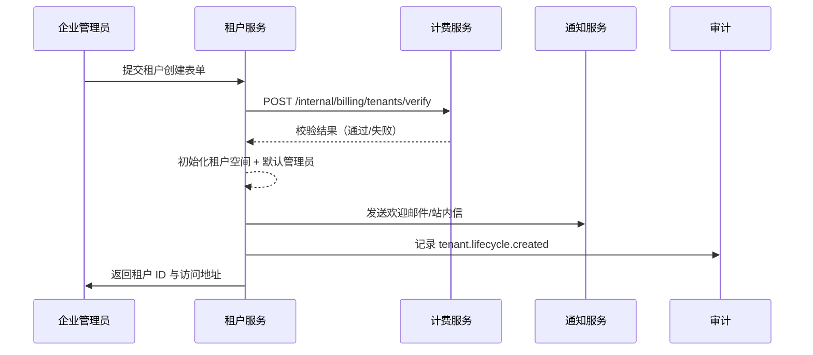

doc_id: UC-IAM-MULTI-TENANT-ONBOARD-001
scn_id: SCN-IAM-MULTI-TENANT-001
title: 租户开通与控制台初始化
status: Draft
version: v0.1.0
repo_key: powerx
scope: powerx
layer: service
domain: iam
scenario_title: "PowerX 多租户与组织管理"
owners:
  - name: Michael Hu
    role: Product Manager
    contact: matrix-x@artisan-cloud.com
  - name: Matrix Ops
    role: Platform Ops Lead
    contact: ops@artisan-cloud.com
contributors: []
linked_requirements:
  - SCN-IAM-MULTI-TENANT-ONBOARD-001
code_refs:
  - repo: powerx
    path: services/tenant-onboarding/
feature_flags:
  - tenant-v2-wizard
  - billing-integration
last_reviewed_at: 2025-10-29

---

# Usecase Overview

- **业务目标**：为企业管理员提供一站式租户开通体验，涵盖信息采集、资质/计费校验、租户空间初始化与欢迎通知，确保集团业务单元能在 5 分钟内完成上线准备。
- **触发角色**：企业管理员（通过控制台向导）、后台计费服务（资质回调）。
- **成功度量**：租户创建成功率 ≥ 98%，端到端耗时 ≤ 5 分钟，欢迎通知送达率 ≥ 99%，审计覆盖率 100%。
- **场景关联**：支撑主场景 `SCN-IAM-MULTI-TENANT-001` 的 Stage 1，并与续约治理（RENEWAL-FREEZE）、组织建模（ORG-MODELING）协同。

> 摘要：实现租户开通过程的自动化，自动生成租户 ID、管理员账号、初始组织模板，并完成计费与审计联动，为后续组织建模与跨租户协作奠定基础。

# Context & Assumptions

- **前置条件**：
  - Feature Flags：`tenant-v2-wizard`, `billing-integration`, `notify-transactional` 必须启用。
  - 租户控制台已部署最新租户向导前端；计费服务可通过 gRPC `Billing.VerifyEnterprise` 接口返回资质与支付状态。
  - 企业管理员拥有 `tenant.create` 权限，且已完成二次验证。
- **输入数据**：租户基础信息（名称、业务域、数据区域、计费方案、营业执照附件）、管理员邮件/手机号、可选组织模板 ID。
- **输出数据**：租户记录（ID、状态、计费方案、模板）、默认管理员账号、欢迎邮件通知、`tenant.lifecycle.created` 审计事件。
- **约束/边界**：
  - 不处理组织结构导入（由 ORG-MODELING Seed 覆盖）。
  - 计费策略配置（价格、折扣）由外部计费系统维护，本用例只消费校验结果。
  - SSO/IdP 集成迟滞不影响租户创建，但在后续组织同步前需要完成配置。

# Solution Blueprint

## 体系分解

| 层 | 主要组件/模块 | 责任 | 代码入口 |
|----|---------------|------|---------|
| 接入层 | `apps/tenant-console/pages/create-tenant` | 向导 UI、表单校验、附件上传 | `apps/tenant-console/` |
| 服务层 | `services/tenant-onboarding/handler.go` | 处理租户创建请求、调用计费与模板服务、写入租户表 | `services/tenant-onboarding/` |
| 任务层 | `services/tenant-onboarding/jobs/welcome.go` | 生成默认管理员、触发欢迎通知、写入审计 | `services/tenant-onboarding/jobs/` |
| 集成层 | `pkg/billing/client`, `pkg/notify/client`, `pkg/audit/logger` | 外部计费、通知、审计 SDK 适配 | `pkg/*` |

## 流程与时序

1. **Step 1 – 提交引导表单**：企业管理员通过向导提交租户信息并上传资质附件。
2. **Step 2 – 资质/计费校验**：后端调用计费服务校验企业资质、支付状态；若失败则返回错误并生成 Pending 工单。
3. **Step 3 – 租户初始化**：创建租户记录、生成租户 ID，写入租户元数据、选择组织模板并初始化默认管理员账号。
4. **Step 4 – 通知与审计**：触发通知服务发送欢迎邮件/站内信；记录 `tenant.lifecycle.created` 审计事件。

# Contracts & Interfaces

- **Inbound API**：
  - `POST /internal/tenants` — 受 `tenant.create` 权限保护，body 包含 `name`, `business_domain`, `data_region`, `billing_plan`, `attachments[]`。失败时返回 4xx 并附带 `error_code`（`BILLING_NOT_READY`, `COMPLIANCE_FAILED` 等）。
- **Outbound 调用**：
  - `Billing.VerifyEnterprise`（gRPC，超时 3s，失败重试 2 次，超时后进入待审核并记录工单）。
  - `Notify.SendTransactional`（REST，确保设置 `template=tenant_welcome_v2`，幂等键使用租户 ID）。
  - `Audit.LogEvent`（REST/Event，severity=INFO，payload 包含租户 ID、管理员账号、计费方案）。
- **配置与脚本**：
  - `config/tenant.yaml` — 定义默认组织模板、初始权限包。
  - `scripts/db/migrations/2025_10_add_tenant_tables.sql` — 租户表结构及索引。
  - `ops/cron/tenant-onboarding-retry` — 定时重试欢迎通知失败记录。

# Implementation Checklist

| 项目 | 描述 | 完成状态 | 负责人 |
|------|------|----------|--------|
| 数据模型 | 创建 `tenant_info`, `tenant_admins` 表及索引，编写迁移脚本 | [ ] | Michael Hu |
| 业务逻辑 | 实现租户创建 Handler、计费校验、模板初始化 | [ ] | Matrix Ops |
| 权限治理 | 配置 `tenant.create` 权限、审计事件上报 | [ ] | Matrix Ops |
| 配置发布 | 发布 `tenant-v2-wizard` Flag，更新默认模板配置 | [ ] | Matrix Ops |
| 文档同步 | 更新场景文档、站点指南、运维 Runbook | [ ] | Michael Hu |

# Testing Strategy

- **单元测试**：`go test ./services/tenant-onboarding/...`；覆盖表单校验、Billing 客户端错误、欢迎通知重试逻辑。
- **集成测试**：使用 `tests/integration/tenant_onboarding_test.go` 模拟正向流程（A-1）与资质失败（A-2），验证数据库写入、审计事件、通知发送。
- **端到端验证**：QA 在沙箱环境运行 `scripts/qa/tenant-onboarding-runbook.md`；准备标准模板、计费沙箱账号、邮件收件箱，期望 5 分钟内收到欢迎邮件。
- **非功能测试**：压力测试租户创建接口（100 RPS 下失败率 <1%），Chaos 实验模拟 Billing 超时确保进入待审核流程。

# Observability & Ops

- **指标**：`tenant_onboarding_duration_seconds`（P95 ≤ 300s）、`tenant_onboarding_success_total`、`tenant_onboarding_billing_failure_total`。
- **日志**：在 `INFO` 级别记录租户 ID、管理员账号、计费方案、模板 ID；错误日志需附 `error_code` 与 TraceID。
- **告警**：
  - 计费校验连续失败 3 次/小时 → PagerDuty (Platform Ops)。
  - 欢迎通知失败率 >5% → Slack `#tenant-ops`。
- **Dashboards**：Grafana `IAM / Tenant Onboarding Overview`、Datadog `tenant-onboarding` 目录。

# Rollback & Failure Handling

- **回滚步骤**：
  - 回滚部署（Argo Rollouts 回滚到上一版本）。
  - 关闭 `tenant-v2-wizard` Feature Flag。
  - 运行 `scripts/db/rollback/2025_10_add_tenant_tables.down.sql`（如需要）。
- **补救措施**：
  - 资质校验失败：在后台重新上传证照后触发脚本 `scripts/ops/retry-tenant-pending.sh --tenant <ID>`。
  - 欢迎邮件失败：在通知服务控制台重发并确认模板。
- **数据修复**：对于已创建但未初始化管理员的记录，执行 `services/tenant-onboarding/tools/create-admin --tenant <ID>`；操作人 Matrix Ops。

# Follow-ups & Risks

| 风险/事项 | 影响 | 缓解方案 | 负责人 | ETA |
|-----------|------|----------|--------|-----|
| 资质附件尺寸过大导致上传失败 | 影响管理员体验 | 引入分片上传/压缩策略，提示规范 | Matrix Ops | 2025-11-10 |
| 通知模板多语言尚未覆盖所有地区 | 欢迎通知体验不一致 | 与本地化团队协作补齐模板 | Michael Hu | 2025-11-20 |

# References & Links

- 场景文档：`docs/scenarios/iam/SCN-IAM-MULTI-TENANT-ONBOARD-001.md`
- 主场景：`docs/scenarios/iam/SCN-IAM-MULTI-TENANT-001.md`
- 审计标准：`docs/standards/governance/audit-events.md`
- 计费接口：`docs/standards/billing/enterprise-verification.md`
- 运维 Runbook：`docs/ops/runbooks/tenant-onboarding.md`
- Figma 原型：`https://figma.com/file/.../tenant-onboarding`
