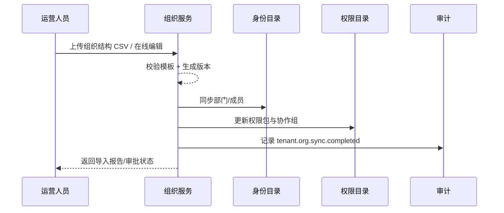

doc_id: UC-IAM-MULTI-TENANT-ORG-MODELING-001
scn_id: SCN-IAM-MULTI-TENANT-001
title: 组织结构建模与协作组配置
status: Draft
version: v0.1.0
repo_key: powerx
scope: powerx
layer: service
domain: iam
scenario_title: "PowerX 多租户与组织管理"
owners:
  - name: Michael Hu
    role: Product Manager
    contact: matrix-x@artisan-cloud.com
  - name: Matrix Ops
    role: Platform Ops Lead
    contact: ops@artisan-cloud.com
contributors: []
linked_requirements:
  - SCN-IAM-MULTI-TENANT-ORG-MODELING-001
code_refs:
  - repo: powerx
    path: services/org-admin/
feature_flags:
  - org-structure-v2
  - iam-directory-sync
last_reviewed_at: 2025-10-29

---

# Usecase Overview

- **业务目标**：让运营人员可以快速导入并维护租户内部的组织树，建立跨部门协作组并同步到身份/权限目录，保障权限边界清晰与协作审批可控。
- **触发角色**：租户运营人员（控制台）、身份目录服务（同步任务）、安全管理员（审批流程）。
- **成功度量**：组织导入成功率 ≥ 98%，同步延迟 ≤ 2 分钟，跨部门协作审批响应时间 ≤ 1 小时，冲突率 < 5%。
- **场景关联**：支撑主场景 Stage 2，并与跨租户共享（CROSS-SHARE）及续约治理（RENEWAL-FREEZE）共享组织数据源。

> 摘要：提供组织建模工具链（导入、编辑、协作组配置、冲突审批），并确保身份目录、权限目录在数分钟内完成同步。

# Context & Assumptions

- **前置条件**：
  - Feature Flags：`org-structure-v2`, `iam-directory-sync`, `collaboration-approval`。
  - 身份目录（Directory）、权限目录（AuthZ）服务处于可用状态，并有组织模板 CSV 校验规则。
  - 运营人员持有 `tenant.org.manage` 权限；审批人拥有 `tenant.org.approve`。
- **输入数据**：组织结构 CSV、部门/团队名称、负责人账号、默认权限包、协作组配置。
- **输出数据**：组织树版本记录、协作组定义、同步任务结果、审批记录、`tenant.org.sync.completed` 事件。
- **边界**：
  - 员工账号生命周期管理由其它用例负责。
  - 无法解决不同租户间的组织共享（由 CROSS-SHARE 覆盖）。
  - CSV 模板字段标准由 `docs/standards/iam/org-import.md` 定义，本用例只消费。

# Solution Blueprint

## 体系分解

| 层 | 主要组件/模块 | 责任 | 代码入口 |
|----|---------------|------|---------|
| 接入层 | `apps/tenant-console/pages/org/index.tsx` | 导入 UI、实时校验、协作组配置 | `apps/tenant-console/` |
| 服务层 | `services/org-admin/importer.go` | CSV 解析、版本控制、冲突检测 | `services/org-admin/` |
| 同步层 | `services/org-sync/worker.go` | 将组织树同步到 Directory/AuthZ，发布事件 | `services/org-sync/` |
| 审批层 | `services/org-admin/approvals.go` | 审批流程、通知路由、留痕 | `services/org-admin/` |

## 流程与时序

1. **Step 1 – 导入/编辑**：运营人员上传组织 CSV 或编辑界面，服务进行 schema 校验与版本检查。
2. **Step 2 – 协作组与权限**：为部门设置负责人、默认权限包，配置跨部门协作组。
3. **Step 3 – 冲突审批**：若检测到权限冲突，生成审批单并等待安全管理员确认。
4. **Step 4 – 同步与通知**：同步至 Directory/AuthZ，发送成功/失败通知并记录审计事件。

# Contracts & Interfaces

- **Inbound API**：
  - `POST /internal/tenants/{tenantId}/org/import` — 支持 multipart CSV 上传；需要 `tenant.org.manage` 权限；返回导入任务 ID。
  - `PUT /internal/tenants/{tenantId}/org/{nodeId}` — 单节点编辑接口。
- **Outbound 调用**：
  - `Directory.SyncOrg`（gRPC；失败重试 3 次，使用幂等键 `<tenantId>-<version>`）。
  - `Auth.AssignRole`（REST；设置默认权限包、协作组成员）。
  - `Notify.SendTransactional`（冲突/审批提醒）。
  - `Audit.LogEvent`（记录导入结果、审批触发、同步失败）。
- **配置与脚本**：
  - `config/org-import.yaml` — CSV schema、字段约束、冲突策略。
  - `scripts/ops/org-import-rollback.sh` — 出错时回滚至上一版本组织树。

> 建议链接到 `docs/standards/**` 的契约文档或下游仓库的接口定义，保持来源单一。

# Implementation Checklist

| 项目 | 描述 | 完成状态 | 负责人 |
|------|------|----------|--------|
| 数据模型 | 建立组织版本表、协作组定义表、审批记录表 | [ ] | Matrix Ops |
| 业务逻辑 | 实现导入解析、冲突检测、协作组 API | [ ] | Matrix Ops |
| 权限治理 | 校验运营与审批权限、审计事件上报 | [ ] | Michael Hu |
| 配置发布 | 更新 CSV 模板配置、Feature Flag 默认值 | [ ] | Matrix Ops |
| 文档同步 | 更新组织导入标准与 Runbook | [ ] | Michael Hu |

# Testing Strategy

- **单元测试**：`go test ./services/org-admin/...`；校验 CSV 解析、冲突检测、审批触发逻辑。
- **集成测试**：`tests/integration/org_sync_test.go` 覆盖 B-1 正向导入、B-2 冲突触发；mock Directory/Auth 服务验证同步与审批。
- **端到端验证**：QA 按 `scripts/qa/org-modeling-scenario.md` 操作；准备示例 CSV、审批人账号，确认组织树渲染正确、审批链路完成。
- **非功能测试**：批量导入 1 万节点组织树，确保同步时间 ≤ 2 分钟；Chaos 测试 Directory 不可用时回滚版本。

> 推荐列出测试用例 ID 或链接到自动化用例仓库；如需本地命令可附上 `npm run test -- <suite>` 等指引。

# Observability & Ops

- **指标**：`tenant_org_import_success_total`, `tenant_org_import_failure_total`, `tenant_org_sync_latency_seconds`（P95 ≤ 120s）。
- **日志**：记录租户 ID、版本号、导入行数、冲突详情；审批日志需包含审批人、结果、时间。
- **告警**：
  - 导入失败率 > 5% / 小时 → Slack `#tenant-ops`。
  - 同步延迟 > 5 分钟 → PagerDuty。
- **Dashboards**：Grafana `IAM / Org Modeling`、Datadog `org-import`。

# Rollback & Failure Handling

- **回滚步骤**：回滚部署；执行 `scripts/ops/org-version-restore.sh --tenant <ID> --version <prev>` 恢复上一版本组织树；暂停 `org-sync` Worker。
- **补救措施**：冲突审批积压时可通过 `services/org-admin/tools/approve --batch` 批量审批；若 Directory 不可用，进入降级模式只保存草稿等待恢复。
- **数据修复**：使用 `services/org-admin/tools/rebuild-index --tenant <ID>` 重建组织缓存；Matrix Ops 负责执行。

# Follow-ups & Risks

| 风险/事项 | 影响 | 缓解方案 | 负责人 | ETA |
|-----------|------|----------|--------|-----|
| CSV 模板仍需国际化字段支持 | 导入失败率上升 | 与本地化团队确定字段映射 | Michael Hu | 2025-11-12 |
| 协作组审批链路依赖第三方审批系统 | 审批阻塞 | 建立兜底自动审批策略 + 告警 | Matrix Ops | 2025-11-18 |

# References & Links

- 场景文档：`docs/scenarios/iam/SCN-IAM-MULTI-TENANT-ORG-MODELING-001.md`
- 主场景：`docs/scenarios/iam/SCN-IAM-MULTI-TENANT-001.md`
- 组织导入标准：`docs/standards/iam/org-import.md`
- 协作组审批规范：`docs/standards/governance/collaboration-approval.md`
- Runbook：`docs/ops/runbooks/org-modeling.md`
