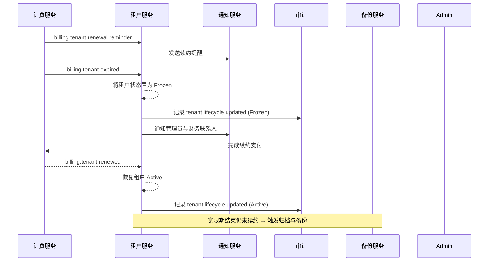

doc_id: UC-IAM-MULTI-TENANT-RENEWAL-FREEZE-001
scn_id: SCN-IAM-MULTI-TENANT-001
title: 租户续约提醒、冻结与恢复治理
status: Draft
version: v0.1.0
repo_key: powerx-billing
scope: powerx
layer: service
domain: iam
scenario_title: "PowerX 多租户与组织管理"
owners:
  - name: Michael Hu
    role: Product Manager
    contact: matrix-x@artisan-cloud.com
  - name: Matrix Ops
    role: Platform Ops Lead
    contact: ops@artisan-cloud.com
contributors: []
linked_requirements:
  - SCN-IAM-MULTI-TENANT-RENEWAL-FREEZE-001
code_refs:
  - repo: powerx-billing
    path: services/tenant-renewal/
feature_flags:
  - tenant-renewal-automation
  - billing-webhook
last_reviewed_at: 2025-10-29

---

# Usecase Overview

- **业务目标**：构建自动化续约提醒、冻结、宽限期管理与恢复流程，确保欠费或到期租户在合规范围内受控，并提供顺畅的续约体验。
- **触发角色**：计费服务（发布到期/续约事件）、租户管理员（续约操作）、通知服务（提醒与告警）。
- **成功度量**：提醒触达率 ≥ 99%，冻结响应时间 ≤ 5 分钟，续约恢复时间 ≤ 2 分钟，宽限期内恢复率 ≥ 90%，误冻结率 < 0.5%。
- **场景关联**：支撑主场景 Stage 4，与租户开通（ONBOARD）共享租户状态信息，并对跨租户共享（CROSS-SHARE）进行状态限制。

> 摘要：通过计费事件驱动租户状态机，自动输出提醒、冻结、恢复与归档动作，并将全过程纳入通知和审计闭环。

# Context & Assumptions

- **前置条件**：
  - Feature Flags：`tenant-renewal-automation`, `billing-webhook`, `notify-transactional`, `audit-streaming`。
  - 计费系统每日生成到期/欠费清单，并支持实时支付回调。
  - 租户管理员与财务联系人在系统中已配置；冻结策略与宽限期参数经法务批准。
- **输入/输出**：
  - 输入：`billing.tenant.renewal.reminder`, `billing.tenant.expired`, `billing.tenant.renewed` 事件；续约支付结果。
  - 输出：租户状态机变更、续约提醒与冻结通知、`tenant.lifecycle.updated` 审计事件、归档备份任务。
- **边界**：
  - 不处理计费策略（价格、折扣）；归档数据保留策略由数据治理用例负责。
  - 对试用租户的特殊流程需要另行配置（不在本用例范围内）。

# Solution Blueprint

## 体系分解

| 层 | 主要组件/模块 | 责任 | 代码入口 |
|----|---------------|------|---------|
| 任务层 | `services/tenant-renewal/scheduler.go` | 扫描到期租户、发布提醒事件 | `services/tenant-renewal/` |
| 服务层 | `services/tenant-renewal/handler.go` | 执行冻结/恢复操作、宽限期逻辑、处理支付回调 | 同上 |
| 通知层 | `pkg/notify/client.go` | 发送提醒、冻结通知、宽限期告警 | `pkg/notify/` |
| 审计与备份层 | `pkg/audit/logger.go`, `services/tenant-archive/` | 记录状态变更审计、执行归档备份 | `pkg/audit`, `services/tenant-archive/` |

## 流程与时序

1. **Step 1 – 提前提醒**：调度任务在到期前 N 天发布提醒事件并推送通知。
2. **Step 2 – 到期冻结**：到期仍未续约时调用冻结 API，限制写操作并在控制台展示续约引导。
3. **Step 3 – 宽限期管理**：宽限期内监听支付回调或人工处理，若仍未续约则升级告警，准备归档。
4. **Step 4 – 恢复/归档**：支付成功后恢复 Active；超过宽限期则归档并触发备份脚本。

# Contracts & Interfaces

- **Inbound 事件**：`billing.tenant.renewal.reminder`, `billing.tenant.expired`, `billing.tenant.renewed`。
- **API**：
  - `POST /internal/tenants/{tenantId}/freeze` — 需要 `tenant.lifecycle.manage` 权限；仅允许 Active→Frozen 转换。
  - `POST /internal/tenants/{tenantId}/resume` — 续约成功后恢复；记录支付流水号。
- **Outbound 调用**：
  - `Notify.SendTransactional`（模板：`tenant_renewal_reminder_v2`, `tenant_freeze_notice_v1`）。
  - `Audit.LogEvent`（记录冻结/解冻、宽限期告警）。
  - `Backup.ArchiveTenant`（归档操作，幂等执行）。
- **配置与脚本**：
  - `config/tenant-renewal.yaml` — 提醒提前天数、宽限期长度、归档策略。
  - `scripts/jobs/tenant-renewal-runner.sh` — 手动触发提醒/冻结。
  - `scripts/ops/tenant-archive.sh` — 执行归档与恢复脚本。

# Implementation Checklist

| 项目 | 描述 | 完成状态 | 负责人 |
|------|------|----------|--------|
| 数据模型 | 扩展 `tenant_status` 表记录冻结/宽限期时间戳 | [ ] | Matrix Ops |
| 任务调度 | 实现续约提醒、冻结调度任务与支付回调处理 | [ ] | Matrix Ops |
| 权限治理 | 更新状态机规则、审计事件、告警配置 | [ ] | Michael Hu |
| 配置发布 | 配置提醒阈值、Feature Flag、Webhook 地址 | [ ] | Matrix Ops |
| 文档同步 | 更新续约 Runbook、站点校验指南 | [ ] | Michael Hu |

# Testing Strategy

- **单元测试**：`go test ./services/tenant-renewal/...`；覆盖事件处理、状态机转换、宽限期逻辑。
- **集成测试**：`tests/integration/tenant_renewal_test.go` 覆盖 D-1 自动冻结、D-2 续约恢复；Mock Notify/Audit/Backup 服务验证副作用。
- **端到端验证**：QA 按 `scripts/qa/tenant-renewal-scenario.md` 操作，在沙箱设置租户到期时间，验证提醒、冻结、恢复流程。
- **非功能测试**：批量模拟 1 万租户到期，压力测试调度稳定性；Chaos 实验模拟 Notify 或 Audit 不可用，验证降级策略。

# Observability & Ops

- **指标**：`tenant_renewal_reminder_sent_total`, `tenant_frozen_total`, `tenant_renewal_success_total`, `tenant_freeze_duration_seconds`（P95 ≤ 120s）。
- **日志**：记录租户 ID、状态变更、提醒渠道、支付流水号、宽限期到期时间；错误日志附带 `error_code` 与 TraceID。
- **告警**：提醒失败率 > 5%（Slack `#tenant-ops`）；冻结后仍有写操作 > 3 次/小时（PagerDuty）；支付回调失败率 > 2%（PagerDuty）。
- **Dashboards**：Grafana `Billing / Tenant Renewal & Freeze`、Datadog `tenant-renewal` 监控组。

# Rollback & Failure Handling

- **回滚步骤**：回滚部署；关闭 `tenant-renewal-automation` Flag；必要时执行 `POST /internal/tenants/{id}/resume` 解除错误冻结。
- **补救措施**：
  - 通知失败：运行 `services/tenant-renewal/tools/resend-reminder --tenant <ID>`。
  - 宽限期配置错误：调整配置后执行 `scripts/ops/tenant-freeze-recalc.sh` 重新计算。
- **数据修复**：使用 `services/tenant-archive/tools/restore --tenant <ID>` 恢复误归档租户，并在审计记录补充说明；操作人 Matrix Ops。

# Follow-ups & Risks

| 风险/事项 | 影响 | 缓解方案 | 负责人 | ETA |
|-----------|------|----------|--------|-----|
| 宽限期策略需与法务同步 | 影响合规与客户体验 | 定期审查宽限策略并记录在 Runbook | Michael Hu | 2025-11-15 |
| 归档存储成本攀升 | 增加运营成本 | 评估冷存策略，引入生命周期管理 | Matrix Ops | 2025-12-01 |

# References & Links

- 场景文档：`docs/scenarios/iam/SCN-IAM-MULTI-TENANT-RENEWAL-FREEZE-001.md`
- 主场景：`docs/scenarios/iam/SCN-IAM-MULTI-TENANT-001.md`
- 计费契约：`docs/standards/billing/tenant-renewal.md`
- 冻结/解冻 Runbook：`docs/ops/runbooks/tenant-renewal.md`
- 审计规范：`docs/standards/governance/audit-events.md`
