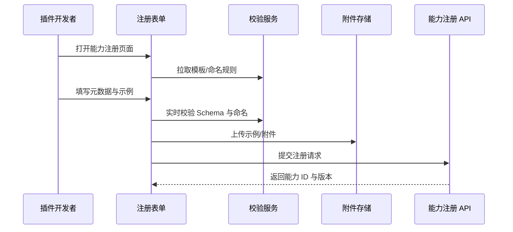

doc_id: UC-INT-PLUGIN-CAPABILITY-MODELING-001
scn_id: SCN-INT-PLUGIN-CAPABILITY-001
title: 能力建模与注册提交
status: Draft
version: v0.1.0
repo_key: powerx-plugin
scope: powerx-plugin
layer: service
domain: integration
scenario_title: "插件能力注册与暴露治理闭环"
owners:
  - name: Michael Hu
    role: Tech Steward
    contact: tech@artisan-cloud.com
  - name: Matrix-X
    role: Docs Coordinator
    contact: dev@artisan-cloud.com
contributors: []
linked_requirements:
  - SCN-INT-PLUGIN-CAPABILITY-001#stage-1
  - SCN-INT-PLUGIN-CAPABILITY-MODELING-001
code_refs:
  - repo: powerx-plugin
    path: apps/control-center/src/pages/Capabilities/RegisterForm.tsx
    description: 能力注册表单 UI、草稿保存、输入校验交互
  - repo: powerx-plugin
    path: apps/control-center/src/services/capability/schemaValidator.ts
    description: Schema/命名规则校验、冲突检查、修订建议
  - repo: powerx-plugin
    path: apps/control-center/src/services/capability/sampleUploader.ts
    description: 示例请求/响应、错误码、附件上传
  - repo: powerx-plugin
    path: scripts/capabilities/registry-cli.mjs
    description: CLI 表单生成、自动校验与提交脚本
feature_flags:
  - PX_PLUGIN_CAPABILITY_REGISTRY_V2
optional: false
last_reviewed_at: 2025-01-20

---

# Usecase Overview

- **业务目标**：帮助插件开发者在 5 分钟内完成能力元数据建模、上传示例、校验命名冲突并提交注册请求，为后续审批与暴露打下结构化基础。
- **成功度量**：表单加载时间 ≤3 秒；自动校验通过率 ≥98%；提交后 1 分钟内生成能力 ID 并写入审计；草稿恢复成功率 ≥99%。
- **场景关联**：对应主场景 Stage 1，直接衔接 `UC-INT-PLUGIN-CAPABILITY-REVIEW-001` 的审核流程。

> 该用例确保能力在进入审批之前就拥有完整、合规的元数据与示例，为跨团队协作提供统一的输入。

# Context & Assumptions

- **前置条件**
  - Feature Flag `PX_PLUGIN_CAPABILITY_REGISTRY_V2` 已启用。
  - 注册表单可访问命名规则、Schema 校验服务、审计日志总线。
  - 对象存储或附件服务已配置，用于示例与 Demo 上传。
  - 插件开发者具备能力注册操作权限。
- **输入/输出**
  - 输入：能力名称、描述、场景、输入输出 Schema、错误码、敏感数据标签、示例请求/响应、体验 Demo 链接。
  - 输出：能力 ID、版本信息、校验结果、审计事件、草稿记录。
- **边界**
  - 不覆盖审批分派、暴露配置与租户授权；不处理插件内部功能实现。

# Solution Blueprint

## 体系分解

| 层 | 主要组件/模块 | 责任 | 代码入口 |
|----|---------------|------|---------|
| 表单 UI 层 | `apps/control-center/src/pages/Capabilities/RegisterForm.tsx` | 渲染表单、草稿保存、错误提示 | `apps/control-center` |
| 校验服务层 | `apps/control-center/src/services/capability/schemaValidator.ts` | 调用后端校验命名、Schema、字段冲突 | `apps/control-center/services` |
| 示例上传层 | `apps/control-center/src/services/capability/sampleUploader.ts` | 管理示例请求/响应、错误码、附件存储 | `apps/control-center/services` |
| CLI 辅助层 | `scripts/capabilities/registry-cli.mjs` | 提供命令行快速生成与校验能力元数据 | `scripts/capabilities` |
| 审计与草稿层 | `apps/control-center/src/services/capability/draftStore.ts` | 草稿缓存、恢复、审计事件写入 | `apps/control-center/services` |

## 流程与时序

1. **Step 1 – 表单初始化**：加载模板、命名规则与校验配置，填充默认字段或草稿。
2. **Step 2 – 元数据录入**：开发者填写能力描述、Schema、错误码、敏感标签，前端实时校验并提示修复建议。
3. **Step 3 – 示例与附件上传**：提交示例请求/响应、体验 Demo、错误码表；校验文件格式与脱敏要求。
4. **Step 4 – 提交与能力 ID 生成**：通过所有校验后提交，返回能力 ID、版本号，写入审计日志并跳转到审核阶段。



# Contracts & Interfaces

- **Inbound APIs / Events**
  - `GET /internal/plugins/capabilities/templates` — 加载模板与默认字段。
  - `POST /internal/plugins/capabilities/validate` — 校验命名、字段、Schema。
  - `POST /internal/plugins/capabilities` — 提交注册请求、生成能力 ID。
- **Outbound 调用**
  - `POST /internal/storage/upload` — 上传示例请求/响应与附件。
  - `POST /internal/audit/event` — 写入 `audit.capability.registry.create`。
- **配置与脚本**
  - `config/capabilities/register_form.yaml` — 表单字段、默认值、校验规则。
  - `scripts/capabilities/registry-cli.mjs` — CLI 生成与校验脚本。

# Implementation Checklist

| 项目 | 描述 | 完成状态 | 负责人 |
|------|------|----------|--------|
| 表单模板 | 定义字段、默认值、草稿恢复逻辑 | [ ] | Michael Hu |
| 校验规则 | 实现命名、Schema、敏感字段校验与提示 | [ ] | Michael Hu |
| 示例上传 | 支持示例/附件上传、脱敏检测、格式校验 | [ ] | Michael Hu |
| CLI 辅助 | 提供 CLI 模板生成、自动校验与提交 | [ ] | Matrix-X |
| 审计事件 | 写入 `audit.capability.registry.create`、记录操作人 | [ ] | Grace Lin |

# Testing Strategy

- **单元测试**
  - 表单字段校验、草稿恢复、命名冲突检测、Schema 校验函数。
  - 示例上传格式检查、脱敏策略、错误提示。
- **集成测试**
  - 使用 `scripts/capabilities/registry-cli.mjs --validate` 验证模板生成与校验。
  - 模拟后端校验服务，确认错误提示与修复流程。
- **端到端验证**
  - 按场景文档用例 A-1、A-2 执行注册成功与命名冲突阻断；验证审计日志、能力 ID 生成功能。
- **非功能测试**
  - 表单加载性能、附件上传带宽限制、并发提交、草稿恢复可靠性。

# Observability & Ops

- **指标**：`capability.form.load_duration_ms`、`capability.validation.failure_rate`、`capability.registry.submit_success_total`。
- **日志**：表单提交参数摘要、校验错误、示例上传结果、能力 ID 与版本；审计事件保留操作人、时间、结果。
- **告警**：表单加载 >5 秒（P2）；校验失败率 >10%（P2）；能力 ID 生成超时 >60 秒（P1）。
- **Dashboards**：Capability Registration Dashboard、Validation Failure Panel。

# Rollback & Failure Handling

- **回滚步骤**：在校验失败或提交异常时自动保存草稿，允许开发者调整后再次提交；如审计写入失败则重试并提示管理员。
- **补救措施**：提供 CLI 工具重新生成模板、导出草稿、批量校验；后台可手动介入调整命名规则或 Schema。
- **数据修复**：使用 `scripts/capabilities/registry-draft-recover.mjs` 恢复草稿；与审计日志对账确保能力 ID 唯一。

# Follow-ups & Risks

| 风险/事项 | 影响 | 缓解方案 | 负责人 | ETA |
|-----------|------|----------|--------|-----|
| 英文/多语言字段未填写导致全球站点展示缺失 | 国际化体验 | 引入必填校验与语言模板，提供翻译占位提示 | Michael Hu | 2025-02-10 |
| Schema 校验规则更新滞后，引发误判 | 注册效率 | 建立规则版本管理与回滚机制，提供校验脚本 | Michael Hu | 2025-02-12 |

# References & Links

- 场景文档：`docs/scenarios/integration/SCN-INT-PLUGIN-CAPABILITY-MODELING-001.md`
- 主场景：`docs/scenarios/integration/SCN-INT-PLUGIN-CAPABILITY-001.md`
- Meta 设计稿：`docs/meta/scenarios/powerx/plugin-ecosystem/integration-and-connectivity/plugin-capability-registration-and-exposure/primary.md#子场景-a`
- docmap 节点：
  ```yaml
  - doc_id: UC-INT-PLUGIN-CAPABILITY-MODELING-001
    scope: powerx-plugin
    layer: service
    domain: integration
    optional: false
    repo: powerx-plugin
    path: docs/usecases-seeds/SCN-INT-PLUGIN-CAPABILITY-001/UC-INT-PLUGIN-CAPABILITY-MODELING-001.md
  ```
- 相关标准：`docs/standards/powerx-plugin/integration/02_capabilities_and_schema/Capability_Design_Guide.md`、`docs/standards/powerx-plugin/integration/02_capabilities_and_schema/IO_Schema_and_Validation.md`
- CLI 工具：`scripts/capabilities/registry-cli.mjs`
