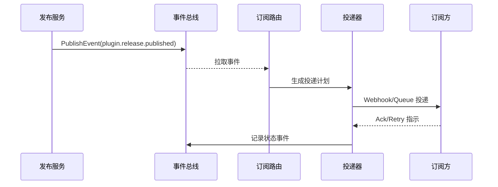

doc_id: UC-OPS-EVENT-NOTIFY-001
scn_id: SCN-OPS-EVENT-TASKFLOW-001
title: 插件发布事件订阅通知编排
status: Draft
version: v0.1.0
repo_key: powerx
scope: powerx
layer: service
domain: ops
scenario_title: "PowerX 事件与任务流管理"
owners:
  - name: Matrix Ops
    role: Platform Ops Lead
    contact: ops@artisan-cloud.com
  - name: Eva Zhang
    role: Automation Steward
    contact: automation@artisan-cloud.com
contributors: []
linked_requirements:
  - SCN-OPS-EVENT-TASKFLOW-001-A
code_refs:
  - repo: powerx
    path: internal/events/bus/publisher.go
    description: 标准事件模型封装与发布入口
  - repo: powerx
    path: internal/events/subscriptions/router.go
    description: 订阅匹配、幂等校验与速率治理
  - repo: powerx
    path: internal/events/delivery/webhook_dispatcher.go
    description: Webhook/队列投递管道与重试策略
  - repo: powerx
    path: internal/events/storage/event_log_repository.go
    description: 事件持久化与追溯查询接口
  - repo: powerx
    path: pkg/audit/event_audit_logger.go
    description: 审计日志写入与告警触发
feature_flags:
  - event-bus-v2
  - plugin-release-webhook
  - audit-streaming
optional: false
last_reviewed_at: 2025-10-31

---

# Usecase Overview

- **业务目标**：在插件发布完成后 5 秒内，将 `plugin.release.published` 等关键事件可靠投递给所有订阅方，并提供追溯、补偿与幂等保障，确保跨系统协作及时触发。
- **成功度量**：事件首次送达成功率 ≥ 97%，重试后累计成功率 ≥ 99.5%；重复投递率 < 0.5%；订阅方 Ack 延迟 P95 ≤ 3 秒；审计日志覆盖率 100%。
- **场景关联**：对应主场景 `SCN-OPS-EVENT-TASKFLOW-001` Stage 1，为调度、Agent 编排与补偿链路提供可信事件源。

> 通过统一事件模型和投递策略，实现插件版本发布后通知运营控制台、CI/CD、告警平台等订阅系统的自动化闭环。

# Context & Assumptions

- **前置条件**
  - `event-bus-v2`、`plugin-release-webhook`、`audit-streaming` Feature Flag 已启用。
  - Kafka 集群/事件总线可用，订阅配置存放于 `event_subscription` 表并通过控制台维护。
  - 订阅方提供的 Webhook/队列端点支持 HMAC 验签与幂等键，具备重试接收能力。
- **输入/输出**
  - 输入：插件发布流水线产出的 `plugin.release.published` 事件、订阅配置、幂等键、租户上下文。
  - 输出：对各订阅方的投递请求、投递结果状态、事件持久化记录、审计事件与指标。
- **边界**
  - 不覆盖插件发布流水线自身的审核/签名流程；
  - 不负责订阅方内部处理逻辑，仅保证投递成功与失败告警；
  - 租户跨区域复制延迟由事件镜像任务处理，此用例仅关注主区域。

# Solution Blueprint

## 体系分解

| 层 | 主要组件/模块 | 责任 | 代码入口 |
|----|---------------|------|---------|
| 事件发布层 | `internal/events/bus/publisher.go` | 校验事件模式、租户信息、生成幂等键并入总线 | `services/events` |
| 订阅匹配层 | `internal/events/subscriptions/router.go` | 根据订阅策略筛选目标、执行速率与权限校验 | `services/events` |
| 投递执行层 | `internal/events/delivery/webhook_dispatcher.go` | Webhook/队列投递、重试、熔断与延迟控制 | `services/events/delivery` |
| 存储与追溯层 | `internal/events/storage/event_log_repository.go` | 记录事件、投递状态、重试历史供查询 | `services/events/storage` |
| 审计观测层 | `pkg/audit/event_audit_logger.go` | 写入审计流、触发失败告警、上报指标 | `pkg/audit` |

## 流程与时序

1. **Step 1 – 发布事件**：插件发布服务调用 `PublishEvent`，校验 schema、租户、幂等键后写入 Kafka Topic。
2. **Step 2 – 匹配订阅**：Router 拉取事件，按租户/标签匹配订阅方，应用速率限制与黑名单。
3. **Step 3 – 投递执行**：Dispatcher 依据通道类型发送 Webhook/队列消息，记录响应码、耗时；失败进入延迟重试计划。
4. **Step 4 – 追溯与告警**：投递结果写入事件仓与审计流，失败超过阈值触发 PagerDuty/IM 告警，新事件同步至 Ops 控制台。
5. **Step 5 – 补偿与手动重放**：运维可通过控制台或 CLI 选择事件重放、修改订阅配置或生成工单。

# Contracts & Interfaces

- **Inbound APIs / Events**
  - `EVENT plugin.release.published` — Payload 包含版本、租户、依赖列表、发布人、校验摘要。
  - `POST /internal/events/publish` — 用于回放/补偿场景，需签名、幂等键。
- **Outbound 调用**
  - Webhook：`POST https://<subscriber>/powerx/events`，带 HMAC 签名头 `X-PowerX-Signature`、重试 3 次指数退避。
  - Queue：向租户指定的 Kafka Topic/AMQP 交换机投递，携带 `tenant_id`、`event_id`、`attempt`.
- **配置与脚本**
  - `config/events/subscriptions.yaml` — 默认订阅策略模板。
  - `scripts/ops/replay-event.mjs` — 事件重放脚本。
  - `scripts/ops/validate-webhook.mjs` — 验签/连通性测试脚本。

# Implementation Checklist

| 项目 | 描述 | 完成状态 | 负责人 |
|------|------|----------|--------|
| 事件 schema | 定义 `plugin.release.published` schema、版本兼容策略 | [ ] | Matrix Ops |
| 订阅治理 | 实现租户/标签匹配、幂等键与速率限制配置 | [ ] | Eva Zhang |
| 投递通道 | 开发 Webhook/队列投递器、重试与熔断逻辑 | [ ] | Matrix Ops |
| 控制台能力 | 更新订阅管理、事件追溯 UI、重放入口 | [ ] | Eva Zhang |
| 观测与告警 | 接入指标、审计、PagerDuty/IM 告警、报表脚本 | [ ] | Matrix Ops |

# Testing Strategy

- **单元测试**：覆盖事件发布参数校验、订阅匹配（标签/租户）、HMAC 签名生成与验证、重试调度窗口。
- **集成测试**：在沙箱 Kafka、Webhook 模拟器中验证成功投递、延迟重试、幂等，执行用例 A-1（正向送达）与 A-2（订阅失败重试）流程。
- **端到端验证**：触发一次真实插件发布流程，确认 Ops 控制台、告警平台、CI/CD 均收到通知且事件中心可追溯。
- **非功能测试**：压测 500 TPS 发布并观察延迟、失败率；注入网络丢包、签名错误，验证重试与告警闭环。

# Observability & Ops

- **指标**：`event.delivery.success_total`、`event.delivery.retry_total`、`event.delivery.latency_p95`、`event.delivery.duplicate_total`。
- **日志**：记录 `event_id`, `tenant_id`, `subscriber_id`, `attempt`, `status`, `latency_ms`, `signature_id`；敏感数据脱敏。
- **告警**：连续失败 >3 次或失败率 >5%/5 分钟触发 PagerDuty，签名验证失败立即通知安全群。
- **Dashboards**：Grafana `Runtime Ops / Event Delivery`、Datadog `event.delivery.*`、Ops 控制台事件中心。

# Rollback & Failure Handling

- **回滚步骤**：切换到旧版 Publisher/Dispatcher 镜像，恢复历史配置，关闭新 Feature Flag，清理未完成的重试任务。
- **补救措施**：使用 `replay-event.mjs` 重放失败事件、调整订阅配置、人工通知关键订阅方。
- **数据修复**：运行 `scripts/audit/reconcile-event-log.mjs` 对比事件仓与审计流；若幂等键异常，执行 SQL 更新修复状态。

# Follow-ups & Risks

| 风险/事项 | 影响 | 缓解方案 | 负责人 | ETA |
|-----------|------|----------|--------|-----|
| 订阅方 Webhook 泛洪导致延迟堆积 | 事件延迟、队列堆积 | 扩展速率限制、启用隔离队列与熔断策略 | Matrix Ops | 2025-11-05 |
| 签名密钥轮换机制尚未自动化 | 安全风险、通知失败 | 引入密钥轮换计划与通知模板，完善检测脚本 | Eva Zhang | 2025-11-12 |

# References & Links

- 主场景：`docs/scenarios/runtime-ops/SCN-OPS-EVENT-TASKFLOW-001.md`
- 背景材料：`docs/meta/scenarios/powerx/core-platform/runtime-ops/event-and-taskflow-management/primary.md`
- 运维脚本：`scripts/ops/replay-event.mjs`、`scripts/ops/validate-webhook.mjs`
