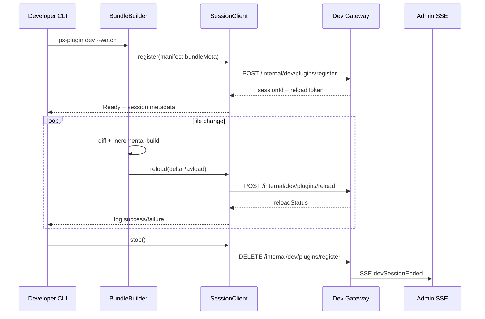

doc_id: PLG-DEV-HOTLOAD-001
scn_id: SCN-PUBLISH-HUB-001
title: PLG-DEV-HOTLOAD-001 - proto/dev
status: Draft
version: v0.1.0
repo_key: powerx-plugin
scope: powerx-plugin
layer: proto
domain: dev
scenario_title: "PowerX 插件开发与分发全链路"
owners:
  - name: Michael Hu
    role: Tech Steward
    contact: tech@artisan-cloud.com
  - name: Matrix-X
    role: Docs Coordinator
    contact: dev@artisan-cloud.com
contributors: []
linked_requirements: []
code_refs:
  - path: cli/src/commands/dev/watch.ts
  - path: cli/src/runtime/hotreload/session.ts
feature_flags:
  - PX_DEV_PLUGIN_HOTLOAD
  - PX_DEV_SESSION_AUDIT
last_reviewed_at: 2025-10-25

---

# Usecase Overview

- **业务目标**：为插件研发者提供秒级反馈的 `px-plugin dev --watch` 流程，自动完成构建、差异打包、Dev API 调用与日志聚合，让本地修改无需重启即可生效，并输出后续离线/在线发布所需的标准 manifest。
- **触发角色**：插件研发工程师、CI 校验机器人（预热热加载场景）。
- **成功度量**：`px-plugin dev register` P95 ≤ 400ms；热重载完成 ≤ 2s；CLI 端日志与 Admin SSE 延迟 ≤ 1s；错误定位信息覆盖率 ≥ 95%；构建生成的 manifest 与包体在发布链路零校验失败。
- **场景关联**：依赖 SCN-DEV-HOTLOAD-001 的沙盒服务，作为 SCN-PUBLISH-HUB-001 的起点，为在线/离线发布提供一致的 manifest 与构建工件。

# Context & Assumptions

- **Feature Flags**：`PX_DEV_PLUGIN_HOTLOAD=true`，允许 CLI 调用 Dev API；`PX_DEV_SESSION_AUDIT` 保障会话审计；若需多租户同时调试启用 `px.dev.multi_tenant`。
- **依赖**：本地 Node 18+、esbuild/tsc；Dev Gateway mTLS 凭据（由 `px auth configure` 写入）；Redis 用于 CLI telemetry；S3 预签名 URL（可选，用于大包）；`docs/_data/repos.yaml` 中记录的仓库 SSH/HTTPS 访问。
- Dev API 可部署在任意环境（本地容器、虚拟机、Kubernetes 等）；本用例不强制依赖特定基础设施，只要通过 HTTPS 暴露下述接口。
- **输入**：`plugin.yaml`、`manifest.json`、源码变更列表、`px-plugin.config.ts`。
- **输出**：热重载差异包（内存中）、`register`/`reload` API 请求体、CLI Telemetry 事件、Admin SSE 日志（通过 Backend）。
- **边界**：不覆盖 Dev API 行为、Admin 面板渲染、Marketplace 发布策略；CLI 仅负责构建/上传与本地日志输出。

# Solution Blueprint

## 体系分解

| 层 | Scope | 组件/模块 | 责任 | 代码入口 / Host |
|----|-------|-----------|------|-----------------|
| proto | powerx-plugin | WatchPipeline | 解析配置、初始化 watcher、触发增量构建 | `packages/cli/src/index.ts` |
| proto | powerx-plugin | BundleBuilder | 调用 esbuild/tsc、生成差异产物、校验大小与签名 | `packages/cli/src/build` |
| proto | powerx-plugin | SessionClient | 负责 Dev API register/reload/delete 调用、重试与 mTLS | `packages/cli/src/runtime` |
| proto | powerx-plugin | TelemetryEmitter | 采集构建与 API 延迟，写入 Workflow Metrics/Kafka | `packages/cli/src/telemetry` |
| service | powerx | PowerX Dev API (`register/reload/delete`) | 托管热加载会话、沙盒调度与回滚 | `https: "//dev-api.powerx.local/internal/dev/plugins/*` |"
| service | powerx | `specs/005-cross-repo-documentation/contracts/powerxdoc-workflows.openapi.yaml` | 约束 CLI 与 Core 的字段与鉴权策略 | `specs/005-cross-repo-documentation/contracts/powerxdoc-workflows.openapi.yaml` |

## 流程与时序

# Contracts & Interfaces

- **CLI 命令**
  - `px-plugin dev --watch [--tenant <id>] [--entry <dir>] [--upload s3]`
    - 输出 sessionId、reloadToken、Admin 面板链接。
    - 支持 `--max-bundle-size`、`--no-telemetry` 等安全参数。
  - `px-plugin dev --stop`：根据缓存的 sessionId 调用 DELETE。
- **Dev API 调用**（由 SessionClient 发起）
  - `POST https: "//dev-api.powerx.local/internal/dev/plugins/register`：携带 manifest、bundleMeta、cliVersion、traceId；Host 可通过 `PX_DEV_API_BASE_URL` 覆盖。"
  - `POST https: "//dev-api.powerx.local/internal/dev/plugins/reload`：携带 sessionId、reloadToken、`changedFiles`、`diagnostics`；支持 `x-reload-id` 幂等头。"
- **配置文件**
  - `px-plugin.config.ts`：声明 entry、assets、env、watch 忽略列表。
  - `plugin.yaml`：保证 `id/version/runtime` 与后台一致。
- **脚本/工具**：`px auth configure` 写入 mTLS；`px-plugin doctor` 检查依赖。
- **Telemetry**：通过 `px-plugin telemetry flush` 将 `dev.hotload.*` 事件写入 Kafka 主题 `dev.hotload.cli`.

# Implementation Checklist

| 项目 | 描述 | 完成状态 | 负责人 |
|------|------|----------|--------|
| watch 入口 | 支持 `--watch` 共享配置、ESM/CJS 插件解析 | [ ] | PowerX Plugin CLI Team |
| 增量构建 | diff 计算、hash 方案、超大文件跳过策略 | [ ] | PowerX Plugin CLI Team |
| Dev API 客户端 | mTLS、重试、Backoff、限速 | [ ] | PowerX Core Dev API Team |
| Telemetry | `dev.hotload.cli_build_time_ms`、`dev.hotload.cli_error` | [ ] | Workflow Telemetry Steward |
| 自动校验 | `px-plugin lint --hotload` 校验 manifest 与脚本 | [ ] | PowerX Plugin CLI Team |
| 文档 | 更新 `README.dev.md`、`docs/guides/dev-hotload.md` | [ ] | Docs Steward Team |

# Testing Strategy

- **单元测试**：`watch.test.ts` 验证事件去抖/重试；`session.test.ts` 覆盖 register/reload token 更新；`bundle.test.ts` 检查差异计算与压缩。
- **集成测试**：在 CI 使用 mock Dev API（`dev-api-stub`) 通信；构建真实插件样例，断言 CLI 输出与 API payload。
- **端到端**：`npm run e2e: "dev-hotload` 启动本地 sandbox，执行 `px-plugin dev --watch`，验证 Admin SSE 是否收到事件；结合 `node scripts/qa/workflow-metrics.mjs --scope dev-hotload` 校验指标是否写入。"
- **非功能**：容量测试 10 并发 watcher；大文件（>100MB）跳过策略；失败重试 + 断网恢复。

# Observability & Ops

- **指标**：`dev.hotload.cli_build_time_ms`、`dev.hotload.cli_reload_duration_ms`、`dev.hotload.cli_error_total`、`dev.hotload.cli_session_lifetime`。
- **日志**：结构化日志写入 `~/.powerx/logs/px-plugin-dev.log`，字段包含 `sessionId`、`tenantId`、`reloadSeq`、`errorCode`。
- **告警**：CLI Telemetry 监测连续 5 次 reload 失败通知 Slack `#powerx-dev-cli`；bundle 超限 >3 次提示升级 `max_bundle_size`。
- **Dashboards**：Workflow Metrics 面板 `Dev Hotload CLI`；Sentry 项目 `powerx-plugin-cli`。

# Rollback & Failure Handling

- **回滚步骤**：通过 npm tag 回滚 CLI 版本，如 `npm dist-tag add @artisancloud/px-plugin@1.12.0 latest`；撤回有问题的 watch 功能 PR。
- **补救措施**：提供 `px-plugin dev --resume` 从断点继续；`px-plugin dev --doctor` 输出诊断；必要时关闭 `PX_DEV_PLUGIN_HOTLOAD`。
- **数据修复**：清理 `~/.powerx/dev-session.json` 缓存，重建 session；如 telemetry 批量错误，执行 `scripts/fix-dev-telemetry.ts`。

# Follow-ups & Risks

| 风险/事项 | 影响 | 缓解方案 | 负责人 | ETA |
|-----------|------|----------|--------|-----|
| 大型仓库 watch 过多导致内存暴涨 | CLI OOM | 默认忽略 build 目录，支持 `--watch-max-files` 并提示配置 | PowerX Plugin CLI Team | 2025-02-05 |
| mTLS 证书更新导致 CLI 无法注册 | 调试中断 | `px auth rotate` 自动刷新；CLI 检查证书有效期提前 7 天提醒 | PowerX Core Dev API Team | 2025-02-12 |
| Telemetry 不可用影响调试指标 | 观测盲区 | CLI 支持本地缓冲/重放；告警 CLI Telemetry 失联 | Workflow Telemetry Steward | 2025-02-08 |
| manifest schema 变更未同步 | 发布链路失败 | 提前拉取 Marketplace schema，CI 校验并提示升级 | Docs Steward Team | 2025-02-01 |

# References & Links

- 场景文档：`docs/scenarios/publish/SCN-DEV-HOTLOAD-001.md`
- 相关规范：`docs/standards/powerx-plugin/deploy/local_debug.md`、`docs/standards/powerx/backend/plugins/dev_hotload_api.md`
- 代码 PR：`https: "//github.com/ArtisanCloud/PowerXPlugin/pulls?q=dev+hotload`"
- 设计材料：`ADR-2024-DEV-HOTLOAD-CLI.md`、`Figma › Dev Hotload CLI UX`

> 完成后请同步 `docmap.yaml`（若新增字段）并运行 `npm run publish: "usecases -- --scn-id SCN-PUBLISH-HUB-001 --validate-only`。"
