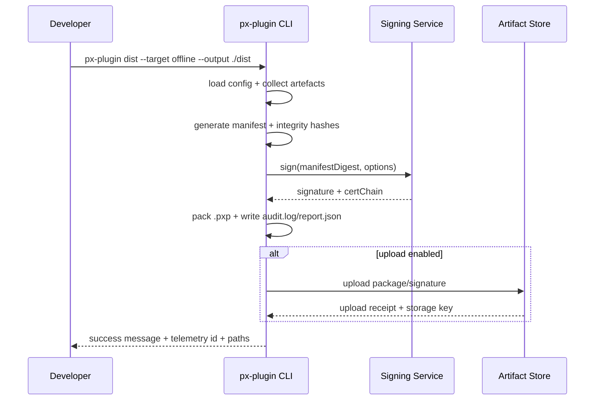

doc_id: PLG-PUBLISH-OFFLINE-001
scn_id: SCN-PUBLISH-HUB-001
title: PLG-PUBLISH-OFFLINE-001 - proto/publish
status: Draft
version: v0.1.0
repo_key: powerx-plugin
scope: powerx-plugin
layer: proto
domain: publish
scenario_title: "PowerX 插件开发与分发全链路"
owners:
  - name: Michael Hu
    role: Tech Steward
    contact: tech@artisan-cloud.com
  - name: Matrix-X
    role: Docs Coordinator
    contact: dev@artisan-cloud.com
contributors:
  - name: Li Wei
    role: CLI Lead
    contact: li.wei@artisan-cloud.com
linked_requirements:
  - type: scenario
    ref: SCN-PUBLISH-HUB-001
  - type: scenario
    ref: SCN-PUBLISH-OFFLINE-001
code_refs:
  - component: cli_dist_orchestrator
    path: 待落地（遵循 PowerXPlugin CLI 规范确定具体语言与目录）
    description: 负责解析命令参数并调度打包、签名、上传等子流程
  - component: offline_compiler
    path: 待落地（实现语言与目录由仓库实际方案决定）
    description: 汇总二进制/前端产物并生成 manifest 与完整性列表
  - component: offline_signer
    path: 待落地（实现语言与目录由仓库实际方案决定）
    description: 对接本地 PEM 或外部 KMS，生成签名与证书链
  - component: offline_verifier
    path: 待落地（实现语言与目录由仓库实际方案决定）
    description: 提供 `dist --verify` 校验 hash、签名与证书有效性
feature_flags:
  - name: PX_OFFLINE_IMPORT
    description: 启用 CLI 离线包产出与元数据信息生成
    default: false
    environments: [development, staging]
  - name: PX_CLI_SIGNING
    description: 控制是否强制验证签名配置（PEM/KMS），阻止无签名包输出
    default: true
    environments: [staging, production]
last_reviewed_at: 2025-10-28

---

# Positioning & Goals

- **业务目标**：为插件研发与交付团队生成安全、可追溯的 `.pxp` 离线包，完整包含 manifest、二进制、前端资源、迁移脚本与签名，满足无公网环境的导入需求。
- **场景关联**：支撑 `SCN-PUBLISH-OFFLINE-001` 的 Stage 1 打包环节，向 Marketplace `MKP-PUBLISH-OFFLINE-001` 与 PowerX Core `PX-PUBLISH-OFFLINE-001` 提供合规 artefact。
- **成功度量**：`px-plugin dist --target offline` P95 耗时 ≤ 90s；签名与哈希校验通过率 100%；离线包在 Admin 导入成功率 ≥ 98%；离线包体积报警率 < 5%。

PowerXPlugin 仓通过 CLI dist 流程统一离线包产出，结合签名、完整性校验与审计日志，为内网客户和合作伙伴提供可审计、可回滚的插件交付能力。

# Core Capabilities

- **Deterministic Packaging**：跨平台收集编译产物与资源，生成一致的 `.pxp` Artefact。
- **Cryptographic Integrity**：对接 PEM/KMS 签名体系，产出完整的签名与证书链。
- **Integrity Reporting**：生成 `integrity.txt`、`report.json`、`audit.log` 以支撑溯源与合规审计。
- **Artifact Distribution Hooks**：可选上传至对象存储，提供回执与地址给 Marketplace/Core。
- **Verification Tooling**：`dist --verify` 在本地与 CI 快速校验包体与签名，降低导入失败率。

# Target Roles & Responsibilities

- **插件研发工程师（Developer）**：在交付前执行 `px-plugin dist`、处理错误并输出 artefact。
- **CLI Steward / CLI Lead**：维护打包流水线、签名适配器与 Telemetry，上线前验证跨平台兼容性。
- **Marketplace 运营/管理员**：接收并登记离线包，依赖报告与签名信息进行审核。
- **Ops / Compliance 团队**：关注签名证书、审计日志、包体存储安全策略。

# Concept & Scope

- **前置条件**
  - 开发仓库已完成 `make build`（后端二进制）与 `npm run build`（Admin UI 输出）。
  - Feature Flag `PX_OFFLINE_IMPORT=1` 生效，CLI 可读取离线配置。
  - 已配置签名材料：本地 PEM (`--sign`, `--key`) 或 KMS (`--kms-key-id`, `--kms-region`)。
  - `px-plugin.config.ts` 定义 artefact 源、忽略列表、版本策略、上传配置。
  - 需要访问对象存储或共享网络盘时，凭据通过 `PX_ARTIFACT_STORE_*` 环境变量注入。
- **输入/输出**
  - 输入：`plugin.yaml`、`manifest.json`、编译后的 `backend/bin/**`、`web-admin/.output/**`、`docs/contracts/**`、可选 `extensions/**`。
  - 输出：`<plugin>-<version>-<os>-<arch>.pxp`、`integrity.txt`（SHA256 列表）、`manifest.signature`、`dist/report.json`、`dist/audit.log`。
- **边界**
  - 不涵盖 Marketplace 审核/分发、PowerX Core 安装流程或 Admin 向导交互。
  - 不负责证书申请、KMS 配置流程，仅消费已存在的签名服务。
  - 不处理在线发布命令（`px-plugin publish`），该能力由 Online Usecase 负责。

# Architecture & Workflow

## 模块分解

| 模块 | Scope | 职责 | 实现备注 |
|------|-------|------|----------|
| CLI Orchestrator | powerx-plugin | 解析参数、加载配置、调度编译/签名/上传子任务 | 具体语言与目录由 CLI 实现方案确定，遵循 PowerXPlugin CLI 规范 |
| Offline Compiler | powerx-plugin | 收集 artefact、执行压缩、生成 manifest 与 integrity 列表 | 需支持多平台产物与差分资源策略 |
| Signing Adapter | powerx-plugin | 对接 PEM/KMS/外部签名服务，输出证书链与签名文件 | 应提供可插拔接口，支持本地与远程签名 |
| Verification Toolkit | powerx-plugin | `dist --verify` 与 CI 校验逻辑，覆盖 hash/signature 双检 | 暴露给 CLI 和流水线脚本，返回结构化诊断 |
| Artifact Store Client | powerx-plugin | 管理对象存储上传、预签名 URL、重试策略 | 需要支持 S3/OSS/MinIO 等实现 |
| Telemetry Emitter | powerx-plugin | 记录打包耗时、包体大小、失败原因并上报 | 与 Workflow Metrics 对齐字段，关联审计 ID |

## 打包流程

# Interface & Configuration Contracts

- **CLI 命令**
  - `px-plugin dist --target offline --output ./dist --sign cert.pem --key key.pem`：标准离线打包，生成 `.pxp`、`integrity.txt`、`manifest.signature`、`audit.log`。
  - `px-plugin dist --target offline --kms-key-id <arn> --kms-region <region>`：对接云 KMS，CLI 会请求签名服务返回 CMS。
  - `px-plugin dist --verify ./dist/<pkg>.pxp --signature ./dist/manifest.signature`：校验 hash 与签名，返回详细诊断。
- **配置**
  - `px-plugin.config.ts`：`offline.targets[]` 声明 `os/arch`、`entry`, `assets`, `ignore` 列表；`artifactStore` 节点配置 S3/OSS bucket、prefix、region；`signer` 节点定义 PEM 或 KMS 参数。
  - 环境变量：`PX_ARTIFACT_STORE_ENDPOINT`, `PX_ARTIFACT_STORE_ACCESS_KEY`, `PX_ARTIFACT_STORE_SECRET`, `PX_SIGNING_ENDPOINT`。
- **输出文件结构**
  - `dist/<plugin>/<version>/<os>-<arch>/package.pxp`：tar+gzip 包体。
  - `dist/.../integrity.txt`：包含每个文件的 SHA256 与相对路径。
  - `dist/.../manifest.signature`：CMS detached signature（base64）。
  - `dist/.../report.json`：记录 hash、大小、签名策略、存储地址、Telemetry ID。
- **外部交互**
  - `PUT <signed-url>` / S3 multipart：用于上传离线包与签名文件，带重试与分块上传。
  - 可选 `POST /telemetry/offline-dist`：向 Workflow Metrics 汇报构建指标。

# Implementation Checklist

| 项目 | 描述 | 完成状态 | 负责人 |
|------|------|----------|--------|
| 打包编译 | 支持多平台（linux/windows/mac）、增量缓存、Source Map | [ ] | Li Wei |
| 签名适配 | 兼容 PEM、KMS、外部签名服务，错误提示可读 | [ ] | Michael Hu |
| 验证管线 | `dist --verify` 与 CI 校验脚本 | [ ] | Li Wei |
| 上传集成 | S3/OSS 分片上传、重试、进度日志 | [ ] | Matrix-X |
| 报表与审计 | 生成 `report.json`、`audit.log` 并链路 telemetry id | [ ] | Matrix-X |
| 文档同步 | 更新 `docs/guides/offline-dist.md`、CLI help text | [ ] | Docs Steward Team |

# Quality Assurance Strategy

- **单元测试**：`compiler.spec.ts` 验证 artefact 过滤、hash 生成；`signer.spec.ts` 覆盖 PEM/KMS 参数校验与错误提示；`verifier.spec.ts` 覆盖离线验证成功/失败分支。
- **集成测试**：CI pipeline 运行 `px-plugin dist --target offline` 生成样例包，调用 mock KMS & S3；验证分片上传、`report.json`、`telemetry` 输出。
- **端到端验证**：联合 PowerX Core/Marketplace，演练 “打包 → Marketplace 离线上传 → Admin 导入 → 回滚”；记录操作手册与审计数据。
- **非功能测试**：大包（>200MB）压缩耗时、并发上传性能、Windows/WSL 路径兼容、签名服务不可用时的降级重试。

# Observability & Telemetry

- **指标**：`offline.dist.duration_ms`（P95 ≤ 90s）、`offline.dist.size_bytes`、`offline.dist.failures_total`、`offline.dist.upload.retry_count`。
- **日志**：CLI 结构化日志 `dist.log` 输出 `pluginId`, `version`, `target`, `hash`, `signer`, `artifactStore`；失败场景记录错误堆栈与 KMS 请求 ID。
- **告警**：签名失败、KMS 超时、包体超限触发告警（Slack `#powerx-plugin-alerts` + PagerDuty L2）；连续三次打包失败触发值班升级。
- **Dashboards**：Workflow Metrics - Offline Dist dashboard；Grafana 离线包大小趋势；S3 上传成功率面板。

# Rollback & Recovery

- **回滚步骤**：如 CLI 引入缺陷，通过 npm dist-tag 回滚 CLI 版本并撤销相关 PR；临时关闭 `PX_CLI_SIGNING` 允许热补丁包产出（需值班审批）。
- **补救措施**：保留 `dist/.tmp` 调查失败 artefact；提供 `px-plugin dist --resume` 继续未完成打包；必要时执行 `scripts/offline/cleanup-staging.ts` 清理缓存。
- **数据修复**：重新打包并上传正确 artefact；若签名证书泄露，立即吊销（CRL）并通知 Marketplace 更新信任列表。

# Risks & Mitigations

| 风险/事项 | 影响 | 缓解方案 | 负责人 | ETA |
|-----------|------|----------|--------|-----|
| 包体尺寸超限影响传输 | 发布耗时、失败率上升 | 启用差分资源、提示压缩策略、分片上传 | Li Wei | 2025-02-18 |
| 签名证书或 KMS 密钥过期 | 离线包导入失败 | CLI 预警（提前 14 天）、自动续签脚本、Fallback PEM | Michael Hu | 2025-02-01 |
| 跨平台路径/权限差异 | Windows/WSL 打包失败 | 制定平台兼容测试矩阵，路径标准化，文档指引 | Docs Steward Team | 2025-01-30 |
| 上传凭据泄露 | 安全风险、包体被篡改 | 支持临时凭据、操作审计、自动 rotate secrets | Matrix-X | 2025-02-10 |

# References & Links

- 场景文档：`docs/scenarios/publish/SCN-PUBLISH-OFFLINE-001.md`
- 相关规范：`docs/standards/powerx-plugin/integration/01_plugin_lifecycle/package.md`、`docs/standards/powerx-marketplace/pxp插件压缩包.md`
- 代码示例：`https: "//github.com/ArtisanCloud/PowerXPlugin/pulls?q=offline+dist`"
- Checklists：`docs/standards/powerx-plugin/lifecycle/checklists/release-checklist.md`

> 完成打包与文档更新后，请执行 `npm run publish: "usecases -- --scn-id SCN-PUBLISH-HUB-001 --validate-only` 校验结构，并与 Marketplace/Core 团队联合演练一次离线导入链路。"
