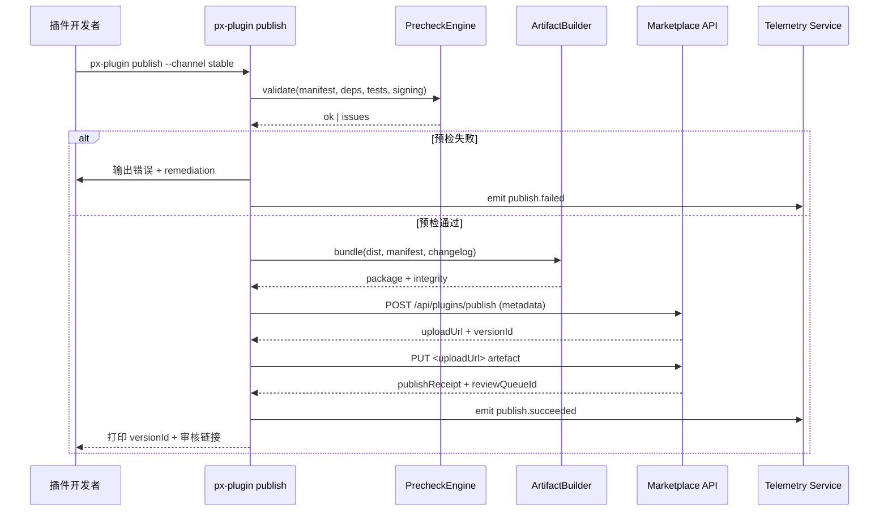

doc_id: PLG-PUBLISH-ONLINE-001
scn_id: SCN-PUBLISH-HUB-001
title: PLG-PUBLISH-ONLINE-001 - proto/publish
status: Draft
version: v0.1.0
repo_key: powerx-plugin
scope: powerx-plugin
layer: proto
domain: publish
scenario_title: "PowerX 插件开发与分发全链路"
owners:
  - name: Michael Hu
    role: Tech Steward
    contact: tech@artisan-cloud.com
  - name: Matrix-X
    role: Docs Coordinator
    contact: dev@artisan-cloud.com
contributors:
  - name: Li Wei
    role: CLI Lead
    contact: li.wei@artisan-cloud.com
linked_requirements:
  - type: scenario
    ref: SCN-PUBLISH-HUB-001
  - type: scenario
    ref: SCN-PUBLISH-ONLINE-001
code_refs:
  - component: publish_command
    path: cli/src/commands/publish.ts
    description: `px-plugin publish` 命令入口，串联预检、打包、上传与回执展示
  - component: publish_pipeline
    path: cli/src/lib/publish/pipeline.ts
    description: 多阶段发布流水线，负责预检、签名、上传、审核触发
  - component: marketplace_registry_client
    path: cli/src/clients/marketplaceRegistry.ts
    description: 封装 Marketplace 版本登记与审核 API
feature_flags:
  - name: PX_PLUGIN_PUBLISH
    description: 控制发布命令是否可用及对应 Marketplace Endpoint
    default: true
    environments: [staging, production]
  - name: PX_PLUGIN_PUBLISH_PRECHECK
    description: 开启严格预检流程（依赖、签名、测试）阻断风险版本
    default: true
    environments: [development, staging, production]
last_reviewed_at: 2025-10-28

---

# Usecase Overview

- **业务目标**：让插件研发团队通过 `px-plugin publish` 一站式生成在线发布 artefact、完成质量门禁、上传并登记 Marketplace 版本。
- **成功度量**：publish 命令执行成功率 ≥ 99%；发布至审核入队耗时 ≤ 10 分钟；预检误报率 < 2%；Telemetry 覆盖率 ≥ 98%。
- **场景关联**：支撑 `SCN-PUBLISH-ONLINE-001` Stage 1，向 `MKP-PUBLISH-ONLINE-001`（审核上架）和 `PX-PUBLISH-ONLINE-001`（安装/升级）提供可靠 artefact 与版本元数据。

PowerXPlugin 仓的在线发布能力负责将构建产物、manifest、签名与自动升级策略汇总，并在 Marketplace 创建待审版本，是在线生态分发链路的起点。

# Context & Assumptions

- Feature Flags `PX_PLUGIN_PUBLISH` 与 `PX_PLUGIN_PUBLISH_PRECHECK` 已按环境开启并配置正确的 Marketplace Endpoint。
- 发布者具备 `plugin:publish` 权限，Marketplace API Token 已写入 `~/.powerx-plugin/config.json` 或环境变量。
- 构建流水线已产出最新 artefact（后端二进制、前端 bundle、迁移脚本），CI 质量门禁通过。
- CLI 能访问签名服务（本地 PEM 或 `PX_SIGNING_ENDPOINT`）与对象存储（`PX_ARTIFACT_STORE_*` 临时凭据）。

# Core Capabilities

- **Pre-flight Validation**：校验版本号递增、依赖兼容性、权限声明、测试覆盖率、签名材料。
- **Deterministic Packaging**：对构建输出进行哈希、压缩与签名，生成 `.pxp` 或多产物 bundle。
- **Metadata Assembly**：生成发布说明、风险提示、灰度策略并写入 Marketplace 版本记录。
- **Upload & Registration**：上传 artefact、提交审核任务、获取 `versionId`/`publishId` 回执。
- **Telemetry & Audit**：记录发布耗时、失败分类、审核链接，供后续溯源与改进。

# Target Roles & Responsibilities

- **插件研发工程师**：执行 publish 命令、补充发布说明、处理预检失败并重新触发。
- **CLI Steward**：维护命令实现、配置 schema、兼容性矩阵与文档。
- **Marketplace 审核员**：消费 CLI 输出的版本记录、测试报告、签名链路，决定上线时间。
- **Ops / Product**：根据发布回执安排灰度策略及运营公告。

# Concept & Scope

- **前置条件**
  - `px-plugin lint`、`px-plugin test`、CI Pipeline 均通过且产出报告。
  - `px-plugin.config.ts` 或 `publish.yml` 已声明渠道、租户黑白名单、回滚方案。
  - 具备网络访问 Marketplace、签名服务、对象存储与 Telemetry 的能力。
- **输入**
  - `manifest.json`, `plugin.yaml`, 构建 artefact (`dist/**`), `CHANGELOG.md`, 测试与覆盖率报告。
  - 发布配置：渠道（stable/beta）、灰度批次、自动升级策略、风险标记。
- **输出**
  - `publish-receipt.json`（`publishId`, `versionId`, `reviewQueueId`, `nextCheckAt`）。
  - Artefact 上传地址、完整性校验文件、签名与证书链。
  - Telemetry 事件与审计日志（`plugin.publish.started|succeeded|failed`）。
- **边界**
  - 不处理 Marketplace 内部审核/通知逻辑，亦不直接触发租户安装。
  - 不覆盖离线包产出（参见 `PLG-PUBLISH-OFFLINE-001`）或 Core 安装执行细节。

# Architecture & Workflow

## 模块分解

| 模块 | Scope | 职责 | 代码入口 / Host |
|------|-------|------|-----------------|
| PublishCommand | powerx-plugin | 解析 CLI 参数、驱动发布流水线、输出回执 | `cli/src/commands/publish.ts` |
| PublishPipeline | powerx-plugin | 协调预检、打包、签名、上传、审核触发 | `cli/src/lib/publish/pipeline.ts` |
| PrecheckEngine | powerx-plugin | 校验版本、依赖、权限、测试报告、签名配置 | `cli/src/lib/publish/precheck.ts` |
| ArtifactBuilder | powerx-plugin | 聚合 artefact、生成 `.pxp` 与完整性文件 | `cli/src/lib/artifacts/builder.ts` |
| MarketplaceRegistryClient | powerx-plugin | 调用 Marketplace 发布/审核 API、处理重试 | `cli/src/clients/marketplaceRegistry.ts` |
| TelemetryEmitter | powerx-plugin | 输出 publish 指标、日志与审计 trail | `cli/src/lib/telemetry/emitter.ts` |

## 流程与时序

# Contracts & Interfaces

- **CLI 命令**
  - `px-plugin publish [--channel <stable|beta>] [--notes ./release.md] [--skip-precheck]`
  - 环境变量：`PX_MARKETPLACE_API_URL`, `PX_MARKETPLACE_TOKEN`, `PX_SIGNING_PROFILE`, `PX_ARTIFACT_STORE_ENDPOINT`, `PX_TELEMETRY_ENDPOINT`.
  - 配置文件：`px-plugin.config.ts` / `publish.yml` 定义渠道、租户过滤、回滚策略、自动升级。
- **外部 API / 调用**
  - `POST /api/marketplace/plugins/publish` — 提交版本元数据与审核信息，使用幂等键 `publishRequestId`。
  - `PUT <signed-url>` — 上传 `.pxp` 或多产物 bundle，支持分片与断点续传。
  - `POST /api/marketplace/plugins/{versionId}/submit-review` — 手动补充审核信息或加速通道。
  - `POST /telemetry/plugin/publish` — 汇报 publish 指标、错误分类、回执信息。
- **配置与脚本**
  - `px-plugin.config.ts`：`publish.targets[]`, `channels`, `telemetry`, `artifacts`, `signer`。
  - `publish.yml`：灰度批次、租户黑白名单、自动升级策略、回滚计划。
  - `scripts/publish/generate-release-notes.ts`：自动生成 release notes 模板。

# Implementation Checklist

| 项目 | 描述 | 完成状态 | 负责人 |
|------|------|----------|--------|
| 发布命令实现 | `px-plugin publish` 参数解析、帮助信息、多渠道支持 | [ ] | Li Wei |
| 预检引擎 | 版本冲突、依赖/权限校验、测试覆盖率阈值控制 | [ ] | Michael Hu |
| Artefact 构建 | 聚合前后端 artefact、生成 `.pxp`、完整性文件、签名 | [ ] | CLI Team |
| Marketplace API 客户端 | 认证、重试、错误分类、审计日志记录 | [ ] | Matrix-X |
| Telemetry 集成 | 上报 publish 事件、耗时、失败分类、versionId | [ ] | Workflow Telemetry Steward |
| 文档与 SOP | 更新 `docs/guides/publish/online.md`、CLI README、示例配置 | [ ] | Docs Steward Team |

# Testing Strategy

- **单元测试**：`publish.command.spec.ts` 覆盖参数解析、错误提示；`precheck.spec.ts` 验证版本/依赖/签名校验；`marketplaceRegistry.spec.ts` Mock API 重试与异常。
- **集成测试**：CI 执行 `pnpm test:integration --filter publish-online`，模拟 Marketplace API、对象存储、签名服务。
- **端到端验证**：跨仓联合演练 “构建 → publish → 审核 → 安装”，记录 release notes 与回滚脚本。
- **非功能测试**：大文件（>300MB）上传性能、弱网重试、并发发布冲突、Windows/macOS/Linux 兼容。

# Observability & Ops

- **指标**：`plugin.publish.duration_ms`, `plugin.publish.precheck.failure_rate`, `plugin.publish.retry.count`, `plugin.publish.bundle.size_bytes`.
- **日志**：结构化 CLI 日志记录 `pluginId`, `version`, `channel`, `publishId`, `status`, `elapsedMs`, `errorCode`, `requestId`。
- **告警**：连续 3 次发布失败通知 `#powerx-plugin-alerts`；publish 耗时 > 10 分钟触发 PagerDuty；Telemetry 丢失率 > 5% 告警 CLI Steward。
- **Dashboards**：Workflow Metrics “Plugin Online Publish” 仪表板、Grafana 发布 SLO 面板、Sentry CLI 异常监控。

# Rollback & Failure Handling

- **回滚步骤**：通过 npm dist-tag 回滚 CLI 版本；必要时关闭 `PX_PLUGIN_PUBLISH` 并通知 Marketplace 暂停审核。
- **补救措施**：提供 `px-plugin publish --resume <publishId>` 继续中断流程；保存 `publish-debug.log`；失败场景输出支持链接与排障指引。
- **数据修复**：与 Marketplace 协作撤回错误版本、清理通知；重建 Telemetry 记录；调整自动升级策略。

# Risks & Mitigations

| 风险/事项 | 影响 | 缓解方案 | 负责人 | ETA |
|-----------|------|----------|--------|-----|
| Marketplace API 变更导致 CLI 不兼容 | 发布命令失败、生态阻塞 | 建立契约测试、版本协商、提供双客户端兼容层 | CLI Team | 2025-01-31 |
| 预检误报/漏报 | 阻断发布或留存风险版本 | 维护白名单、引入 Telemetry 反馈回路、定期复盘规则 | Michael Hu | 2025-02-15 |
| Artefact 上传中断 | 版本登记失败、需人工干预 | 支持断点续传、自动重试、resume 命令与进度提示 | Li Wei | 2025-02-05 |
| Telemetry 暴露敏感信息 | 合规风险、阻碍审计 | 字段脱敏、TLS 传输、配置字段白名单 | Workflow Telemetry Steward | 2025-01-20 |

# References & Links

- 场景文档：`docs/scenarios/publish/SCN-PUBLISH-ONLINE-001.md`
- 相关规范：`docs/standards/powerx-plugin/integration/online_publish.md`
- CLI 指南：`docs/guides/publish/online.md`
- 代码示例：`https://github.com/ArtisanCloud/PowerXPlugin/pulls?q=px-plugin+publish`

> Seed 更新后，请执行 `npm run publish:usecases -- --scn-id SCN-PUBLISH-HUB-001 --validate-only` 校验结构，并与 Marketplace 团队演练一次在线发布链路。
