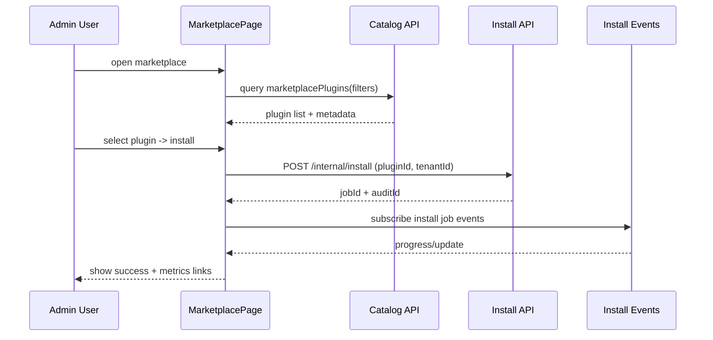

doc_id: PX-ADMIN-PUBLISH-ONLINE-001
scn_id: SCN-PUBLISH-HUB-001
title: PX-ADMIN-PUBLISH-ONLINE-001 - ui/marketplace
status: Draft
version: v0.1.0
repo_key: powerx-admin
scope: powerx-admin
layer: ui
domain: marketplace
scenario_title: "PowerX 插件开发与分发全链路"
owners:
  - name: Matrix-X
    role: Docs Coordinator
    contact: dev@artisan-cloud.com
  - name: Zoe Chen
    role: Product Owner
    contact: zoe@artisan-cloud.com
contributors: []
linked_requirements: []
code_refs:
  - path: apps/admin/src/pages/marketplace/PluginMarketplace.vue
  - path: apps/admin/src/services/marketplaceCatalogApi.ts
feature_flags:
  - PX_MARKETPLACE_SYNC
  - PX_ADMIN_MARKETPLACE
last_reviewed_at: 2025-10-25

---

# Usecase Overview

- **业务目标**：在 PowerX Admin 中提供插件 Marketplace 视图，支持搜索、过滤、安装、升级、卸载与指标可视化，确保 Marketplace 发布的插件能快速被租户发现和部署。
- **触发角色**：租户管理员、运维团队、支持工程师。
- **成功度量**：目录刷新 ≤ 1 分钟；安装向导成功率 ≥ 99%；插件详情页加载延迟 ≤ 2 秒；错误提示满意度 ≥ 90%。
- **场景关联**：消费 `PX-PUBLISH-ONLINE-001` 的目录数据，支撑 `SCN-PUBLISH-ONLINE-001` 的展示与安装。

# Context & Assumptions

- **Feature Flags**：`PX_ADMIN_MARKETPLACE` 打开模块；依赖 Backend `PX_MARKETPLACE_SYNC`。
- **依赖**：GraphQL `marketplacePlugins`、`admin.install` APIs、SSE 安装事件、Workflow Metrics。
- **输入**：Catalog 数据（多语言）、Marketplace 发布事件、安装状态。
- **输出**：插件列表、详情、安装向导、指标面板、告警通知。
- **边界**：不处理 Marketplace 审核；不执行实际安装（交给 Backend）；离线导入另有向导。

# Solution Blueprint

## 体系分解

| 模块 | 组件 | 责任 | 入口 |
|------|------|------|------|
| MarketplacePage | `PluginMarketplace.vue` | 显示目录、搜索、筛选、分页 | `apps/admin/src/pages/marketplace` |
| PluginDetail | `PluginDetailDrawer.vue` | 展示元数据、版本、指标、操作按钮 | 同上 |
| InstallWizard | `InstallWizard.vue` | 安装流程（确认→租户配置→执行→结果） | `apps/admin/src/components` |
| MetricsPanel | `PluginMetrics.vue` | 展示下载量、错误率、安装情况 | `apps/admin/src/components` |
| CatalogClient | `marketplaceCatalogApi.ts` | 调用 GraphQL/REST、处理缓存 | `apps/admin/src/services` |

## 流程与时序

# Contracts & Interfaces

- **GraphQL**
  - `marketplacePlugins(filters)`：返回分页、分类、标签、评分。
  - `marketplacePlugin(id)`：详情，含版本、变更日志、兼容性。
- **REST**
  - `POST /internal/install`、`DELETE /internal/install/{pluginId}`、`GET /internal/install/jobs/{id}`。
- **SSE/WebSocket**
  - `install.job.events`：安装进度/日志。
- **配置**
  - `admin.marketplace.featuredTags`、`admin.marketplace.installRetentionDays`、`admin.marketplace.metricWidgets`。

# Implementation Checklist

| 项目 | 描述 | 完成状态 | 负责人 |
|------|------|----------|--------|
| 列表体验 | 搜索、标签、无结果提示 | [ ] | Zoe Chen |
| 详情抽屉 | 多语言、变更日志、依赖展示 | [ ] | Dave |
| 安装向导 | 多租户选择、权限确认、回滚 | [ ] | Carol |
| 指标面板 | Workflow Metrics 嵌入、阈值显示 | [ ] | Matrix-X |
| 文档 | `docs/guides/admin/marketplace.md` | [ ] | Matrix-X |

# Testing Strategy

- **单元测试**：Vue 组件测试；GraphQL 客户端缓存逻辑、安装 API 调用。
- **端到端**：Cypress `marketplace-install.cy.ts`（浏览→安装→回滚）；多语言验证。
- **可靠性测试**：SSE 断线恢复；安装失败时 UI 告警；缓存过期自动刷新。
- **性能测试**：插件列表 1000+ 条分页仍维持 FPS ≥ 50；预加载详情、懒加载图片。
# Observability & Ops

- **指标**：`admin.marketplace.page_load_ms`、`admin.marketplace.install_success_rate`、`admin.marketplace.install_duration_ms`。
- **日志**：`admin_marketplace.log`（`pluginId`、`tenantId`、`action`、`status`）。
- **告警**：安装失败率 > 5%；GraphQL 请求错误；SSE 超时。
- **Dashboards**：Admin Marketplace Monitor、Sentry release health。

# Rollback & Failure Handling

- **回滚**：关闭 `PX_ADMIN_MARKETPLACE`；回滚 Admin release；恢复至旧 UI。
- **补救措施**：提供 CLI 安装指引；显示 Backend 状态链接；失败时导出日志。
- **数据修复**：手动刷新缓存；重新加载 Marketplace 数据；`scripts/marketplace/resync_catalog.ts`。

# Follow-ups & Risks

| 风险/事项 | 影响 | 缓解方案 | 负责人 | ETA |
|-----------|------|----------|--------|-----|
| 多语言翻译缺失 | 用户体验差 | 与 i18n 团队同步翻译；默认 fallback | Zoe Chen | 2025-02-12 |
| 安装权限控制不足 | 安全威胁 | 集成 RBAC、中台权限校验 | Matrix-X | 2025-02-05 |
| 缓存陈旧 | 展示错误版本 | GraphQL incremental fetch、定时刷新、手动刷新按钮 | Dave | 2025-02-08 |

# References & Links

- 场景：`docs/scenarios/publish/SCN-PUBLISH-ONLINE-001.md`
- 标准：`docs/standards/powerx-admin/plugins/admin_workflow.md`
- 设计：`Figma › Admin Marketplace`
- 代码 PR：`https://github.com/ArtisanCloud/PowerXAdmin/pulls?q=marketplace`

> 完成后请运行 `node scripts/site/sync-scenario-pages.mjs --scn-id SCN-PUBLISH-HUB-001 --with-seeds` 同步站点，并执行 `npm run publish:usecases -- --scn-id SCN-PUBLISH-HUB-001 --validate-only`。
