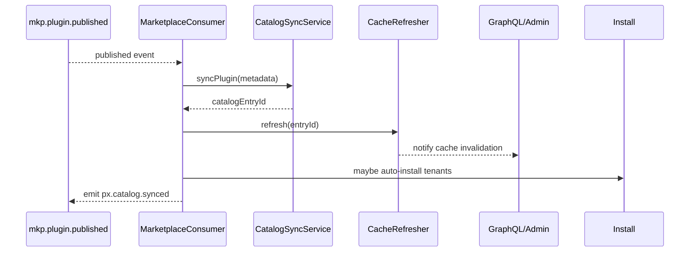

doc_id: PX-PUBLISH-ONLINE-001
scn_id: SCN-PUBLISH-HUB-001
title: PX-PUBLISH-ONLINE-001 - service/catalog
status: Draft
version: v0.1.0
repo_key: powerx-backend
scope: powerx-backend
layer: service
domain: catalog
scenario_title: "PowerX 插件开发与分发全链路"
owners:
  - name: Michael Hu
    role: Tech Steward
    contact: tech@artisan-cloud.com
  - name: Carol
    role: Platform Architect
    contact: carol@artisan-cloud.com
contributors: []
linked_requirements: []
code_refs:
  - path: services/catalog/catalog_sync_service.go
  - path: api/catalog_install.go
  - path: events/marketplace_consumer.go
feature_flags:
  - PX_MARKETPLACE_SYNC
  - PX_INSTALL_ORCHESTRATOR
last_reviewed_at: 2025-10-25

---

# Usecase Overview

- **业务目标**：监听 Marketplace 发布事件，完成目录同步、缓存刷新、安装编排与 License 校验，确保新插件在 5 分钟内可供租户安装。
- **触发角色**：Marketplace 事件消费者、Admin 市场、租户安装脚本。
- **成功度量**：事件处理延迟 ≤ 60s；目录同步成功率 ≥ 99.5%；安装触发成功率 ≥ 99%；缓存刷新延迟 ≤ 30s。
- **场景关联**：承接 `MKP-PUBLISH-ONLINE-001`，向 `PX-ADMIN-PUBLISH-ONLINE-001` 和租户安装 API 提供数据。

# Context & Assumptions

- **Feature Flags**：`PX_MARKETPLACE_SYNC` 开启事件消费；`PX_INSTALL_ORCHESTRATOR` 控制安装流程。
- **依赖**：Kafka/NSQ 事件总线、Catalog DB、Redis 缓存、License 服务、Workflow Metrics。
- **输入**：`mkp.plugin.published` 事件（含 `pluginId`、`version`、`artifactId`、`metadata`）。
- **输出**：Catalog 条目（`px_catalog.plugins`）、GraphQL API 数据、安装任务、缓存更新事件、Admin 通知。
- **边界**：不执行 Marketplace 审核；不负责 Admin UI；离线流程另行处理。

# Solution Blueprint

## 体系分解

| 模块 | 组件 | 责任 | 入口 |
|------|------|------|------|
| MarketplaceConsumer | `events/marketplace_consumer.go` | 消费发布事件、幂等处理、写任务队列 | `cmd/catalog-sync/main.go` |
| CatalogSyncService | `services/catalog/catalog_sync_service.go` | Upsert 目录、处理多语言、依赖项 | `services/catalog` |
| CacheRefresher | `internal/cache/catalog_cache.go` | 刷新 Redis/CDN、通知 Admin | `internal/cache` |
| InstallOrchestrator | `services/install/install_orchestrator.go` | 针对 auto-install 租户触发安装 | `services/install` |

## 流程与时序

# Contracts & Interfaces

- **Events**
  - 输入：`mkp.plugin.published`（schema 版本化，含 `checksum`、`channel`、`pricing`）。
  - 输出：`px.catalog.synced`、`px.catalog.sync_failed`、`px.install.triggered`。
- **REST/GraphQL**
  - `POST /internal/catalog/refresh`（Admin 手动触发）；GraphQL `catalogPlugins` 提供 UI 数据。
- **配置**
  - `catalog.sync.concurrency`、`catalog.cache.ttl_seconds`、`install.auto.tenants`、`marketplace.event.max_retry`。

# Implementation Checklist

| 项目 | 描述 | 完成状态 | 负责人 |
|------|------|----------|--------|
| 事件消费 | 幂等 key、死信队列、重试策略 | [ ] | Carol |
| Catalog Upsert | 多语言字段、依赖/权限校验 | [ ] | Michael Hu |
| Cache 刷新 | Redis + CDN + GraphQL 层 | [ ] | Michael Hu |
| Auto Install | 安装编排、License 校验、回滚 | [ ] | Carol |
| 文档 | 更新 `docs/standards/powerx-backend/catalog_sync.md` | [ ] | Matrix-X |

# Testing Strategy

- **单元测试**：`catalog_sync_service_test.go`、`marketplace_consumer_test.go`、`install_orchestrator_test.go`。
- **集成测试**：Kafka + DB + Redis sandbox；模拟失败事件；验证 cache 刷新。
- **端到端**：与 Marketplace/ Admin 结合演练发布→展示→安装；统计时延。
- **非功能**：吞吐（每分钟 50 events）、事件乱序、分区扩容、灾难恢复。

# Observability & Ops

- **指标**：`catalog.sync.duration_ms`、`catalog.sync.success_rate`、`catalog.sync.retry_count`、`install.auto.success_rate`。
- **日志**：`catalog_sync.log`（`eventId`、`pluginId`、`version`、`status`、`retry`）。
- **告警**：同步失败率 > 2%；事件积压 > 100；缓存刷新失败；安装自动化错误。
- **Dashboards**：Catalog Sync Grafana；Kafka lag 监控；Sentry for install orchestrator。

# Rollback & Failure Handling

- **回滚**：暂停消费者（Feature Flag）、回滚部署；恢复到上一 Catalog 版本（DB snapshot）。
- **补救措施**：手动触发 `catalog refresh`；重放事件；清理损坏缓存；`px-install rollback`。
- **数据修复**：SQL 脚本修复 catalog entries；`scripts/catalog/rebuild_cache.go` 重建缓存。

# Follow-ups & Risks

| 风险/事项 | 影响 | 缓解方案 | 负责人 | ETA |
|-----------|------|----------|--------|-----|
| 事件模式变更 | 消费失败 | Schema registry + 版本协商 + 回滚策略 | Michael Hu | 2025-02-12 |
| Cache 与 DB 不一致 | Admin 显示错误 | 双写校验、定期全量比对、自动修复 | Carol | 2025-02-20 |
| Auto-install 失败 | 客户影响 | 幂等安装、告警与自动回滚 | Matrix-X | 2025-02-05 |

# References & Links

- 场景：`docs/scenarios/publish/SCN-PUBLISH-ONLINE-001.md`
- 标准：`docs/standards/powerx-backend/catalog_sync.md`
- 代码仓：`https://github.com/ArtisanCloud/PowerX/tree/dev/services/catalog`
- 设计：`ADR-2024-CATALOG-SYNC.md`

> Seed 完成后请运行 `node scripts/site/sync-scenario-pages.mjs --scn-id SCN-PUBLISH-HUB-001 --with-seeds --force` 同步站点，并执行 `npm run publish:usecases -- --scn-id SCN-PUBLISH-HUB-001 --validate-only`。
