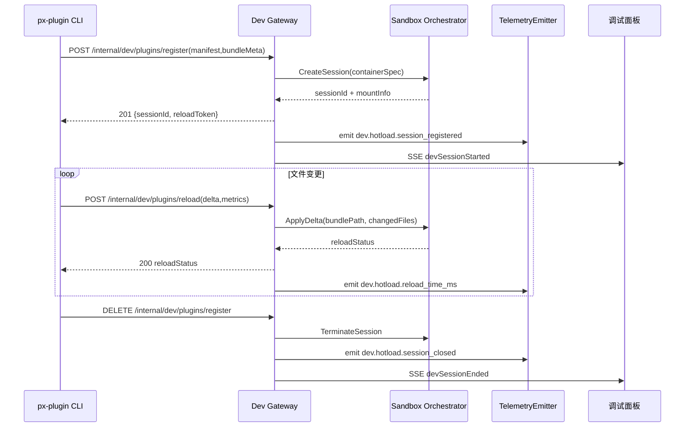

doc_id: PX-DEV-HOTLOAD-001
scn_id: SCN-PUBLISH-HUB-001
title: PX-DEV-HOTLOAD-001 - service/dev
status: Draft
version: v0.1.0
repo_key: powerx-backend
scope: powerx-backend
layer: service
domain: dev
scenario_title: "PowerX 插件开发与分发全链路"
owners:
  - name: Michael Hu
    role: Tech Steward
    contact: tech@artisan-cloud.com
  - name: Matrix-X
    role: Docs Coordinator
    contact: dev@artisan-cloud.com
contributors: []
linked_requirements: []
code_refs:
  - path: services/dev_plugin/dev_session_service.go
  - path: api/dev_gateway.go
  - path: internal/sandbox/orchestrator.go
feature_flags:
  - PX_DEV_PLUGIN_HOTLOAD
  - PX_DEV_SESSION_AUDIT
last_reviewed_at: 2025-10-25

---

# Usecase Overview

- **业务目标**：提供稳定的 Dev API 与沙盒运行环境，使 `px-plugin dev --watch` 在秒级注册、毫秒级热重载下运行，并输出完整审计与调试信息。
- **触发角色**：插件研发工程师、PowerX 平台后端 Stewards、Admin 调试面板使用者。
- **成功度量**：注册接口 P95 ≤ 400ms、热重载成功率 ≥ 99%、沙盒会话释放时间 ≤ 30s、错误事件在 5s 内可见于 Admin 调试面板。
- **场景关联**：支撑主场景《SCN-DEV-HOTLOAD-001》，同时为离线/在线发布流程提供一致的 manifest 契约与审计轨迹。

# Context & Assumptions

- **Feature Flags**：`PX_DEV_PLUGIN_HOTLOAD`、`PX_DEV_SESSION_AUDIT` 必开；若需跨租户调试启用 `px.dev.multi_tenant`。
- **依赖服务**：Sandbox Orchestrator、Redis session 缓存、OSS/S3 临时存储、Workflow Metrics Kafka topic。
- **认证**：CLI 使用 OAuth2 Client Credentials + mTLS，Gateway 负责证书校验与租户识别；Token 有效期 30 分钟可刷新。
- **输入**：插件 manifest、bundle 元数据、增量变更（`changedFiles`、hash）、CLI 构建指标。
- **输出**：沙盒 sessionId、reloadToken、Admin SSE 事件、Telemetry 指标、审计日志。
- **边界**：不负责 CLI 构建细节、Admin UI 呈现、Marketplace 审核；仅覆盖 Dev API 与沙盒生命周期。

# Solution Blueprint

## 体系分解

| 模块 | 主要组件/模块 | 责任 | 代码入口 |
|------|---------------|------|---------|
| DevSessionService | `services/dev_plugin/dev_session_service.go` | 管理 session 注册、热重载、终止、状态机 | `cmd/devapi/main.go` |
| DevGateway | `api/dev_gateway.go` | 暴露 REST/gRPC 接口，鉴权、限流、审计 | `api` |
| SandboxOrchestrator | `internal/sandbox/orchestrator.go` | 调度容器、挂载 bundle、资源隔离 | `internal/sandbox` |
| TelemetryEmitter | `internal/telemetry/dev_hotload_metrics.go` | 写入 Workflow Metrics/Kafka、SSE | `internal/telemetry` |

## 流程与时序

# Contracts & Interfaces

- **REST/gRPC**
  - `POST /internal/dev/plugins/register`：Body 包含 manifest、bundleMeta、cliVersion；返回 `sessionId/reloadToken`。
  - `POST /internal/dev/plugins/reload`：Body 包含 sessionId、reloadToken、`changedFiles`、`metrics`；超时 10s，支持重试幂等键。
  - `DELETE /internal/dev/plugins/register`：幂等，已注销返回 `204` 并告警。
- **Sandbox gRPC**：`CreateSandbox`、`ApplyBundleDelta`、`DestroySandbox`；需透传租户隔离参数与资源配额。
- **存储**：OSS/S3 预签名上传差异包；校验大小（默认 ≤200MB）。
- **配置**：`dev.sessions.max_per_tenant`、`dev.sessions.ttl_minutes`、`telemetry.dev_hotload.enabled`。

# Implementation Checklist

| 项目 | 描述 | 完成状态 | 负责人 |
|------|------|----------|--------|
| API 契约 | 更新 OpenAPI/Proto，声明错误码与节流策略 | [ ] | Michael Hu |
| 沙盒调度 | 支持增量挂载、资源隔离、自动回收 | [ ] | Carol |
| Token 管理 | Reload token 轮换、回收时同步撤销 | [ ] | Carol |
| Telemetry & 审计 | 指标、SSE、`PX_DEV_SESSION` 审计记录 | [ ] | Matrix-X |
| 限流与守护 | per-tenant 限流、Idle session 自动清理 | [ ] | Michael Hu |

# Testing Strategy

- **单元测试**：`dev_session_service_test.go` 覆盖状态机、token 校验、异常流程；`telemetry_emitter_test.go` 验证指标字段。
- **集成测试**：使用 mock Sandbox 验证 register/reload；结合真实 OSS/S3 端点测试上传与超限处理。
- **端到端**：`npm run e2e:dev-hotload` 启动沙盒集群，执行 CLI watch，校验 SSE 与 audit log。
- **非功能**：压力测试 10 并发 session；故障注入（网络抖动、沙盒重启）验证重试与回收策略。

# Observability & Ops

- **指标**：`dev.hotload.session_registered`、`dev.hotload.active_sessions`、`dev.hotload.reload_time_ms`、`dev.hotload.reload_failures`。
- **日志**：结构化 JSON（`sessionId`、`tenantId`、`pluginId`、`reloadDuration`、`errorCode`）；写入 ELK。
- **告警**：5 分钟内 `reload_failures` >5 触发 PagerDuty；session 回收失败自动触发清理任务并通知 `#powerx-dev-alerts`。
- **Dashboards**：Grafana `PowerX Dev Hotload`、Kibana sandbox 日志视图、Sentry `powerx-dev-api`。

# Rollback & Failure Handling

- **回滚**：Git revert Dev API 相关改动，重新部署上一镜像；恢复默认配置阈值。
- **补救措施**：`px-devapi cleanup --tenant <id>` 清除遗留 session；手动加入 reload token 黑名单。
- **数据修复**：Redis 手动删除 `dev:sessions:*`，在审计库记录操作；必要时重放 Telemetry。

# Follow-ups & Risks

| 风险/事项 | 影响 | 缓解方案 | 负责人 | ETA |
|-----------|------|----------|--------|-----|
| 沙盒资源争用导致热重载延迟 | 研发体验下降 | 建立 per-tenant 资源配额与优先级调度；定期压测 | Carol | 2025-03-10 |
| Dev API 与 CLI 版本不兼容 | CLI watch 失败 | 引入版本握手，CLI 提示升级；保持向后兼容 | Michael Hu | 2025-02-20 |
| Telemetry 缺失影响定位 | 运维盲区 | 默认开启指标采集并设快速告警 | Matrix-X | 2025-02-15 |

# References & Links

- 场景文档：`docs/scenarios/publish/SCN-DEV-HOTLOAD-001.md`
- 标准：`docs/standards/powerx-backend/plugins/dev_hotload_api.md`、`docs/standards/powerx-platform/telemetry/workflow_metrics.md`
- 代码仓：`https://github.com/ArtisanCloud/PowerX/tree/dev/services/dev-api`
- 设计：`ADR-2024-DEV-SESSION-MGMT.md`、`Figma › Dev Hotload Observability`

> Seed 完成后请更新 `docs/_data/docmap.yaml`（如字段变更），并运行 `npm run publish:usecases -- --scn-id SCN-PUBLISH-HUB-001 --validate-only` 校验。
