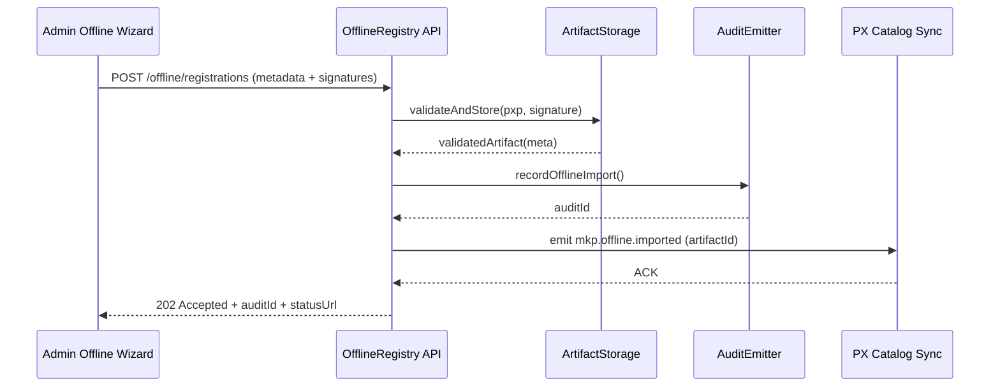

doc_id: MKP-PUBLISH-OFFLINE-001
scn_id: SCN-PUBLISH-HUB-001
title: MKP-PUBLISH-OFFLINE-001 - api/marketplace
status: Draft
version: v0.1.0
repo_key: powerx-marketplace
scope: powerx-marketplace
layer: api
domain: marketplace
scenario_title: "PowerX 插件开发与分发全链路"
owners:
  - name: Matrix-X
    role: Docs Coordinator
    contact: dev@artisan-cloud.com
  - name: Zoe Chen
    role: Marketplace Lead
    contact: zoe@artisan-cloud.com
contributors: []
linked_requirements: []
code_refs:
  - path: services/offline_registry/offline_import_service.go
  - path: api/offline_registry.go
feature_flags:
  - PX_OFFLINE_IMPORT
  - PX_MARKETPLACE_SYNC
last_reviewed_at: 2025-10-25

---

# Usecase Overview

- **业务目标**：为内网或断网环境提供 Marketplace 离线插件登记与校验能力，确保 Admin 导入的 `.pxp` 包在上线前完成完整性核验、元数据录入与合规审计。
- **触发角色**：Marketplace 审核人员、合作伙伴运营、后台服务。
- **成功度量**：离线登记 API 成功率 ≥ 99%；校验耗时 ≤ 120s；审核结果同步 Backend 的延迟 ≤ 2 分钟；审计记录完整率 100%。
- **场景关联**：支撑 `SCN-PUBLISH-OFFLINE-001` 的离线导入流程，与 CLI 离线打包、Backend 导入、Admin 离线 UI 联动。

# Context & Assumptions

- **Feature Flags**：`PX_OFFLINE_IMPORT`、`PX_MARKETPLACE_SYNC`，允许 Offline Registry 生效并同步目录。
- **依赖服务**：签名校验服务、OSS 托管离线包、Workflow Metrics、审计系统。
- **输入**：`.pxp` 包元数据、`manifest.signature`、`integrity.txt`、导入计划（租户/环境）。
- **输出**：离线导入记录、审核状态、`offline.registry.audit_id`、通知 Backend 的目录事件。
- **边界**：不直接分发包体给租户；不提供 UI。侧重 API、存证与事件。

# Solution Blueprint

## 体系分解

| 模块 | 组件 | 责任 | 入口 |
|------|------|------|------|
| OfflineRegistryService | `services/offline_registry/offline_import_service.go` | 校验签名、登记元数据、写审计 | `cmd/marketplace-offline/main.go` |
| ArtifactStorage | `internal/storage/offline_store.go` | 校验/存储离线包、生成下载地址 | `internal/storage` |
| AuditEmitter | `internal/audit/offline_registry.go` | 记录 `MKP_OFFLINE_IMPORT` 审计、Push Kafka 事件 | `internal/audit` |
| SyncPublisher | `internal/events/catalog_sync.go` | 向 Backend 分发 `mkp.offline.imported` 通知 | `internal/events` |

## 流程与时序

# Contracts & Interfaces

- **REST**
  - `POST /offline/registrations`：payload 包含 `pluginId`、`version`、`tenantScope`、`hashes`、`signature`，可异步处理。
  - `GET /offline/registrations/{id}`：返回当前审核状态、错误原因、下载链接。
  - `POST /offline/registrations/{id}/approve|reject`：人工或自动审核结果。
- **Events**
  - Kafka `mkp.offline.imported`：字段包含 `pluginId`、`artifactId`、`tenantScope`、`auditId`。
  - 错误事件 `mkp.offline.failed` 供告警使用。
- **配置**
  - `offline.registry.allowed_tenants`、`offline.registry.max_artifact_size_mb`、`offline.registry.signature.algorithm`。

# Implementation Checklist

| 项目 | 描述 | 完成状态 | 负责人 |
|------|------|----------|--------|
| 校验模块 | 支持 CMS、JWS、KMS 公钥验证 | [ ] | Zoe Chen |
| 审核流 | 支持手动/自动判定、留痕 | [ ] | Matrix-X |
| 事件广播 | `mkp.offline.imported` 与重试策略 | [ ] | Carol |
| API 文档 | OpenAPI/AsyncAPI 更新 | [ ] | Matrix-X |
| 报表 | 离线导入成功率、延迟洞察 | [ ] | Zoe Chen |

# Testing Strategy

- **单元测试**：`offline_import_service_test.go` 覆盖签名验证、状态流转；`artifact_store_test.go` 覆盖大小校验；`audit_emitter_test.go` 验证审计。
- **集成测试**：与 Backend mock 校验事件串联；OSS/S3 仿真存储。
- **端到端**：结合 CLI 打包与 Admin 导入进行演练，确保状态回传准确。
- **非功能**：压力测试（同时导入 20 个包）、断网重试、审计系统不可用时的补偿。

# Observability & Ops

- **指标**：`offline.registry.validation_time_ms`、`offline.registry.success_rate`、`offline.registry.queue_depth`。
- **日志**：结构化日志 `mkp_offline_registry.log`（`artifactId`、`pluginId`、`status`、`errorCode`）。
- **告警**：连续 3 次签名验证失败触发安全告警；事件广播重试超过 3 次通知平台团队。
- **Dashboards**：Marketplace Offline Registry 面板；审计事件跟踪视图。

# Rollback & Failure Handling

- **回滚**：Feature Flag 降级；回滚离线服务部署至上一版本。
- **补救措施**：提供 `mkp-offline-admin retry --id <uuid>` CLI；失败记录可手动重放事件；导出审计供线下处理。
- **数据修复**：如状态卡住，使用 SQL 或管理脚本更新至 `FAILED` 并自动通知 Admin；同步更新 Backend 状态。

# Follow-ups & Risks

| 风险/事项 | 影响 | 缓解方案 | 负责人 | ETA |
|-----------|------|----------|--------|-----|
| 签名算法升级导致兼容问题 | 导入失败 | 提供版本协商、兼容旧签名；发布公告与迁移指南 | Zoe Chen | 2025-02-10 |
| Artifact 存储容量压力 | 影响导入 | 定期清理过期包、分层存储、压缩 | Carol | 2025-03-01 |
| 审计系统不可用 | 合规风险 | 缓存队列并重试，超时升级到合规团队 | Matrix-X | 2025-01-28 |

# References & Links

- 场景：`docs/scenarios/publish/SCN-PUBLISH-OFFLINE-001.md`
- 标准：`docs/standards/powerx-marketplace/离线导入流程.md`
- 代码仓：`https://github.com/ArtisanCloud/PowerXMarketplace/tree/dev/services/offline-registry`
- 设计：`ADR-2024-OFFLINE-REGISTRY.md`

> Seed 完成后，记得在发布前运行 `npm run publish:usecases -- --scn-id SCN-PUBLISH-HUB-001 --validate-only`，确认 Marketplace 接口文档与 Backend 一致。
