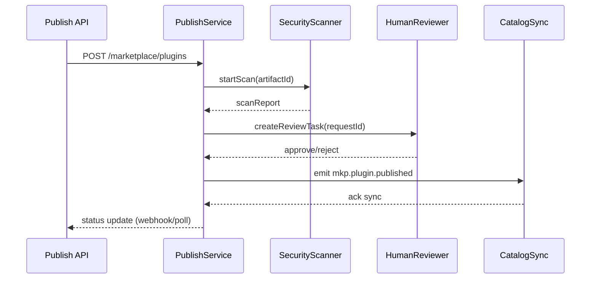

doc_id: MKP-PUBLISH-ONLINE-001
scn_id: SCN-PUBLISH-HUB-001
title: MKP-PUBLISH-ONLINE-001 - api/marketplace
status: Draft
version: v0.1.0
repo_key: powerx-marketplace
scope: powerx-marketplace
layer: api
domain: marketplace
scenario_title: "PowerX 插件开发与分发全链路"
owners:
  - name: Matrix-X
    role: Docs Coordinator
    contact: dev@artisan-cloud.com
  - name: Zoe Chen
    role: Marketplace Lead
    contact: zoe@artisan-cloud.com
contributors: []
linked_requirements: []
code_refs:
  - path: services/publish/publish_service.go
  - path: api/plugins_publish.go
  - path: events/publish_event_emitter.go
feature_flags:
  - PX_MARKETPLACE_SYNC
  - PX_MARKETPLACE_AUDIT
last_reviewed_at: 2025-10-25

---

# Usecase Overview

- **业务目标**：Marketplace 接收 CLI 发布请求，执行安全扫描、人工/自动审核、目录登记、事件广播，让插件在通过审核后可供租户发现与安装。
- **触发角色**：Marketplace 审核员、自动化审核服务、Backend 目录同步器。
- **成功度量**：审核完成 SLA ≤ 15 分钟；安全扫描漏报率 0；事件广播延迟 ≤ 1 分钟；撤回/回滚可在 2 分钟内生效。
- **场景关联**：核心于 `SCN-PUBLISH-ONLINE-001`；向 `PX-PUBLISH-ONLINE-001`、`PX-ADMIN-PUBLISH-ONLINE-001` 提供目录数据；与 `PLG-PUBLISH-ONLINE-001` CLI 协作。

# Context & Assumptions

- **Feature Flags**：`PX_MARKETPLACE_SYNC` 启用目录同步；`PX_MARKETPLACE_AUDIT` 控制审核工具；选配 `PX_MARKETPLACE_PRICE`。
- **依赖**：安全扫描（SAST/DAST）、签名验证服务、Catalog DB、Kafka Event Bus、Workflow Metrics。
- **输入**：CLI 提交的 `pluginId`、`version`、`artifactId`、合规信息、发布渠道；审核员备注。
- **输出**：审核状态（pending/approved/rejected）、目录条目、事件 `mkp.plugin.published`、审计记录。
- **边界**：不处理 Admin UI 呈现；不负责具体安装；离线流程另行处理。

# Solution Blueprint

## 体系分解

| 模块 | 组件 | 责任 | 入口 |
|------|------|------|------|
| PublishService | `services/publish/publish_service.go` | 协调审核、扫描、目录注册 | `cmd/marketplace/main.go` |
| ScanPipeline | `services/publish/security_scan.go` | 触发/汇总安全扫描结果 | `services/publish` |
| AuditWorkflow | `services/publish/audit_workflow.go` | 人工审核、SLA追踪、合规存证 | 同上 |
| EventEmitter | `events/publish_event_emitter.go` | 广播 `mkp.plugin.published` / 回滚事件 | `events` |

## 流程与时序

# Contracts & Interfaces

- **REST**
  - `POST /marketplace/plugins`：创建发布请求。
  - `PATCH /marketplace/plugins/{requestId}`：审核员更新状态。
  - `GET /marketplace/plugins/{pluginId}/versions`：返回版本列表、状态。
- **Webhooks**
  - `POST /webhooks/publish-status`：通知 CLI/CI 审核结果（可选）。
- **Events**
  - Kafka `mkp.plugin.published`、`mkp.plugin.rejected`、`mkp.plugin.recalled`。
- **配置**
  - `publish.scan.required`、`publish.audit.sla_minutes`、`publish.channels`、`publish.auto_approve_conditions`。

# Implementation Checklist

| 项目 | 描述 | 完成状态 | 负责人 |
|------|------|----------|--------|
| 审核工作流 | 审批队列、SLA 监控、自动升级 | [ ] | Zoe Chen |
| 安全扫描 | 集成 SAST/DAST、渗透扫描白名单 | [ ] | Matrix-X |
| 事件系统 | Kafka 事件定义、重试、死信队列 | [ ] | Carol |
| 报表 | 审核时长、通过率 Dashboards | [ ] | Matrix-X |
| 文档 | 更新 AsyncAPI/OpenAPI；发布政策 | [ ] | Zoe Chen |

# Testing Strategy

- **单元测试**：`publish_service_test.go`、`audit_workflow_test.go`、`event_emitter_test.go`。
- **集成测试**：与扫描/审核 mock 交互；测试审批分支（approve/reject/rework）。
- **端到端**：使用 CLI 发起发布 → 审核 → Backend 同步 → Admin 安装；验证事件链条。
- **非功能**：审核队列高峰测试；事件重试；安全扫描超时处理。

# Observability & Ops

- **指标**：`publish.requests_created`、`publish.approval_duration_ms`、`publish.rejection_rate`、`publish.event_lag_ms`。
- **日志**：`marketplace_publish.log` （`requestId`、`pluginId`、`decision`、`reviewer`）。
- **告警**：审核 SLA 超时；事件堆积；扫描失败率 > 5% 通知安全组。
- **Dashboards**：Marketplace 发布监控、SLA 面板、事件延迟图。

# Rollback & Failure Handling

- **回滚**：`/marketplace/plugins/{requestId}/recall` 撤回；Feature Flag 停用发布；回滚服务部署。
- **补救措施**：人工修改状态、重放事件；提供 `mkp-publish retry` CLI；生成补偿报告。
- **数据修复**：同步目录与审核状态；修复错误的版本标签；更新缓存。

# Follow-ups & Risks

| 风险/事项 | 影响 | 缓解方案 | 负责人 | ETA |
|-----------|------|----------|--------|-----|
| 审核积压 | 发布延迟 | SLA 告警、临时扩容审核员、自动审批低风险请求 | Zoe Chen | 2025-02-10 |
| 安全扫描误报 | 阻塞发布 | 维护白名单、差异化策略、人工复核 | Matrix-X | 2025-02-05 |
| 事件丢失 | Backend 状态不一致 | 使用 Kafka 幂等 key、监控 lag、重放机制 | Carol | 2025-01-30 |

# References & Links

- 场景：`docs/scenarios/publish/SCN-PUBLISH-ONLINE-001.md`
- 标准：`docs/standards/powerx-marketplace/发布和下载插件流程.md`
- 代码仓：`https://github.com/ArtisanCloud/PowerXMarketplace/tree/dev/services/publish`
- 设计：`ADR-2024-MARKETPLACE-PUBLISHING.md`

> 完成后请同步事件契约与 Backend/Admin 团队，并执行 `npm run publish:usecases -- --scn-id SCN-PUBLISH-HUB-001 --validate-only`。
