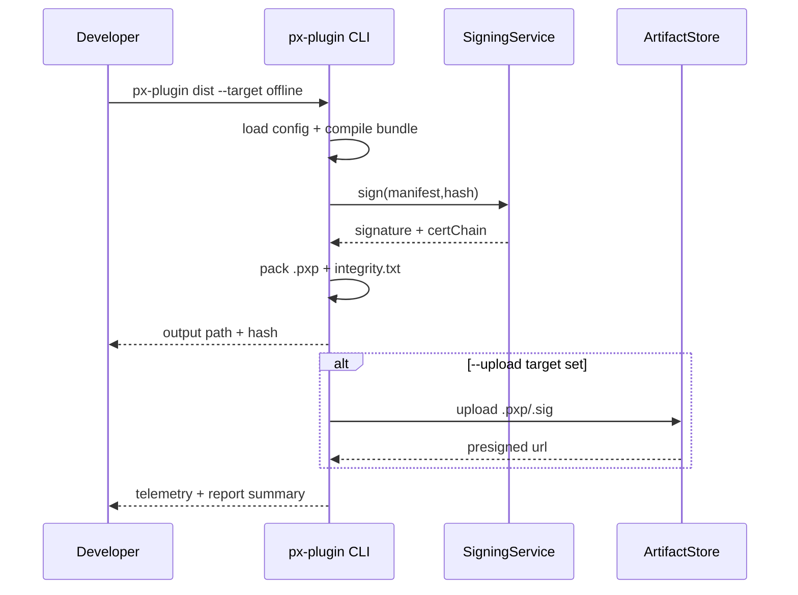

doc_id: PLG-PUBLISH-OFFLINE-001
scn_id: SCN-PUBLISH-HUB-001
title: PLG-PUBLISH-OFFLINE-001 - proto/publish
status: Draft
version: v0.1.0
repo_key: powerx-plugin
scope: powerx-plugin
layer: proto
domain: publish
scenario_title: "PowerX 插件开发与分发全链路"
owners:
  - name: Michael Hu
    role: Tech Steward
    contact: tech@artisan-cloud.com
  - name: Li Wei
    role: CLI Lead
    contact: li.wei@artisan-cloud.com
contributors: []
linked_requirements: []
code_refs:
  - path: cli/src/commands/dist.ts
  - path: cli/src/pkg/offline/package-writer.ts
feature_flags:
  - PX_OFFLINE_IMPORT
last_reviewed_at: 2025-10-25

---

# Usecase Overview

- **业务目标**：生成安全可校验的 `.pxp` 离线插件包，涵盖二进制、资源、manifest 与签名，确保无 Marketplace 环境下也能导入与回滚。
- **触发角色**：插件研发工程师、内网发布管理员、合作伙伴交付团队。
- **成功度量**：打包耗时 ≤ 90s；包体 hash 与签名校验通过率 100%；`px-plugin dist` 命令失败率 < 1%；离线包被 Admin 导入成功率 ≥ 98%。
- **场景关联**：与 `PX-PUBLISH-OFFLINE-001` Backend 导入、`PX-ADMIN-PUBLISH-OFFLINE-001` Admin 向导协同，作为离线分发入口。

# Context & Assumptions

- **Feature Flags**：`PX_OFFLINE_IMPORT` 允许 CLI 输出离线包元数据；`PX_CLI_SIGNING` 开启签名。
- **依赖**：Node 18+、OpenSSL 或 KMS 进行签名、`px-plugin config` 中定义打包入口；可选 OSS/S3 上传离线包。
- **输入**：`plugin.yaml`、`manifest.json`、打包入口代码、资源文件、`px-plugin.config.ts`。
- **输出**：`.pxp` 压缩包、`manifest.signature`、`integrity.txt`、构建日志、Telemetry。
- **边界**：不处理 Backend 导入；不涵盖在线 Marketplace 发布；仅关注打包、签名、校验。

# Solution Blueprint

## 体系分解

| 模块 | 主要组件 | 责任 | 代码入口 |
|------|----------|------|---------|
| PackageBuilder | `cli/src/commands/dist.ts` | orchestrate dist 命令、加载配置、调用编译管线 | `packages/cli/src` |
| Compiler | `cli/src/pkg/offline/compiler.ts` | 构建 bundle、压缩、生成清单 | `packages/cli/src/pkg/offline` |
| Signer | `cli/src/pkg/offline/signer.ts` | 读取证书/密钥，生成签名与证书链 | 同上 |
| Verifier | `cli/src/pkg/offline/verifier.ts` | 本地验证包体 hash 与签名，支持 `--verify` | 同上 |

## 流程与时序

# Contracts & Interfaces

- **CLI 命令**
  - `px-plugin dist --target offline --output ./dist --sign cert.pem --key key.pem`
    - 支持 `--skip-sign`（仅测试）、`--artifact-store s3`、`--metadata <file>`。
  - `px-plugin dist --verify ./dist/plugin.pxp` 校验 hash 与签名。
- **配置**
  - `px-plugin.config.ts`：声明打包 entry、assets、忽略列表、版本策略。
  - Signing：支持 PEM、KMS (`--kms-key-id`)；配置 `PX_PKG_SIGNER_ENDPOINT`。
- **Artifacts**
  - `.pxp`：tar+gzip，包含 `manifest.json`、`assets/**`、`scripts/`。
  - `manifest.signature`：CMS Detached；`integrity.txt`：sha256 哈希列表。

# Implementation Checklist

| 项目 | 描述 | 完成状态 | 负责人 |
|------|------|----------|--------|
| bundler | 支持 tree-shaking、增量缓存、source map | [ ] | Li Wei |
| signing | 兼容本地 PEM 与云 KMS；错误提示友好 | [ ] | Michael Hu |
| verification | `--verify` 命令与 CI 集成 | [ ] | Li Wei |
| reporting | 生成 `dist/report.json`（hash、大小、签名信息） | [ ] | Matrix-X |
| 文档 | 更新 `docs/guides/offline-dist.md`、CLI help | [ ] | Matrix-X |

# Testing Strategy

- **单元测试**：`compiler.test.ts` 覆盖资源打包、`signer.test.ts` 验证证书格式；`verifier.test.ts` 覆盖 hash 校验。
- **集成测试**：在 CI 生成样例 `.pxp` 并使用 Admin Mock 导入；覆盖 `--kms-key-id`、`--upload` 分支。
- **端到端**：结合 Backend/ Admin 离线导入流程，演练打包→导入→回滚。
- **非功能**：大包（>200MB）性能测试；多平台（Win/Mac/Linux）兼容验证。

# Observability & Ops

- **指标**：`offline.dist.duration_ms`、`offline.dist.size_bytes`、`offline.dist.failures_total`。
- **日志**：CLI 结构化日志 `dist.log`（`pluginId`、`version`、`hash`、`signer`）。
- **告警**：签名失败或 KMS 不可用触发 Slack `#powerx-plugin-alerts`；包体超限提示阈值调整。
- **Dashboards**：CLI Telemetry Dashboard、离线包大小趋势图。

# Rollback & Failure Handling

- **回滚**：撤销 CLI dist 功能 PR 或通过 npm dist-tag 切换版本。
- **补救措施**：提供 `px-plugin dist --resume` 支持断点续打；失败时保留 `dist/.tmp` 用于调查。
- **数据修复**：重新生成包体并更新 hash；如签名证书泄露，执行 `revoke-cert` 并重新签发。

# Follow-ups & Risks

| 风险/事项 | 影响 | 缓解方案 | 负责人 | ETA |
|-----------|------|----------|--------|-----|
| 大包导致上传耗时 | 发布时延高 | 支持分片上传、压缩策略提示 | Li Wei | 2025-02-18 |
| 签名证书过期 | 导致导入失败 | CLI 提前 14 天提醒，支持自动化续签 | Michael Hu | 2025-02-01 |
| 跨平台路径差异 | dist 失败 | 提供平台兼容测试矩阵、路径规范化 | Li Wei | 2025-01-30 |

# References & Links

- 场景：`docs/scenarios/publish/SCN-PUBLISH-OFFLINE-001.md`
- 标准：`docs/standards/powerx-plugin/deploy/release_package.md`
- 示例 PR：`https://github.com/ArtisanCloud/PowerXPlugin/pulls?q=offline+dist`
- 设计：`ADR-2024-OFFLINE-PACKAGE-SIGNING.md`

> 完成后请在 Admin/Backend 环节验证离线包兼容性，并执行 `npm run publish:usecases -- --scn-id SCN-PUBLISH-HUB-001 --validate-only`。
